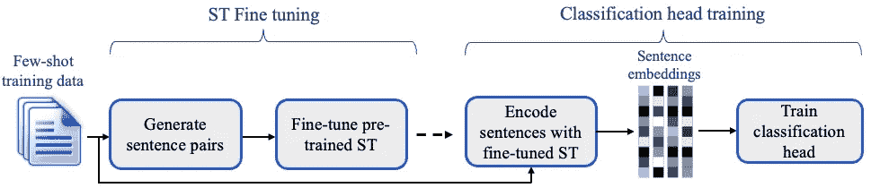
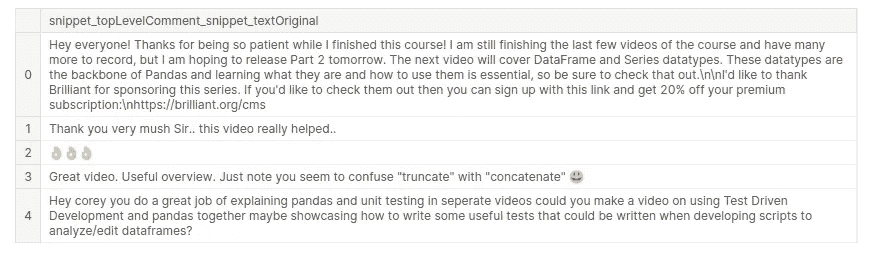

# set fit-Youtube 评论的少量镜头学习

> 原文：<https://medium.com/geekculture/setfit-few-shot-learning-for-youtube-comments-2aa1edfbdba2?source=collection_archive---------9----------------------->

# **问题陈述:**

通常今天完成的 ML 依赖于标记的数据。在现实世界中，很难找到贴有标签的数据，等待一些数据科学家捡起来并开始构建模型。

根据[的一份报告](https://www.grandviewresearch.com/industry-analysis/data-collection-labeling-market)“2021 年，全球数据收集和标签市场规模价值 16.7 亿美元，预计从 2022 年到 2030 年将以 25.1%的复合年增长率(CAGR)扩张”。

甚至在数据科学家中也有这样一种观念，即要有好性能，他们需要大量的数据。这就是像**少投学习**这样的技术可以派上用场的地方。

# 什么是少投学习？

它是监督 ML 的一部分，在监督 ML 中，模型被给定一些带标签的例子，然后使用它来训练，以对看不见的例子进行推断(预测)。

目标是减少在给定任务上实现类似性能所需的训练数据量。

# 什么是 SetFit？

set fit(**Se**tence**T**transformer**Fi**ne-**T**uning):一个高效的句子变形器微调框架。

培训分为两个阶段:

1.  句子转换器微调:这以连体方式发生在句子对上，目标是最大化语义不同的句子之间的距离，最小化语义相似的句子之间的距离。
2.  分类头训练:将富文本嵌入并与类别标签形成分类训练集。分类模型采用 Logistic 回归模型。(在未来，我认为这可以是任何分类模型。)



Two stage training process

有关这一切如何工作和基准测试结果的更多详细信息，请参考[博客](https://huggingface.co/blog/setfit)和 SetFit 论文。

仅仅通过用多语言转换器替换基本句子转换器，它就给出了很好的结果。

## 根据推断:

1.  将看不见的样本传递给句子转换器(使用少量训练样本进行微调)以生成密集嵌入。
2.  分类头使用这种富文本嵌入来返回一个类标签。

# 数据集源:

数据集是使用 Youtube API 收集的。它包含了数据科学相关频道的 YouTube 评论集。 [Kaggle 数据集](https://www.kaggle.com/datasets/tushifire/youtube-data-science-channels-comments)

**注意:**如果在 kaggle 上运行，首先卸载 tensorflow，因为预装版本的 tf 有问题。

```
%pip uninstall tensorflow -y
```

如果您直接希望看到实际结果，请跳到模型的**推理部分。**

# 安装套件

```
%pip install setfit
```

让我们进入代码示例。

## 问题陈述:

想象你自己是一名在 YouTube 上教学的教育工作者，你想看到来自学生的问题。但是评论区有点乱。建立一个系统，从杂乱的评论中过滤出问题。

*形式上，给定一条评论预测文本是否是问句。*

将数据集加载到 pandas 数据框中，并过滤掉注释字段。

```
comments_df = pd.read_csv('/kaggle/input/youtube-data-science-channels-comments/Coreyms_comments.csv',engine='python')
comments_text_df = pd.DataFrame(comments_df['snippet_topLevelComment_snippet_textOriginal'])
```

看看评论样本。运行下面的单元格，为每个类(问题和非问题)生成一些样本。

```
comments_text_df.sample(5)
```



sample comments

# 数据监管

我为两个班收集了 16 篇课文的样本。请记住，我们这里没有标记的培训数据。

```
# questions is a list of text comments which are questions.
# not_questions is a list of text comments which are  not questions.
df = pd.DataFrame()
df['text'] = questions
df['label'] = True

df1 = pd.DataFrame()
df1['text'] = not_questions
df1['label'] = False

combined_comments_df = pd.concat([df,df1])
combined_comments_df = combined_comments_df.reset_index(drop =True)
```

将熊猫数据帧转换为拥抱人脸数据集

```
from datasets import Dataset
dataset = Dataset.from_pandas(combined_comments_df)
dataset
```

```
from setfit import SetFitModel
model_id = 'sentence-transformers/all-MiniLM-L6-v2'
model = SetFitModel.from_pretrained(model_id) 
```

这个模型 id 可以被修改成任何预先训练好的模型形式[句子-变形金刚](https://www.sbert.net/docs/pretrained_models.html)。

# 训练装备

让我们定义我们的 SetFitTrainer。

```
from sentence_transformers.losses import CosineSimilarityLoss

from setfit import SetFitTrainer

trainer = SetFitTrainer(
    model=model,
    train_dataset=dataset,
    eval_dataset=dataset,
    loss_class=CosineSimilarityLoss,
    num_iterations=20,
    num_epochs=10,
    column_mapping={"text": "text", "label": "label"},
)
trainer.train()
```

我也使用了与 eval_dataset 相同的数据集。我们也可以定义不带 eval_dataset 的培训师。

**注意:**最好有一个单独的 eval_dataset。为此必须再次标记几个数据点。

就这样，我们训练了一个分类器，每个只有 16 个例子。

如果你愿意，你可以把你的模型推到中心，并与他人分享。

# 推理模型

服务 SetFit 模型与服务任何 HuggingFace 模型没有太大区别。

下面显示了每个类的 2 个例子。

```
from setfit import SetFitModel

model = SetFitModel.from_pretrained("tushifire/setfit_youtube_comments_is_a_question")

# Run inference
preds = model(["i loved the spiderman movie!", "pineapple on pizza is the worst 🤮"])
preds
# array([False, False])

preds = model(["""what video do I watch that takes the html_output and insert it into the actual html page?""",
               "Why does for loop end without a break statement"])
preds
# array([ True,  True])
```

效果挺好的。

我们可以通过以下方式提高分类器的性能:

1.  使用更大的预训练模型
2.  进行超参数搜索
3.  找出与社交媒体评论、教育领域等领域相同的预训练模型。

在 [kaggle 笔记本](https://www.kaggle.com/code/tushifire/setfit-few-shots-youtube-comments)看完整代码。

# 参考

1.  数据市场:[https://www . grandview research . com/industry-analysis/data-collection-labeling-Market](https://www.grandviewresearch.com/industry-analysis/data-collection-labeling-market)
2.  拥抱脸博客:[https://huggingface.co/blog/setfit](https://huggingface.co/blog/setfit)
3.  预训车型:[https://www.sbert.net/docs/pretrained_models.html](https://www.sbert.net/docs/pretrained_models.html)
4.  Github 回购:[https://github.com/huggingface/setfit](https://github.com/huggingface/setfit)
5.  高效的无提示少投学习[https://arxiv.org/abs/2209.11055](https://arxiv.org/abs/2209.11055)