# 如何用 Angular 13 应用程序设置模拟后端

> 原文：<https://medium.com/geekculture/setting-up-a-mock-backend-with-angular-13-applications-26a21788f7da?source=collection_archive---------1----------------------->

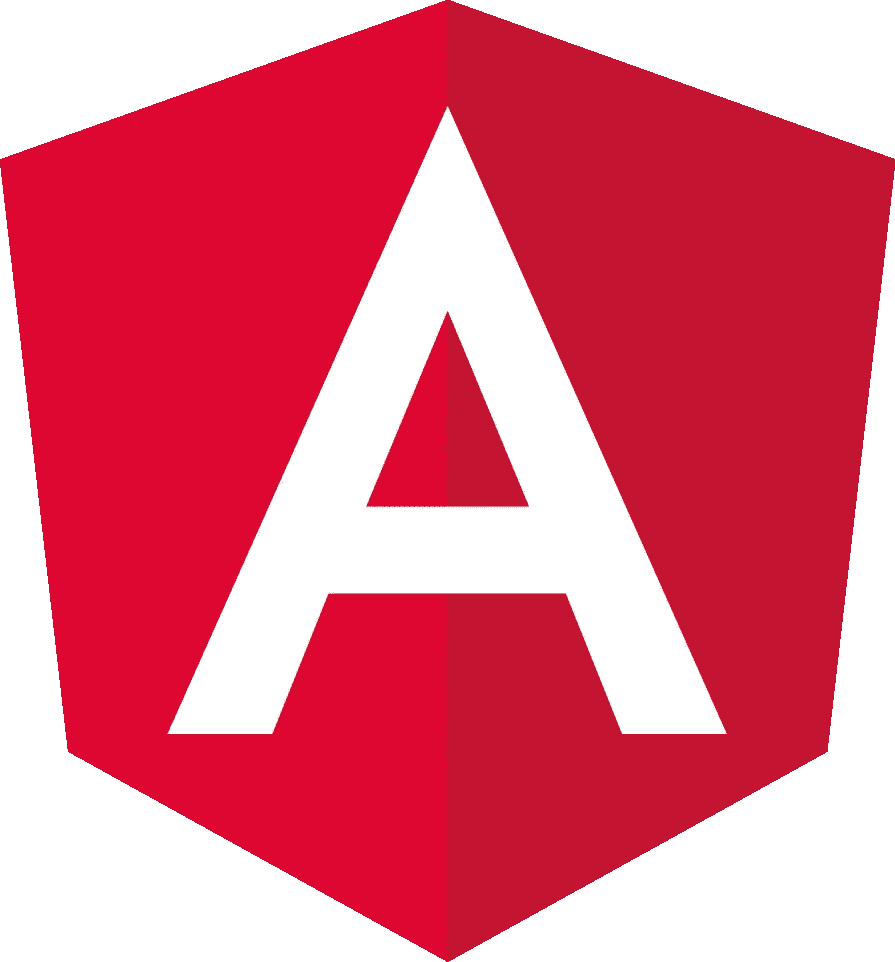

在一个前端和后端同时开发的世界中，开发应用程序的开发人员应该能够与一个假的后端进行交互，以便通过模仿后端数据来创建 UI，这是非常重要的。

多亏了 npm 包，比如 [**json-server**](https://www.npmjs.com/package/json-server) 和 [**nodemon**](https://www.npmjs.com/package/nodemon) ，这个过程变得非常简单。

json-server 是一个包，提供了完整的零编码的伪 REST API，可以轻松安装。

***nodemon*** 是一个帮助开发基于 Node.js 的应用程序的工具，当检测到目录中的文件发生变化时，它会自动重启节点应用程序。

下面是一个模拟后端的逐步设置，您可以从头开始设置一个返回模拟 JSON 响应的假 REST API 端点:

# 1.创建新项目

使用 [**Angular CLI 工具**](https://www.npmjs.com/package/@angular/cli) 命令创建一个全新的 Angular 项目:

```
ng new mock-server
```

这将建立一个名为 ***的模拟服务器*** 的 Angular 项目，包含如下所示的 ***package.json*** 。在写这篇文章的时候，使用的有角版本是 v13。它可能会在以后的某个时间点发生变化，然而，这个概念仍然保持不变，并且它适用于 Angular 2+的每个版本。

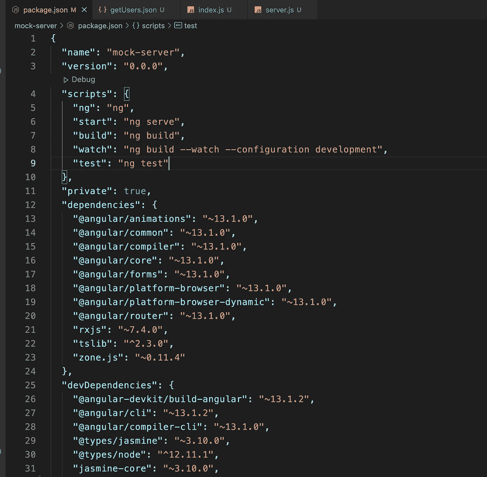

package.json

# 2.安装 npm 软件包

```
npm install json-server --save-dev
npm install nodemon --save-dev
```

以上命令将最新版本的 json-server 和 nodemon 作为一个 dev 依赖项进行安装，并将它添加到您的 ***package.json*** 文件中。

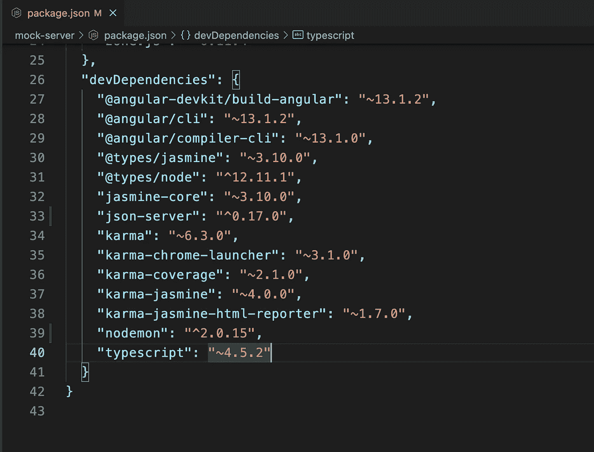

package.json

# 3.在 JSON 文件中添加模拟数据

创建一个名为 ***服务器*** 的文件夹。根据您的选择，该名称可以是任何名称。在 ***服务器*** 文件夹、***data/users/json***内创建另一个文件夹结构，并创建一个***getusers . JSON***文件以 JSON 响应 ***的形式包含模拟用户列表。*** 创建上述文件夹结构是为了确保一致性，以防添加多个虚假的 API JSON 响应，并且它们可能属于应用程序中单独的功能模块。文件夹结构是在功能模块的基础上创建的，很像我们在 Angular app 中对功能模块所做的。

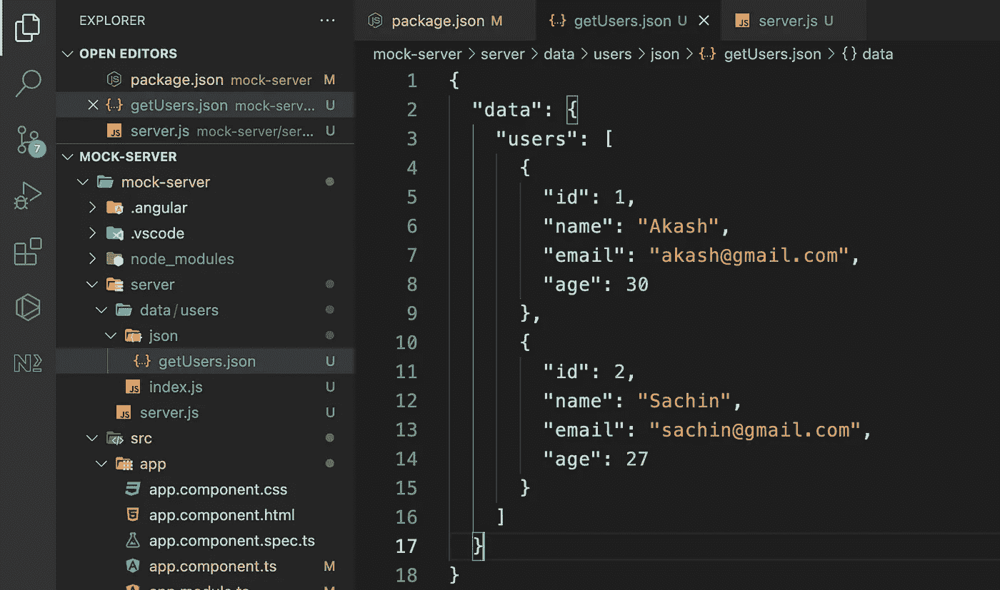

getUsers.json

# 4.添加 index.js 文件

要导出 ***server.js*** 文件中的 JSON 数据，请在***server/data/users***文件夹中创建一个 ***index.js*** 文件，该文件导出模拟 JSON 响应(用户列表)作为要在 ***server.js*** 文件中使用的模块。***module . exports***是一个特殊的对象，默认包含在 Node.js 应用程序的每个 JavaScript 文件中。module 是表示当前模块的变量，exports 是将作为模块公开的对象。

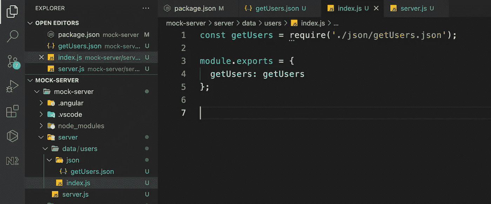

index.js

# 5.添加一个 server.js 文件将所有内容连接在一起

创建一个 ***server.js*** 文件，其中包含使用 Node.js 设置 ***json-server*** 的配置，配置如下:

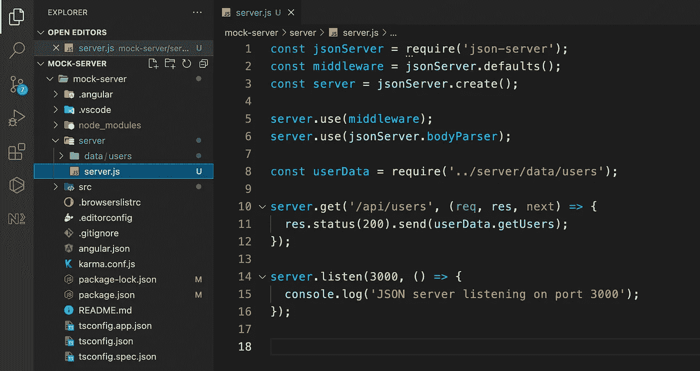

server.js

上面的节点服务器运行在端口号 3000 上。它在端点 ***/api/users*** 监听请求，以返回***http://localhost:3000/API/users 上的用户列表。***

# 6.在 package.json 中添加脚本

在 ***server.js*** 文件中完成服务器的配置后，在 ***package.json*** 中创建一个脚本，如下图:

```
"mock:server": "nodemon server/server.js --ext js,ts,json,html"
```

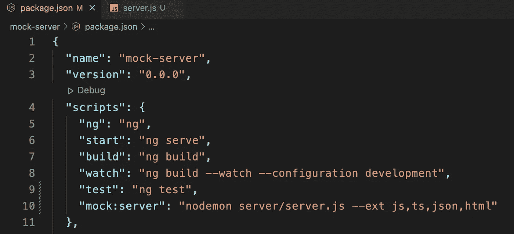

package.json

在命令行上添加***NPM run mock:Server***查看服务器运行时的控制台消息，***“JSON Server running at port 3000”。*** 上面的脚本在监视模式下运行，并监听对*类型文件的任何更改。js，*。ts，*。json 和*。它会自动重启节点服务器。

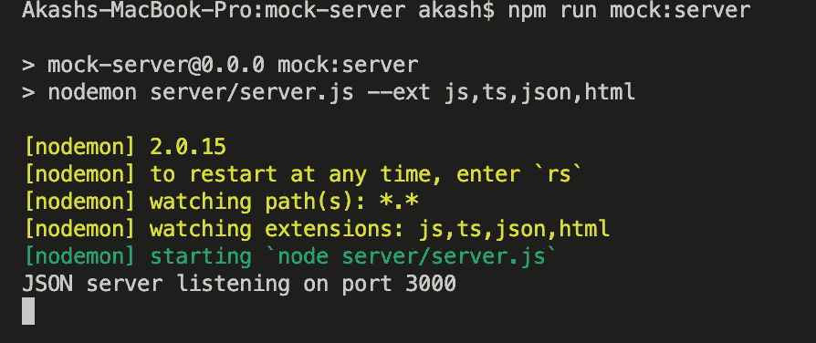

Command line view of mock JSON server running at port 3000

# 7.转到浏览器并输入 URL

瞧啊。我们的模拟服务器已经设置好，可以进行测试了。进入浏览器，点击地址栏中的[http://localhost:3000/API/users](http://localhost:3000/api/users)。您将能够在浏览器上看到用户列表。

类似地，您可以为 POST、PUT、PATCH 和 DELETE 操作设置模拟端点。

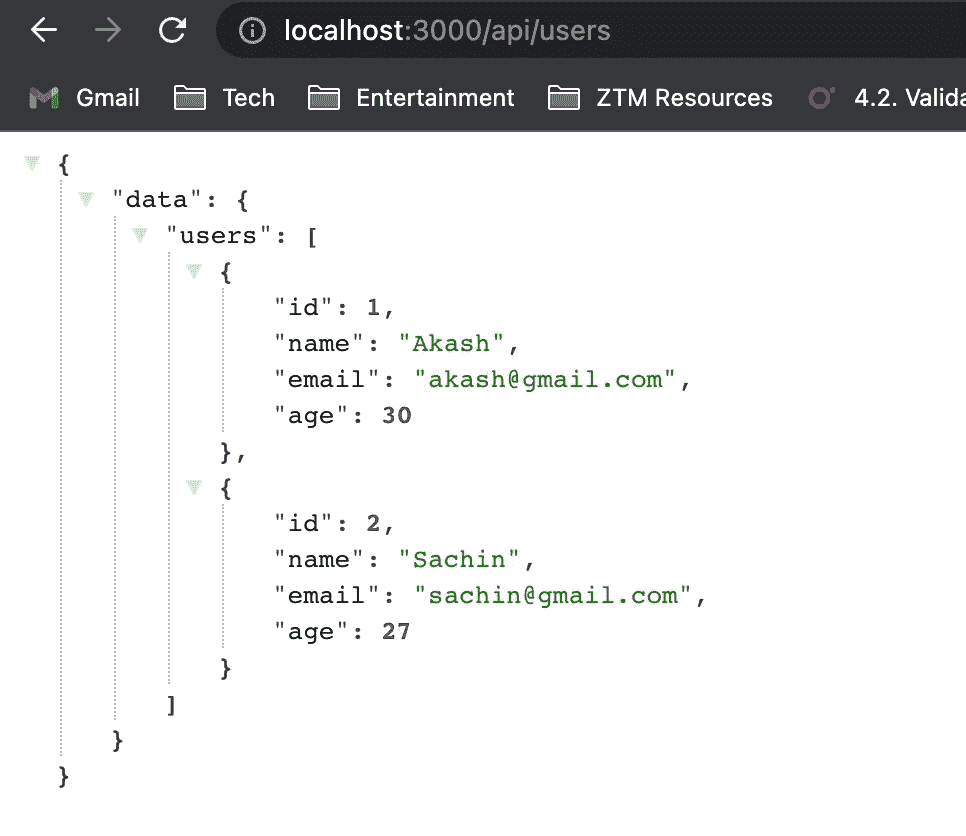

JSON Server running at http://localhost:3000

# **8。在角度应用 UI 上测试它**

将 [**HttpClientModule**](https://angular.io/api/common/http/HttpClientModule) 注入到 ***app.module.ts*** 中，将 [**HttpClient**](https://angular.io/api/common/http/HttpClient) 作为依赖注入到***app . component . ts .***中，然后在 [**ngOnInit()**](https://angular.io/api/core/OnInit) 生命周期钩子中，从模拟 API 端点 [http://localhost](http://localhost:3000/api/users)

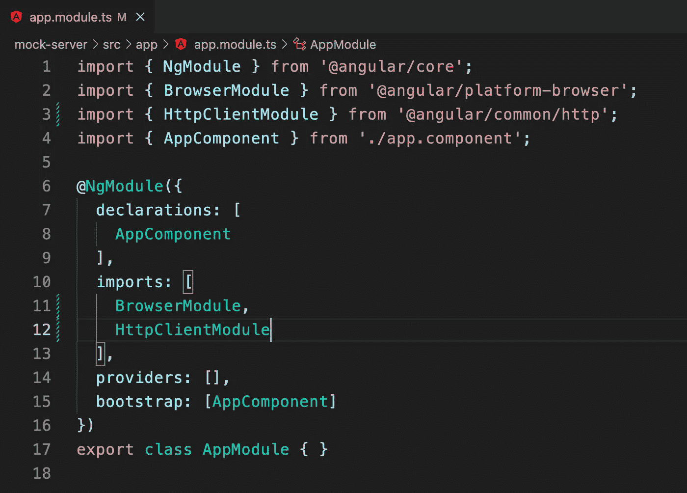

app.module.ts

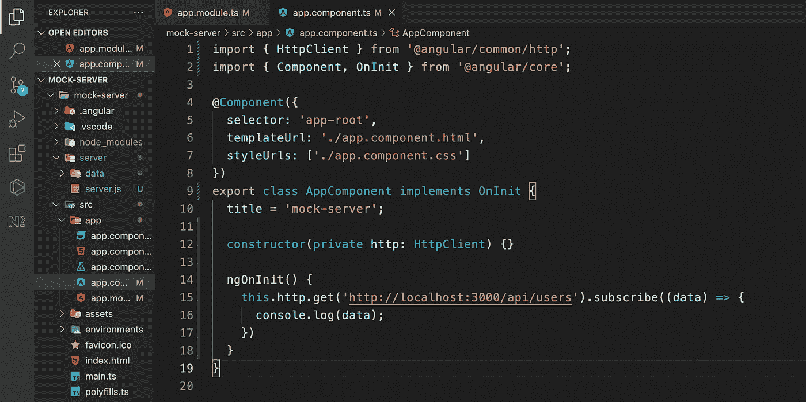

app.component.ts

如果你在编码的过程中遇到了困难，下面是 GitHub repo 的公开链接:

[***https://github.com/akashkriplani/mock-server***](https://github.com/akashkriplani/mock-server)

# 结论

现在我们有了。我希望这篇文章对你有用。感谢您的阅读。请随时提供您的意见、建议和任何其他可能有帮助的反馈。

*更多内容请看*[***plain English . io***](https://plainenglish.io/)*。报名参加我们的* [***免费每周简讯***](http://newsletter.plainenglish.io/) *。关注我们*[***Twitter***](https://twitter.com/inPlainEngHQ)*和*[***LinkedIn***](https://www.linkedin.com/company/inplainenglish/)*。加入我们的* [***社区不和谐***](https://discord.gg/GtDtUAvyhW) *。*