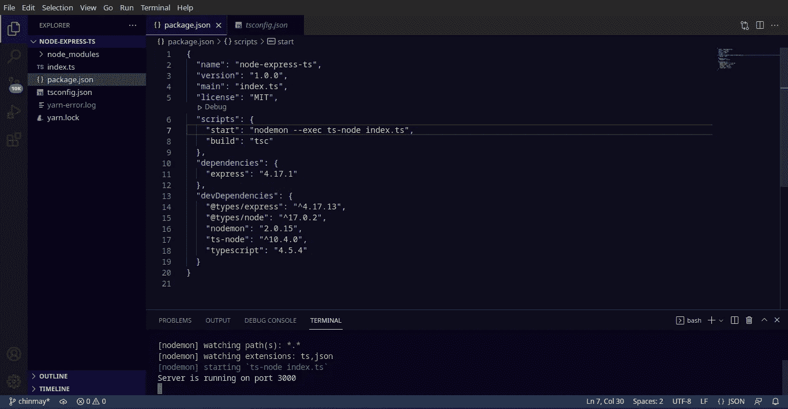
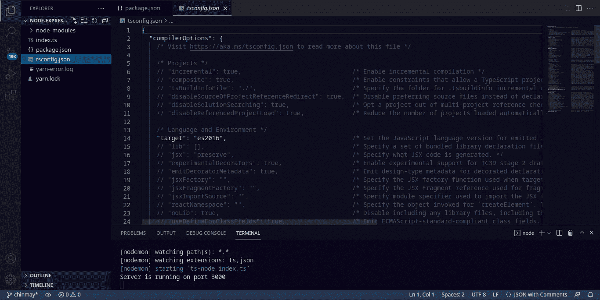
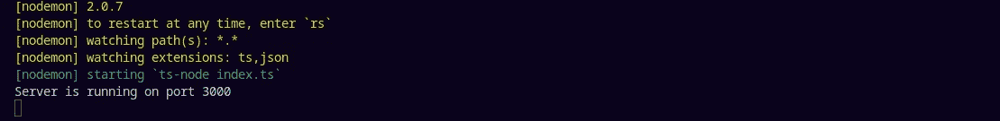
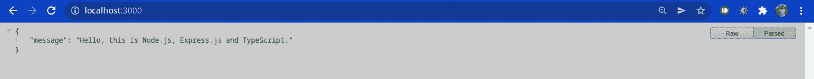

# 使用 Express.js 和 TypeScript 设置 Node.js 项目环境:最佳实践

> 原文：<https://medium.com/geekculture/setting-up-a-node-js-project-environment-with-express-js-and-typescript-best-practices-284cc37c5aa1?source=collection_archive---------4----------------------->


> 在本文中，我们将按照最佳实践在 express.js 和 typescript 中设置 node.js 项目。我们将使用 yarn 来安装我们所有的依赖项，我将在本文的后面部分回到它的好处。
> 
> 我将在本文末尾提供 GitHub 资源库的链接。这是用 TypeScript 开发 API 的第一部分，请继续关注下一篇文章，在那里我们将看到路由、使用 ORM 等等。

在我们开始之前，我们需要验证某些事情，以便我们在编码时不会遇到任何问题。

首先，检查您的系统上是否安装了**节点**和 **npm** :

```
node -v
npm -v
```

始终将 npm 安装在节点旁边。可能会有我们需要 npm 的情况，所以它总是有用的。如果你没有安装它们，你可以从[这里(对于 Linux 系统)](https://linuxize.com/post/how-to-install-node-js-on-ubuntu-18.04/) [(对于 Windows 系统)](https://docs.npmjs.com/downloading-and-installing-node-js-and-npm)获取参考。

其次，检查是否安装了**纱线**，为此在您的终端中运行以下命令:

```
yarn -v or yarn --version
```

如果您的系统上没有安装 yarn，您可以参考此处的[进行安装。或者您可以通过运行以下命令直接用 npm 安装 yarn:](https://classic.yarnpkg.com/lang/en/docs/install/#debian-stable)

```
npm install -g yarn
```

最后，我们将安装**类型脚本**。这也可以在国家预防机制的帮助下完成:

```
npm install -g typescript
```

成功安装 typescript 后，您可以按如下方式检查其版本:

```
tsc -v
```

**注意:****-g 标志**告诉它全局安装依赖项。我更喜欢在第一次安装时使用-g 标志，否则我们必须在本地安装每个依赖项或包，具体到每个项目。然而，这是一个选择，每个人都可以自由地按照自己的方式去做。此外，在系统中全局安装 typescript 也是一种选择。不管怎样，我们都需要它作为我们项目中的一个依赖项，所以我们也将在那里添加它。

至此，我们完成了先决条件。下一步，我们将开始设置我们的项目。

**步骤 1:** 选择您希望项目所在的系统目录，例如 **cd Desktop/work**

```
mkdir node-express-ts
```

这将为您创建一个新目录。现在我们需要生成 **package.json** 文件，我们将在其中存储所有的依赖项。为此，请运行以下命令:

```
yarn init -y
```

**步骤 2:** 现在我们将安装一些依赖项。我们将使用纱线安装以下设备:

```
yarn add express@4.17.1
yarn add nodemon@2.0.15 --dev
yarn add typescript --dev
yarn add @types/express --dev
yarn add @types/node --dev
yarn add ts-node --dev
```

我们现在已经准备好了基本的依赖集。dev 标志将它们保存在 package.json 文件中的 devDependencies 下。 **devDependencies** 是我们仅用于本地开发和测试目的的包。Express 作为**依赖项**安装，因为应用程序将在生产过程中使用它。每次保存文件时，Nodemon 都会查找并执行更改。

另外，我们可以在 package.json 中添加一个' scripts' json 对象，这样在终端内部运行 **yarn start** 就会启动服务器。除此之外，还可以通过做 **nodemon index.ts** 来运行。



package.json after installing all the dependencies

**第三步:** TS 项目需要一个 **tsconfig.json** 文件。我们可以按如下方式生成它:

```
tsc --init
or
npx tsc --init 
```

tsc 是一个内置的 typescript 编译器。当我们用 typescript 编写代码时，它会将代码编译成 javascript。



tsconfig.json

**步骤 4:** 现在我们已经准备好了项目结构，我们将从一个 **index.ts** 文件开始，并运行一些基本代码来查看我们的服务器是否工作正常。

index.ts

成功编译后，我们将在终端中得到响应。



最后，JSON 请求可以在 localhost:3000 上看到



JSON response

**纱线优于 npm 的优势:**

1.  Yarn 比 npm 快。与 npm 相比，它下载软件包的速度更快。
2.  Yarn 可以同时获取和安装多个包。
3.  纱线更安全。

根据您的需求，您可以自由地使用 npm 或 yarn 来安装软件包。这就是本文的全部内容。谢谢你。

Github 资源库的链接是 [***这里是***](https://github.com/chinmaykarmokar/node-express-typescript) 。

文章的第 2 部分可在处[获得。](/@chinmaykarmokar/routing-our-typescript-api-in-express-js-and-using-typeorm-for-connecting-to-our-postgresql-db-bde5132b5102)

谢谢大家！