# 用 Webpack、Babel 和 Eslint 从头开始设置 React 应用程序

> 原文：<https://medium.com/geekculture/setting-up-a-react-app-from-scratch-withwebpack-babel-and-eslint-57eb3dcaf2e9?source=collection_archive---------3----------------------->

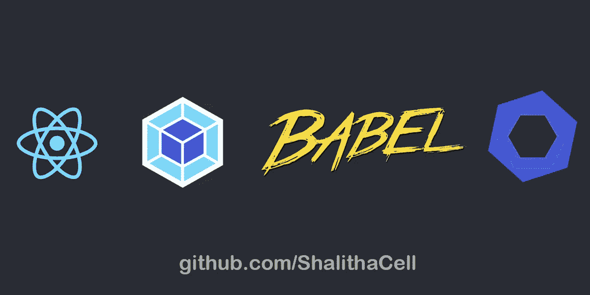

不熟悉 JavaScript？从你宝贵的时间里抽出 5 分钟来读读这个吧！！我向你保证它不会被浪费，

[](https://shalithax.medium.com/javascript-concepts-that-will-level-up-your-development-skills-35604462025b) [## 将提升您的开发技能的 JavaScript 概念

### 不熟悉 JavaScript？从你宝贵的时间里抽出 5 分钟来读读这个吧！！我向你保证它不会被浪费，

shalithax.medium.com](https://shalithax.medium.com/javascript-concepts-that-will-level-up-your-development-skills-35604462025b) 

我们都知道这个神奇的命令`create-react-app .`,但是，如果你正在做任何需要 SASS、Webpack 配置或其他定制配置的事情，CRA (create-react-app)将会是一个麻烦。例如，如果您想要添加自定义构建配置。添加自定义配置的一种方法是弹出应用程序。

如果你是一个天生好奇的开发人员，你想知道事情是如何工作的，哪个部分做什么，那么让我来帮你。

*先决条件*

1.  [**节点**](https://nodejs.org/en/)
2.  任何 IDE(推荐[**Webstorm**](https://www.jetbrains.com/webstorm/)**或 [**Visual Studio 代码**](https://code.visualstudio.com/) **)。****

# ****让我们开始****

**打开命令行或 Git bash 并创建一个新目录:**

```
mkdir custom-react-boilerplate && cd custom-react-boilerplate
```

**通过运行以下命令初始化项目:**

```
npm init
```

**它将提示您输入项目的几个方面。将输入内容填写为您自己的内容。然后就可以看到 *package.json* 文件了。**

**然后我们安装 react**

```
npm install react react-dom
```

## **安装 Webpack**

**Webpack 是一个捆绑器。Webpack 的核心功能是获取我们在项目中编写的一堆 JavaScript 文件，并将它们转换成一个单一的、缩小的文件，以便快速提供服务。**

**让我们安装 Webpack。**

```
npm install --save-dev webpack webpack-dev-server webpack-cli html-loader html-webpack-plugin
```

*   ****webpack** —包括所有核心 webpack 功能。**
*   ****webpack-dev-server** —当我们的文件被更改时，这个开发服务器会自动重新运行 webpack。**
*   **webpack-cli —允许从命令行运行 webpack。**

**接下来，我们配置 package.json 来运行 Webpack。**

```
"scripts": {
 "start": "webpack serve --mode development --env=development",
},
```

*   ***—模式*表示配置选项告诉 webpack 运行阶段。欲了解更多信息，请访问[https://webpack.js.org/configuration/mode/](https://webpack.js.org/configuration/mode/)**
*   ***— env* 表示我们设置运行环境。我们在下面的主题**源图中使用该参数，以获得更好的错误日志。****

**支持以下字符串值:**

**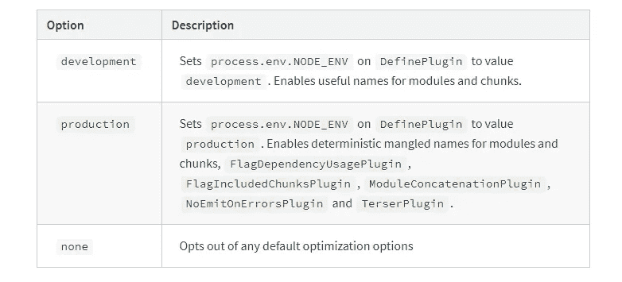**

**webpack run stages**

**然后我们在项目的根目录下创建一个`index.html`文件，**

```
<!DOCTYPE html>
<html lang="en">
<head>
    <meta charset="UTF-8">
    <title>Custom React Configuration</title>
</head>
<body>
    <div id="root"></div>
</body>
</html>
```

**两个突出显示的东西，你必须创建一个`<div id="root"></div>`元素和一个`<script src="./dist/bundle.js"></script>` 标签。**

**添加 src 目录，然后添加 index.jsx 和 App.jsx 文件**

```
mkdir src && cd src && touch index.jsx && touch App.jsx
```

**现在让我们添加一些起始代码，**

**在 App.jsx 文件中，**

```
import ***React*** from "react";

function App()
{
    return (
        <div className='App'>
            <h1>Hello World !</h1>
        </div>
    );
}

export default App;
```

**在 index.jsx 文件中，**

```
import ***React*** from "react";
import ReactDOM from "react-dom";
import App from "./App";

ReactDOM.render(
    <React.StrictMode>
        <App />
    </React.StrictMode>,
    ***document***.getElementById('root'),
);
```

**首先，我们创建`App.jsx`，并将其导入到`index.jsx`。这种方法隔离了复杂性，比把所有东西放在一起更容易理解。所以有几件事需要澄清，**

**什么是**反应。StrictMode** ？**

**React 的 StrictMode 是一种帮助组件，可以帮助你编写更好的 react 组件，你可以用`<StrictMode>`包装一组组件。**

**`StrictMode`目前帮助:**

*   **[识别具有不安全生命周期的组件](https://reactjs.org/docs/strict-mode.html#identifying-unsafe-lifecycles)**
*   **[关于传统字符串引用 API 用法的警告](https://reactjs.org/docs/strict-mode.html#warning-about-legacy-string-ref-api-usage)**
*   **[关于已弃用的 findDOMNode 用法的警告](https://reactjs.org/docs/strict-mode.html#warning-about-deprecated-finddomnode-usage)**
*   **[检测意外副作用](https://reactjs.org/docs/strict-mode.html#detecting-unexpected-side-effects)**
*   **[检测遗留上下文 API](https://reactjs.org/docs/strict-mode.html#detecting-legacy-context-api)**

**更多信息请参考:[https://reactjs.org/docs/strict-mode.html](https://reactjs.org/docs/strict-mode.html)**

# **配置巴别塔 7**

**好吧，什么是巴别塔，我们为什么需要它？**

> **巴别塔负责将新的语言特征转换成旧的。**

**虽然大多数流行的浏览器都可以支持 ECMAScript2015(或 ES6)，但确保您的代码与旧版本的 JavaScript 兼容始终是一个好做法。Es6 有`let`、`const`、`arrow functions`、`classes`等。为了理解，下面我们有一个 ES6 arrow 函数的输入，它被转换成一个普通的、旧的 ES5 JavaScript 函数。**

```
// Babel Input: ES2015 arrow function
[1, 2, 3].map((n) => n + 1);

// Babel Output: ES5 equivalent
[1, 2, 3].map(function(n) {
  return n + 1;
});
```

**进一步参考:[https://babeljs.io/docs/en/](https://babeljs.io/docs/en/)**

**让我们将 Babel 安装到我们的项目中，**

```
npm install --save-dev @babel/core @babel/preset-env @babel/preset-react babel-loader
```

**我们刚刚安装的内容:**

*   ****@babel/core:** 包含 babel 转换脚本的主依赖项。**
*   *****@ babel/preset-env***:将 ES6+转换成有效的 ES5 代码。可以选择自动配置浏览器聚合填充。**
*   *****@ Babel/preset-react***:将巴别支援扩展到 JSX。**
*   ****babel-loader:** 将 babel 与 Webpack 挂钩的 webpack 加载器。我们将用这个包从 webpack 运行 Babel。**

**要将 Babel 配置到我们的 webpack 中，在您的根目录中创建一个名为`webpack.config.js` file 的文件:**

```
const ***path*** = require('path');
const HtmlWebpackPlugin = require('html-webpack-plugin');

module.exports = {
    entry: './src/index.jsx',
    output: {
        path: ***path***.resolve(__dirname, 'build'),
        publicPath: '/',
        filename: 'bundle.js'
    },
    resolve: {
        alias: {
            components: ***path***.resolve(__dirname, 'src'),
        },
        extensions: ['.js', '.jsx'],
    },
    devServer: {
        contentBase: "./build",
    },
    module: {
        rules: [
            {
                test: /\.(js|jsx)$/,
                exclude: /node_modules/,
                use: ['babel-loader']
            },
            {
                test: /\.less$/,
                use: [
                    'style-loader',
                    'css-loader',
                    'less-loader',
                ],
            },
        ]
    },
    plugins: [
        new HtmlWebpackPlugin({
            template:  ***path***.resolve('./index.html'),
        }),
    ]
};
```

**现在我们澄清一下`webpack.config.js`文件中设置的配置。**

**`entry`是我们主要的 JavaScript 文件。在 React 中，这是我们使用渲染器的文件。**

**`output`告诉我们把捆绑的代码放在哪里，给文件取什么名字。这里，我们配置 Webpack 在根目录下创建一个名为`/dist`的目录，并创建一个名为`bundle.js`的文件。**

**`output` 告诉服务器提供来自`contentBase`配置的内容。**

**`"module"`是我们告诉 Webpack 使用我们之前安装的所有加载器的地方。**

**接下来，Babel 预置，在项目的根目录下创建一个新的`.babelrc`文件。**

```
{
  "presets": [
    "@babel/preset-env",
    "@babel/preset-react"
  ]
}
```

**现在运行`npm run start`。你可以看到 Hello world！。**

# **用于更好的错误日志的源映射**

**源映射为浏览器提供了一种将压缩文件中的代码映射回其在源文件中的原始位置的方法。这样，当错误发生时，您会被指向错误发生的确切文件和行。因此，如果您使用任何工具来缩小、连接或捆绑您的代码，您肯定需要生成源地图。**

**所以我们修改了`webpack.config.js`中的`devtool`**

```
devtool : isProduction ?'source-map' : 'inline-source-map'
```

**现在`webpack.config.js`看起来像，**

```
const ***path*** = require('path');
const ***HtmlWebpackPlugin*** = require('html-webpack-plugin');

module.exports = (env) => {
    const isProduction = env === 'production';
    return{
        entry: './src/index.jsx',
        output: {
            path: ***path***.resolve(__dirname, 'build'),
            publicPath: '/',
            filename: 'bundle.js'
        },
        resolve: {
            alias: {
                components: ***path***.resolve(__dirname, 'src'),
            },
            extensions: ['.js', '.jsx'],
        },
        devServer: {
            contentBase: "./build",
        },
        module: {
            rules: [
                {
                    test: /\.(js|jsx)$/,
                    exclude: /node_modules/,
                    use: ['babel-loader']
                },
                {
                    test: /\.less$/,
                    use: [
                        'style-loader',
                        'css-loader',
                        'less-loader',
                    ],
                },
            ]
        },
        plugins: [
            new ***HtmlWebpackPlugin***({
                template:  ***path***.resolve('./index.html'),
            }),
        ],
        devtool : isProduction ?'source-map' : 'inline-source-map'
    }

};
```

# **设置 ESLint**

**伟大的项目是由一致的代码组成的。代码应该和它的作者没有区别:你不应该知道谁编写了项目中的哪一行代码。Eslint 通过指出常见错误和实施良好的编程模式来帮助开发人员编写更好的代码。**

> *****Linters*** *突出显示* ***您的源代码*** *中的语法和风格问题，这些问题通常会帮助您识别并纠正* ***可能会*** *导致错误的微妙编程错误或非常规编码做法*。**

**让我们将 ESLint 安装到我们的项目中:**

```
npm --save-dev install eslint eslint-loader babel-eslint eslint-config-react eslint-plugin-react
```

**之后在终端中运行`eslint --init`。那么请遵守秩序，**

**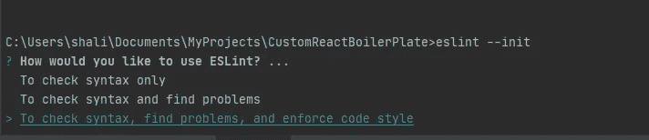**

**我们选择 Eslint 来检查语法和问题，并加强代码风格以确保代码的一致性。**

**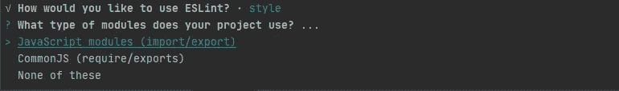**

**我个人更喜欢**导入/导出**语句。选择你感兴趣的。**

**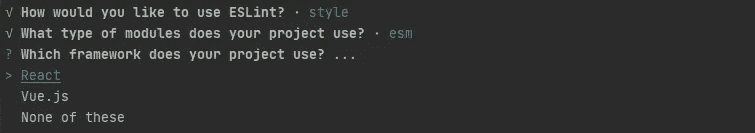**

**我们的应用程序是基于 React 的应用程序。所以我们需要选择**反应**。**

**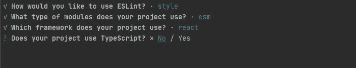**

**我们不会在这里使用 typescript。所以我们选择**号****

**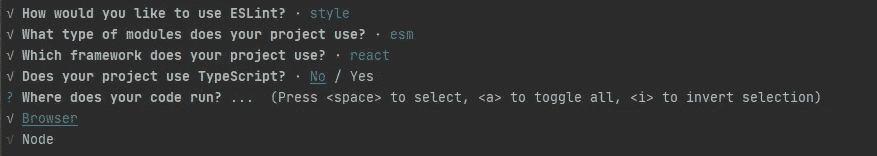**

**我们的 React 应用程序正在浏览器上运行。所以我们只选择**浏览器**。**

****

**我建议使用流行的风格指南。**

**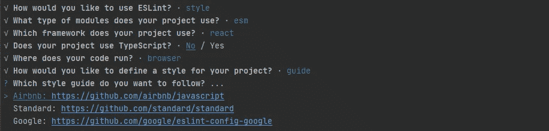**

**我个人喜欢 **Airbnb** 的风格指引。所以我选择 Airbnb，如果你喜欢不同的东西。请自己选择。**

**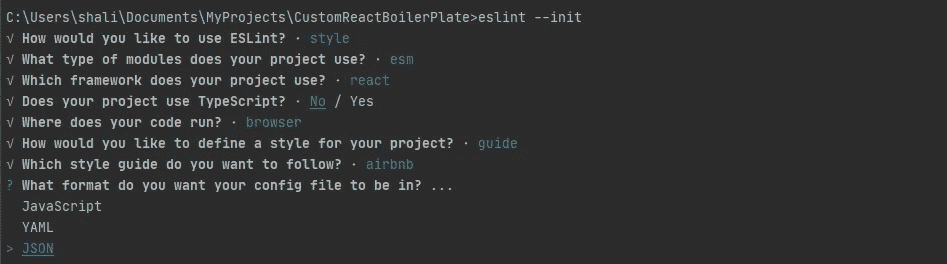**

**这里 Eslint 要求创建一个配置文件，文件名为 **JS** ， **YAMLor JSON** 。我个人比较喜欢 **JSON** 类型的配置文件。所以我选择 **JSON** 。**

**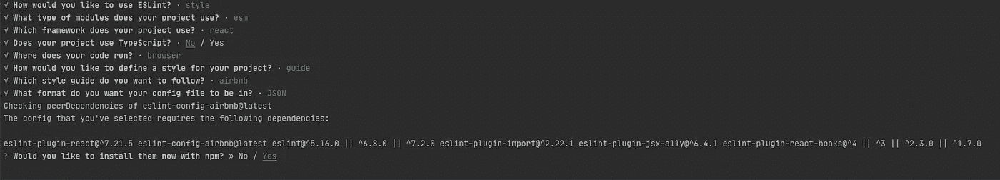**

**有时候 Eslint 会要求安装一些插件。所以请选择**是**。**

**现在你可以看到`eslintc.json`文件被创建在项目根文件夹中。这是 Eslint 的配置文件。**

**我们还得修改`webpack.config.js`。**

```
use: ['babel-loader', 'eslint-loader'] // include eslint-loader
```

**现在文件`webpack.config.js`看起来像，**

```
const ***path*** = require('path');
const ***HtmlWebpackPlugin*** = require('html-webpack-plugin');

module.exports = (env) => {
    const isProduction = env === 'production';
    return{
        entry: './src/index.jsx',
        output: {
            path: ***path***.resolve(__dirname, 'build'),
            publicPath: '/',
            filename: 'bundle.js'
        },
        resolve: {
            alias: {
                components: ***path***.resolve(__dirname, 'src'),
            },
            extensions: ['.js', '.jsx'],
        },
        devServer: {
            contentBase: "./build",
        },
        module: {
            rules: [
                {
                    test: /\.(js|jsx)$/,
                    exclude: /node_modules/,
                    use: ['babel-loader', 'eslint-loader']
                },
                {
                    test: /\.less$/,
                    use: [
                        'style-loader',
                        'css-loader',
                        'less-loader',
                    ],
                },
            ]
        },
        plugins: [
            new ***HtmlWebpackPlugin***({
                template:  ***path***.resolve('./index.html'),
            }),
        ],
        devtool : isProduction ?'source-map' : 'inline-source-map'
    }

};
```

**供参考:[https://eslint.org/](https://eslint.org/)**

**扩展埃斯林规则。我为更好的编码约定添加了一些自定义规则。如果您想要扩展 eslint 规则，请转到`eslintc.json`文件，并将您的自定义规则放在`"rules":{}`中。**

**如果你对自定义规则感兴趣请参考:[](https://github.com/ShalithaCell/Eslint-Rules-ReactJs)**

****所以我们再次运行项目`npm run start`****

****哦..控制台上出现了很多错误，****

****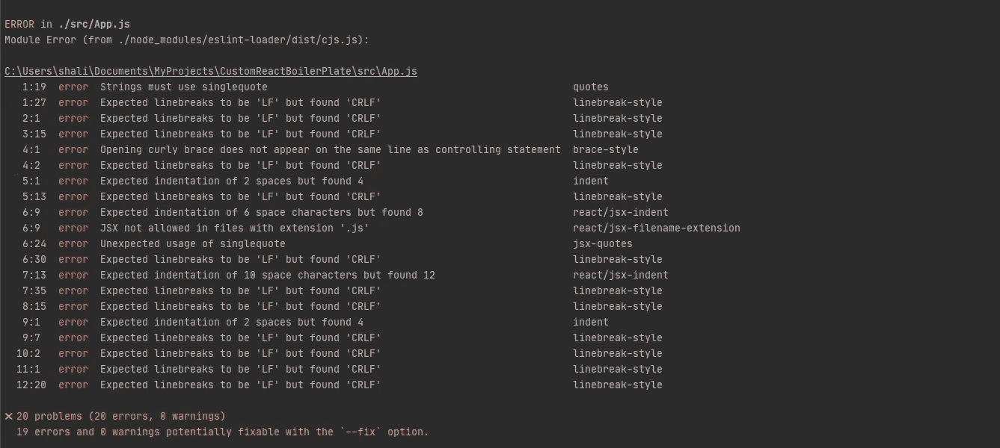****

****这些错误来自 Eslint。****

# ****错误！我该怎么办？****

****有多种方法可以解决 Eslint 错误和警告。****

*   ****使用—修复命令****
*   ****设置 IDE 以检查 Eslint 配置。****

## ****1.使用—修复****

****将下面一行添加到`package.json` 文件中。****

```
**"scripts": {
    "lint": "eslint --fix --ext .js,.jsx ."
}**
```

****现在**脚本**标签就像，****

```
**"scripts": {
  "start": "webpack serve --mode development",
  "lint": "eslint --fix --ext .js,.jsx .",
  "test": "echo \"Error: no test specified\" && exit 1"
},**
```

****然后用`npm run lint`运行****

****所以我们再次运行项目`npm run start`并检查错误是否消失。****

## ****2.设置 IDE 以检查 Eslint 配置。****

****参考 [b](https://dev.to/blaytenshi/enabling-eslint-on-intellij-vscode-3614) elow 链接配置 **WebStrom** 和 **VS 代码**。****

****[](https://dev.to/blaytenshi/enabling-eslint-on-intellij-vscode-3614) [## 在 Intellij 和 VSCode 上启用 ESLint

### ESLint 是一个非常酷的工具，可以帮你清理 Javascript 代码！但是，当您在 IDE 上进行设计时，例如…

开发到](https://dev.to/blaytenshi/enabling-eslint-on-intellij-vscode-3614) 

# 使用 React 设置更少

Less 是 CSS 的向后兼容语言扩展。

供进一步参考:[https://lesscss.org/](https://lesscss.org/)

让我们安装必要的软件包，

```
npm install --save-dev less less-loader css-loader style-loader
```

请检查您的 webpack 配置`module`属性，如下所示(我们之前配置了较少的属性):

```
module : {
   rules : [
      {
         test    : /\.(js|jsx)$/,
         exclude : /node_modules/,
         use     : [ 'babel-loader', 'eslint-loader' ],
      },
      {
         test : /\.less$/,
         use  : [
            'style-loader',
            'css-loader',
            'less-loader',
         ],
      },
   ],
},
```

最后你的包`package.json`文件脚本看起来，

```
"scripts": {
  "start": "webpack serve --mode development --env=development",
  "lint": "eslint --fix --ext .js,.jsx .",
  "test": "echo \"Error: no test specified\" && exit 1",
  "build": "webpack --mode production --env=production"
},
```

# 结论

我们刚刚创建了自己的 React 项目样板。不使用`create-react-app`而构建的全功能 React 应用。我希望这至少有助于澄清在您已经构建的 React 应用程序下正在发生的一些事情。

源代码:[https://github.com/ShalithaCell/React-Custom-BoilerPlate](https://github.com/ShalithaCell/React-Custom-BoilerPlate)****