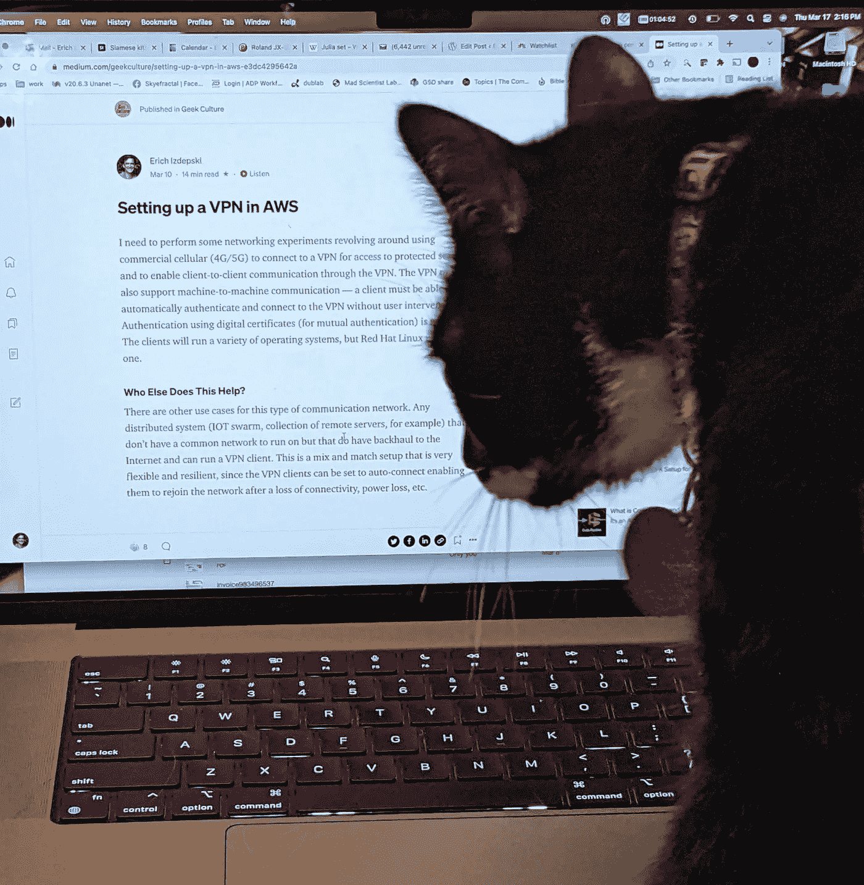
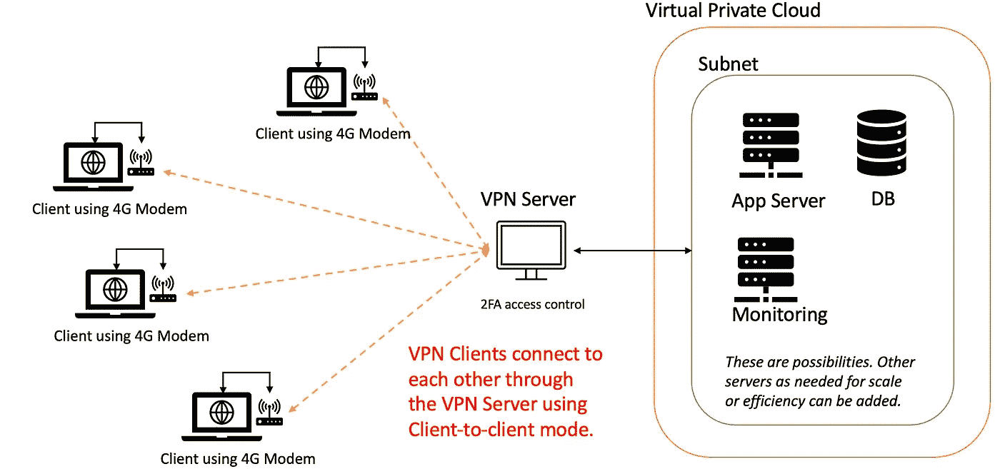
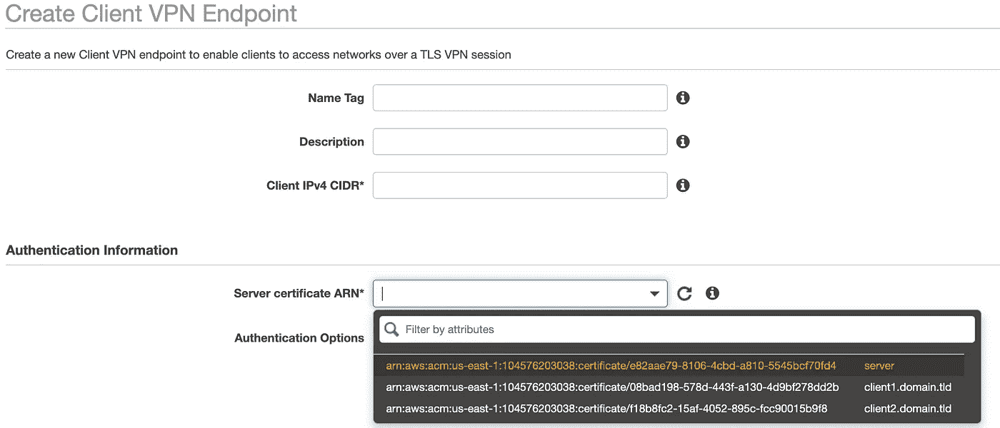
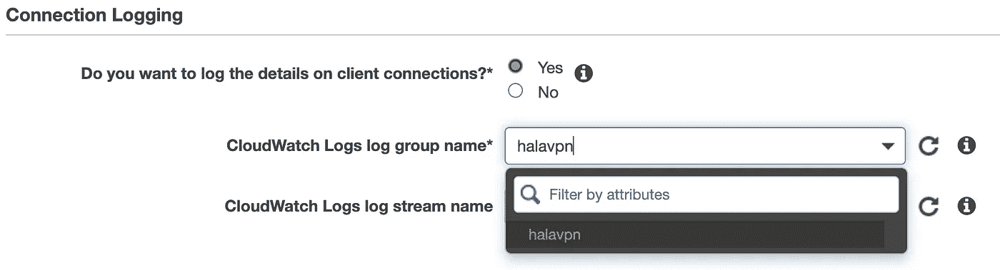
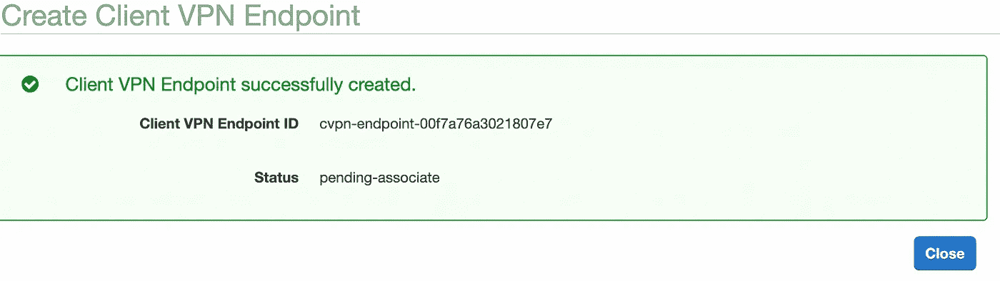
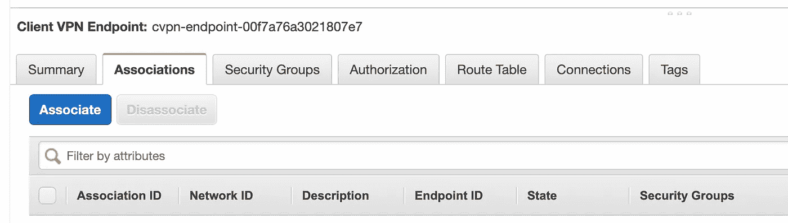
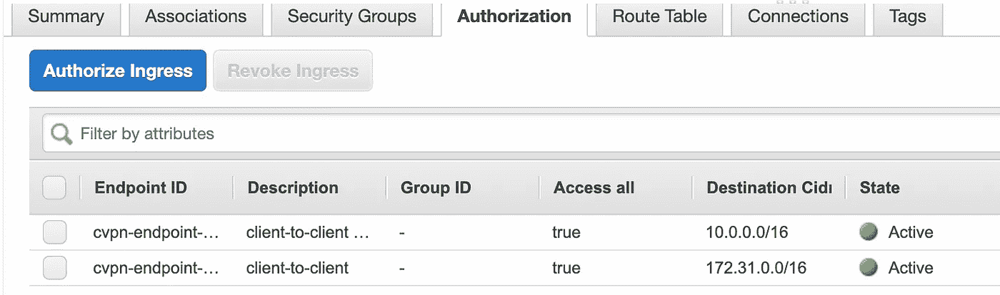
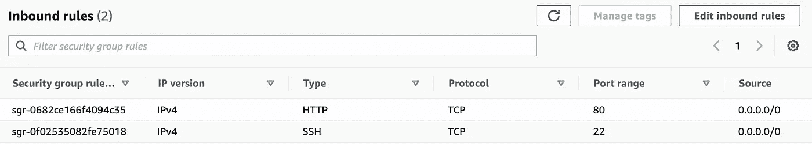
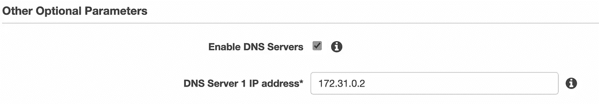
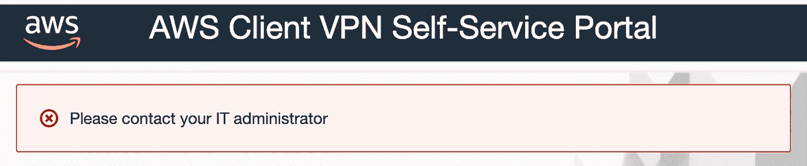

# 在 AWS 中设置 VPN

> 原文：<https://medium.com/geekculture/setting-up-a-vpn-in-aws-e3dc4295642a?source=collection_archive---------8----------------------->



So easy a cat could do it!

我需要围绕使用商用蜂窝(4G/5G)连接到 VPN 以访问受保护的服务并通过 VPN 实现客户端到客户端的通信来执行一些网络实验。VPN 还必须支持机器对机器的通信—客户端必须能够自动进行身份验证并连接到 VPN，而无需用户干预。我的目标是使用数字证书进行认证(用于相互认证)。这些客户机将运行多种操作系统，但 Red Hat Linux 是主要的操作系统。

## 这对谁还有帮助？

这种类型的通信网络还有其他使用案例。任何分布式系统(例如，IOT 群，远程服务器的集合),没有公共网络可以运行，但是有到互联网的回程，并且可以运行 VPN 客户端。这是一种非常灵活的混合设置，因为 VPN 客户端可以设置为自动连接，使它们能够在失去连接、断电等情况后重新加入网络。

# 初步研究

在做初步研究时，我发现 OpenVPN([https://openvpn.net](https://openvpn.net))具有我需要的客户端到客户端的通信特性。客户端也可用于许多操作系统(【https://openvpn.net/vpn-client/】T2)。此外，OpenVPN 客户端与 Amazon Web Services VPN 协同工作。我已经建立了一个 AWS 免费层帐户来试验这些功能，并验证我的计划是否可行。



Target Network Setup

为了满足我的要求，我首先需要一个 AWS 虚拟私有云(VPC)。我使用了新的创建 VPC 向导，建立 VPC 非常简单，因为每个选项都提供了很好的默认值。这提供了公共和私有子网、一个互联网网关以及一个通往 S3 存储的安全网关。公共子网使用路由表(自动创建)连接到互联网网关。*我后来发现 AWS 自动为我创建了一个默认的 VPC，所以我的是多余的。*

下一步是创建客户端 VPN 端点，它将成为客户端的通信中心和我的 VPC 的入口。

我需要用于相互认证的数字证书。这些可以自签名，步骤如下:

[https://docs . AWS . Amazon . com/VPN/latest/client VPN-admin/client-authentic ation . html # mutual](https://docs.aws.amazon.com/vpn/latest/clientvpn-admin/client-authentication.html#mutual)

要将证书放入 AWS 凭证管理器(ACM ),我建议使用 ACM 控制台。您可以使用 AWS CLI 客户端，但这需要更多的工作，除非您已经设置好了。

[https://docs . AWS . Amazon . com/CLI/latest/user guide/getting-started-install . html](https://docs.aws.amazon.com/cli/latest/userguide/getting-started-install.html)

> 光是 VPN 设置就花了 4 个多小时才能够连接到客户端。希望这些笔记能帮助你更快地完成。最后一部分，转移话题，涵盖了我的错误，这样你就可以避免它们。

# 自签名证书

生成您自己的 CA、服务器证书和密钥，以及一个或多个客户端证书和密钥非常简单，这里有详细的说明:

[https://docs . AWS . Amazon . com/VPN/latest/client VPN-admin/client-authentic ation . html # mutual](https://docs.aws.amazon.com/vpn/latest/clientvpn-admin/client-authentication.html#mutual)

> 关于安全的一句话。用于生成所有证书的命令指定 nopass，这意味着不加密私钥(默认为加密)。easyrsa 命令将提示您输入 PEM 通行短语。在某些情况下，这可能是必需的(无人值守登录，GUI 客户端不知道如何要求您输入密码，等等。)关注自己的需求就好。

接下来，使用 https://console.aws.amazon.com/acm[的 ACM 控制台上传证书](https://console.aws.amazon.com/acm)

需要注意的一点是，当您剪切和粘贴 PEM 编码的证书文件时，您需要包含证书数据的头(— -开始证书—-)和尾(—-结束证书— —)。

我导入了服务器证书和密钥，以及 ca.crt 文件和我的第一个客户机证书和密钥。我回去创建了一个新的客户端证书，发现指令中有一个小问题。在此之前，请务必将您的客户端证书和私钥复制到一个新文件(重命名)或位置！！

他们说要创建新的客户端证书，只需重新运行命令:

```
./easyrsa build-client-full client1.domain.tld nopass
```

这会导致以下错误(文件冲突):

> 请求文件已经存在。中止构建以避免覆盖此文件。如果您希望继续，请使用不同的名称或删除该文件。匹配文件位于:/Users/eizdepski/github/easy-RSA/easy RSA 3/PKI/reqs/client 1 . domain . TLD . req

您需要做的是为新的客户端证书更改输出文件名。我简单地创建了我的客户端 2，如下所示:

```
./easyrsa build-client-full client2.domain.tld nopass
```

我将新的证书对复制到包含所有证书的目录中，并使用 ACM 导入新的证书对。ACM 还让我为证书添加一个键/值对，所以我给它们起了名字，表明它们的用途。

# 创建客户端 VPN 端点

既然满足了先决条件，就该创建客户端 VPN 端点了。这一次，当我查看服务器证书 ARN 下拉列表时，我看到了我导入的新证书！



我还想确保只允许我在 VPN 服务器中颁发和提供的证书。不确定这是不是一个功能，但会做一些测试。

## 日志和云观察

因为我这样做是为了测试，所以我打开了 CloudWatch 日志。这要求我首先创建一个 CloudWatch 日志组名。我进入 CloudWatch 服务页面([https://console.aws.amazon.com/cloudwatch](https://console.aws.amazon.com/cloudwatch))，从页面菜单中选择 Logs: Log Group，然后点击“创建日志组”按钮。从测试开始，我将日志保留时间设置为 30 天。您还应该创建一个日志流。刷新客户端 VPN 页面上的下拉菜单显示了我刚刚创建的组和日志流，因此我选择了它们。



下面是一个成功的 VPN 客户端连接的 cloudwatch 日志示例。

```
{
    "connection-log-type": "connection-attempt",
    "connection-attempt-status": "successful",
    "connection-attempt-failure-reason": "NA",
    "connection-id": "cvpn-connection-blah",
    "client-vpn-endpoint-id": "cvpn-endpoint-blah",
    "transport-protocol": "tcp",
    "connection-start-time": "2022-03-10 19:10:05",
    "connection-last-update-time": "2022-03-10 19:10:05",
    "client-ip": "10.0.0.131",
    "common-name": "client1.domain.tld",
    "device-type": "mac",
    "device-ip": "72.83.89.146",
    "port": "60521",
    "ingress-bytes": "0",
    "egress-bytes": "0",
    "ingress-packets": "0",
    "egress-packets": "0",
    "connection-end-time": "NA",
    "connection-duration-seconds": "0"
}
```

## 可选(但很重要)

有一些重要的可选设置。我将 TLS 传输协议切换到 TCP(我正在使用蜂窝连接，所以我想要可靠性)。我还打开了分割隧道，这样我的所有流量就不会通过 VPN，并启用了自助服务门户，以便轻松检索客户端和 VPN 配置文件(结果是，当选择相互身份验证时，门户不工作)。

## 将 VPN 关联到 VPC

VPC 的身份证呢？我做了一个 VPC，但是当我检查我的控制台时，我发现我有两个。一个被列为默认。另一个是我做并命名的。这有点奇怪。我选择了默认的 VPC。



我做了更多的阅读，发现 AWS 为你创建了一个默认的 VPC，所以我删除了我创建的那个，因为它没有用。它也有一个重叠的 CIDR 范围，阻止协会的工作。

客户端 VPN 控制台显示状态为“待定-关联”。在控制台中，我选择了关联选项卡(在底部),关联过程开始了。这个过程大约需要 10 分钟才能完成。



# 连接到 VPN

VPC 仪表板现在有了一个新的按钮——下载客户端配置。这将为您提供客户端所需的 OpenVPN 配置文件。它包括 VPN 端点的 DNS 名称和我创建的 CA 证书。但是**-*是不完整的，没有任何关于客户端证书的内容。***

从客户端 VPN 控制台页面，我重新下载了我的 opvn 配置文件(并删除了其他文件)。我还尝试了 VPN 端点的 DNS 名称(ping ),它还没有激活。[顺便说一下，ping 被 VPN 服务器忽略，但是这个命令会显示 DNS 名称是否解析为 IP 地址，所以仍然有用。]

在调查这些问题时，我发现了一个示例 ovpn 配置文件，它解释了在哪里放置我的客户端证书和密钥数据。确保包含数据的页眉和页脚。

```
<ca>
*Contents of CA* </ca>
<cert>
*Contents of client certificate (.crt) file* </cert>
<key>
*Contents of private key (.key) file* </key>
```

我添加了用于客户端身份验证的证书和密钥，并尝试连接。它失败了，并说我的 VPN 端点的 DNS 名称没有解析。这可能需要几个小时来传播，所以我明天会尝试。

第二天我试了一下我的 OpenVPN 客户端，仍然无法连接。我认为这花了太长时间，不仅仅是一个 DNS 名称传播问题。我在这里发现了一个有趣的额外说明，它讲述了在出现 DNS 错误的情况下如何更改 OpenVPN 配置文件:

 [## 客户端 VPN 故障排除

### 以下主题可以帮助您解决客户端 VPN 端点可能遇到的问题。更多信息…

docs.aws.amazon.com](https://docs.aws.amazon.com/vpn/latest/clientvpn-admin/troubleshooting.html#resolve-host-name) 

下载的配置文件有一个远程随机主机名设置，显然在 OpenVPN(在使用版本 3.3.3 (4163)的 Mac 上)中不起作用。

```
remote cvpn-endpoint-blah-blah-blah 443
remote-random-hostname
```

它应该做的是在 DNS 名称前附加一个随机字符串，以防止 DNS 缓存，但它没有。我加了“哈拉”DNS 名称所在的远程线路，现在我可以连接:

```
remote hala.cvpn-endpoint-blah-blah-blah 443
remote-random-hostname
```

## 客户端到客户端的通信

我还需要更改 VPN 服务器配置，以允许客户端到客户端的通信，并使用多个客户端进行测试。我计划使用不同的接入网络(蜂窝和家庭 FIOS)将它们连接起来。说明在这里:[https://docs . AWS . Amazon . com/VPN/latest/client VPN-admin/scenario-client-to-client . html](https://docs.aws.amazon.com/vpn/latest/clientvpn-admin/scenario-client-to-client.html)

现在让我们看看它们的效果如何！这些指令顺利地发挥了作用。只是一定要注意你用的是哪个 CIDR 系列。有时是客户范围，有时是 VPC 范围。



我将两台计算机连接到 VPN，并尝试对它们进行 ping 操作。我可以从 Windows 转到 Mac，但如果不关闭 Windows 防火墙，就不能反过来。底线是他们能够通过 VPN 通话。我还在 Windows 机器上启动了一个 web 服务器，在更改 Apache 配置以监听当前的 VPN IP 地址后，我可以通过 Mac 上的 VPN 客户端到客户端通信来查看网页。

## 将 EC2 实例添加到 VPC

我想验证一切，所以还将在我使用的 AWS VPC 子网中设置一个简单的 web 服务器，这样我就可以测试从客户端通过 VPN 到 web 服务器的连接性。说明在这里:[https://docs . AWS . Amazon . com/AWS C2/latest/user guide/launching-instance . html # initiate-instance-launch](https://docs.aws.amazon.com/AWSEC2/latest/UserGuide/launching-instance.html#initiate-instance-launch)

启动实例时，请确保它在正确的 VPC 中启动，并且位于与您的客户端 VPN 关联的子网上。实例启动向导的实例详细信息部分显示了 VPC 和子网，并允许您编辑它们。启动后，您可以验证实例私有 IP 是否在客户端 VPN 端点的 CIDR 范围内。

我启动了我的实例，并尝试通过 SSH 连接。我可以使用它的公共 DNS 名称和我在实例启动期间创建的密钥对通过 SSH 连接，并且不需要在 VPN 上这样做。这不是我真正想要的，因为我只想通过 VPN 访问，但对于测试来说，这并不坏。我注意到你的 redhat 的 SSH 用户名必须是 ec2-user vice root(文档是错误的)。你的密钥文件权限也不能太‘开放’。不允许全球可读。我在密钥文件上使用 chmod 400 重置了我的权限。

下一个挑战是当通过 VPN 连接时，使用 SSH 来访问 VPC 子网上的私有 DNS(或 IP)。这一开始并不奏效，因为当我授权从客户端 VPN 访问 VPC 子网时，*我调换了部分 IP 地址*。一旦我解决了这个问题，我就可以直接使用 SSH 和 EC2 实例的私有 IP 地址了。但是，EC2 实例 DNS 名称不起作用。请注意，由于 EC2 实例防火墙的原因，ping 可能不起作用，因此请使用其他方法来验证连通性。

默认情况下，EC2 启动实例允许入站 SSH 流量——您可以在 EC2 控制台页面的 Security 选项卡中检查这些设置。防火墙似乎设置为“全部拒绝”，因此任何其他测试都需要添加适当的入站流量规则。

## Web 服务器测试

我在 EC2 实例上安装了 Apache。需要 3 个命令(如果不想让它自动启动，只需要 2 个命令)就可以让它运行。

```
sudo yum install http
sudo chkconfig httpd on
sudo server httpd start
```

确保为 EC2 实例的安全组添加 HTTP 入站流量规则！！



我使用它的私有 IP 地址通过客户端 VPN 访问它，得到了 RHEL 测试页面。我仍然没有为 VPN 客户服务的 DNS，虽然，没有访问 VPC 子网上的服务器，也没有为他们自己服务。我还希望根据客户端数字证书中的属性自动应用 VPN 客户端的 DNS 名称。这将使客户端更容易找到彼此，因为当您重新连接时，客户端 IP 会发生变化。

## 附加测试

我做了一些其他的测试。我创建了一个没有客户端证书的配置文件，它无法按预期连接。我有丢失随机 DNS 字符串部分的原始配置文件，它不工作(又一次，如预期的那样)。我还创建了一个配置文件，其中包含一个没有上传到 ACM 的新客户端证书，它连接了。这意味着 VPN 接受任何拥有由我创建的 CA 签署的客户端证书的人。

我尝试了 Windows 10 OpenVPN 客户端，它可以正常使用我创建的配置文件。然后我去掉了 DNS 前缀，看看 remote-random-hostname 是否适用于这个客户端，它确实适用！这很好，因为虽然前缀解决了 Mac 客户端的问题，但通过 DNS 缓存，您仍然可能遇到 IP 被 Amazon 更改，而您的本地 DNS 缓存指向旧 IP 的情况。随机前缀阻止缓存工作，因为它在缓存中找不到条目，并且总是查询 DNS 服务器。

我还通过客户端 VPN 在一个 4G 热点(我的最终目标网络)上测试了一切，一切都正常。

# VPC 的 DNS

虽然这种设置不需要 DNS 也可以工作，但是查找连接到 VPN 服务器的 IP 地址，或者使用我为 EC2 实例使用的子网中的服务的 IP 地址是很繁琐的。那么如何解决这个问题呢？

VPC 子网中的 DNS 服务器位于子网的. 2 地址。我的子网是 172.31.0.0，这意味着 DNS 服务器应该在 172.31.0.2。我上了 VPN，用我的 web 服务器的私有 DNS 名称尝试了一个 nslookup 命令，它成功了。

```
eizdepski@eclector ~ % nslookup ip-172-31-73-3.ec2.internal 172.31.0.2
Server:  172.31.0.2
Address: 172.31.0.2#53Non-authoritative answer:
Name: ip-172-31-73-3.ec2.internal
Address: 172.31.73.3
```

只有一个问题——我不知道如何向 OpenVPN 客户端提供 DNS 服务器 IP。我试过一种方法，但日志仍然显示没有设置 DNS 服务器。我回到客户端 VPN 设置，记得当我设置它时，我没有启用 DNS，因为我当时不知道 VPC DNS 服务器的 IP 地址。我回去修好了。



我重新连接了 VPN 客户端，现在日志显示了我的 DNS 服务器。我用私有 DNS 名称尝试了 web 服务器，得到了我想要的 RHEL 测试页面。

# 摘要

这花了一些时间(总共大约 9 个小时，但包括这篇文章)，所以我希望它能帮助你走得更快一点。还有一件事我想实现；也就是说，为 VPC 客户提供 DNS 名称，这样他们可以更容易地找到彼此。至少在 VPC，现在有了 DNS 支持，客户端可以很容易地连接到中央服务器，从而可以获得网络中所有节点的 IP 地址。其他要考虑的事情是进一步锁定环境，但在你把自己锁在外面之前，你只能到此为止，所以要小心。只允许 SSH 流量的默认规则是好的。

# 转移

这是关于我犯的所有错误的部分！可能会节省你一些时间，所以仔细看看。

## 打字稿

小心那些 CIDR 山脉！

## 自定义 VPC

如果您自己制作 VPC，请确保您的 CIDR IP 地址范围不与客户端 VPN 使用的范围重叠。这是行不通的，你不能改变范围，这意味着你必须重新开始，创造一个新的 VPC。

## 自助服务页面

我尝试了自助服务页面，但收到一条错误消息。读了一会儿之后，我发现这个门户对那些使用相互认证的人不可用。



## 使用 CLI 上传证书

*注意——这是 Mac OS 特有的*

我使用的是版本 1.10.62 的 AWS CLI(运行“AWS-Version”进行检查)，所以决定升级到版本 2。低于 1.20 的版本基于 Python 2.7，该版本已被弃用，加上我首先使用 3.7.4，我必须删除旧的 CLI，但在我的 Mac 上出现错误。

这将删除 cli(除非您安装了 pip)

```
sudo rm -rf /usr/local/awssudo rm /usr/local/bin/aws
```

如果你安装了 pip，那么用这种方式卸载。提示:要想知道你是否安装了 pip，输入‘pip freeze’并查找 awscli 条目。

```
eizdepski@eclector ~ % pip3 uninstall awscli
```

我收到一个错误。

```
xcrun: error: invalid active developer path (/Library/Developer/CommandLineTools), missing xcrun at: /Library/Developer/CommandLineTools/usr/bin/xcrun
```

以下命令将修复该问题:xcode-select–install

接下来，我安装了 CLI 版本 2 并验证了它。

```
eizdepski@eclector ~ % curl “https://awscli.amazonaws.com/AWSCLIV2.pkg" -o “AWSCLIV2.pkg”
% Total % Received % Xferd Average Speed Time Time Time Current
Dload Upload Total Spent Left Speed
100 27.1M 100 27.1M 0 0 5985k 0 0:00:04 0:00:04 — : — : — 5985k
eizdepski@eclector ~ %
eizdepski@eclector ~ % sudo installer -pkg ./AWSCLIV2.pkg -target /
installer: Package name is AWS Command Line Interface
installer: Installing at base path /
installer: The install was successful.
eizdepski@eclector ~ % which aws
/usr/local/bin/aws
eizdepski@eclector ~ % aws --version
aws-cli/2.4.23 Python/3.8.8 Darwin/21.3.0 exe/x86_64 prompt/off
eizdepski@eclector ~ %
```

这是导入证书的命令:

```
eizdepski@eclector halavpn % aws acm import-certificate --certificate fileb://server.crt --private-key fileb://server.key --certificate-chain fileb://ca.crt
```

但是，尝试上传还是没有成功。我没有上传的权限(可能是因为我将 aws CLI 升级到了版本 2)，也没有完全安装新的 CLI。调用 ImportCertificate 操作时出错(无法识别的 ClientException):

```
The security token included in the request is invalid.
```

我切换到 ACM 控制台——简单多了！