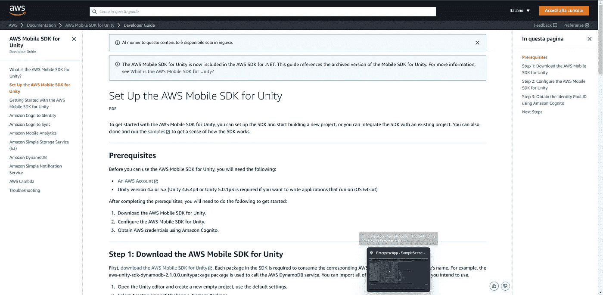

# 通过 4 个步骤在 Unity 中设置和开始使用 AWS

> 原文：<https://medium.com/geekculture/setting-up-and-getting-started-with-aws-in-unity-in-4-steps-f662b62f8248?source=collection_archive---------15----------------------->

**目标**:在 Unity 项目中设置 AWS Mobile SDK

**Unity** 是一个强大且相对即时的引擎，可以用来构建**应用**，只要**游戏**。

在应用程序中，将需要数据:帐户登录，设置，从几个来源检索信息…

The [web page](https://docs.aws.amazon.com/mobile/sdkforunity/developerguide/setup-unity.html) with the steps to set up the SDK