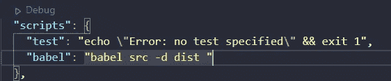
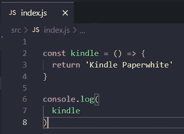
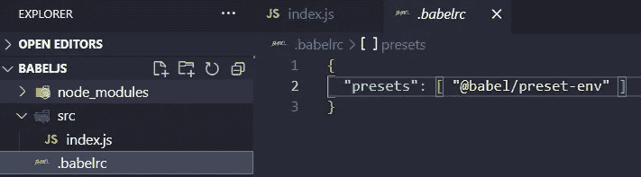
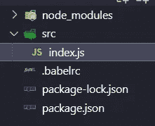
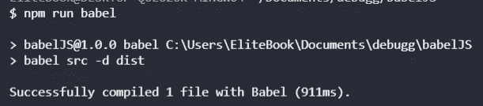
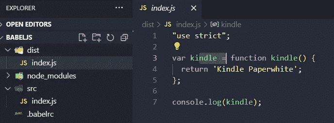
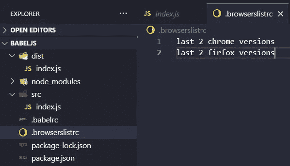

# 为 JavaScript 设置 Babel 非常小的项目

> 原文：<https://medium.com/geekculture/setting-up-babel-for-javascript-very-small-project-2c68800c4df3?source=collection_archive---------9----------------------->


我当时用的是 Webpack，TypeScript 的编译器，现在是时候给老浏览器用 Babel 了，因为这是 Babel 的要点。

# 巴比伦式的城市

巴别塔就像它的网络所说的那样:

> Babel 是一个工具链，主要用于将 ECMAScript 2015+代码转换为当前和旧版本浏览器或环境下的向后兼容版本的 JavaScript。以下是 Babel 可以为您做的主要事情:

换句话说，它将帮助我们编译的 JavaScript 在旧的浏览器中工作。

你也可以看

# 我们开始吧

我们需要安装依赖项，但是在开发依赖项上，因为巴别塔是用于开发目的的。

# NPM

启动 NPM

```
$ npm init -y
```

仅出于开发目的安装依赖项，我们将使用 babel、core、CLI 以及最后但并非最不重要的预置-env

```
$ npm i --save-dev [@babel/core](http://twitter.com/babel/core) [@babel/cli](http://twitter.com/babel/cli) [@babel/preset-env](http://twitter.com/babel/preset-env)
```

然后我们需要在我们的 JSON 包中添加这个命令来运行 Babel，我们运行 Babel，然后它将搜索 src 目录，最后它将编译我们的 dist 目录中的文件，对吗？



Example command to run Babel

```
"babel": "babel src -d dist "
```

然后我们需要创建我们的 JavaScript 文件


Js files’ Directory



Small example of my JavaScript file with arrow functions

之后，我们需要添加我们的 babelrc 文件来添加预置，这将完成为旧浏览器转换 js 文件的工作



Example Creating .babelrc file

我们需要使用 JSON 结构来保持一切正常，然后我们需要添加预设，在这种情况下是 preset-env，这就是现在的全部内容

迄今为止的结构



Example structure

运行命令

```
$ npm run babel
```

如果一切顺利，我们可以看到它将我们的文件编译到 dist 目录中



Example running babel for the first time



Example output js file

并为旧浏览器做好了准备对不起，kindle 的例子，但我真的很喜欢这些设备❤，然后，如果你想使用巴别塔的特定版本的浏览器，你需要创建一个 browserslistrc 文件添加什么样的版本你想要的



Example structure and browserlistfile

# 结论

巴别塔是一个方便的老浏览器的工具，而不是与 IE 或另一个老浏览器斗争，你可以选择这个小例子运行你的巴别塔的命令，去吃零食，继续学习，我们可以指定浏览器版本真棒！如果我们为一家只使用 Chrome 版本 56 或其他版本的公司工作，真的很有用！

# 来源

[](https://babeljs.io/) [## 下一代 JavaScript 的编译器

### 我们是一小群志愿者，他们利用业余时间维护这个项目，由社区资助。如果…

babeljs.io](https://babeljs.io/) [](https://babeljs.io/docs/en/) [## 巴别塔是什么？巴比伦式的城市

### Babel 是一个 JavaScript 编译器

babeljs.io](https://babeljs.io/docs/en/) [](https://www.amazon.com/TypeScript-Quickly-Yakov-Fain/dp/1617295949) [## 快速打字

### 在 Amazon.com 上快速打字[费恩，雅科夫，莫伊瑟夫，安东]。*符合条件的优惠可享受免费*运输。打字稿…

www.amazon.com](https://www.amazon.com/TypeScript-Quickly-Yakov-Fain/dp/1617295949)