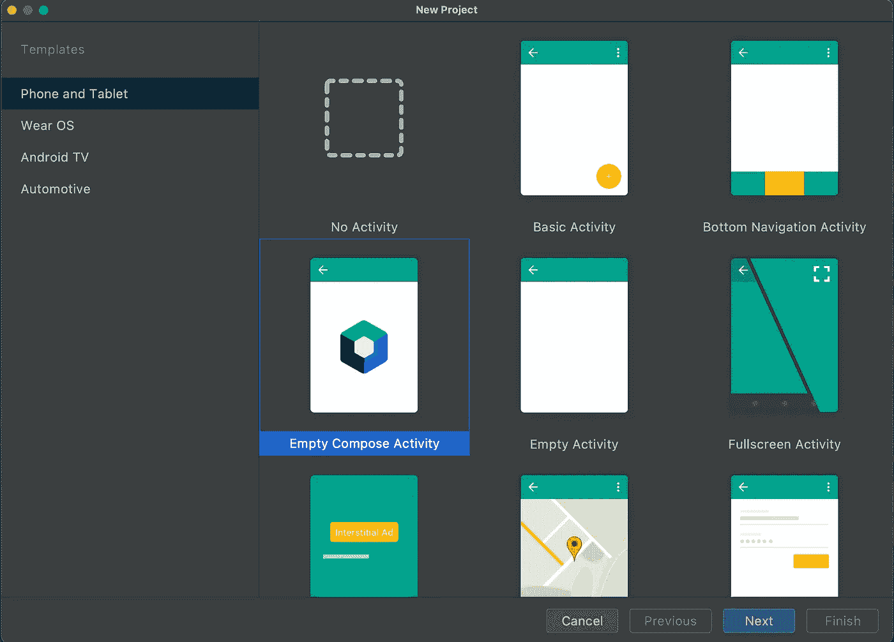
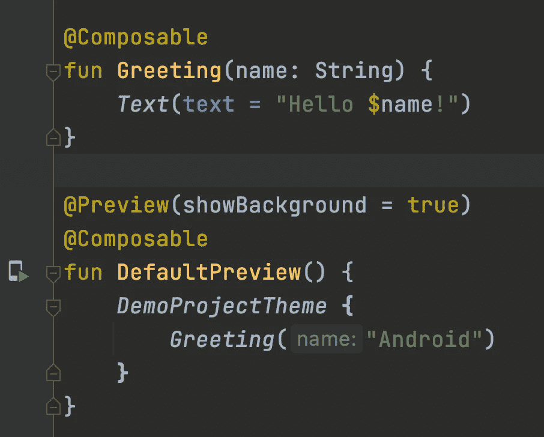
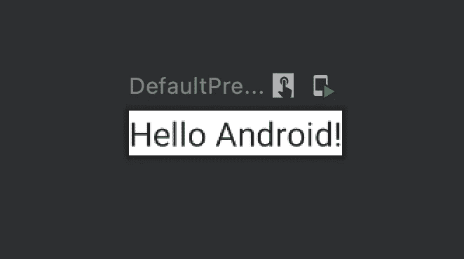

# 设置撰写。

> 原文：<https://medium.com/geekculture/setting-up-compose-d16be61cf30c?source=collection_archive---------63----------------------->

Jetpack Compose

Jetpack Compose 是一个适用于 android 的现代 UI 工具包。这无疑是 android 团队在过去几年中发布的最令人兴奋的功能之一。

既然它现在已经稳定并发布了 1.0 版本，那么现在无疑是开始学习 compose 的好时机。

为了开始，你需要有一个 android studio IDE，如果你还没有的话，你可以从[这里](https://developer.android.com/studio)得到。

> **可组合**:帮助创建 UI 的普通函数。

# 让我们创建我们的第一个项目。

创建一个新项目，在创建新项目时，确保您已经选择了空的 Compose 活动。

构建完成后，您将看到一个名为 Greeting 的可组合示例，默认情况下由 IDE 生成。您还会注意到 ui.theme 目录，它包含所有的主题、字符串以及颜色资源，这些资源以前都在 res 目录中。浅色和深色主题的颜色已经为我们预先定义好了。

**@Composable** 注释用于构建 UI 元素的函数。用@Composable 注释函数或表达式会改变函数或表达式的类型。例如，可组合函数只能从另一个可组合函数中调用。

@Preview 批注帮助我们在 IDE 本身中可视化 UI，而无需在设备或仿真器上运行它(@Preview 批注)。

接下来，我们将探索最常见的 Jetpack 组合布局:元素放置的方式及其在视图系统中的等效方式。

直到那时快乐写作。