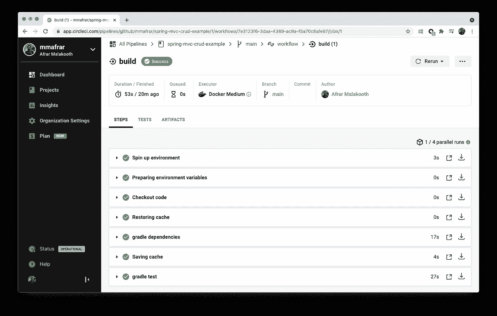

# 在 Spring Boot 建立与 GitHub 和 CircleCI 的持续集成

> 原文：<https://medium.com/geekculture/setting-up-continuous-integration-in-spring-boot-with-github-and-circleci-f2e68690e138?source=collection_archive---------32----------------------->

持续集成是主要的 DevOps 实践，允许所有开发人员的工作副本一天几次合并到共享存储库中。目前有几个工具可以设置这个，即 GitLab Runners，AWS CodeBuild，GitHub Actions，Travis CI & Jenkins 等。

Photo by [Sigmund](https://unsplash.com/@sigmund?utm_source=medium&utm_medium=referral) on [Unsplash](https://unsplash.com?utm_source=medium&utm_medium=referral)

在这个故事中，我将关注如何用 CircleCI 为 GitHub 库设置这个。我将使用一个 Spring Boot 的 MVC 项目，该项目使用 Gradle 作为构建工具，但是即使您更喜欢 Maven，也应该可以使用。要继续学习本教程，你需要将你的 Spring Boot 项目托管在 GitHub 库中，如果你没有这样的库，请随意使用下面的例子。

 [## MMA frar/spring-MVC-crud-example

### 用 JPA 和 JSP 实现 Spring Boot MVC CRUD 操作

github.com](https://github.com/mmafrar/spring-mvc-crud-example) 

接下来访问 CircleCI 网站并使用您的 GitHub 帐户登录。登录后，您将进入**仪表板**页面。从左侧窗格点击**项目**菜单，你应该会被重定向到如下所示的屏幕。从显示的项目列表中，点击**设置项目**按钮，选择您计划继续学习本教程的项目。您应该看到项目的示例配置，根据您的编程语言和构建工具选择正确的配置。我选择了 **Java (Gradle)** ，如果你的项目使用 Maven 选择 **Java (Maven)** 。

Projects

你会看到一个模板 *config.yml* 文件，下面是一个基于 Gradle 的 Java 项目的例子。点击**提交并运行**按钮。这将在*中创建一个 *config.yml* 文件。circleci* 文件夹，位于您的存储库的根目录下一个名为 *circle-ci-setup* 的新分支上。如果您对这个配置满意，您可以稍后将它合并到您的主分支中，或者继续进行更改。

如果**提交并运行**选项不起作用(就像我几次遇到的那样)，你应该会看到手动操作的步骤。将文件手动提交到您的存储库中，并推送更改。然后点击**开始构建**按钮手动触发作业。

Job Steps

接下来，从左侧窗格导航到**仪表板**页面，点击带有文本 **build** 的超链接。您将看到如上所示的作业摘要。

编码快乐！下面是我发布的一个 DEV 社区视频。你可能也有兴趣看看我的媒体故事[给 iOS 应用程序添加启动屏幕](https://mmafrar.medium.com/adding-a-launch-screen-to-an-ios-app-ac197075b25b)。

 [## 为 iOS 创建简单的浏览器

### 链接到故事…

dev.to](https://dev.to/mmafrar/creating-a-simple-browser-for-ios-2b3)