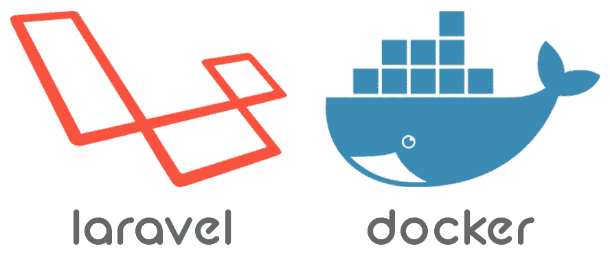

# 在新设备上使用 Docker 设置 Laravel 100%

> 原文：<https://medium.com/geekculture/setting-up-laravel-100-with-docker-on-a-new-device-158ae2e2727?source=collection_archive---------7----------------------->

我经常与个人讨论如何建立工作环境。仍然有一个很大的社区拒绝 Docker 我假设是因为他们不知道如何充分利用它。在本文中，我想展示如何使用 Docker 在您的计算机上设置一个环境。这就是你所需要的。你不需要任何其他东西，并且你使用哪个操作系统都没关系。你永远不会有…