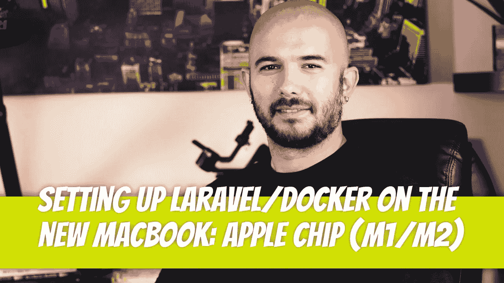

# 在新 MacBook 上设置 Laravel/Docker:苹果芯片(M1/M2)

> 原文：<https://medium.com/geekculture/setting-up-laravel-docker-on-the-new-macbook-apple-chip-m1-m2-4e9027535aca?source=collection_archive---------0----------------------->

我们将假设您刚买了一台新的 Mac，并试图尽快启动和运行。将会有一些你需要开始做的事情，比如`brew`、`composer`和`Docker`。

如果你不需要从 GitHub 拉一个 Laravel 项目，而且这是你第一次在电脑上安装 Laravel 项目…