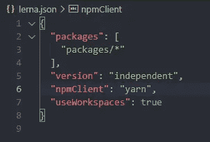
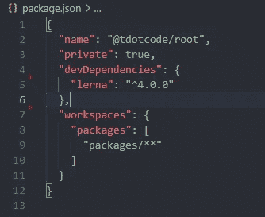
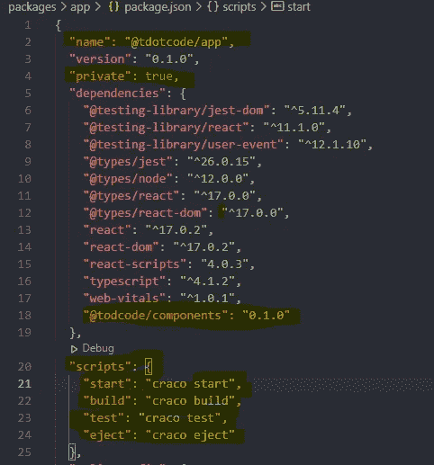
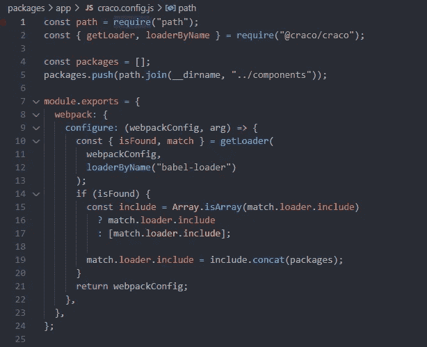
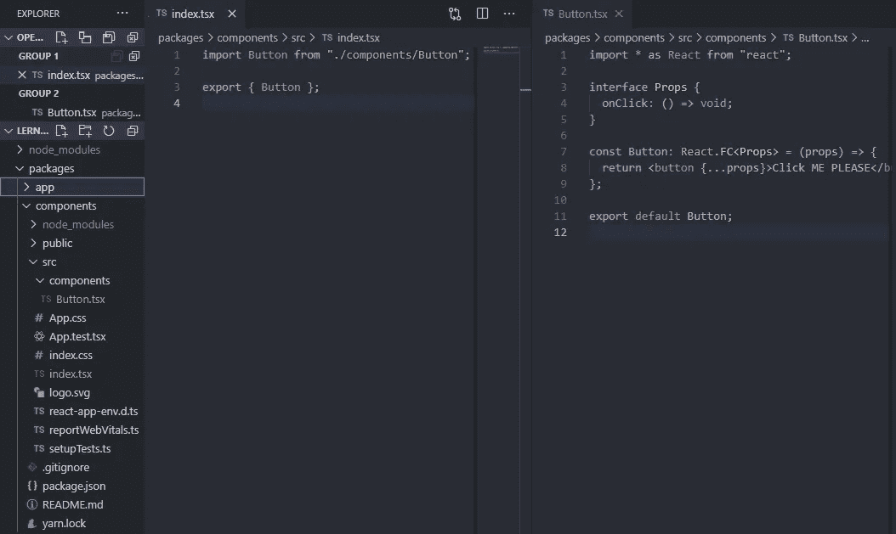

# 使用 Create React 应用程序设置 Monorepo

> 原文：<https://medium.com/geekculture/setting-up-monorepo-with-create-react-app-cb2cfa763b96?source=collection_archive---------1----------------------->

问候大家！正如往常一样，这篇文章有一个视频版本，您可以一步一步地查看，让您开始使用 monorepo for Create React 应用程序！:D

简单介绍一下，我的任务是转换一个 monorepo，其中有 2 个 create react 应用程序。尽管这是一个 monorepo，但代码不能在不同的应用程序之间共享，create react app 很难让它开箱即用。因此，我在网上四处寻找一篇文章或一个人，希望能在我运气不佳的情况下帮助我。我不得不阅读 8 篇不同的文章，从每篇文章中获取一些信息，找出如何让多个 create react 应用程序在彼此之间共享代码的简单任务。因此，我希望这篇文章能帮助你开箱即用！

# **你需要什么工具来完成这项工作？**

首先你需要两个 create react 应用程序，其次你需要 craco(create-react-app-config-ovveride)。我发现使用 craco 比 react-app-rewired 容易得多。
我们还将使用 lerna 和 yarn 工作区来帮助管理 monorepo。

让我们运行几个命令并开始吧！

```
npx lerna init
mkdir packages/app
mkdir packages/components
```

这将在您的工作区中设置 lerna。即使我们使用的是 yarn 工作空间，为什么还要使用 lerna？lerna 自带了非常有用的 cli 命令，可以并行运行进程，我认为与 yarn workspaces 相结合，它使事情变得非常强大。
修改您的`lerna.json`文件，如下所示



lerna.json

这将告诉 lerna 使用纱线作为客户端，使用`useWorkspaces`作为纱线。如果您没有创建一个`package.json`文件，您将需要做一个`yarn init -y`。如果你已经创建了一个，修改如下



package.json

你可以添加任何你喜欢的名字，重要的是`"private": true`和`"workspaces"`

现在我们已经完成了所有的设置，让我们准备好应用程序，从运行`npx create-react-app --template typescript`的`app`和`components`文件夹，以及运行`lerna.json`文件的顶层文件夹`yarn add -W craco`。同样，craco 将是帮助我们共享组件的关键。

一旦安装了两个应用程序`app/components`，将`package.json`文件中的名称更改为您将用来引用应用程序的名称。在我的例子中，我选择了`@tdotcode/app`和`@tdotcode/components`。



这就是你的`package.json`文件应该看起来的样子。重要字段会突出显示。确保当您将另一个 repo 作为依赖项添加时，确保您也添加了在`components`package . JSON 文件中声明的正确版本。还要注意我们是如何用`craco`替换`react-scripts`的。

我们需要做的最后一件事是在`app`目录下创建一个`craco.config.js`文件。在这个文件中，我们将具体说明当我们引用我们的`components`文件夹中的文件时，我们希望 webpack 如何表现。



craco.config.js

如果您之前已经设置了自己的 wepack 配置，这应该对您有意义。本质上，我们只是提取`babel-loader`配置，并告诉`babel-loader`转换来自组件目录的代码。如果我们不这样做，我们的浏览器将加载文件，这是 JavaScript 无法解析的。

最后一件事，在你的根文件夹中，我将运行`yarn lerna bootstrap`这将引导所有应用程序到根节点模块文件夹，以便其他 repos 可以使用它。

# 万岁你完蛋了！！！！🎊🎊🎊

现在您需要做的就是在您的`components`文件夹中创建组件，并从您的`app`文件夹中提取它们。在我的例子中，我在 components 文件夹中创建了一个按钮。



components folder

需要注意的一点是，我在 package.json 文件中设置了一个属性为`"main": "./src/index.tsx`,这将是引用组件目录的应用程序的入口点。

现在让我们看看`app`是如何使用按钮的


如您所见，我们通过在`package.json`文件中设置的名称来引用另一个应用程序。

# 结论

我们已经学会了如何设置我们的 create-react-apps 来在 monorepo 类型的设置中工作，这对我的项目来说是巨大的，因为两个应用程序可以共享公共组件，这消除了两个应用程序之间的差异！

*   **Github 代码可在此处找到***
*   [https://github.com/floydjones1/monorepo-cra](https://github.com/floydjones1/monorepo-cra)