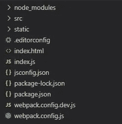
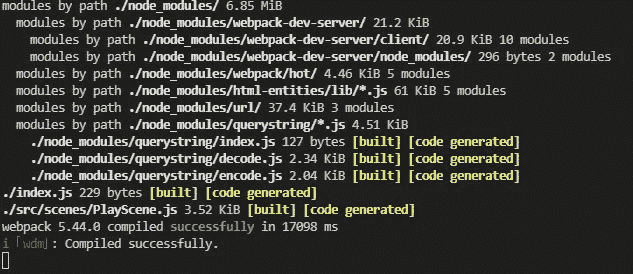

# 使用 Webpack 和 NodeJS 设置 Phaser 3—第一部分

> 原文：<https://medium.com/geekculture/setting-up-phaser-3-with-webpack-and-nodejs-part-i-d25365563f74?source=collection_archive---------2----------------------->

haser 3 对于 JavaScript 开发者来说是一个迷人的游戏开发框架。随着脸书即时游戏通过插件提供的支持和在线游戏的增长趋势，人们可以放心地打赌，它将在未来几年获得更多的牵引力。


Photo by [Ferenc Almasi](https://unsplash.com/@flowforfrank?utm_source=medium&utm_medium=referral) on [Unsplash](https://unsplash.com?utm_source=medium&utm_medium=referral)

作为一名 JavaScript 开发人员(是的，罪名成立！)，几个月前决定尝试一下游戏开发。老实说，几乎每个软件开发人员一生中至少有一次梦想写自己的游戏。因此，在本文中，我们将介绍如何使用 Webpack 和 NodeJS 来设置 Phaser 3 框架。

> **亲提示:**
> 
> 我已经创建了一个名为 [@cdebadri/phasercli](https://www.npmjs.com/package/@cdebadri/phasercli) (类似 create-react-app)的 npm 包，用它可以很容易地用 webpack 配置 phaser 游戏，只需一个命令。如果你想要一个可扩展的工具和一个一站式的解决方案来用 webpack 配置 phaser 游戏，而不需要写样板代码，请使用这个。现在我们继续这篇文章。

让我们打开一个终端，写下:

```
mkdir -p phasergame && cd phasergame
npm init -y
```

这将在当前工作目录下创建一个名为`phasergame`的目录，并在其中创建一个`package.json`，表明该文件夹现在是一个 NodeJS 项目。现在我们可以开始安装依赖项了。

```
npm i phaser --save
npm i webpack webpack-cli css-loader babel-loader @babel/core @babel/preset-env style-loader html-webpack-plugin copy-webpack-plugin webpack-dev-server --save-dev
```

我们刚刚安装的依赖项的一些要点:

*   `phaser`:游戏框架和引擎。
*   `webpack`:捆绑者。它将有一个配置文件，指示 webpack 应该如何捆绑 html、css、js 和资产(图像、字体等)。)在一起。
*   `webpack-cli` : Webpack 有自己的 CLI，也需要安装，这样 Webpack 才能在隔离的环境中处理文件。
*   `css-loader`:这将拉所有的 css 文件并转换成字符串。
*   `style-loader`:这将获取字符串并将其包含在相关的 html 页面的 style 标签下。
*   `babel-loader`:这将获取源代码中所有的 ES6+特性(比如类)并将其转换成 ES5 特性，所有浏览器都支持。
*   `@babel/core`和`@babel/preset-env`:这些是智能预设，在传输文件时使用最新的 ES5 JavaScript 特性。它还添加了聚合填充，以防浏览器环境不支持它。
*   `html-webpack-plugin`:它将从一个模板文件中创建一个 index.html。模板可以是一个 ejs 文件，甚至是一个 html 文件。它还会动态添加捆绑的 js 文件。
*   它将复制所有的静态资产，如图片、字体等，并把它放在提供静态内容的 dist 文件夹中。
*   `webpack-dev-server` : Webpack 提供了一个 dev 服务器，用于在保存时热重装 UI。这不是强制性的，但它很好，因为人们在设计游戏时不必考虑服务器端代码。

让我们打开`src`文件夹，添加一些代码。在`src`中，我们将创建一个`scenes`文件夹

下面是目录结构的样子:



一些关于重要子目录和文件的提示:

*   `src`:这将保存源代码。
*   `static`:这是提供静态文件的目录。
*   `webpack.config.dev`和`webpack.config`:这是分别用于开发和生产的 webpack 配置文件。对于开发来说，建议以某种方式配置捆绑输出，以便更容易跟踪特定模块的错误，而在生产中，我们希望缩小捆绑包，以便最小化捆绑包的大小。

我们将继续为我们的游戏添加一些源代码。让我们在`src`中创建一个`scenes`文件夹，并在`scenes`下添加一个名为`PlayScene.js`的文件。这里有一些`PlayScene.js`的代码:

在本文中，我只是在游戏窗口的中央放了一张图片。我在与`src`文件夹相邻的`static`文件夹中有一个`star.png`图像。

接下来我们将添加`index.js`，它将创建游戏环境。

index.js

我们还将添加一个`index.html`，它将作为`HtmlWebpackPlugin`的模板:

Sample index.html

现在让我们开始添加 webpack 配置:

A webpack development config

在这里，生成的文件将被放在项目根目录下的`build`文件夹中。整个配置是一个对象，不同的键具有以下意义:

*   `mode` —这告诉我们应该在哪个环境中使用这个配置。
*   `output` —它告诉我们生成文件的位置。`path`和`filename`将列出生成文件的目的地和名称。`clean`选项将在每次新构建完成时清理输出目录。
*   `module` —这是告诉 webpack 如何处理源文件的部分。`babel-loader`应该使用`@babel/preset-env`预置来**转换**代码(获取所有 ES6+特性并将其转换成易于理解的 ES5 特性)。接下来，我们用`css-loader`和`style-loader`来加载 css 文件，最后我们对资产文件进行配置。
*   `devtool` —该选项告诉 webpack 如何生成源地图。有多种选项，如`eval`、`eval-cheap-source-map`等。人们可以从这个[链接](https://webpack.js.org/configuration/devtool/)中浏览所有链接，然后选择最适合的链接。
*   `plugins` —接下来是插件。`HtmlWebpackPlugin`应该使用模板文件构建`index.html`,并通过 webpack 插入生成的`main.js`。`CopyWebpackPlugin`应该将字体和图像等静态文件复制到`build`文件夹。
*   `devServer`——很多时候，在开发游戏时，我们不想考虑后台进程，如在数据库中更新高分或在数据库中存储玩家分数，而只关注游戏性。这里，`webpack-dev-server`来拯救我们了。它提供了一个现成的服务器，只需对`port`、`contentBase`(应该提供内容的文件夹)、`hot`(如果要热重装代码)等进行很少的配置就可以使用。

一旦开发配置就绪，让我们更新我们的`package.json`,让 webpack 获取这个配置文件来生成构建。

```
"scripts": {
  "start": "npx webpack serve --config ./webpack.config.dev.js"
}
```

`npx webpack serve`命令将使用我们刚才编码的`./webpack.config.dev.js`启动`webpack-dev-server`。

现在让我们打开一个终端，转到我们的项目目录并键入:

```
npm start
```

我们会在屏幕上看到 webpack 日志，在日志的底部，应该有一个“编译成功”。



Webpack build successfull

现在，如果我们在`localhost:3000`打开浏览器，我们会看到一个黑色的屏幕，我们的星星在屏幕中央。

我们将在下一篇文章中讨论生产 webpack 配置。更多敬请关注！