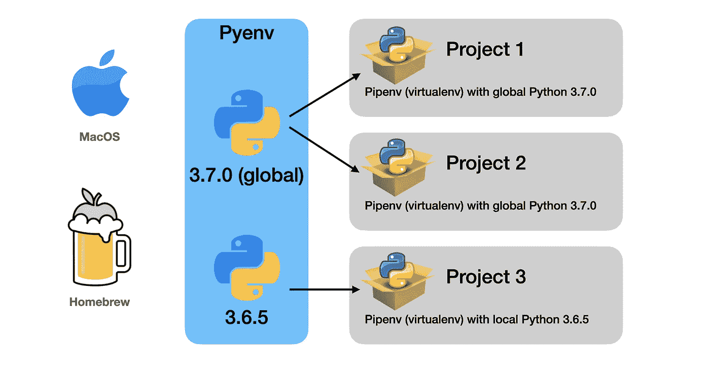
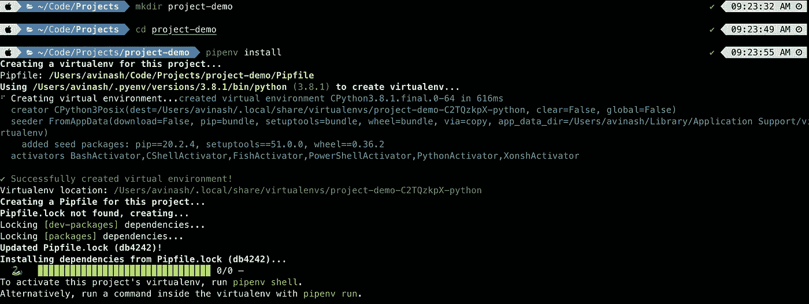
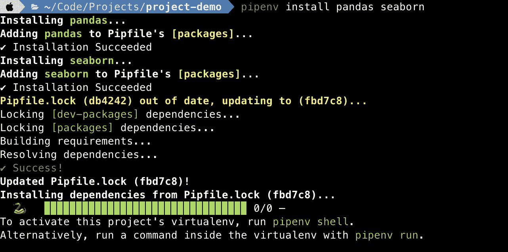
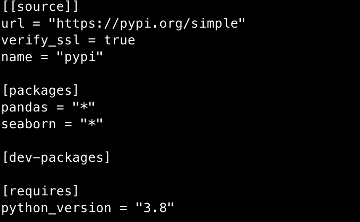
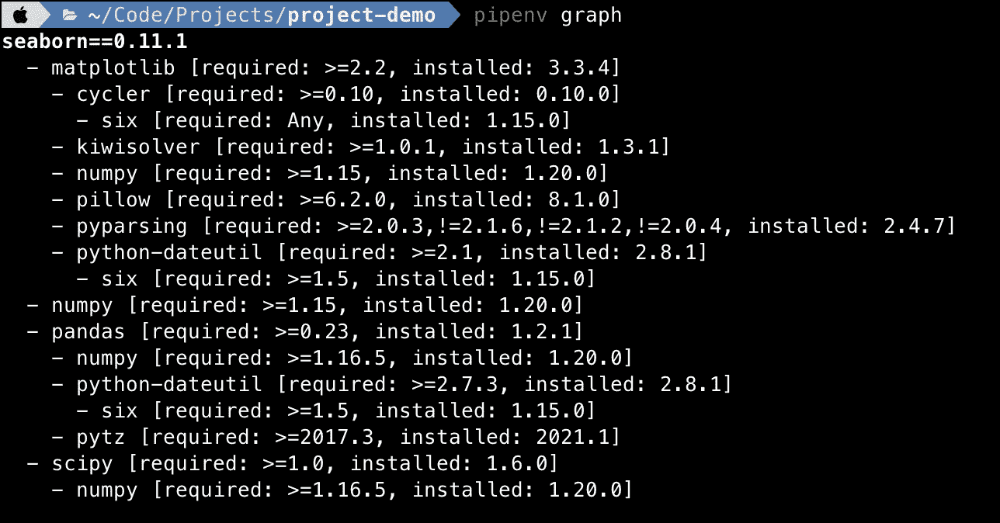

# 使用 Homebrew、Pyenv 和 Pipenv 在 macOS 中设置 python 环境

> 原文：<https://medium.com/geekculture/setting-up-python-environment-in-macos-using-pyenv-and-pipenv-116293da8e72?source=collection_archive---------0----------------------->

## 如果您正在处理需要部署到生产环境并维护干净代码库的不同项目，Pyenv 和 Pipenv 是必要的工具。



A high-level overview of how Pyenv and Pipenv are different and solve the bigger problem.

在本地系统中处理不同的项目时，我们经常会遇到一个问题

1.  对于不同的项目，我们可能需要不同的 python 版本(不太常见)
2.  我们可能需要与特定版本兼容的 python 包(更有可能)。
3.  不同项目的虚拟环境便于部署

在遇到这个问题后，我找到了一个完美的解决方案，它使用了两个非常棒的库——Pyenv 和 Pipenv。

Pyenv 是管理 python 版本，Pipenv 是创建每个项目所需的虚拟环境，管理每个项目的 Python 包及其依赖关系。

这是在本地进行不同项目的一个很好的方式，没有任何麻烦。

我们将使用自制软件安装 Pyenv 和 Pipenv。如果你已经有了自制软件，跳过下一步。

## 安装自制软件

家酿是一个 macOS 的软件包管理器。还有其他像 MacPorts 这样的包管理器，但是家酿很容易也很受欢迎。这是我的一站式软件包管理器，用于安装一些软件包，如 java、scala、apache-spark、python…

只需运行下面的代码从它的 git repo 安装家酿。或者查看他们的官方页面—【https://brew.sh/ 获取说明和故障排除

```
ruby -e "$(curl -fsSL https://raw.githubusercontent.com/Homebrew/install/master/install)"
```

## 安装 Pyenv

我们可以使用带有`brew install python`的自制软件或特定版本`brew install python@3.7`来安装 python，但是使用 Pyenv 是处理不同版本的更好方式。

```
brew install pyenv
```

也将这段代码添加到您的。zshrc 或者。bashrc，取决于你用的 shell。然后重新启动终端，使更改生效。

```
if command -v pyenv 1>/dev/null 2>&1; then
  eval "$(pyenv init -)"
fi
```

要查看所有 pyenv 可用的 python 版本:

```
pyenv install --list
```

要安装特定版本:

```
pyenv install 3.7.0
```

默认情况下，macOS 选择系统 python 版本。要将 pyenv 版本设置为默认值:

```
pyenv global 3.7.0
```

检查 python 版本，它应该反映如上设置的版本:

```
python --version
```

如果特定项目需要不同的 python 版本，则首先安装该版本(如果尚未安装)，导航到项目文件夹，并将该版本设置为该文件夹的本地版本。

```
pyenv install 3.6.5
cd <path to project folder>
pyenv local 3.6.5
```

这样，一个特定的项目将使用 3.6.5 版本，所有其他项目默认使用 3.7.0 版本。

要检查使用 pyenv 安装的所有 python 版本，请输入以下命令:

```
pyenv versions
```

查看他们的主页了解更多详情—【https://github.com/pyenv/pyenv 

## 安装管道

而 pyenv 将拥有不同版本的 python，并能够在它们之间轻松切换。Pipenv 是为不同的项目创建虚拟环境，我们需要不同版本的 python 包。总的来说，我建议使用虚拟环境，这样可以很容易地在生产中复制或者共享项目所需的包列表。

使用自制软件安装 Pipenv:

```
brew install pipenv
```

**注意:**这个 pipenv 创建了对 python 版本的依赖，该版本在 pyenv 中被设置为全局的。

导航到项目文件夹并运行`pipenv install`

```
cd <path to project folder>
pipenv install
```

这将在该文件夹中创建一个虚拟环境。虚拟环境的名称与文件夹名称相同。(注:我的全球版本是 3.8.1)



Using pipenv to create a virtual environment within the project folder.

如果您有一个包含 requirements.txt 的现有项目文件夹，这也将安装该文件中列出的包。

它还创建了两个文件——Pipfile 和 Pipfile.lock。

要安装任何软件包，请执行 pipenv install <list of="" packages="" separated="" by="" space="">。不需要激活虚拟环境。注意是 **pipenv** 而不是 **pip** 。</list>



Using pipenv to install necessary packages.

现在让我们看一下 Pipfile。



Contents of Pipfile created by pipenv install.

Pipenv 中另一个很棒的命令，用来查找包之间的依赖关系，它存储在 Pipfile 中

```
pipenv graph
```



Results of Pipenv graph command.

如果只安装了 seaborn，那么所有这些包也会被安装。这是显示依赖关系的一种很好的方式，与不知道哪个包依赖哪个包或者为什么某个包在列表中的`pip list`相比，我非常喜欢这种方法。

反过来也一样。当卸载`pipenv uninstall pandas`时，它会移除其他包不需要的依赖包。

要运行 python 文件，请使用`pipenv run python <file.py>`。不需要激活虚拟环境并从中运行 python。一行代码就能完成所有工作，而且非常简单。

Pipenv 比我在本文中提到的要多得多。因此，我建议仔细阅读他们的文档以了解更多细节和定制—[https://docs.pipenv.org/](https://docs.pipenv.org/)

**专业提示:**为中的所有命令创建别名。zshrc 或者. bashrc .下面是我的列表供参考。

```
alias py="python $1"
alias prp="pipenv run python $1"
alias ps="pipenv shell"
alias pi="pipenv install $1"
alias pu="pipenv uninstall $1"
alias pg="pipenv graph"
alias pr="pipenv --rm"
```

## 结论

当处理需要不同 python 版本或不同 python 包的不同项目时，或者为了易于部署，pyenv+pipenv 是一个极好的组合。设置它需要一点时间和精力，但从长远来看是值得的。