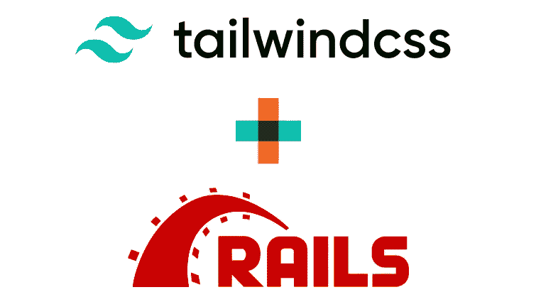

# 用 JIT 设置 Rails 6.1 + Tailwind CSS 2.2

> 原文：<https://medium.com/geekculture/setting-up-rails-6-1-tailwind-css-2-2-with-jit-41a237ca22dc?source=collection_archive---------6----------------------->



我将向您展示如何使用 *Rails 6.1* 及其默认 *Webpacker* 版本(4.5)创建一个项目，并配置 *Tailwind CSS* ，启用其依赖项和 *JIT* 模式。

您将得到一个自动编译最终 CSS 的项目，并在每次更改后为您刷新浏览器。

创建一个 *Rails* 应用程序:

```
rails new tailwind-jit-rails
```

安装*顺风 CSS* 依赖项。打开终端并运行:

```
yarn add @fullhuman/postcss-purgecss@^4 postcss@^8 postcss-loader@^4 autoprefixer@^10 tailwindcss@^2
```

创建文件`app/javascript/stylesheets/application.scss`(您必须创建`stylesheets`目录)。

现在打开`application.scss`并添加*顺风 CSS* 指令:

```
@tailwind base;
@tailwind components;
@tailwind utilities;
```

记住这是一个 *SCSS* 文件，所以你可以在这里添加你以后需要的 *SCSS* 代码。

打开`app/javascript/packs/application.js`并添加该导入以包含新的`application.scss`:

```
import "stylesheets/application.scss"
```

将该行放在最后一个`import`(通道)的下方。

打开`postcss.config.js`并将此`require`添加到`plugins`数组的开头，就在第一个`require`之前:

```
require('tailwindcss')
```

打开`app/views/layouts/application.html.erb`并将其添加到`stylesheet_link_tag`之前:

```
<%= stylesheet_pack_tag 'application', 'data-turbolinks-track': 'reload' %>
```

所以它看起来像这样:

```
<%= stylesheet_pack_tag 'application', 'data-turbolinks-track': 'reload' %>
<%= stylesheet_link_tag 'application', media: 'all', 'data-turbolinks-track': 'reload' %>
<%= javascript_pack_tag 'application', 'data-turbolinks-track': 'reload' %>
```

现在您可以在终端中创建*顺风 CSS* 配置文件:

```
npx tailwindcss init
```

启用 *JIT* 模式并配置`purge`选项，如下所示:

```
mode: 'jit',
purge: [
  './app/views/**/*.html.erb',
  './app/helpers/**/*.rb',
  './app/javascript/**/*.js',
],
```

为了防止*网络打包机*产生一个相当烦人的警告信息，打开`babel.config.js`并在底部添加这个，就在关闭`].filter(Boolean)`之前:

```
['@babel/plugin-proposal-private-methods', { loose: true }],
['@babel/plugin-proposal-private-property-in-object', { loose: true }]
```

请记住在前面的元素中添加一个逗号。它看起来会像这样:

```
[
'@babel/plugin-transform-regenerator',
  {
    async: false
  }
],
['@babel/plugin-proposal-private-methods', { loose: true }],
['@babel/plugin-proposal-private-property-in-object', { loose: true }]
```

最后，为了让 *Webpacker 5* 与 *PostCSS 8* 一起工作，我们需要添加一个小黑客。打开`config/webpack/environment.js`并将其添加到`module.exports = environment`之前:

**就是这样！**

如果您想测试它是否工作，创建一个测试控制器:rails g controller Home index

在`config/routes.rb`中增加`root`:

```
root 'home#index'
```

打开`app/views/home/index.html.erb`并像这样创建一个`H1`:

```
<h1 class="font-bold text-4xl text-center text-red-500">Hello World!</h1>
```

现在在终端选项卡中打开 *Webpacker* 服务器:

```
bin/webpack-dev-server
```

在另一个选项卡中显示 *Rails* 服务器:

```
bin/rails s
```

打开浏览器并加载`localhost:3000`

你应该会看到一个大大的红色 *Hello World！*

试着做些改变，你会发现它编译和刷新浏览器的速度有多快。

作为附加说明，为了让 *Tailwind CSS IntelliSense* 扩展在`html.erb`文件中工作，你必须打开首选项并寻找`files.associations`选项。点击*添加项目*按钮，添加`*.html.erb`为*项目*，添加`html`为*值*。

[](https://www.udemy.com/course/tailwind-css-fundamentals/?referralCode=2C23FC8E6076971C23A6)

如果你喜欢这篇文章，并且没有时间去研究和学习这个框架，**我推荐我的** [**关于 Udemy**](https://www.udemy.com/course/tailwind-css-fundamentals/?referralCode=2C23FC8E6076971C23A6) 的 Tailwind CSS 课程，在那里我会简明扼要地解释如何使用这个框架。

我也教你如何使用 4 个官方插件，为你节省了很多工作。

尽情享受吧！