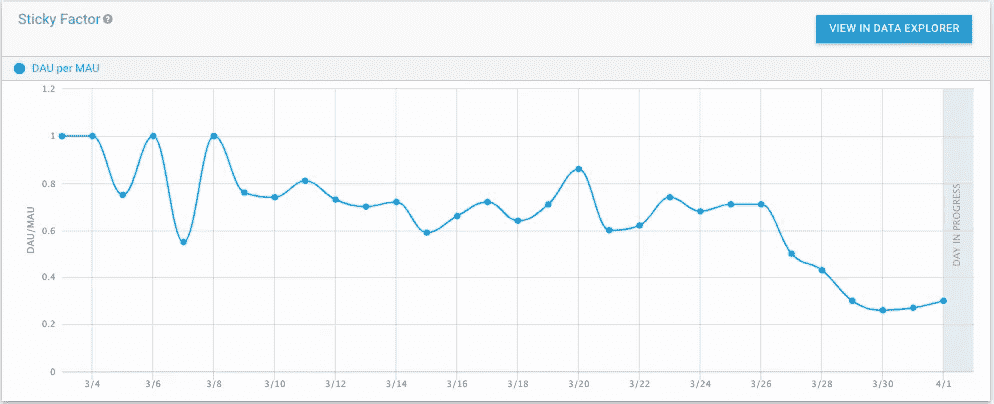

# 设置 Unity Analytics

> 原文：<https://medium.com/geekculture/setting-up-unity-analytics-f54c7ad8f5c7?source=collection_archive---------12----------------------->

## 如何团结

## 快速设置和运行！

如果你想更好地了解你的受众、他们的品味和习惯，分析服务是必不可少的。

Unity 提供了一种简单的方法让**跟踪**并分析您可能感兴趣的事件，例如:

*   点击一个按钮
*   选择一个字符或情节路径…