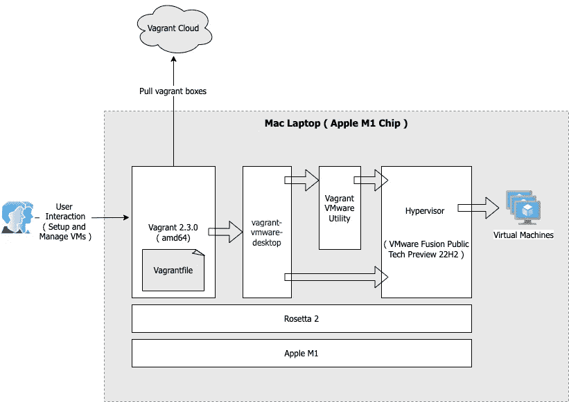
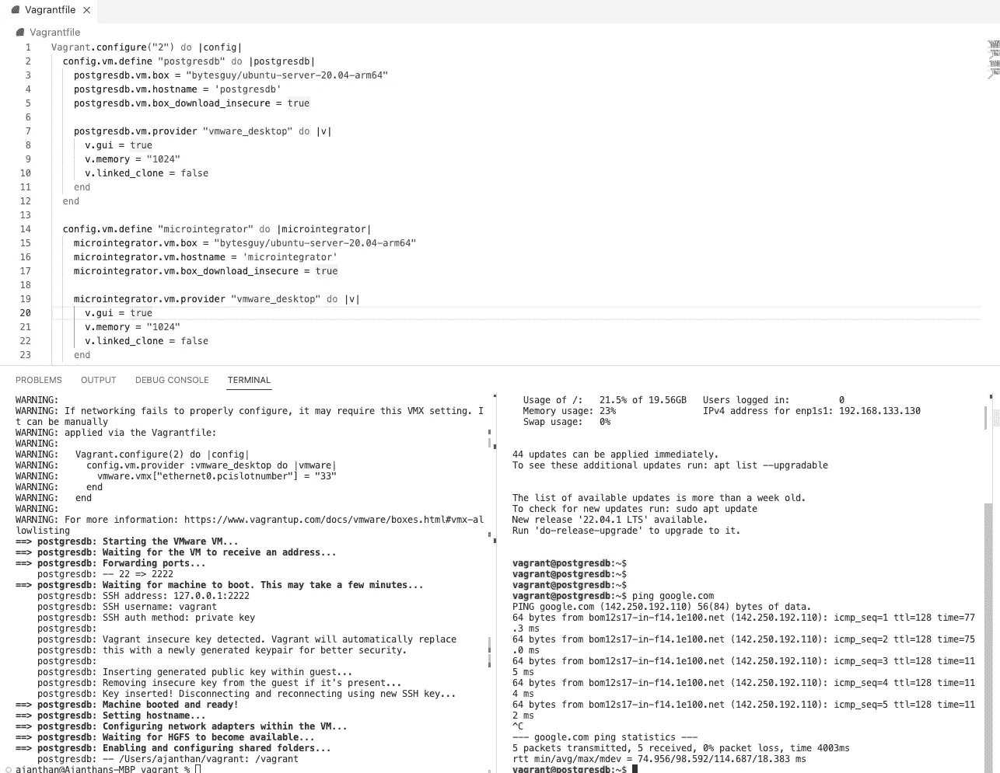

# 为 Mac(苹果 M1 专业版)中的虚拟机管理设置 vagger 2 . 3 . 0

> 原文：<https://medium.com/geekculture/setting-up-vagrant-2-3-0-for-virtual-machine-management-in-mac-apple-m1-pro-9dc4ec9036db?source=collection_archive---------0----------------------->

对于开发人员来说，总是需要一个本地环境来尝试不同的开发任务，这就需要在本地 PC 上进行多虚拟机管理。Vagrant 是目前在本地环境中设置和管理多个虚拟机最方便的工具。

在这篇文章中，我的意图是解释我们如何在苹果苹果 M1 CPU 架构中设置这一点——其中安装需要一些依赖，因为目前苹果 M1 不支持虚拟盒。

## **我们要设置什么**

## 先决条件

1.  **罗塞塔 2:** 这是为了在搭载苹果芯片的 Mac 电脑上运行一款为搭载英特尔处理器的 Mac 电脑打造的应用。
2.  **流浪者 2.3.0** :流浪者分布，用于 VM 设置和管理
3.  **流浪者-vmware-桌面(3.0.1 )** :流浪者的 VMware 提供者的主要部分。
4.  **流浪者 vmware 实用程序(1.0.21 ):** 流浪者-VMware-桌面插件与之交互的服务。这部分插件的目的是在主机上执行需要特权访问的操作。这包括融合/工作站的网络操作和验证。(内容摘自[https://github.com/hashicorp/vagrant-vmware-desktop](https://github.com/hashicorp/vagrant-vmware-desktop))
5.  **虚拟机管理程序(VMware Fusion Public Tech Preview 22 H2)**:如前所述，它将用作虚拟机管理程序。

**安装步骤**

1.  作为第一步，安装 Rosetta 2。执行下面的命令来实现它。

2.安装流浪者。去[https://www.vagrantup.com/downloads](https://www.vagrantup.com/downloads)下载 Mac 版的并安装 dmg。

使用下面的命令检查 vagger 的版本。

3.安装**虚拟机管理程序(VMware Fusion 公共技术预览版 22H2)。去 https://customerconnect.vmware.com/downloads/get-download?下载 Group=FUS-PUBTP-22H2 并安装**VMware-Fusion-e . x . p-2019 12 87 _ universal . dmg .****

也执行下面的命令

4.现在安装 vmware 应用工具。去[https://www.vagrantup.com/vmware/downloads](https://www.vagrantup.com/vmware/downloads)下载并安装流浪者 vmware Utility 1.0.21。

安装后，请检查以下位置的日志。这是为了检查 vm-utility 是否正常运行。

检查是否正在运行

如果不启动它

5.现在执行下面的命令来安装 vagger-VMware-desktop。

6.现在，我们可以创建这个流浪者文件，并执行命令来创建所需的虚拟机。

示例流浪文件

7.现在，执行 vagger up 命令来创建并启动 VM。请注意，当运行此命令时，将会有一个 GUI 打开，只需最小化并在后台运行它。当我们在没有 GUI 选项的情况下执行时，travel up 命令挂起，看起来这是一个已知的问题。

8.通过 SSH 连接到服务器

9.同样，其他虚拟机也可以启动。这个博客到此为止。

10.更多有用的命令和备忘单可以在 https://gist.github.com/wpscholar/a49594e2e2b918f4d0c4 的[找到](https://gist.github.com/wpscholar/a49594e2e2b918f4d0c4)

## 参考

1.  【https://www.vagrantup.com/intro 
2.  [https://github.com/hashicorp/vagrant-vmware-desktop](https://github.com/hashicorp/vagrant-vmware-desktop)
3.  [https://www . vanguard . com/docs/providers/VMware/installation](https://www.vagrantup.com/docs/providers/vmware/installation)
4.  [https://gist . github . com/sbailliez/f22db 6434 AC 84 eccb 6 D3 c 8833 c 85 ad 92](https://gist.github.com/sbailliez/f22db6434ac84eccb6d3c8833c85ad92)
5.  [https://github.com/hashicorp/vagrant/issues/12195](https://github.com/hashicorp/vagrant/issues/12195)
6.  [https://www.youtube.com/watch?v=UZXFMCfXqh8](https://www.youtube.com/watch?v=UZXFMCfXqh8)
7.  [https://www . vanguard . com/docs/providers/VMware/configuration](https://www.vagrantup.com/docs/providers/vmware/configuration)