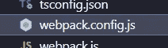
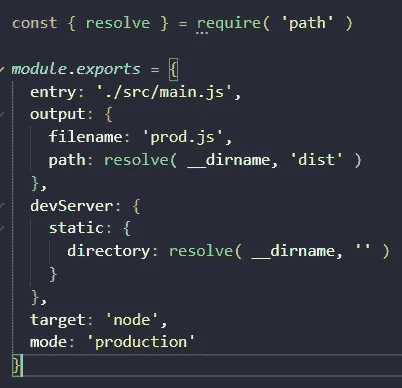
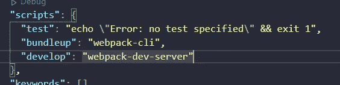
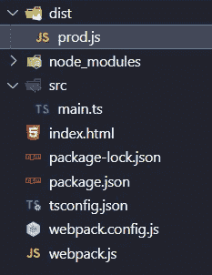
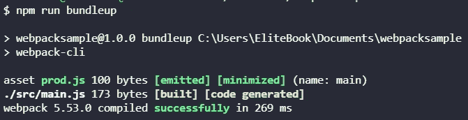
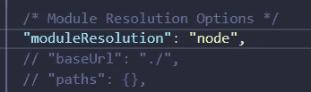
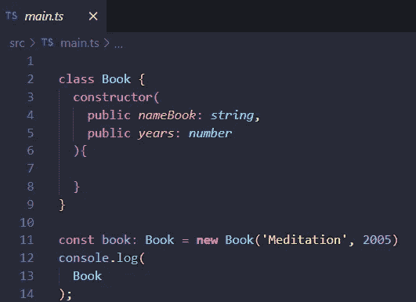
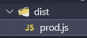

# 为 JavaScript、TypeScript 设置 Webpack 并使用 Webpack 服务器

> 原文：<https://medium.com/geekculture/setting-up-webpack-for-javascript-typescript-and-using-webpack-server-f5654a2de11b?source=collection_archive---------4----------------------->


我真的很想在我的项目中使用 Webpack，但是没有足够的时间或者没有动力，我一直在回避 Webpack😥，现在我正在给我的项目添加第一步，并从中学习了很多😀

# 网络包

[维基百科说](http://webpack is an open-source JavaScript module bundler.)

> webpack 是一个开源的 JavaScript 模块捆绑器。

它有助于压缩我们的文件，它可以创建我们的代码块，为我们的项目提供更好的性能，实际上它使用加载器来创建所有的魔法，并扩展 Webpack 的使用。

# 让我们从 JavaScript 开始

你也可以看！

您需要创建一个目录，然后在该目录中使用以下命令创建一个 NPM JSON 文件

```
npm init -y
```

然后您需要安装 Webpack 和 Webpack-cli

```
npm i --save-dev webpack webpack-cli
```

之后，您需要创建一个 webpack-config 文件



Example webpack config file

在 webpack-config.js 文件中，我们可以从这段代码开始



Example code for Webpack-config.js file for JavaScript

```
const { resolve } = require( 'path' )
*module*.*exports* = {
entry: './src/main.js',
output: {
filename: 'prod.js',
path: resolve( __dirname, 'dist' )
},
devServer: {
static: {
directory: resolve( __dirname, '' )
}
},
target: 'node',
mode: 'production'
}
```

此代码用于导出配置开始，我们从条目文件开始，输出我们指定将成为我们条目文件的名称文件，之后我们需要路径、目标和模式如果我们希望用于开发或生产，devServer 将启动 webpack 服务器您需要安装 webpack-dev-server

```
npm i --save-dev webpack-dev-server
```

并更改您的包 JSON



Add bundleup and develop for webpack-dev-server

如果您想编译您的 JavaScript，您需要运行这个命令，它将创建目录和文件

```
npm run bundleup
```



Example compiled file



Example data from Webpack on console

# 好吧，让我们以打字稿结束

你也可以看！！

对于 TypeScript，您只需要安装 TypeScript 启动的 ts config . JSON add module resolution，稍微修改一下 webpack-config.js 并安装 TypeScript 的加载程序。

安装 ts-loader 和 typescript

```
npm i --save-dev ts-loader typescript
```

更改 webpack-config.js 我们只添加了模块，用于键入脚本的规则，加载程序，将排除 resolve 及其扩展的文件，仅此而已。

```
const { resolve } = require( 'path' )
*module*.*exports* = {
entry: './src/main.ts',
output: {
filename: 'prod.js',
path: resolve( __dirname, 'dist' )
},
module: {
rules: [
{
test: /\.ts$/,
exclude: /node_module/,
use: 'ts-loader'
}]},
resolve: {
extensions: [ '.ts', '.js' ]
},
target: 'node',
mode: 'production'
}
```

使用以下命令将 tsconfig.json 添加到我们的项目中:

```
tsc --init
```

向我们的 tsconfig.json 添加 moduleresolution



Adding moduleResolution to our tsconfig file

创建一个类型脚本文件:



Example TypeScript file

并运行此命令将我们的 TypeScript 文件编译成一个新的 JavaScript 生产文件。

```
npm run bundleup
```


Example data from Webpack on console



Compiled file

# 结论

这是一个使用 Webpack 作为我们的生产编译器的小练习，它帮助我们使用 JavaScript 和 TypeScript，TypeScript 可以很好地使用，您只需要 ts-loader，我们使用了 Webpack dev 服务器包，我们启动了一个服务器来实现这一动态，您可以使用 Webpack 作为您的首选服务器，我们稍微更改了我们的包 JSON 来启动 Webpack-cli，这太棒了，我希望您会喜欢！

# 来源

[](https://en.wikipedia.org/wiki/Webpack) [## 网络包-维基百科

### webpack 是一个开源的 JavaScript 模块捆绑器。它主要是为 JavaScript 设计的，但是它可以转换…

en.wikipedia.org](https://en.wikipedia.org/wiki/Webpack) [](https://webpack.js.org/configuration/dev-server/) [## DevServer | webpack

### webpack-dev-server 可以用来快速开发应用程序。请参阅开发指南开始使用。这一页…

webpack.js.org](https://webpack.js.org/configuration/dev-server/) [](https://webpack.js.org/) [## 网络包

### webpack 是一个模块捆绑器。它的主要目的是捆绑 JavaScript 文件以便在浏览器中使用，但它也…

webpack.js.org](https://webpack.js.org/) [](https://www.npmjs.com/package/webpack-dev-server) [## web pack-开发-服务器

### 将 webpack 与提供实时重新加载的开发服务器一起使用。这应该仅用于开发。它使用…

www.npmjs.com](https://www.npmjs.com/package/webpack-dev-server)