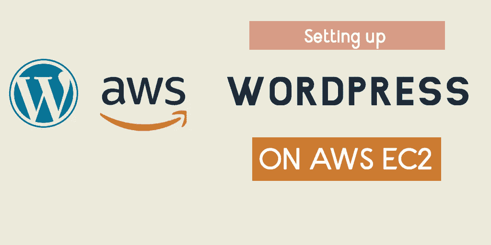

# 在 AWS EC2 上设置 Wordpress

> 原文：<https://medium.com/geekculture/setting-up-wordpress-on-aws-ec2-722f861d260b?source=collection_archive---------3----------------------->

## 了解如何在 AWS EC2 上从头开始安装 Wordpress

Hosting Wordpress on AWS EC2

在这篇文章中，我们将学习如何在 AWS EC2 实例上建立一个 Wordpress 网站，并将其与您自己的域相关联。我们也可以使用 AWS 市场上现有的 Wordpress AMIs 中的一个，但是这有什么意思呢？