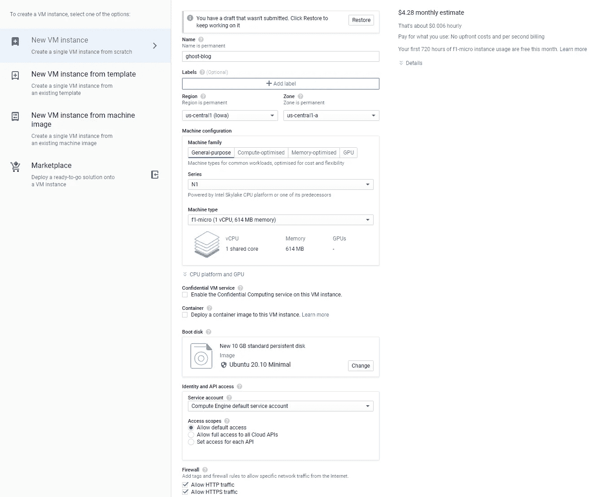
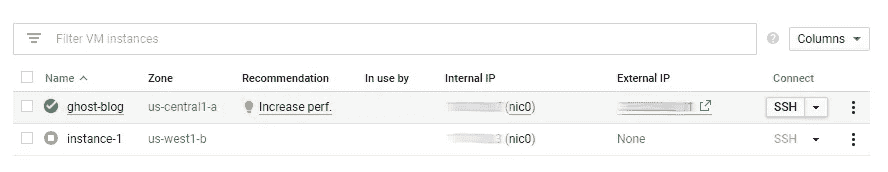
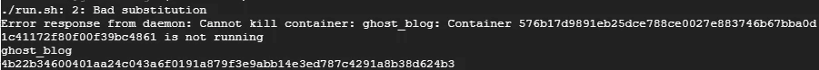
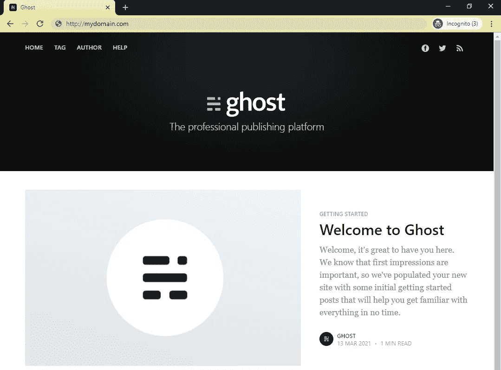

# 在 15 分钟内建立一个免费的个人博客

> 原文：<https://medium.com/geekculture/setup-a-free-self-hosted-blog-in-under-15-minutes-717480c5097b?source=collection_archive---------11----------------------->

## 如何使用谷歌云平台的计算引擎免费部署你自己的 Ghost 博客？


Photo by [Intricate Explorer](https://unsplash.com/@intricateexplorer?utm_source=unsplash&utm_medium=referral&utm_content=creditCopyText) on [Unsplash](/s/photos/ghost?utm_source=unsplash&utm_medium=referral&utm_content=creditCopyText)

Ghost 是一个流行的开源博客平台，我是它的大力支持者。[这里的](https://theappliedarchitect.com/)是 Ghost 上托管的博客的样子。该平台是安全的、轻量级的，并且非常易于使用和定制。Ghost 团队在这里发了一篇关于他们的平台与 WordPress [相比如何的帖子。](https://ghost.org/vs/wordpress/)

如果你想让 Ghost 为你托管博客，需要支付托管费，但在本文中，我将带你在谷歌云平台(GCP)上建立一个 Dockerized ghost 博客。用这种方法，你的博客可以完全免费托管，设置时间应该在 15 分钟以内。你可以在这里阅读幽灵[以及为什么我在这里](https://ghost.org/docs/)使用 GCP 作为我的云平台[。](https://appliedarchitect.medium.com/google-cloud-platform-gcp-vs-amazon-web-services-aws-for-the-hobbyist-e79326a8177)

拥有一个 GCP 帐户是先决条件，你可以在这里免费创建一个帐户。如果您使用 AWS、Azure 或其他云供应商，除了计算实例设置之外，您可以遵循相同的步骤。

我们开始吧！

# 设置计算引擎实例

谷歌的[计算引擎](https://cloud.google.com/compute)是一项在云中部署私有虚拟机的服务。GCP [始终免费层](https://cloud.google.com/free)提供这些虚拟机中的一个**免费**供您使用，我们将使用该服务来托管我们的 Ghost 博客。

如果你在 GCP 还没有项目，或者如果你想创建一个与你的 Ghost 博客相关联的新项目，你可以在这里[完成。](https://console.cloud.google.com/projectcreate)

计算引擎创建过程可以在[这里](https://console.cloud.google.com/compute/instancesAdd)开始，或者通过点击[虚拟机实例](https://console.cloud.google.com/compute/instances)视图上的**创建实例**按钮开始。

1.  为您的实例指定一个名称(我将使用 ghost-blog)
2.  在机器配置下，将机器系列保留为**通用**，选择 **N1** 用于系列，选择**f1-微型**用于机器类型(自由层)
3.  将引导磁盘更改为公共映像 **Ubuntu 20.10** 或 **Ubuntu 20.10 Minimal** ，引导磁盘类型设置为**标准持久磁盘**
4.  确保选中了**允许 HTTP 流量**和**允许 HTTPS 流量**复选框
5.  请注意右上方的消息，该消息表明本月 f1-micro 实例的前 **744 小时免费使用** —如果您没有看到此消息，您可能选择了错误的机器类型或错误的地区(必须是美国西部 1、美国中部 1、美国东部 1)

您的配置应该是这样的:



Diagram by author

单击**创建**并等待实例启动。您应该会被自动重定向到您的虚拟机实例列表，一旦您看到实例旁边出现绿色复选标记，它就可以运行了。



Diagram by author

请注意外部 IP，因为我们将需要在本教程中进一步配置 Ghost。

单击 Connect 下的 **SSH** 按钮启动一个会话，并访问您的新计算引擎实例。

# 为 Ghost 准备好实例

如上所述，在这次演练中，我将使用 Ubuntu 20.10。如果您使用不同的操作系统，您将不得不调整您的命令。

我更喜欢 nano，但是你可以用任何适合你的。更新包列表并安装您的编辑器。

```
sudo apt-get update 
sudo apt-get install nano
```

# 添加交换空间

像 f1-micro 这样的小型计算实例具有有限的内存(在我们的例子中是 600MB)，这可能会减慢繁重的进程并使 CPU 过载。如果您使用具有足够内存的大型计算实例，可以跳过这一步，但是我将从添加[交换存储](https://www.enterprisestorageforum.com/hardware/what-is-memory-swapping/#:~:text=Memory%20swapping%20is%20a%20computer,random%20access%20memory%20%28RAM%29.)来增强性能开始。您希望在交换空间中添加 2 倍的可用 RAM—在我的例子中，这是 600 MB RAM 的 1.2GB 交换空间。创建您的交换文件:

```
sudo fallocate -l 1.2G /swapfile
```

将权限更改为仅允许根用户访问:

```
sudo chmod 600 /swapfile
```

在文件上设置一个 Linux 交换区:

```
sudo mkswap /swapfile
```

通过修改文件系统表，确保更改是永久性的:

```
sudo nano /etc/fstab
```

将`/swapfile swap swap defaults 0 0`追加到文件的末尾。它应该是这样的:

```
LABEL=cloudimg-rootfs / ext4 defaults 0 1 
LABEL=UEFI /boot/efi vfat defaults 0 1 
/swapfile swap swap defaults 0 0
```

*如果您以前从未使用过 nano，您可以使用 **ctrl+x** 关闭文件——当询问您是否要保存修改的缓冲区时，输入**y+输入**。

您的实例现在多了 1.2GB 的交换内存。

# 安装 Docker

我们将使用 Ghost Docker 映像来部署我们的博客。Docker 有一个安装演练，你可以在这里跟随，但我将在这一节包括相关的说明。

更新您的软件包列表并运行升级，以确保一切都是最新的:

```
sudo apt-get update 
sudo apt-get upgrade
```

安装所需的软件包:

```
sudo apt-get install \
    apt-transport-https \
    ca-certificates \
    curl \
    gnupg \
    lsb-release \
    software-properties-common
```

添加 Docker 官方 GPG 键:

```
curl -fsSL [https://download.docker.com/linux/ubuntu/gpg](https://download.docker.com/linux/ubuntu/gpg) | sudo apt-key add -
```

设置稳定的存储库:

```
sudo add-apt-repository "deb [arch=amd64] [https://download.docker.com/linux/ubuntu](https://download.docker.com/linux/ubuntu) groovy stable"
```

再次运行更新并安装 docker:

```
sudo apt-get update
sudo apt-get install docker-ce docker-ce-cli containerd.io
```

您可以检查以确保 Docker 是用`sudo docker --version` 命令安装的，并在输出`Docker version 20.10.5, build 55c4c88`中看到类似这样的内容。

现在，您已经准备好获取和配置 Ghost 映像了！

# 配置和部署 Ghost

部署 Ghost 有几种不同的方法，但正如前面提到的，我们将使用 Docker。Docker hub 上维护着一个虚拟 Docker 映像，这让我们的工作变得非常容易。

获取最新的 Ghost docker 图像:

```
sudo docker pull ghost:latest
```

创建一个目录来存放您的内容和 Docker 配置文件，并创建所述配置文件**(确保更改您的 IP/域)**:

```
mkdir ghost_blogecho '{
  "url": "**http://yourdomain-or-ip**",
  "server": {
    "port": 2368,
    "host": "0.0.0.0"
  },
  "database": {
    "client": "sqlite3",
    "connection": {
      "filename": "/var/lib/ghost/content/data/ghost.db"
    }
  },
  "mail": {
    "transport": "Direct"
  },
  "logging": {
    "transports": [
      "file",
      "stdout"
    ]
  },
  "process": "systemd",
  "paths": {
    "contentPath": "/var/lib/ghost/content"
  }
}' >> ghost_blog/config.json
```

**将*[**http://your domain-or-ip**](http://yourdomain-or-ip)***替换为我们在* ***设置计算引擎实例*** *一节中提到的外部 IP。如果您有一个指向该 IP 的域，您可以使用该域。***

**创建一个 shell 脚本文件来快速启动您的 Docker 容器**(确保更改您的 IP/域)**:**

```
echo '# Set path variables
DATA_DIR="$PWD/ghost_blog"
CONTAINER_NAME="ghost_blog"# Purge the existing container if running.
docker kill $CONTAINER_NAME
docker rm $CONTAINER_NAME# Mount the volumes - content directory and config file
# and add the url variable for docker map as the public URL
docker run \
-d \
--restart=always \
-p 80:2368 \
-e url="**http://yourdomain-or-ip**" \
-v $DATA_DIR/content:/var/lib/ghost/content \
-v $DATA_DIR/config.json:/var/lib/ghost/config.production.json \
--name $CONTAINER_NAME \
ghost' >> run.sh
```

****用我们在* ***设置计算引擎实例*** *一节中提到的外部 ip 替换*[**http://your domain-or-IP**](http://yourdomain-or-ip)***。如果您有一个指向该 IP 的域，您可以使用该域。*****

****您不应该有以下文件夹结构:****

****├── run.sh
├──幽灵 _ 博客
│ ├── config.json****

****要启动包含 Ghost 映像的 Docker 容器，请运行:****

```
**sudo sh ./run.sh**
```

****第一次运行该脚本时，您会看到一个无法终止容器错误。这是正常的，不会引起任何问题。下面是一个输出示例:****

********

****Diagram by author****

****导航到您的外部 IP，您现在应该看到您的博客实例(确保您使用的是 HTTP 而不是 HTTPS)。****

********

****Diagram by author****

****要完成配置你的博客，你需要导航到**http://your domain-or-IP/ghost**，并按照说明创建你的管理帐户。****

****恭喜你，你现在有了自己的 Ghost 博客页面并开始运行了！****

# ****其他有用的主题****

## ****更新幽灵****

****有了这个设置，您只需运行`sudo docker pull ghost:latest`就可以更新您的 Ghost 映像****

## ****为你的博客设置 HTTPS****

****如果你想让你的博客更上一层楼，你需要设置一个合适的域名和 SSL 证书。我有一篇关于 NGINX 和 Certbot 的文章。****

## ****持久内容存储****

****通过我们的设置，您的所有内容、配置和帖子都将保存在`ghost_blog`文件夹中。为了给你的博客创建一个合适的备份，我推荐使用 git。您可以将`ghost_blog`文件夹初始化为 git 存储库，这样便于备份和恢复。****

## ****IP 和域管理****

****如果你的博客的入口点改变到一个新的 IP 或者一个合适的域名，你需要用新的 IP/域名更新`ghost_blog/config.json`和`run.sh`文件。一旦 dun 简单地重新运行 run.sh 批处理脚本。****

******祝好运，编码快乐！******

*****原载于 2021 年 3 月 13 日 https://theappliedarchitect.com*[](https://theappliedarchitect.com/setup-a-free-self-hosted-blog-in-under-15-minutes/)**。******