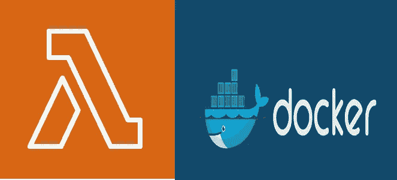

# 使用 Alpine Docker 运行 AWS Lambda

> 原文：<https://medium.com/geekculture/setup-a-lambda-function-using-docker-72356e0a4f13?source=collection_archive---------8----------------------->

当宣布 AWS Lambda 将支持 Docker 时，许多人欢呼雀跃，因为 AWS 最终采用了他们首选的部署方法。事实上，使用 zip 存档是一种部署代码的老方法。此外，大多数公司甚至个人都有过多的免费 CI 来建立 Docker 形象。但是，开发者仍然有很多问题:与 zip 相比，使用 Docker 时的延迟如何，尤其是在启动时，以及如何才能看到图像。

让我们从最简单的 Lambda 函数开始:

如您所见，这是一个非常简单的函数，它返回发送给它的几个属性。它与来自 AWS Lambda 的样本测试事件相匹配。我将在以后的其他教程中构建一些高级函数，这是我的入门教程。

## 要求

要运行实际的代码，您需要几样东西:

1.  一个活跃的 AWS 管理帐户显然
2.  AWS CLI 配置为工作
3.  码头工人

AWS CLI 是由 AWS 构建和维护的一组工具，允许开发人员使用 AWS。我不打算在这里详细说明如何安装 CLI，而是将您指向下面的文档。安装非常简单，只需遵循以下指南:

 [## 安装、更新和卸载 AWS CLI 版本 2

### 在您的系统上安装 AWS 命令行界面版本 2 (AWS CLI 版本 2)。

docs.aws.amazon.com](https://docs.aws.amazon.com/cli/latest/userguide/install-cliv2.html) 

1.  在[https://console.aws.amazon.com/iamv2/home#/users](https://console.aws.amazon.com/iamv2/home#/users)创建一个具有管理员权限的用户
2.  现在，您必须配置 AWS CLI 以访问编程用途:`aws configure`并提供帐户名和密码。
3.  使用下面的命令在 ECR 中创建一个存储库，我们称之为 hello-world】
4.  登录 Docker: `aws ecr get-login-password --region <region> | docker login --username AWS --password-stdin <account>.dkr.ecr.<region>.amazonaws.com`
5.  你完了！

根据 AWS 文档，我们有两种选择:

1.  使用 AWS 官方的图片来构建你的容器
2.  使用**任何**图像(Alpine，Ubuntu 等。)和**添加 lambda 运行时**

在这两种情况下，**工作流程**是相同的:

1.  将 docker 文件添加到 lambda 函数所在的文件夹中
2.  创建包含该函数的图像
3.  给图像加标签
4.  将图像推送到 ECR
5.  现在，当创建/更新新的 Lambda 时，我们必须使用这个映像

所以这可以解释为:

1.  `docker build -t hello-world .`
2.  `docker tag hello-world:latest <account>.dkr.ecr.<region>.amazonaws.com/hello-world:latest`
3.  `docker push <account>.dkr.ecr.<region>.amazonaws.com/hello-world:latest`
4.  使用 select from 容器重新部署 Lambda。

## 1.使用 AWS 官方映像进行设置

第一步是选择提供的图像之一。每种语言都有大量的图片。关于这些基础映像的一个伟大之处在于它们是安全的，并且包含了所有的东西。在我的例子中，我选择 Nodejs 基本映像。

## 2.设置自定义镜像并安装 **lambda 运行时**

就像官方图片一样，你首先需要选择一个，它可以是任何东西，所以我选择了阿尔卑斯山，因为那里非常小。

选择基本映像时要小心，因为许多映像都有很多安全漏洞，您必须修复和部署这些漏洞，然后更新 lambda 函数。幸运的是，AWS 有一个扫描工具来找到一个已知的漏洞。

您需要向 Docker 添加一堆构建工具，因为 lambda 接口是在您的容器中本地编译的。

现在你需要安装[运行时 API](https://docs.aws.amazon.com/lambda/latest/dg/runtimes-api.html) aws-lambda-ric，可选的你可以添加模拟器用于测试目的。

**可选**我们可以添加一个模拟器，用于在发送到 ECR 之前测试功能。

 [## GitHub-AWS/AWS-lambda-运行时-接口-仿真器

### Lambda 运行时接口仿真器是 Lambda 运行时和扩展 API 的代理，它允许客户…

github.com](https://github.com/aws/aws-lambda-runtime-interface-emulator) 

## 结果:

我测试了多次 Docker 图像，下面是结果:

我注意到有时容器的大小被缓存在 AWS 上，并且它变化很大，显然最好将大小保持在最小值以获得最佳性能。

请记住，我们的 lambda 是一个简单的函数，大多数生产函数都有很大的依赖性。幸运的是，容器大小限制已经增加，现在我们可以达到 10GB。

## 结论:

AWS 通过 Docker image for lambda 为客户提供了出色的体验。它有一个有点慢的开始，特别是与 zip 文件相比，但考虑到大得多的大小，这是可以预料的。

## 助手链接:

1.  AWS CLI 配置指南:[此处](https://docs.aws.amazon.com/cli/latest/userguide/cli-configure-quickstart.html#cli-configure-quickstart-creds)
2.  创建图像的 lambda 文档指南:[此处](https://docs.aws.amazon.com/lambda/latest/dg/images-create.html)
3.  从备选图像创建图像的指南:[此处](https://docs.aws.amazon.com/lambda/latest/dg/images-create.html#images-create-from-alt)

此外，点击查看整个示例项目[。](https://github.com/BogdanNic/aws-lambda-docker)

## 附录(Postscript)

如果你想要更多的教程，请鼓掌！