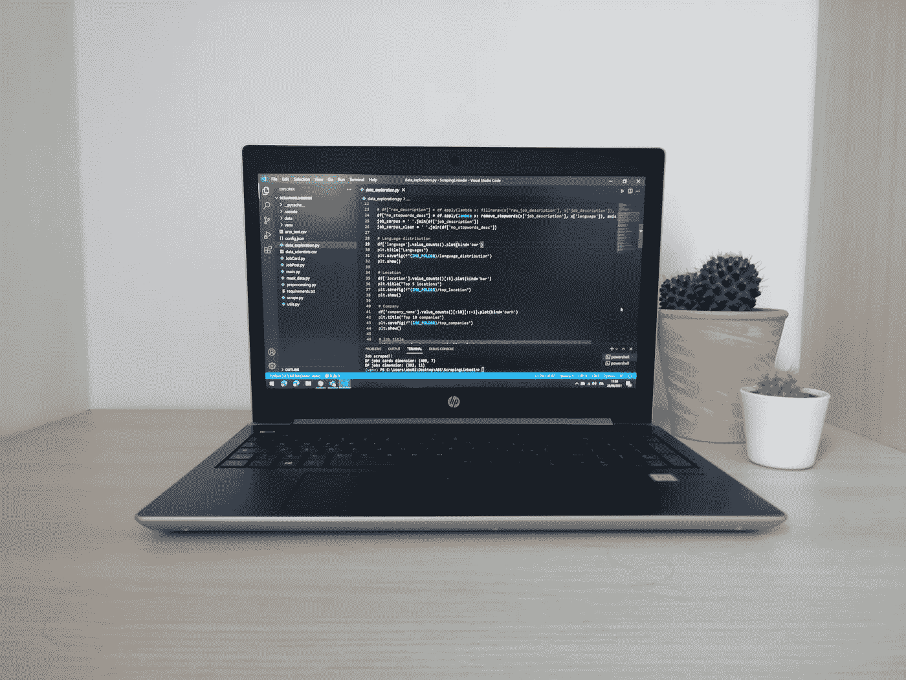

# 设置一个可投入生产的 Python 项目

> 原文：<https://medium.com/geekculture/setup-a-ready-for-production-python-project-f1ae69886756?source=collection_archive---------11----------------------->

## 提高 python 项目的质量，并为生产做好准备

Photo by the Author

Python 是当今使用最多的编程语言之一。它的设置非常简单，与 Java 相比，它的语法非常用户友好，并且有很多预先构建的模块，可以帮助创建机器学习算法。