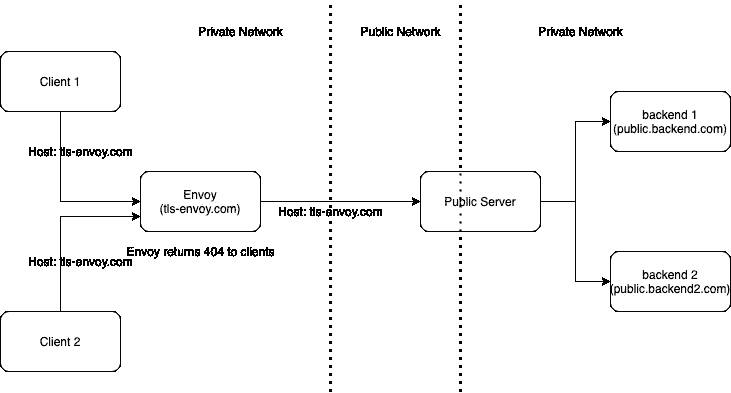
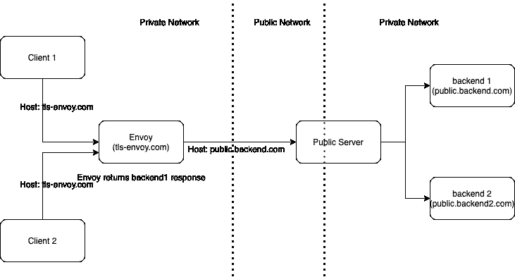
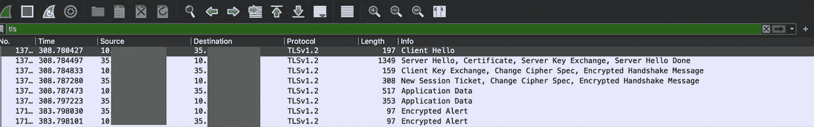

# TLS 发起特使

> 原文：<https://medium.com/geekculture/setup-envoy-for-tls-origination-973d3cab6d1b?source=collection_archive---------20----------------------->

*特使版本:1.8.0*

> 配置特使是设置特使最难的部分之一。

R 最近，我需要设置 TLS 发起的特使，当你在私有网络中处理数百个微服务时，这非常有用，并且一些服务需要通过 HTTPS 与第三方服务进行对话。拥有 TLS 发起有助于通过消除拥有 HTTPS 服务器的需求来更容易地编写服务测试。

# **步骤 1** :准备配置

让我们讨论一下这个特定于 TLS 发起要求的配置。

**request_headers_to_add:** 这是一个监听器配置，用于向传出的上游请求添加头。这可用于添加上游服务器授权所需的任何凭证。最后附加的报头，即**主机**是一个非常特殊的报头，如果您不重写它，那么如果上游服务器使用主机报头来确定其相应的上游主机，您将获得 HTTP 状态代码 **404** 。例如没有主机重写



envoy without host rewrite

另一方面，用主机重写作品如下:



envoy with host rewrite

**tls_context:** 该配置键用于定义特使是否需要进行上游 tls_origination，同时 **alpn_protocols** 仅在上游服务器公开 alpn 协议时使用。更多细节可以在官方文档[这里](https://www.envoyproxy.io/docs/envoy/v1.8.0/api-v2/api/v2/auth/cert.proto#envoy-api-msg-auth-commontlscontext)找到。

# 步骤 2:调试

即使在使用上述配置，或使用更新的配置或更新的特使版本，您可能需要调试，以检查 TLS 握手是否工作。

我更喜欢在将日志级别设置为`trace`时，先查看特使日志。希望，你会找到一些东西，如果没有，那么是时候把大枪。

**tcpdump:** 借助以下命令，您可以使用它来捕获 TCP 流量:

```
tcpdump -ni eth0 "tcp port 443 and (tcp[((tcp[12] & 0xf0) >> 2)] = 0x16)"
```

你可以查看[这篇](https://stackoverflow.com/questions/39624745/capture-only-ssl-handshake-with-tcpdump)堆栈溢出文章了解更多细节。

如果特使的吊舱部署在 k8s 上，同样的命令也可以在其上运行。

**ngrep** :您可以使用下面的命令安装这个命令行工具

```
apt-get install ngrep
```

安装后，grep 上游的 IP 地址，只观察相关的流量

```
ngrep -Wbyline "upstream ip address" -d any
```

wireshark: 我个人更喜欢这种方法，如果有太多的日志，并且上面的两个命令对搜索和过滤功能都没有帮助。

*   首先在本地安装 Wireshark。
*   使用以下命令在本地计算机上创建命名管道

```
mkfifo /tmp/remote
```

*   然后将 Wireshark 指向这个

```
wireshark -k -i /tmp/remote
```

*   使用以下命令在远程计算机上运行 tcpdump 命令。

```
ssh root@firewall "tcpdump -s 0 -U -n -w - -i eth0 not port 22" > /tmp/remote
```

如果特使部署在 k8s 上

```
k exec envoy-876ffdb89-2542s -- tcpdump -s 0 -U -n -w - -i eth0 > /tmp/remote
```

*   一旦您通过 envoy 向 backend1 发送请求，您应该立即在 Wireshark GUI 上观察到一些流量，然后您可以使用`tls`过滤器来检查 TLS 握手。



Wireshark TLS traffic

在评论中回复您的反馈、建议以及您遇到的任何其他用于调试 envoy 配置的工具。