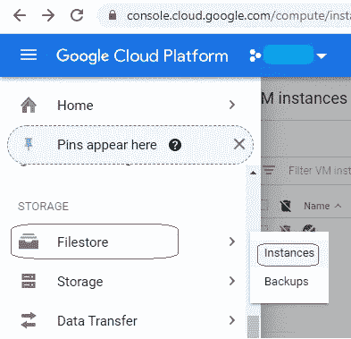
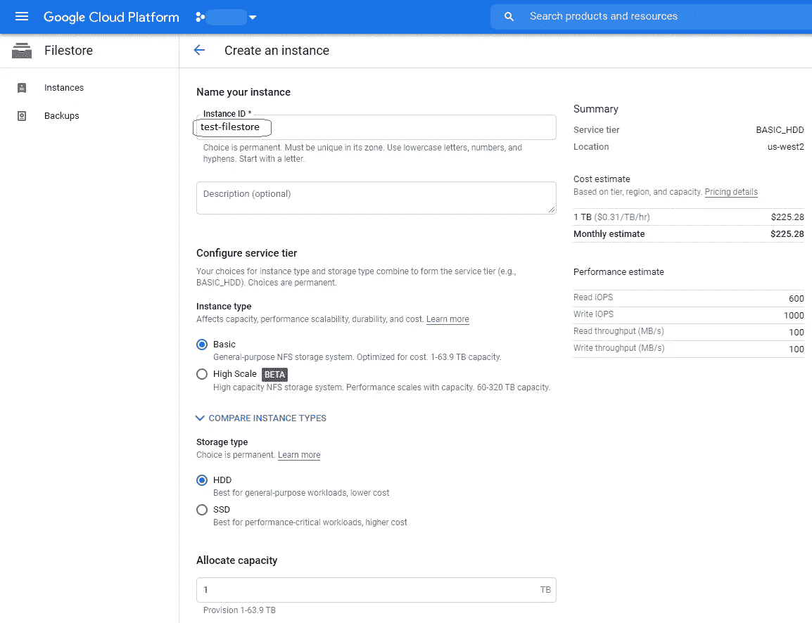
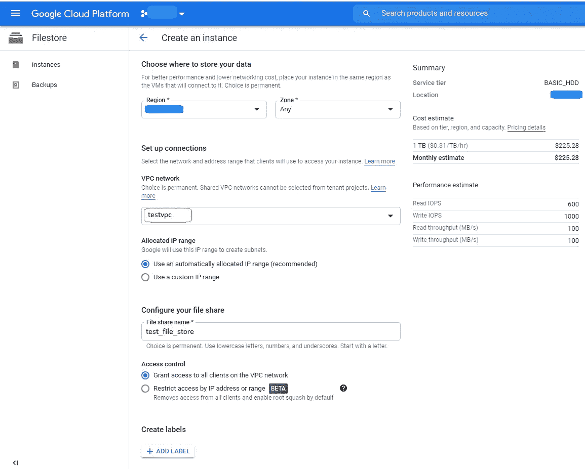
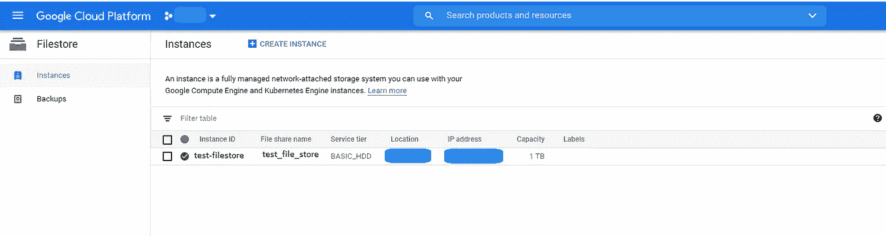
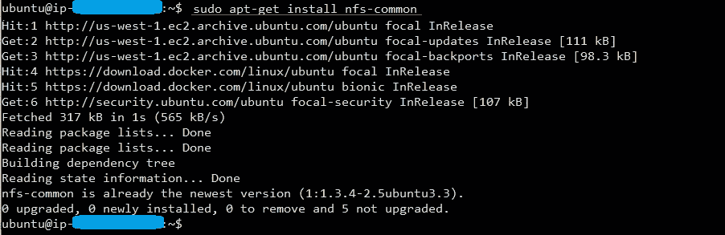
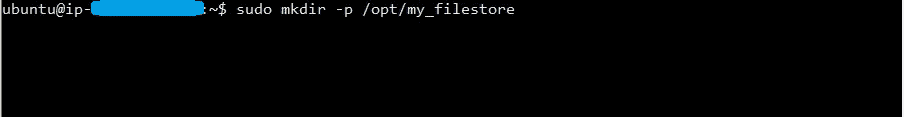

# 在 Google Cloud 上设置 Filestore(共享文件系统),并挂载到 Ubuntu 系统上

> 原文：<https://medium.com/geekculture/setup-filestore-shared-filesystem-on-google-cloud-and-mount-on-to-ubuntu-systems-157fb762b25c?source=collection_archive---------0----------------------->

1.  在 Google Cloud 控制台中，转到文件存储实例页面，然后单击创建实例

2.输入文件存储实例的详细信息。当我们在 Ubuntu 客户端系统上挂载文件存储时，**实例 ID 非常重要**

选择适当的地区和区域。此外，选择适当的 VPC。否则，它将使用默认的 VPC。文件共享名是必需的，但是在挂载文件存储时我们不使用它。

使用上述设置创建文件存储后，我们应该在文件存储实例下看到它。在 Ubuntu 客户端系统上挂载文件存储时，需要**实例 ID** 和 **IP 地址**。

3)将文件存储挂载到 Ubuntu 客户端机器上

3.1)访问 Ubuntu 系统并从其源同步软件包索引文件

sudo apt-get -y update &&

3.2)安装 NFS 支持文件

sudo apt-get -y install nfs-common

3.3)为挂载创建一个目录

sudo mkdir my_filestore (assuming the folder name is my_filestore)

3.4)挂载文件存储

sudo mount xxx.xxx.xxx.xxx:/test-filestore /opt/my_filestore

3.5)授予装载文件夹适当的权限

sudo chmod +xxx /opt/my_filestore

3.6)编辑文件系统表，以便**在客户端机器重启时自动挂载**文件存储

sudo nano /etc/fstab

3.7)输入安装详细信息

xxx.xxx.xxx.xxx:/test-filestore /opt/my_filestore nfs defaults,_netdev 0 0

3.8)保存并运行 **sudo reboot** 以确保文件存储在重新启动后自动挂载

**您已经成功创建并挂载了 Filestore！**

# 常见问题

**如何在 AWS(EFS——弹性文件系统)上设置文件系统？**

请浏览我的文章[设置亚马逊弹性文件系统(EFS)并挂载到 Ubuntu EC2](https://suryagutta.medium.com/ow-to-setup-amazon-elastic-file-system-efs-and-mount-on-to-ubuntu-ec2-b47346427d5) 。

**感谢**阅读！请👏如果你喜欢这篇文章，请跟我来，因为它鼓励我写更多！