# Docker 和 Kubernetes 初学者指南

> 原文：<https://medium.com/geekculture/setup-kubernetes-for-your-infra-and-add-ci-cd-using-github-actions-part-i-introduction-e9904fbc27ac?source=collection_archive---------2----------------------->


Photo by [Towfiqu barbhuiya](https://unsplash.com/@towfiqu999999?utm_source=medium&utm_medium=referral) on [Unsplash](https://unsplash.com?utm_source=medium&utm_medium=referral)

之前我们已经用 AWS CodeDeploy、GitHub Actions 和 AWS Auto Scaling Groups (ASG)解决了 CI/CD 和伸缩的问题。只要有几项服务需要管理，这种方法就能很好地工作，随着服务的增长，服务器也会增长，管理大量的 ASG 需要更好的协调，而不是每次需要为用户添加新服务时简单地创建一个新的 ASG。

在我们开始之前，我建议你访问我之前的博客，在这里看看我们是如何解决扩展问题的[，这样你就可以比较发生了什么变化以及原因。](https://ansukumari.medium.com/auto-deploy-and-auto-scale-servers-using-aws-codedeploy-and-github-actions-cb85edb3da4e)

简而言之，我们将实例放在 ASG 后面，以便在流量激增的情况下自动扩展，然后我们在 GitHub Actions 工作流中运行 AWS CodeDeploy，以将 GitHub 上推送的代码自动部署到 ASG 后面的所有实例。

随着时间的推移，我们不断添加新的服务，因此每个服务都有新的 ASG，不同类型的实例在每个 ASG 中运行不同的代码。我们现在有 50 多个助理秘书长，管理这些助理秘书长是一项艰巨的任务。

## 进入 KUBERNETES..

为了理解我们是如何设置 Kubernetes 的，我们需要理解它所基于的组件。我将在下面对每一个进行简单的解释，如果你已经知道这些组件是如何工作的，可以随意跳到[第二部分](/geekculture/setup-kubernetes-for-your-infra-and-add-ci-cd-using-github-actions-part-ii-implementation-46c628124e94)，在那里我将通过代码示例讲述我们如何使用这些组件来解决上述问题。

# Docker、docker 图像和容器

Docker 只是一种容器化应用程序的方式。当你在本地机器上编写应用程序时，你可以将代码传输到互联网上，让其他人使用，但这并不能保证它在你的机器上就能完全正常工作，甚至根本不能工作。这是因为您的应用程序可能有依赖关系，如模块、框架、数据库等，这在其他用户的机器上可能不会得到满足。

为了解决这个问题，我们可以将您的应用程序放在一个容器中，该容器不仅包含您的代码，还包含它的所有依赖项以及所有模块的指定版本。这叫做**集装箱化**。如果我们使用 docker 容器，它被称为**docker 化**。

为了对你的应用程序进行 dockerize，你需要在你的库中添加一个名为 **Dockerfile 的文件(**这个文件不能被命名为其他任何名称，D 应该是大写的，其余的应该是小写的，没有任何扩展名 **)** ，当它运行时，会为你的应用程序构建一个可共享的映像。这个映像可以被推送到网上的注册表中，并与任何人共享，以便在他们的系统中的容器中运行。下面是一个节点应用程序的示例 **Dockerfile** 。

一个**容器**是一个轻量级环境，它将你的应用程序与系统中的其他应用程序分开。从概念上讲，它类似于虚拟机，但与虚拟机不同的是，它没有位于机器操作系统之上的来宾操作系统，因此更加轻量级和易于管理。

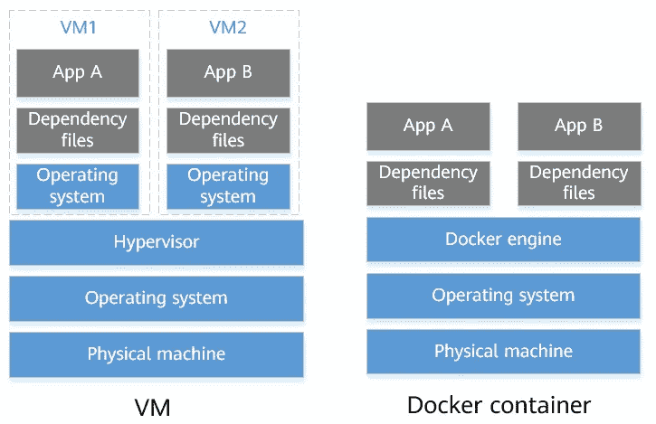

# 如何在 Docker 上运行应用程序

Docker 有一些运行应用程序所需的组件/对象，下面是与它们相关的常用命令:

## a.图像—

图像是打包在文件中的应用程序的模板，当执行该模板时，将运行应用程序。

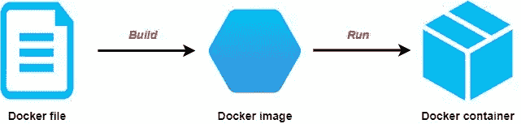

`$ docker run <image_id/image_name>`:你可以使用这个命令来创建你的图像的一个运行实例。如果映像存在于您的本地，docker 将使用它，否则它将在执行相同的命令时从 DockerHub 注册表中提取映像。

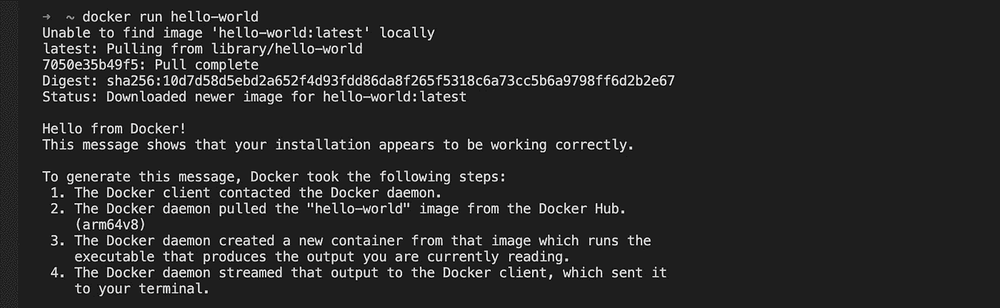

`$ docker images`:使用该命令列出本地机器中存在的所有图像。

`$ docker rmi <image_id/image_name>`:从本地删除一张图片。

## b.容器—

容器就是在 Docker 中运行的所有独立的应用程序。

`$ docker ps`:列出当前正在运行的所有容器。

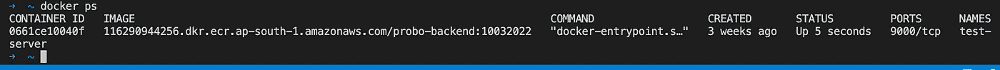

`$ docker ps --all`:列出各种状态下的所有集装箱，即正在运行、已退出、已完成等。

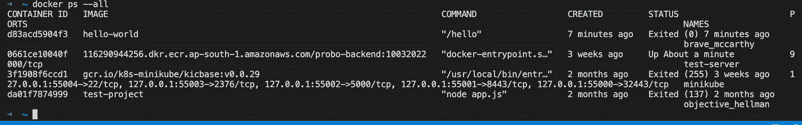

`$ docker container start/stop/kill <container_id/container_name>`:启动已列出但当前未运行的容器，停止正在运行的容器，终止容器而不允许进程分别完成。

***注意*** *:当写容器或图像 id 时你不必写完整的 hash，只需使用唯一的首字母即可。*

`$ docker exec -it <container_id/container_name> bash`:进入你的容器应用。

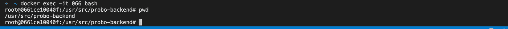

`$ docker rm <container_id/container_name>`:删除容器。

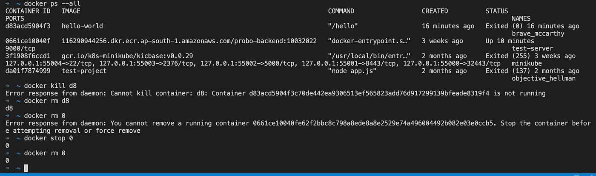

# 库伯内特斯

AKA k8s，我找到的了解 k8s 的最好资源是官方手把手教程，这里的[是它的链接。在这篇博客中，我将简要介绍 k8s 和它的对象，我们需要熟悉它们，了解我们的系统，在 k8s 上设置和使用我们的 infra。](https://kubernetes.io/docs/tutorials/kubernetes-basics/)

Kubernetes 是一种管理所有容器及其相关图像和其他资源的方法。

> Kubernetes 为您提供了一个灵活运行分布式系统的框架。它负责应用程序的伸缩和故障转移，提供部署模式等等。例如，Kubernetes 可以轻松地为您的系统管理 canary 部署。

## 库伯内特星团

k8s 集群是一个生态系统，由**高度可用的计算机集群组成，这些计算机作为一个单元**连接在一起，运行您的应用程序和绑定您的应用程序的服务。

以下是查看和切换集群/上下文的一些命令:

`$ kubectl config get-clusters`:列出您系统中配置的所有集群


`$ kubectl config get-contexts`:列出您系统中配置的所有上下文。具有经过身份验证的用户的集群形成一个上下文。

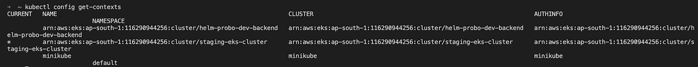

`$ kubectl config current-context`:要检查您当前正在哪个上下文中工作，您所做的任何更改都将应用到该上下文中。

`$ kubectl config use-context <context_name>`:切换上下文。

## 结节

它是运行您的应用程序的底层物理或虚拟机。一堆这样的节点组成了 k8s 集群。

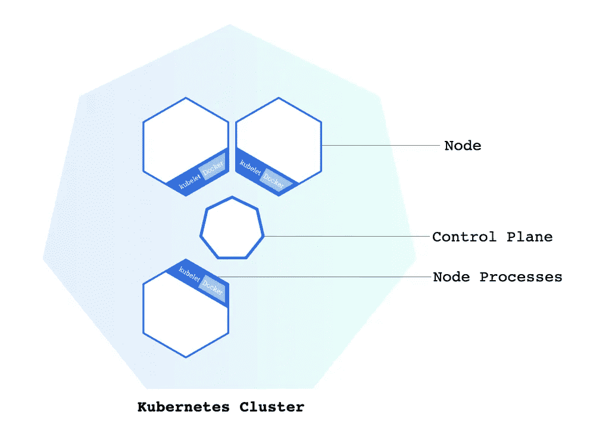

## 豆荚

pod 是运行容器化应用程序的抽象概念。理想情况下，一个 pod 只运行一个容器，尽管您可以指定 k8s 在一个 pod 中运行多个容器，但是只推荐用于非常紧密耦合的应用程序。多个单元在一个节点上运行。

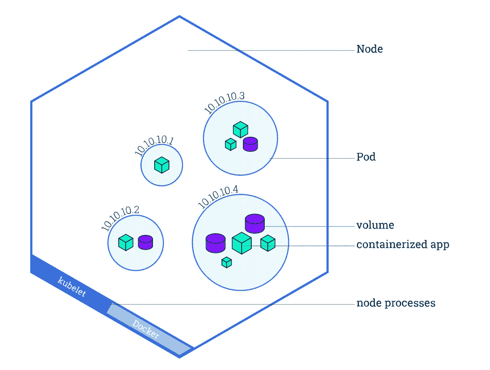

***使用 pod 时需要了解的常用命令:***

`$ kubectl get po`:列出当前上下文中默认名称空间中的所有窗格。

`$ kubectl exec -it <pod_name> -- bash`:进入吊舱内部

`$ kubectl logs -f <pod_name>`:获取 pod 的控制台日志

## 部署

k8s 部署是以 yaml 格式编写的 k8s 对象之一，包含应用程序 pod 管理的所有规范，例如，应用程序应该具有的副本数量、应用程序 pod 应该使用的图像、需要在 pod 容器中设置的任何环境变量等。下面是一个示例部署文件。

```
**apiVersion**: apps/v1
**kind**: Deployment
**metadata**:
  **name**: nginx-deployment
  **labels**:
    **app**: nginx
**spec**:
  **replicas**: 3
  **selector**:
    **matchLabels**:
      **app**: nginx
  **template**:
    **metadata**:
      **labels**:
        **app**: nginx
    **spec**:
      **containers**:
      - **name**: nginx
        **image**: nginx:1.14.2
        **ports**:
        - **containerPort**: 80
```

您可以使用`kubectl create`命令在命令中创建一个默认的部署提供映像，或者编写一个*类*部署的 yaml 文件，如上所示，然后运行`kubectl apply`命令来创建该部署。

要创建默认部署，请运行以下命令:

```
$ kubectl create deployment <deployment_name> --image=<image_name/image_id>**Eg:** 
kubectl create deployment kubernetes-bootcamp --image=gcr.io/google-samples/kubernetes-bootcamp:v1
```

要使用上述部署文件创建部署，请运行以下命令:

```
$ kubectl apply -f <path_to_deployment_yaml_file>**Eg:**
kubectl apply -f [https://k8s.io/examples/controllers/nginx-deployment.yaml](https://k8s.io/examples/controllers/nginx-deployment.yaml)
```

**部署**是使用最多的对象之一，详细了解可以参考[这个](https://kubernetes.io/docs/concepts/workloads/controllers/deployment/)官方文档。

## 进入

k8s ingress 是一个允许集群外部的用户访问您的应用程序和服务的对象。它主要通过 HTTP/HTTPS 提供路由规则，也充当负载平衡器。

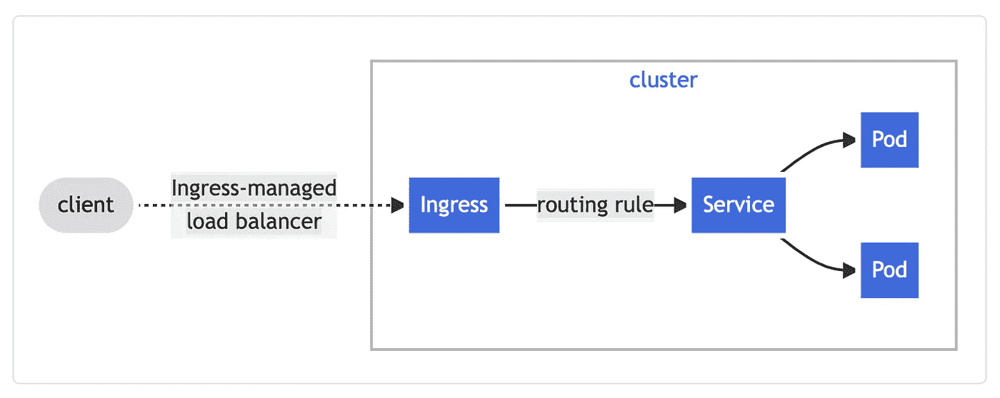

下面是一个示例入口 yaml 文件。

```
**apiVersion**: networking.k8s.io/v1
**kind**: Ingress
**metadata**:
  **name**: minimal-ingress
  **annotations**:
    **nginx.ingress.kubernetes.io/rewrite-target**: /
**spec**:
  **ingressClassName**: nginx-example
  **rules**:
  - **http**:
      **paths**:
      - **path**: /testpath
        **pathType**: Prefix
        **backend**:
          **service**:
            **name**: test
            **port**:
              **number**: 80
```

您可以使用带有 yaml 文件路径的`kubectl create`命令或`kubectl apply`命令创建一个类似于部署文件的入口文件。

## 其他对象和常用命令

k8s 有许多对象，记住每个对象的命令是不可行的，因此它遵循一个在大多数情况下都有用的通用模式。

***k8s 的一些天体有:***

*   部署
*   分离舱
*   服务
*   名称空间
*   进入
*   复制集
*   配置映射
*   达蒙塞特
*   水平 Pod 自动缩放器(HPA)
*   等等

***与上述对象一起使用的常用命令:***

`$ kubectl get <object_type>`:列出同一类别的所有对象。例如，要列出所有正在运行的 pod 或查看当前上下文中的所有部署，您可以分别使用`kubectl get pods`或`kubectl get deployments`。

大多数对象也有一个与 command 一起使用的简写，例如:

```
**pods**: kubectl get pods/po**deployments**: kubectl get deployments/deploy**services**: kubectl get services/svc**namespaces**: kubectl get namespaces/ns**HPA**: kubectl get horizontalpodautoscaler/hpa**ConfigMaps**: kubectl get configmaps/cm**DaemonSets**: kubectl get daemonsets/ds**Ingress**: kubectl get ingress/ing
```

`$ kubectl edit <object_type> <object_name>`:要动态编辑任何对象，您可以使用该命令，这将在`vi`编辑器中打开 yml 文件，您可以使用`i`命令插入更改，使用`esc` + `:wq!`保存这些更改。

`$ kubectl describe <object_type> <object_name>`:获取对象的详细描述/配置。

`$ kubectl get <object_type> <object_name> -o yaml`:查看 yaml 文件形式的对象配置。

`$ kubectl delete <object_type> <object_name>`:删除任何对象及其依赖关系。例如，如果您删除一个部署，该部署应该运行/创建的任何 pod 也将被删除。

`$ <any_of_above_command> -n <namespace_name>`:默认情况下，如果您使用上述任何命令，它将仅对默认名称空间有效，要在不同的名称空间中使用该命令，您可以使用`-n`标志。比如说，`$ kubectl get po -n test`。

我们对先决条件的介绍到此结束，现在让我们在下一部分讨论如何使用 k8s 解决最初的问题，链接[这里](/@ansukumari/setup-kubernetes-for-your-infra-and-add-ci-cd-using-github-actions-part-ii-implementation-46c628124e94)。