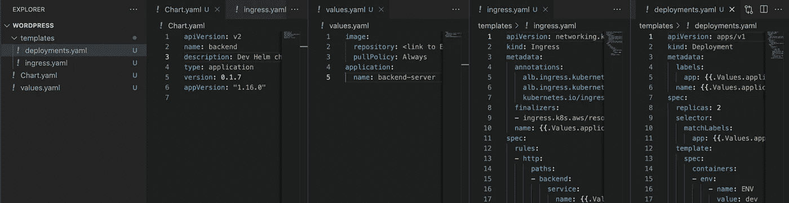
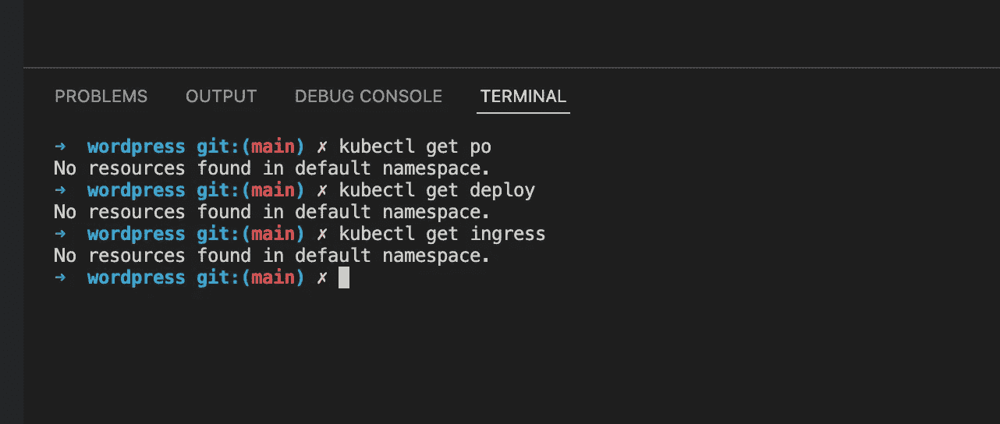
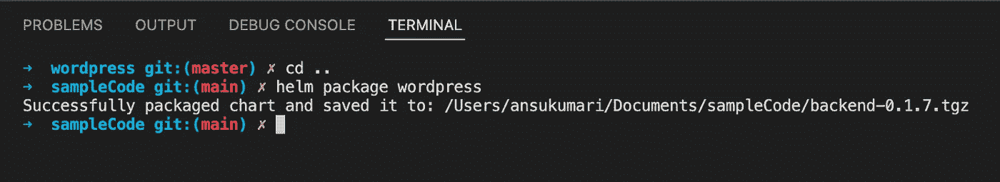
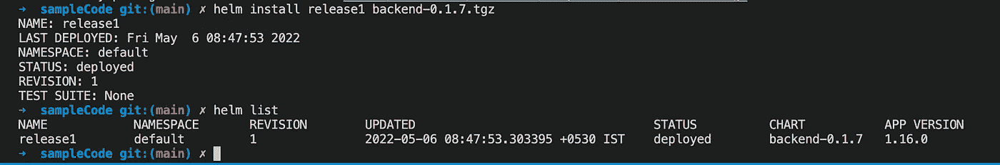
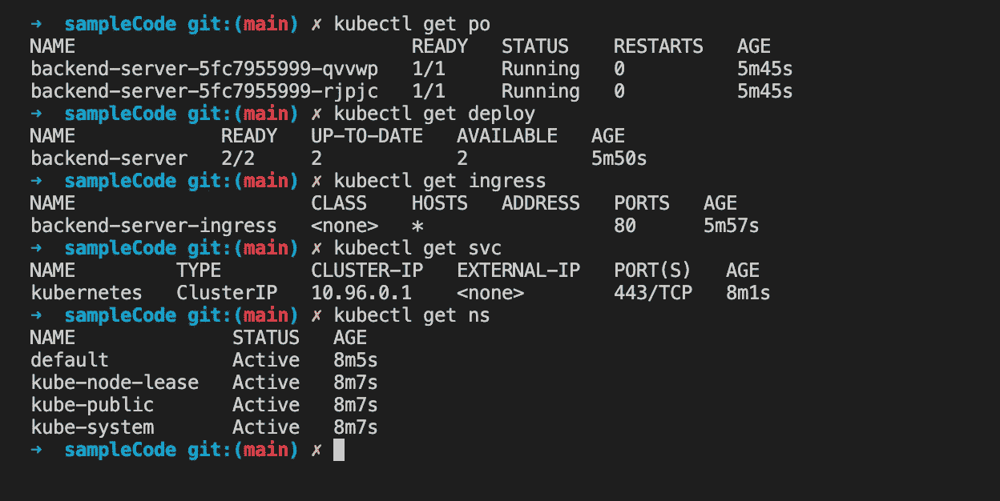

# 舵图介绍

> 原文：<https://medium.com/geekculture/setup-kubernetes-for-your-infra-and-add-ci-cd-using-github-actions-part-ii-implementation-46c628124e94?source=collection_archive---------3----------------------->


Photo by [Joshua Aragon](https://unsplash.com/@goshua13?utm_source=medium&utm_medium=referral) on [Unsplash](https://unsplash.com?utm_source=medium&utm_medium=referral)

到目前为止，我们已经看到我们有许多服务可以提供给客户，并且每种服务都有自己的应用程序。正如本文第一部分中所讨论的，50 个 ASG 意味着 50 种不同类型的服务器——使用 ec2 实例管理这些服务器变成了一项手动任务。我们有 5 种不同类型的应用程序和大约 10 种不同类型的服务器为每种应用程序运行——分类为 http 服务器和工作程序。

由于 k8s 只运行容器化的应用程序，我们需要为每个应用程序构建一个映像并管理它。为了将应用程序容器化，我们将 **Dockerfile** 添加到我们的应用程序中，并将其存储在我们的 AWS 弹性容器注册表(ECR)中。然后，我们在 AWS Elastic Kubernetes Service(EKS)上创建了一个 k8s 集群，并按照本[指南从本地连接到该集群。如果你需要温习 Docker 或 Kubernetes 的基础知识，可以参考我之前的](https://aws.amazon.com/premiumsupport/knowledge-center/eks-cluster-connection/)[博客](/geekculture/setup-kubernetes-for-your-infra-and-add-ci-cd-using-github-actions-part-i-introduction-e9904fbc27ac)。

要将图像推或拉至您的 AWS ECR，您需要首先使用以下命令向 docker 授权 AWS。更多指导请参考本文件。

```
aws ecr get-login-password --region **<*aws-region>*** | docker login --username AWS --password-stdin ***<aws_account_id>***.dkr.ecr.**<*aws-region>***.amazonaws.com
```

然后使用如下所示的`docker push/pull`命令。

```
docker pull 11xxxxxxxxxx.dkr.ecr.ap-south-1.amazonaws.com/backend:latest
```

现在我们有了 k8s 集群设置，是时候创建一些对象了。我们首先为我们的应用程序创建一个部署，我们将使用存储在 ECR 中的映像。对于这个例子，我使用了一个样本图像`nginx:1.14.2`,所以我们有一个工作代码要运行。

```
**apiVersion**: apps/v1
**kind**: Deployment
**metadata**:
  **labels**:
    **app**: backend-server
  **name**: backend-server
**spec**:
  **replicas**: 2
  **selector**:
    **matchLabels**:
      **app**: backend-server
  **template**:
    **metadata**:
      **creationTimestamp**: null
      **labels**:
        **app**: backend-server
    **spec**:
      **containers**:
      - **env**:
          - **name**: ENV
            **value**: dev
        **image**: nginx:1.14.2
        **imagePullPolicy**: Always
        **name**: backend-server
        **ports**:
        - **containerPort**: 80
          **protocol**: TCP
      **dnsPolicy**: ClusterFirst
```

创建这个文件并在集群中运行命令`$ kubectl apply -f deployment.yaml`将会启动 2 个 pod，运行 ECS 映像中指定的代码。您可以使用本文第一部分中提到的命令检查日志或进入 pods，并确保服务器运行正常，并且可以在 localhost 上访问。

我们现在添加下面的入口文件，使服务器也可以从外部访问。

```
**apiVersion**: networking.k8s.io/v1
**kind**: Ingress
**metadata**:
  **annotations**:
    **alb.ingress.kubernetes.io/scheme**: internet-facing
    **alb.ingress.kubernetes.io/target-type**: ip
    **kubernetes.io/ingress.class**: alb
  **finalizers**:
  - ingress.k8s.aws/resources
  **name**: backend-server-ingress
**spec**:
  **rules**:
  - **http**:
      **paths**:
      - **backend**:
          **service**:
            **name**: backend-server
            **port**:
              **number**: 3000
        **path**: /
        **pathType**: Prefix
```

应用该文件将生成一个 url，您可以`curl`在任何地方访问您的应用程序表单。使用`get`或`describe`命令，如前一篇文章所讨论的，将会显示 url。

我们的应用程序在几分钟内就启动并运行了，但是我需要添加另一个应用程序——当然是不同的映像，因为它们内部运行的代码不同。我将创建另一个部署文件和另一个入口..另一个用于第三个项目，依此类推。

我是否必须手动地一遍又一遍地创建相同的文件来更改一个属性？

## 介绍舵图…

以最简单的方式，helm chart 是一种使用变量重用你的对象文件的方法，也就是说，一旦你创建了所有你需要的 k8s 对象，在我们的例子中是部署和入口文件，你就可以使用一个变量来代替动态属性的硬编码值，并反复使用同一组对象。

一个舵图表本身只是一个文件夹，当你安装舵，一个文件夹被创建，里面有几个文件，如下图所示。现在让我们只关注 3 件事——值文件、Chart.yaml 文件和 templates 文件夹(其他文件可以选择保存在文件夹中)。要详细学习头盔，你可以从这里的开始[。](https://helm.sh/docs/topics/charts/)

```
**wordpress**/
  **Chart.yaml**          # A YAML file containing info about the chart
  **LICENSE**             
  **README.md    **       
  **values.yaml   **      # The default config values for this chart
  **values.schema.json** 
  **charts/  **           
  **crds/**               
  **templates/   **       # All the k8s object files
  **templates/NOTES.txt** 
```

`Chart.yaml`文件只有元数据，像舵图的版本和描述。

`values.yaml`文件是以 yaml 格式编写的键值对的集合，在所有 k8s 对象中用作变量。下面是我们将保存在项目中的值文件，因为我们只需要更改所有应用程序的应用程序和图像名称，其余所有配置都是相同的，我们将只保存在这个文件中。

```
**image**:
  **repository**: nginx:1.14.2 #link to ECS image with tag
  **pullPolicy**: Always**application**:
  **name**: backend-server
```

所以现在我们的`deployments.yaml`和`ingress.yaml`文件看起来像下面这样，它们现在位于 helm chart 项目的 template 文件夹中。

```
**apiVersion**: apps/v1
**kind**: Deployment
**metadata**:
  **labels**:
    **app**: {{.Values.application.name}}
  **name**: {{.Values.application.name}}
**spec**:
  **replicas**: 2
  **selector**:
    **matchLabels**:
      **app**: {{.Values.application.name}}
  **template**:
    **metadata**:
      **creationTimestamp**: null
      **labels**:
        **app**: {{.Values.application.name}}
    **spec**:
      **containers**:
      - **env**:
          - **name**: ENV
            **value**: dev
        **image**: {{.Values.image.repository}}
        **imagePullPolicy**: {{.Values.image.pullPolicy}}
        **name**: {{.Values.application.name}}
        **ports**:
        - **containerPort**: 80
          **protocol**: TCP
      **dnsPolicy**: ClusterFirst**apiVersion**: networking.k8s.io/v1
**kind**: Ingress
**metadata**:
  **annotations**:
    **alb.ingress.kubernetes.io/scheme**: internet-facing
    **alb.ingress.kubernetes.io/target-type**: ip
    **kubernetes.io/ingress.class**: alb
  **finalizers**:
  - ingress.k8s.aws/resources
  **name**: {{.Values.application.name}}-ingress
**spec**:
  **rules**:
  - **http**:
      **paths**:
      - **backend**:
          **service**:
            **name**: {{.Values.application.name}}
            **port**:
              **number**: 3000
        **path**: /
        **pathType**: Prefix
```

这是我们的舵图表文件夹的最终结构。



您可以保存这些文件并删除您的 k8s 集群中当前运行的所有资源，以测试我们的 Helm 图表。



一旦集群中没有资源，请按顺序运行以下命令。

`helm package <foler_name>`:上移一个文件夹，运行这个命令，在这个位置会创建一个 zip 文件，其名称和版本在你的`Chart.yaml`文件中指定。



您可以使用 zip 文件在我们的集群中安装 helm。



就是这样，它只需要一个命令——`helm install`——就可以毫不费力地安装运行您的应用程序所需的所有应用程序对象。现在，如果您`kubectl`对象，您将找到所有已配置的对象。



部署一个不同的应用程序，它需要所有相同的资源对象和不同的值，就像我们的例子中的不同映像——派生这个 repo，更改值并安装 helm！完成了。

那是给你的。我们遇到的最后一个问题是为每个应用程序添加工作实例，即共享相同映像/代码但运行不同命令的实例。我们需要一种动态的方式来为每个服务创建部署文件，这可以由开发人员直接完成，并且需要 DevOps 团队的最小参与。因此，我们需要将 worker config 添加到值文件本身..但是在循环中？

这是我不得不尝试解决的问题，理解变量、循环和循环中的条件如何在 yaml 文件中工作。下面是解决方案。

Kubernetes 对象文件的一个有趣特性是，您可以使用`---`字符在同一个文件中创建多个对象。例如，要在一个文件中创建入口和部署对象，可以编写如下代码。

```
**apiVersion**: apps/v1
**kind**: Deployment
**metadata**:
  **labels**:
    **app**: {{.Values.application.name}}
  **name**: {{.Values.application.name}}
**spec**:
  **replicas**: 2
  **selector**:
    **matchLabels**:
      **app**: {{.Values.application.name}}
  **template**:
    **metadata**:
      **creationTimestamp**: null
      **labels**:
        **app**: {{.Values.application.name}}
    **spec**:
      **containers**:
      - **env**:
          - **name**: ENV
            **value**: dev
        **image**: {{.Values.image.repository}}
        **imagePullPolicy**: {{.Values.image.pullPolicy}}
        **name**: {{.Values.application.name}}
        **ports**:
        - **containerPort**: 80
          **protocol**: TCP
      **dnsPolicy**: ClusterFirst
---
**apiVersion**: networking.k8s.io/v1
**kind**: Ingress
**metadata**:
  **annotations**:
    **alb.ingress.kubernetes.io/scheme**: internet-facing
    **alb.ingress.kubernetes.io/target-type**: ip
    **kubernetes.io/ingress.class**: alb
  **finalizers**:
  - ingress.k8s.aws/resources
  **name**: {{.Values.application.name}}-ingress
**spec**:
  **rules**:
  - **http**:
      **paths**:
      - **backend**:
          **service**:
            **name**: {{.Values.application.name}}
            **port**:
              **number**: 3000
        **path**: /
        **pathType**: Prefix
```

很方便，不是吗？下面是我如何使用这个特性来动态创建部署文件。

我将下面的代码添加到了`values.yaml`文件中:

```
workers:
  - name: update
    replicas: 1
    command: ["export QUEUE_NAME=updates-queue && node worker.js"]
  - name: cron-events
    replicas: 1
    command: ["export QUEUE_NAME=cron-events && node worker.js"]
```

所以完整的文件如下所示。

```
**image**:
  **repository**: nginx:1.14.2 #link to ECS image with tag
  **pullPolicy**: Always**application**:
  **name**: backend-server**workers**:
  - **name**: update
    **replicas**: 1
    **command**: ["export QUEUE_NAME=updates-queue && node worker.js"]
  - **name**: cron-events
    **replicas**: 1
    **command**: ["export QUEUE_NAME=cron-events && node worker.js"]# NOTE: the worker commands won't run with this values file because we have provided nginx image and nodejs is not installed on the container that is being spin up. This is just an example code to refer.
```

我为 workers 创建了一个新的部署文件`workersDeployment.yaml`，如下所示。

```
{{- range $worker := .Values.workers }}
{{- with $worker }}
**apiVersion**: apps/v1
**kind**: Deployment
**metadata**:
  **labels**:
    **app**: {{.name}}
  **name**: {{.name}}
**spec**:
  **replicas**: {{ .replicas }}
  **selector**:
    **matchLabels**:
      **app**: {{.name}}
  **template**:
    **metadata**:
      **creationTimestamp**: null
      **labels**:
        **app**: {{.name}}
    **spec**:
      **containers**:
      - **env**:
          - **name**: NODE_ENV
            **value**: staging
        **image**: {{$.Values.image.repository}}
        **imagePullPolicy**: {{$.Values.image.pullPolicy}}
        **name**: {{.name}}
        **command**: ["/bin/sh","-c"]
        **args**: {{.command}}
        **ports**:
        - **containerPort**: {{$.Values.service.targetPort}}
          **protocol**: TCP
        **resources**: {}
        **terminationMessagePath**: /dev/termination-log
        **terminationMessagePolicy**: File
      **dnsPolicy**: ClusterFirst
---
{{- end }}
{{- end }}
```

`{{- range $worker := .Values.workers}}`

`range`关键字是一个迭代器，它是你在 yaml 文件中运行循环的方式，就像 python、java 或 c++等语言中的`for`关键字一样。上面这一行类似于用 python 写`for worker in .Values.workers`。

`{{- with $worker }}`

> 下一个要看的控制结构是`with`动作。这控制变量范围。回想一下`.`是对*当前作用域*的引用。所以`.Values`告诉模板在当前范围内寻找`Values`对象。

我们已经在`values`文件中将`workers`定义为一个映射列表，对于每个列表元素，我们将当前范围设置为该元素，这样我们就可以使用`.`后跟映射的 keyname 来引用它的键值。

`{{.name}}`

这让我们想到了这个。`.`是`workers`列表的当前元素，`.<keyname>`将填充元素键的值。类似于用 python 写`worker[name]`。

`{{$.Values.image.repository}}`

既然我们已经改变了当前的作用域，请注意我们必须在`Values`变量前使用`$`来访问`values.yaml`文件，以使编译器理解我们需要访问一个全局/父变量，而不是一个局部`worker`变量。

`{{end}}`

`end`只是结束作用域的关键字，就像我们在 c++和 java 等语言中使用花括号`}`来结束作用域一样。

*要了解 helm 中变量和作用域的更多信息，可以参考* [*本*](https://helm.sh/docs/chart_template_guide/control_structures/) *官方文档。*

当在 repo 中使用此文件运行`helm install`时，它会创建多个部署文件，其名称与`values`文件中的`workers`列表中提供的名称相同，并为每个部署旋转各自的 pod。

因此，我们只需一个命令就可以让我们的服务器准备就绪——没有任何麻烦，但是等一下，我们是否需要提取代码，构建映像，将其推送到 ECR 注册表，再次打包 helm，然后在每次我对代码进行最微小的更改时再次安装它？听起来又是一个很大的工作量，但我认为我们已经解决了这个问题，是时候对我们的 GitHub Actions 工作流进行一些调整来管理 k8s 的 CI/CD 了。

让我们解决这个问题，并为我们在 GitHub repo 中创建的每个分支构建一个测试环境，让每个开发人员在产品相同但隔离的组件测试环境中测试他们的代码，然后将它合并到集成测试的 staging 分支——这是使用 k8s 的另一个优势——在下一篇文章中！