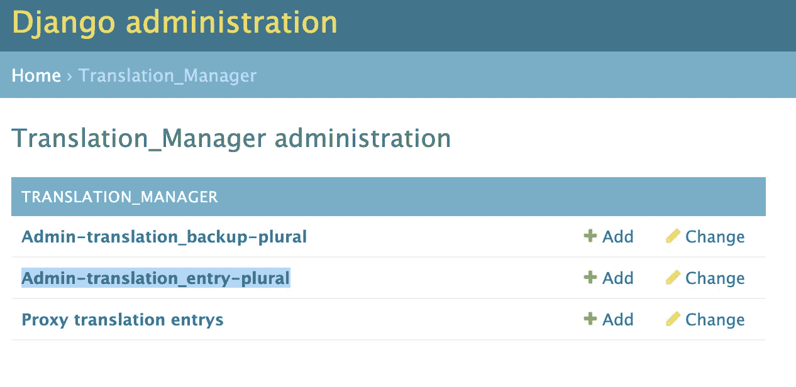
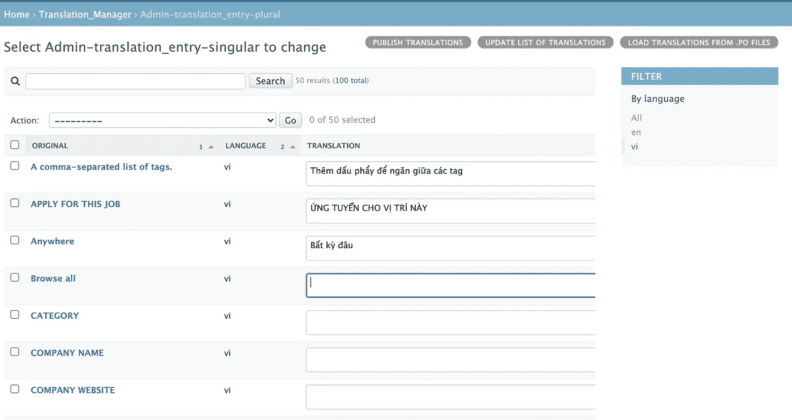

# 在 Django 项目中设置多语言—翻译经理

> 原文：<https://medium.com/geekculture/setup-multi-language-in-django-project-translation-manager-986bc22f90a6?source=collection_archive---------0----------------------->

翻译管理器基于 Django 的翻译 i18n 基础，并扩展了其功能。

# 为什么我用这个代替默认的 Django 翻译？

*   我可以完全控制 Django 管理员的翻译。
*   它自动创建翻译备份，我们可以管理备份
*   它允许您使用高级过滤器或创建类别。
*   它可以选择忽略模糊的翻译(翻译建议)。
*   它允许你做代理翻译

# 让我们做整合

## 1.安装 Django 翻译管理器

```
pip install django-translation-manager
```

## 2.启用和设置 Django 翻译管理器

如果你使用的是 Django cookiecutters 或 Django Two Scoops 的推荐设置，它们将设置分为 base.py、local.py 和 production.py，那么你可以这样使用。

如果你使用默认的 Django 项目设置，你可以这样使用。

运行迁移以应用翻译迁移文件

```
python manage.py migrate
```

**注:**你可以从这个[https://en.wikipedia.org/wiki/List_of_ISO_639-1_codes](https://en.wikipedia.org/wiki/List_of_ISO_639-1_codes)中得到一个**语言的列表**

## 3.国际化—模板

**trans** 用于翻译单行——我们将使用它作为标题
**blocktrans** 用于扩展内容——我们将使用它作为段落

## 4.创建语言文件

我们需要创建一个文件夹，Django 将在其中保存所有的翻译文件。这些文件将由 Django 自动创建

*   创建区域设置所在的文件夹。在我的例子中，我在 apps/locale 上有我的 locale 路径

```
mkdir apps/locale
```

*   为我们支持的语言环境创建翻译文件。为此，进入应用程序目录，并在目录内运行

```
$ django-admin makemessages -l vi
$ django-admin makemessages -l en
```

您可以用您喜欢添加的语言的地区代码替换`vi`。

## 5.在 admin Django 上添加/编辑翻译

运行`python manage.py runserver`然后将浏览器指向[http://localhost:8000/Admin/translation _ manager/](http://localhost:8000/admin/translation_manager/)然后转到***Admin-translation _ entry-plural***



你将会看到一个翻译文本列表，从现在开始你可以在 Django 的 admin 中编辑所有的翻译。

**请注意**编辑完翻译后，不要忘记点击页面底部的保存按钮。然后，当您准备好发布它时，单击“**更新翻译列表**”进行翻译，然后单击“**发布翻译**”发布更新。你现在可以在你网站的前面查看这些变化。

# 奖金

Django 附带了一个默认视图`django.conf.urls.i18n`，它用 Python 设置了用户的语言。您可以简单地设置一个特定的 URL 来触发这个功能。例如:

```
path('i18n/', include('django.conf.urls.i18n')),
```

这个视图期望将`language`参数作为一个`POST`变量，保存当前用户在会话中的语言偏好。

虽然默认的实现对于基本的 i18n 来说很好，但是除了语言之外，您可能还需要设置附加的参数来设置存储变量的区域设置，比如地理位置。要设置这样一个变量，您需要创建一个自定义视图。在这个例子中，让我们在 Django 应用程序中手动设置一个语言 ID。您可以按照相同的过程来设置与用户的语言环境相关的任何其他变量。

# 其他设置？

我通常会禁用一些不必要的字段。

```
TRANSLATIONS_ADMIN_EXCLUDE_FIELDS = ['get_hint', 'locale_parent_dir', 'domain']
```

更多设置信息可以看看这个文档[https://readthedocs . org/projects/django-translation-manager/downloads/pdf/master/](https://readthedocs.org/projects/django-translation-manager/downloads/pdf/master/)
[https://www.coex.cz/blog/translation-manager](https://www.coex.cz/blog/translation-manager)

希望这有所帮助！如果你在整合翻译时遇到任何问题或错误，请给我留言。