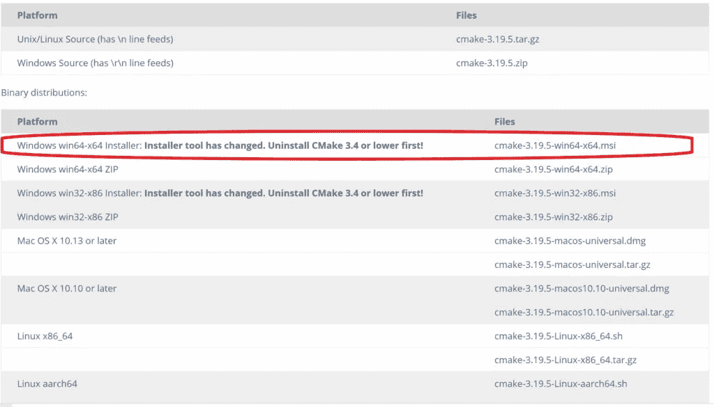
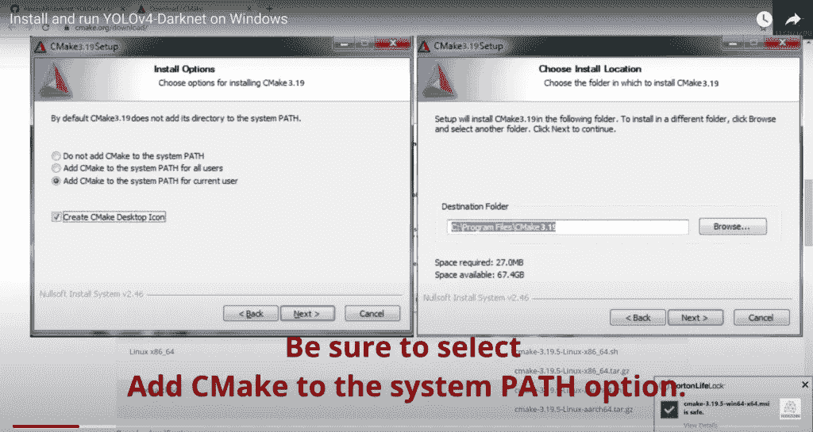

# 使用 CUDA 后端支持设置 OpenCV-DNN 模块(适用于 Windows)

> 原文：<https://medium.com/geekculture/setup-opencv-dnn-module-with-cuda-backend-support-for-windows-7f1856691da3?source=collection_archive---------2----------------------->


# 在本教程中，我们将使用 CUDA 后端支持从源代码构建 OpenCV(OpenCV-DNN-CUDA 模块)。

**重要:**OpenCV-DNN-CUDA 模块只支持推理。因此，虽然你会从中获得更快的推断，但是训练将与我们在没有 CUDA 后端支持的情况下设置的 OpenCV 相同。

# 步伐

1.安装 CUDA & cuDNN。

2.安装 CMake GUI。

3.安装 Anaconda 个人版。

4.安装带有“C++桌面开发”模块的 Visual Studio。

5.在 Anaconda 中创建一个虚拟环境

6.为你的 NVidia GPU 从源代码构建 OpenCV。

# 我在 YouTube 上的视频！

## 步骤 1)安装 CUDA 和 cuDNN

为您的系统下载最新版本的 CUDA 及其相应的 cuDNN 档案。去 https://developer.nvidia.com/cuda-downloads[下载最新的 CUDA 工具包。你也可以从](https://developer.nvidia.com/cuda-downloads)[以前的 CUDA 版本档案库](https://developer.nvidia.com/cuda-toolkit-archive)下载以前的版本，或者在上面给出的 cuda-downloads 链接的参考资料部分下载。你可以从 https://developer.nvidia.com/cudnn[下载 cuDNN 的最新版本。你也可以从 https://developer.nvidia.com/rdp/cudnn-archive](https://developer.nvidia.com/cudnn)[的 cudnn 档案馆下载以前的版本。](https://developer.nvidia.com/rdp/cudnn-archive)

通过运行 CUDA exe 文件安装 CUDA，然后将 cuDNN 文件夹及其内容解压并复制到我们安装 CUDA 的位置。通常，这是在 C:\ Program Files \ NVIDIA GPU Computing Toolkit \ CUDA \ v11 . x 中。系统还会自动将此路径添加到环境变量中，作为 CUDA_PATH。我们需要为 CMake GUI 的 Path 变量添加一些路径来查找 cuDNN。点击阅读完整的 [CUDA & cuDNN 安装。](https://techzizou.com/?p=424)

**注意:**正如上面 CUDA & cuDNN 设置博客中提到的，您必须为 **Path** 系统变量添加与您为 **CUDNN** 系统变量添加的路径相同的路径。添加这些路径后，重新启动系统。这只是为了确保我们将要使用的 CMake GUI 软件能够在我们的系统上找到 cuDNN。

## 步骤 2)安装 CMake GUI

接下来，我们需要为 Windows 安装 CMake GUI。(给出链接)[https://cmake.org/download/](https://cmake.org/download/)

为您的系统选择安装程序。我用的是 Windows (64 位)。下载安装程序，运行并安装它。另外，**在安装过程中将其添加到您的路径中。**



## 步骤 3)安装 Anaconda Windows 个人版

*   从[这里](https://www.anaconda.com/products/individual)下载并运行 Anaconda 安装程序。
*   安装 Anaconda 时选择“*只是我*”选项，以避免任何管理权限问题。
*   选择将 Anaconda python 作为默认选项的选项，并选择将 Anaconda python 包含在 PATH 变量中的其他选项。这确保了 Anaconda python 首先在系统中被发现。您总是可以通过转到您的环境变量并将您想要作为默认设置的 python 移动到 Anaconda python 之上来改变这一点。

.

## 步骤 4)安装 MSVC(微软 Visual Studio)

去 MSVC:[https://visual studio . Microsoft . com/thank-you-downloading-visual-studio/？sku =社区](https://visualstudio.microsoft.com/thank-you-downloading-visual-studio/?sku=Community)。这将为您下载 MSVC 社区版安装程序 exe 文件。运行它。选择如下所示的“*使用 C++* 进行桌面开发”包，然后点击安装。如果您已经有另一个版本的 visual studio，如 visual studio professional 或 enterprise，请确保安装了上述模块。


## 步骤 5)在 Anaconda 中创建一个虚拟环境

**注意:我在为虚拟环境构建 OpenCV 时执行了这一步。如果您想构建您的基础环境，您可以跳过这一步，转到步骤 6。**

●首先，打开 Anaconda 提示符并运行以下命令来创建一个新的 Anaconda 环境。

```
**conda create -n env_NAME** **python=3.9**
```

(其中 **env_NAME** 是您想要创建的环境的名称。我正在设置 python=3.9)

*   要激活环境，请使用以下命令:

```
**conda activate env_NAME**
```

*   为此环境安装 NumPy

```
**pip install numpy**
#OR
**pip install --upgrade numpy**
```

# 第 6 步)最后，使用 CUDA 后端支持为您的特定 NVidia GPU 从源代码构建 OpenCV。

这是设置 OpenCV-DNN-CUDA 模块的主要步骤，即在 CUDA 后端支持下从源代码构建 OpenCV。这给了我们对象检测模型更快的推断。我们将在这里安装一些库。

**重要提示:**在我们开始之前，如果您正在为您的基础环境创建它，请确保使用 *pip install numpy* 安装 NumPy。否则，如果您在虚拟环境中这样做，我们已经在步骤 5 中安装了 numpy。

● **6) a)** 首先下载 **OpenCV** 和 **opencv_contrib** 。

从官方 OpenCV 发布页面或 GitHub 页面下载最新的 OpenCV 源文件。**接下来**，**下载 opencv_contrib 的确切版本，作为你下载的 opencv 源文件**。使用以下链接下载这两个文件。(目前最新的 OpenCV 版本是 4.5.5)

https://opencv.org/releases/

https://github.com/opencv/opencv_contrib

**注意:**对两个 opencv & opencv_contrib 使用相同的版本。要选择特定版本，点击左上方的主下拉菜单，点击**标签、**并选择版本。

● **6) b)** 在 c 盘新建一个文件夹，名为 ***opencv*** 。将上一步中的文件夹解压并复制到 ***C:\opencv*** 文件夹中。

● **6) c)** 在 ***C:\opencv*** 内创建另一个名为 ***build*** 的文件夹

**注意:**在运行 CMake 之前，您需要在您的系统上安装并配置 CUDA、cuDNN。参考[这篇博客](https://techzizou.com/?p=424)学习如何在 Windows 上安装和设置 CUDA 和 CUDNN。

● **6) d)** 打开 **CMake GUI** 。选择源文件为***C:\ opencv \ opencv-4 . 5 . 5***，选择编译二进制文件的目的文件为 ***C:\opencv\build。***

● **6) e)** 勾选**分组**条目框，点击**配置**。将此项目的生成器**设置为您的 Visual Studio 版本。我有 2017 所以我会设置 **Visual Studio 15 2017** 。最后，选择“**发电机可选平台**为 **x64。****

● **6) f)** 第一次配置完成后，通过在搜索框中键入并勾选相应的框来选择以下模块。

```
**WITH_CUDA****OPENCV_DNN_CUDA****ENABLE_FAST_MATH****BUILD_opencv_world****BUILD_opencv_dnn****BUILD_opencv_python3**
```

(默认情况下，通常会选择其中一些，但请仔细检查它们，因为它们很重要)

● **6) g)** 接下来键入以下内容，并将路径设置为我们在步骤 6)b)中提取的***opencv _ contrib***文件夹内的 ***modules*** 文件夹。

```
**OPENCV_EXTRA_MODULES_PATH**
```

给出路径→***C:\ opencv \ opencv _ contrib-4 . 5 . 5 \ modules***

● **6) h)** 接下来，只有在为我们在第 5 步中创建的虚拟环境构建 OpenCV 时，才执行这一步。如果没有，您可以跳到步骤 6) i)。我这样做是因为我正在我的虚拟环境中安装 OpenCV。

在搜索框中输入 **PYTHON3** 。如果您已经将 anaconda 设置为默认 python，您将看到以下所有 python3 路径条目指向基本 anaconda 环境中的库，否则，如果这是您的默认 python，您将看到 windows python 基本环境库。

我们需要将它们设置为指向相同类型的虚拟环境库。(**注意**:这是我们在第 5 步中在 Anaconda 提示符下创建的虚拟环境 *env_NAME* 。同样，这里我的 Anaconda 位置是 *C:\anaconda3* 。你的可能不同，例如:in*C:\ Program Data \ anaconda 3*等。)

```
**PYTHON3_EXECUTABLE**
```

更改 C:\anaconda3\python.exe →

到 C:\ anaconda3 \ envs \ env _ NAME \ python . exe

```
**PYTHON3_INCLUDE_DIR**
```

更改 C:\anaconda3\include →

到 C:\ anaconda3 \ envs \ env _ NAME \ include

```
**PYTHON3_LIBRARY**
```

更改 C:\ anaconda3 \ libs \ python 39 . lib→

到 C:\ anaconda 3 \ envs \ env _ NAME \ libs \ python 39 . lib

```
**PYTHON3_NUMPY_INCLUDE_DIRS**
```

更改 C:/anaconda 3/Lib/site-packages/numpy/core/include→

到 C:/anaconda 3/envs/env _ NAME/Lib/site-packages/numpy/core/include

```
**PYTHON3_PACKAGES_PATH**
```

更改 C:/anaconda 3/Lib/site-packages→

到 C:/anaconda 3/envs/env _ NAME/Lib/site-packages

● **6) i)** 再次点击**配置**。

● **6) j)** 一旦第二个配置完成，你会在输出中看到你的 CUDA 和 cuDNN。现在，通过在搜索框中键入并勾选复选框来选择以下内容。

```
**CUDA_FAST_MATH**
```

● **6) k)** 接下来，将你的 GPU 的计算能力设置为 CUDA_ARCH_BIN。(你可以点击这个链接查看你的 GPU 的 cc→[https://developer.nvidia.com/cuda-gpus](https://developer.nvidia.com/cuda-gpus)。转到此链接并选择您的 GPU 部分。例如:我有一个 GeForce GPU，因此我将选择“支持 CUDA 的 GeForce 和 TITAN 产品”部分。这将显示所有 GPU 及其计算能力的下拉列表。我的是 6.1)

```
**CUDA_ARCH_BIN 6.1**
```

● **6) l)** 查找 CMAKE_CONFIGURATION_TYPES。删除调试选项，只设置发布选项。

```
**CMAKE_CONFIGURATION_TYPES       Release**
```

● **6) m)** 最后一次配置。

● **6) n)** 第三个也是最后一个配置完成后，验证所有输出，最后点击**生成。**这个用这些设置生成项目，我们可以用它来构建我们的 OpenCV。

● **6) o)** 接下来，一旦生成完成。在 **C:\opencv** 目录中打开命令提示符，并运行以下命令。

```
**"C:\Program Files\CMake\bin\cmake.exe" --build "C:\opencv\build" --target INSTALL --config Release**
```

这将使用 CUDA 后端构建 OpenCV-DNN 模块。这个过程可能需要一个小时左右。

● **6) p)** 最后，在您的环境变量中设置以下路径，并重新启动您的系统。

在系统变量中设置一个新变量 **OpenCV_DIR** 指向下面三个。→

*   ‣c:\ opencv \ build \ install \ x64 \ vc15 \ bin
*   ‣c:\ opencv \ build \ install \ x64 \ vc15 \ lib
*   ‣ C:\opencv\build

另外，将以下路径添加到系统变量中的**路径**变量中。→

*   ‣c:\ opencv \ build \ install \ x64 \ vc15 \ bin

添加路径后，重新启动系统。

就是这样！我们已经在 CUDA 后端支持下成功构建了 OpenCV-DNN 模块。

检查 cv2 是否安装正确。在 Anaconda 提示符下运行以下命令:

```
conda activate opencv_dnn_cuda
pythonPython 3.9.7 (main, Apr  4 2022, 05:22:27) [MSC v.1916 64 bit (AMD64)] :: Anaconda, Inc. on win32
Type "help", "copyright", "credits" or "license" for more information.
>>> import cv2
>>> cv2.__version__
'4.5.5'
>>>
```

# 使用下面的 test_DNN_CV.py 脚本检查 OpenCV 是否正确安装了 CUDA 后端支持。

```
import numpy as np
import cv2 as cv
import timenpTmp = np.random.random((1024, 1024)).astype(np.float32)npMat1 = np.stack([npTmp,npTmp],axis=2)
npMat2 = npMat1cuMat1 = cv.cuda_GpuMat()
cuMat2 = cv.cuda_GpuMat()
cuMat1.upload(npMat1)
cuMat2.upload(npMat2)start_time = time.time()
cv.cuda.gemm(cuMat1, cuMat2,1,None,0,None,1)print("CUDA using GPU --- %s seconds ---" % (time.time() - start_time))start_time = time.time()
cv.gemm(npMat1,npMat2,1,None,0,None,1)print("CPU --- %s seconds ---" % (time.time() - start_time))
```

## 下载下面的脚本来测试 OpenCV-DNN。

[**下载测试 _DNN_CV.py**](https://techzizou.com/setup-opencv-dnn-cuda-module-for-windows/#test_dnn_cv)

# 下一个教程:

## 在 Windows 上使用 OpenCV-DNN 模块运行 YOLOv4 推理

[](/geekculture/yolov4-inference-using-opencv-dnn-cuda-on-windows-e7ca995bcacd) [## Windows 环境下基于 OpenCV-DNN-CUDA 的 YOLOv4 推理

### 在 Windows 上使用 OpenCV-DNN-CUDA 模块运行 YOLOv4 推理。

medium.com](/geekculture/yolov4-inference-using-opencv-dnn-cuda-on-windows-e7ca995bcacd) 

## 别忘了留下👏

## 祝您愉快！！！✌

# ♕·特奇佐·♕