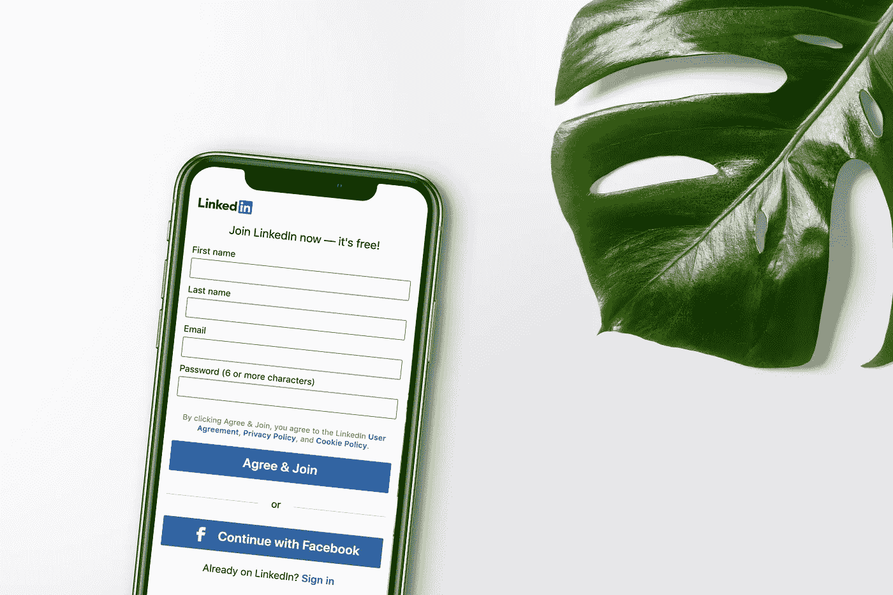
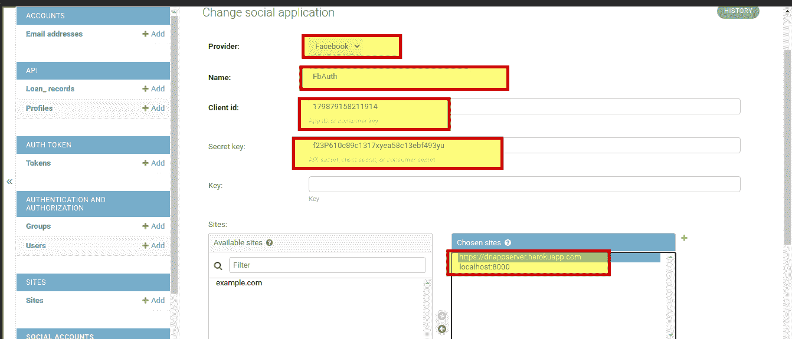

# 在 Django Rest 框架中设置社会认证

> 原文：<https://medium.com/geekculture/setup-social-authentication-in-django-rest-framework-1afdb675375f?source=collection_archive---------0----------------------->



随着全球互联网用户的激增，以及人们接受和访问数字产品，带来最佳用户体验并留住许多访客用户已成为许多应用程序的目标。社交认证旨在简化访问者的登录过程，从而提高用户注册的转化率。

一些优势包括:

*   更快的注册
*   少记一个登录凭证
*   更少的失败登录尝试。
*   更轻松的移动体验。
*   用户体验可以更加个性化和有针对性。

这样的例子不胜枚举。

# 背景

我最近需要为谷歌和脸书的社交提供商实现社交登录 API。我曾多次尝试让它工作并与客户端应用程序对话，但事实证明这很有挑战性😧。

唉，我们得到了与客户端应用程序通信的社会认证 API😊，在本教程中，我将向您展示如何轻松实现脸书社交登录。

**假设。**读者对 Python、Django Rest 框架和 API 有一些经验。

将社交认证集成到应用程序的服务器端需要:

*   选定的社交认证提供商
*   对社交认证提供者的登录请求
*   来自登录的身份验证令牌，用于访问受保护的 API 路由。

在开始之前，

*   前往[脸书开发商](https://developers.facebook.com/apps/)页面
*   创建一个社交应用
*   在仪表板上，设置>>基本，添加“应用程序域”和“站点 URL ”,可以是任何 URL，并记住在本地机器的`/etc/hosts`文件中设置 URL。
*   复制 FACEBOOK_APP_ID 和 FACEBOOK_APP_SECRET，并将它们设置为项目的环境变量。环境文件。

一切就绪，让我们配置 Django 应用程序；

在这个项目中，我们将使用 [django-rest-auth](https://django-rest-auth.readthedocs.io/en/latest/introduction.html) 库。该包旨在通过提供一组 REST API 端点来简化注册和认证任务。

1.)安装 django-rest-auth 包:

```
pip install django-rest-auth
```

2.)将 rest_auth app 添加到 Django [settings.py](http://settings.py) 中的 INSTALLED_APPS 中:

```
INSTALLED_APPS = ( ..., 'rest_framework', 'rest_framework.authtoken', ..., 'rest_auth' )
```

3.)添加 rest _ auth URLs:

```
urlpatterns = [ ..., path('api/<version>/rest-auth/', include('rest_auth.urls')) ]
```

4.)我们还需要安装 [django-allauth](https://django-allauth.readthedocs.io/en/latest/installation.html) 包，因为我们需要启用标准注册过程。

```
pip install django-allauth
```

5.)将 django.contrib.sites、allauth、allauth.account、rest_auth.registration 应用添加到您的 Django [settings.py](http://settings.py) 中的 INSTALLED_APPS:

```
INSTALLED_APPS = ( ..., 'django.contrib.sites', 'allauth', 'allauth.account', 'rest_auth.registration', )
```

6.)将 SITE_ID = 1 添加到您的 Django [settings.py](http://settings.py)

7.)添加 rest _ auth.registration urls:

```
urlpatterns = [ ..., path('api/<version>/rest-auth/', include('rest_auth.urls')), path('api/<version>/rest-auth/registration/', include('rest_auth.registration.urls')) ]
```

8.)将 allauth.socialaccount 和 allauth . social account . providers . Facebook 或 allauth . social account . providers . Twitter 应用添加到您的 Django [settings.py](http://settings.py) 中的 INSTALLED_APPS:

```
INSTALLED_APPS = ( ..., 'rest_framework', 'rest_framework.authtoken', 'rest_auth' ..., 'django.contrib.sites', 'allauth', 'allauth.account', 'rest_auth.registration', ..., 'allauth.socialaccount', 'allauth.socialaccount.providers.facebook' )
```

9.)在 Django 管理面板中添加社交应用程序



10.)创建一个新视图作为 rest _ auth . registration . views . social log in view 的子类:

```
from allauth.socialaccount.providers.facebook.views import FacebookOAuth2Adapter from rest_auth.registration.views import SocialLoginView class FacebookLogin (SocialLoginView): adapter_class = FacebookOAuth2Adapter
```

11.)为 FacebookLogin 登录视图创建一个 URL:

```
urlpatterns += [ path('api/<version>/rest-auth/facebook/', FacebookLogin.as_view(), name='fb_login'), ]
```

让我们在没有任何身份验证令牌的情况下测试 API，并获得适当的响应:


TaDa！！！后端社交认证配置已经设置完毕，可以与客户端应用程序通信了。

希望您可以通过支持更多的社交认证提供者来改善应用程序的用户体验🤓。

感谢观众🤗。在 [Github](https://www.github.com/nextwebb) 、[LinkedIn](https://www.linkedin.com/m/in/peterson-oaikhenah-102645144)&&[Twitter](https://www.twitter.com/i_am_nextwebb)上与我联系。

# 更多资源:

 [## Django-Rest-Auth 文档

### 这个项目依赖于 django-rest-framework 库，所以如果您还没有安装它，请安装它。确保你也有…

django-rest-auth . readthedocs . io](https://django-rest-auth.readthedocs.io/en/latest/installation.html)  [## Django-Allauth 文件

### 指定上下文处理器如下:模板= [ { '后端'…

django-allauth.readthedocs.io](https://django-allauth.readthedocs.io/en/latest/installation.html) 

*最初发布于*[*https://nextwebb . hashnode . dev*](https://nextwebb.hashnode.dev/setup-social-authentication-in-django-rest-framework)*。*