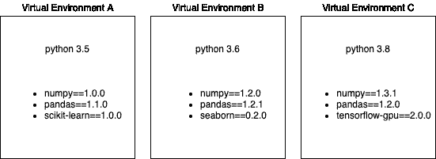
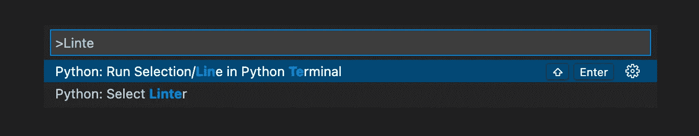
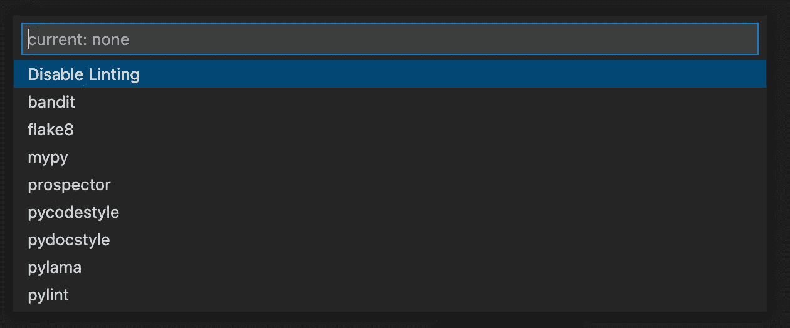
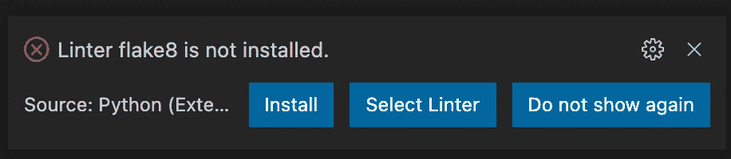
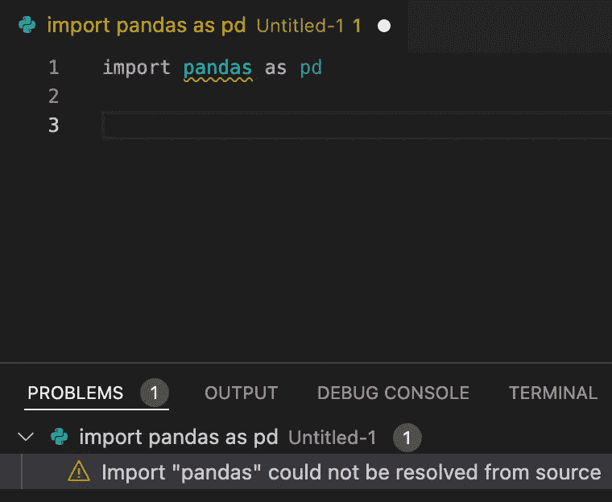
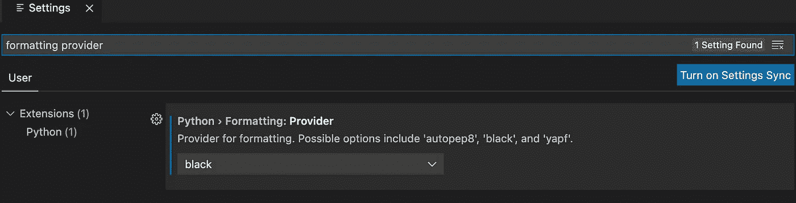
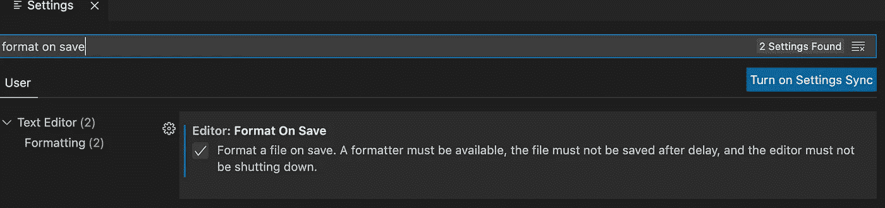
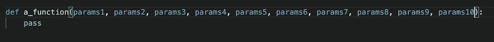
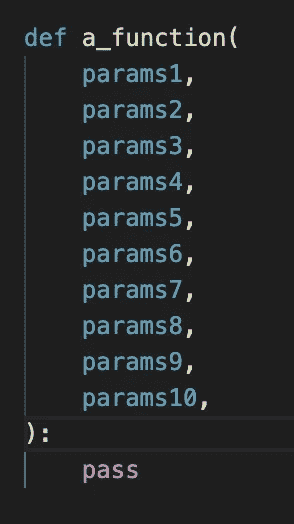

# 作为数据从业者设置您的编码工作空间

> 原文：<https://medium.com/geekculture/setup-your-coding-workspace-for-a-data-practitioner-292c718212f8?source=collection_archive---------16----------------------->

## 管理您的环境、库和工作区的简单方法，帮助您更高效地为企业提供价值

Photo by [Linus Mimietz](https://unsplash.com/@linusmimietz?utm_source=medium&utm_medium=referral) on [Unsplash](https://unsplash.com?utm_source=medium&utm_medium=referral)

> 剧透:仅涵盖 python 用户，初学者

作为一名数据科学家或数据分析师，我们的日常工作涉及许多事情。最重要的部分之一是建模或编码。可以是简单的自动化脚本，甚至是气流计划脚本。

随着工作的进展，您将会有一堆需要有效维护的代码。因为您不想花费太多时间调试代码，而不是交付更多的商业价值(如果您是数据工程师，情况可能会有所不同)。

在本文中，我想分享一些作为数据从业者创建编码工作空间的技巧。这很简单，因为我将只涵盖基本的。你可以随时调整它，以符合你的风格和需求。

让我们开始吧！

# 虚拟环境

我将从设置您的虚拟环境管理器开始(当然)。顺便问一下，什么是虚拟环境管理器？

它是一个管理您的 python 版本和第三方 python 库的工具，因此您可以为您的每个应用程序保留一个合适的版本。如果您想了解更多信息，请查看本文:[https://www . data quest . io/blog/a-complete-guide-to-python-virtual-environments/](https://www.dataquest.io/blog/a-complete-guide-to-python-virtual-environments/)

virtual environment illustration (image by Author)

## 蟒蛇 vs 迷你蟒蛇 vs …其他的？

基于 Conda 文件:

> **选择蟒蛇如果你:**
> 
> -不熟悉 conda 或 Python。
> 
> -比如一次性自动安装 Python 和 1，500 多个科学软件包的便利性。
> 
> -有时间和磁盘空间—-几分钟和 3 GB。
> 
> -不想单独安装您要使用的每个软件包。
> 
> -希望使用一套针对互操作性和可用性进行策划和审查的包。
> 
> **选择 Miniconda 如果你:**
> 
> -不要介意单独安装您想要使用的每个软件包。
> 
> -没有时间或磁盘空间一次安装超过 1，500 个软件包。
> 
> -希望快速访问 Python 和 conda 命令，并希望稍后整理其他程序。

要设置它，你可以直接从[官网](https://www.anaconda.com/products/distribution)下载安装程序。

## 默认库

如果您使用 Anaconda，它将在基础环境中安装几个默认的第三方库。你可以在这个链接中看到每个版本都包含了什么样的库:[https://docs.anaconda.com/anaconda/packages/](https://docs.anaconda.com/anaconda/packages/py3.9_osx-64/)

## 技巧

创建你的 **requirements.txt** ，里面装满你的基本库。您可以根据自己的项目类型来决定包含哪个库。

另外，确保**维护库的版本**，你不希望你的代码在将来突然停止工作，不是吗？

Example of default requirements.txt

有了默认的 requirements.txt 之后，确保总是创建一个空的虚拟环境，然后运行`pip install -r requirements.txt`

# 编码环境

你通常需要比 Jupyter 笔记本更多的东西来编写你的 python 代码。它可以用于模型服务，甚至只是您希望每天执行的一个简单的自动化脚本(例如使用 cron)。

## Visual Studio 代码或 VS 代码(我个人的最爱)

是免费的，可以在他们的[官网](https://code.visualstudio.com/)下载。它成为我最喜欢的，因为它非常轻量级，并且有这么多我可以使用的扩展。

另一个选择可能是 PyCharm，专门面向 python 用户。

## 代码棉绒

根据维基百科:

> Lint 或 linter 是一个静态代码分析工具，用于标记编程错误、bug、风格错误和可疑结构

它帮助你检查你的代码是否没有错误，未使用的导入，未使用的声明变量，等等。它帮助你保持一个干净的代码。

要在 VS 代码中设置您的 linter，您可以遵循以下说明(基于这个[文档](https://code.visualstudio.com/docs/python/linting#:~:text=To%20enable%20linters%2C%20open%20the,name%20of%20the%20chosen%20linter.)):

*   打开命令选项板(⇧+⌘+P 或 Ctrl+Shift+P)

Command Palette (image by author)

*   选择 Python: Select Linter 命令。该命令将`"python.linting.<linter>Enabled": true`添加到您的设置中，其中`<linter>`是所选棉绒的名称。我个人用 **flake8。**

Linter selection (image by author)

*   详见[具体棉绒](https://code.visualstudio.com/docs/python/linting#_specific-linters)。
*   启用 linter 会提示您在所选环境中为所选的 linter 安装所需的软件包。

Install linter prompt (image by author)

*   现在，您可以直接在问题控制台中看到代码中的问题，因此您可以轻松地修复它们。

Example of problems detected (image by author)

## 代码格式化程序

虽然 linter 可以帮助您找到错误和未使用的导入，但是 formatter 可以帮助您提高代码的可读性。它修正了样式，如间距、行跳转、注释等。

我个人在这种情况下使用黑色代码格式化程序。 [Black](https://pypi.org/project/black/) 是一个不折不扣的 Python 代码格式化程序，要了解更多关于 Black 编码风格的内容，你可以访问这个[链接](https://black.readthedocs.io/en/stable/the_black_code_style/current_style.html)

*   首先，你需要通过`pip install black`安装它
*   然后打开设置并搜索`python formatting provider`，选择`black`

Python formatting provider setting (image by author)

*   在设置中再次搜索`format on save`

Format on save setting (image by author)

*   现在每次你保存你的代码，它会自动格式化你的代码，以匹配黑色的风格。

Function declaration before save (image by author)

Function declaration after save (image by author)

## 技巧

林挺或格式化程序只是一个助手。它有助于您在保持效率的同时开始考虑干净的代码约定。学习和实现一个好的编码实践需要时间，但是这是一个好的开始。

想了解更多关于干净代码的知识，可以看看这本书:[https://www . Amazon . com/Clean-Code-Handbook-Software-craftness/DP/0132350882](https://www.amazon.com/Clean-Code-Handbook-Software-Craftsmanship/dp/0132350882)

# 结束语

我希望这些技巧对那些刚刚开始在数据科学项目中承担越来越多编码任务的人有用。只是不要忘记总是让你的代码干净和可读，因为我们永远不知道将来当你开始一个新的令人兴奋的项目时，你会把它交给其他人。

一如既往，快乐学习🚀🚀