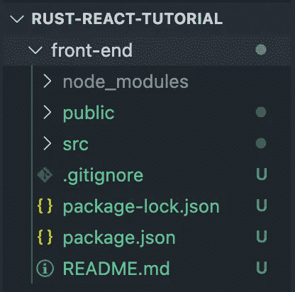
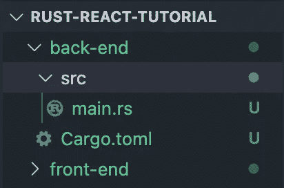
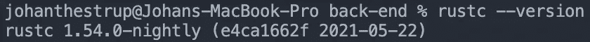
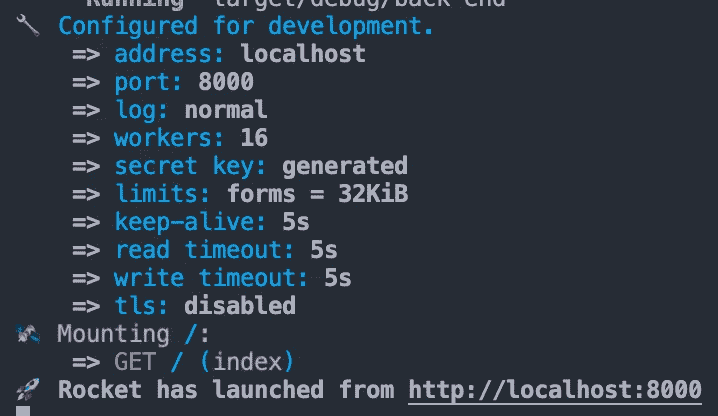
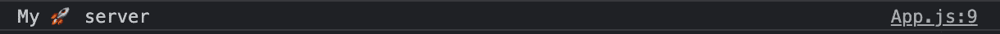
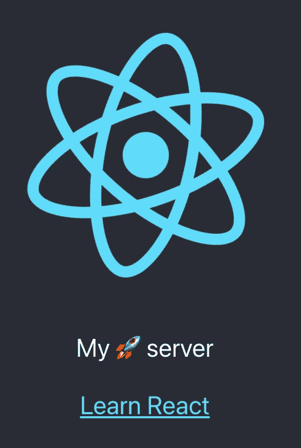
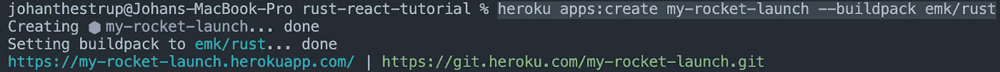
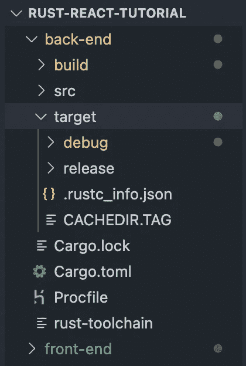
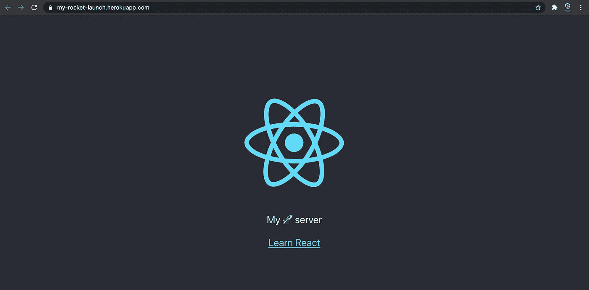

# 设置 Rust-React 项目并将其部署到 Heroku。

> 原文：<https://medium.com/geekculture/setup-your-rust-react-project-and-deploy-it-to-heroku-888a16d603ea?source=collection_archive---------5----------------------->


#Rustacean

我花了一周时间学习铁锈的基本知识。作为一个学习实验，我决定在 Rust 中构建一个简单的后端，与我在 React 中构建的前端进行交互。Rust 没有在 Heroku 上列出的官方支持的构建包，因此，部署过程没有很好的记录。这肯定不是火箭科学，但我想分享我的学习，因为我花了一些时间来收集资源和成功部署我的应用程序。

该项目将在您的前端和后端之间建立尽可能简单的交互，并将其部署到 Heroku。我希望你能够重复这个设置，发射一个比我在这个指南中更酷的火箭！🚀

让我们创建一个新的 react 应用程序。我们将把 React 应用程序放在一个名为“前端”的文件夹中。



[https://create-react-app.dev/](https://create-react-app.dev/)

接下来，我们将创建我们的 Rust 服务器。这是假设你的电脑上安装了 Rust。如果没有，下面是链接:[](https://www.rust-lang.org/tools/install)

```
*cargo new rust-server --bin*
```

*这将为我们创建一个“Hello World”示例。*

**

*[https://doc.rust-lang.org/cargo/guide/creating-a-new-project.html](https://doc.rust-lang.org/cargo/guide/creating-a-new-project.html)*

*如果我们进入我们的后端文件夹，运行“货物运行”，我们应该看到“你好，世界！”在我们的终点站。*

**

*Great success!*

*现在为了使用火箭🚀我们需要使用 Rust 的“夜间”版本。我们通过在终端中运行以下命令来安装“nightly”。*

```
*rustup toolchain install nightly*
```

*其次是:*

```
*rustup default nightly*
```

*现在如果你跑:*

```
*rustc --version*
```

*您应该看到我们使用的版本是夜间版本:*

**

*我们现在将添加 Rocket 作为项目依赖项。火箭🚀是一个允许我们在 Rust 中构建网络应用的框架。在 Rust 中，我们在 Cargo.toml 文件中处理依赖关系。通过将 Rocket 添加到列表中，将其作为依赖项添加:*

```
*[package]name = "back-end"version = "0.1.0"edition = "2018"**[dependencies]****rocket = "0.4.10"***
```

*回到我们的“main.rs”文件中，我们将复制粘贴“Hello World”示例到 Rocket 中🚀文档。我们的 main.rs 现在看起来像这样:*

```
*#![feature(proc_macro_hygiene, decl_macro)]

#[macro_use] extern crate rocket; #[get("/")]fn index() -> &'static str {"Hello, world!"}#[get("/api/myrocket")]fn myrocket() -> String {"My 🚀 server".to_string()}fn main() {
    rocket::ignite().mount("/", routes![index, myrocket]).launch();
}*
```

*接下来，我们将通过运行以下命令来启动服务器:*

```
*cargo run*
```

*这一次，您的终端将开始安装 rocket，并在安装结束时向您显示以下消息:*

**

*Our server is running on localhost 8000!*

*让我们检查一下我们的服务器！*

**

*[http://localhost:8000/](http://localhost:8000/)*

*我们现在要把这个变成“你好，世界！”通过从我们刚刚创建的服务器获取数据，消息出现在我们的前端。*

*我们将让我们的火箭服务器运行，同时我们打开一个新的终端窗口。运行以下命令:*

```
*cd front-end
npm start*
```

*如果您访问您的本地主机，您应该会看到旋转的 react 徽标。*

*现在我们将尝试从我们的火箭服务器获取数据。*

*在 app.js 中，我们将使用 axios 向运行在 localhost 8000 上的服务器发出 http 请求。如果您也选择使用 axios，您将必须安装依赖项并导入它！*

```
*function App() {const getData = async () => {const response = await axios("http://localhost:8000/myrocket");console.log(response.data);};useEffect(() => {getData();}, []);return (<div *className*="App">......*
```

*让我们看看我们的控制台。我们有一个错误:*

**

*Our server doesn’t allow Cross-origin resource sharing (CORS).*

*为了处理这个错误，我们需要配置当请求来自不同来源时，我们的服务器应该如何操作。为此，我们将在项目中添加另一个依赖项:“rocket_cors”。在我们的 Cargo.toml 中添加以下内容:*

```
*[dependencies]rocket = "0.4.10"
**rocket_cors = "0.5.1"***
```

*接下来，我们将配置如何处理来自 main.rs 内部不同来源的调用。*

*我们将把这个新的依赖项导入 main.rs*

```
*extern crate rocket_cors;*
```

*记住分号在 Rust 中是强制执行的！:)*

*此外，我们需要从 Rocket 导入 http 方法:*

```
*rocket::http::Method;*
```

*接下来，我们将使用以下代码配置我们的 CORS 选项。如果你有兴趣了解更多关于配置选项的信息，我建议你看看 github repo 中的例子或者阅读链接中的文档。*

*回购:[https://github.com/lawliet89/rocket_cors](https://github.com/lawliet89/rocket_cors)*

*医生:[https://docs.rs/rocket_cors/0.5.2/rocket_cors/](https://docs.rs/rocket_cors/0.5.2/rocket_cors/)*

```
*use rocket_cors::{AllowedHeaders, AllowedOrigins, Error,Cors, CorsOptions};fn make_cors() -> Cors {let allowed_origins = AllowedOrigins::some_exact(&[ *// 4.* ***//CHANGE THESE TO MATCH YOUR PORTS*****"http://localhost:3000",****"http://127.0.0.1:3000",****"http://localhost:8000",****"http://0.0.0.0:8000",**]);CorsOptions { *// 5.*allowed_origins,allowed_methods: vec![Method::Get].into_iter().map(From::from).collect(), *// 1.*allowed_headers: AllowedHeaders::some(&["Authorization","Accept","Access-Control-Allow-Origin", *// 6.*]),allow_credentials: true,..Default::default()}.to_cors().expect("error while building CORS")}*
```

*我们就快成功了，但在准备发射之前，我们需要将 CORS 选项安装到火箭上。🚀*

```
*fn rocket() -> rocket::Rocket {rocket::ignite().mount("/",routes![
**//PASS IN THE NAME OF YOUR ROUTES HERE**index,myrocket],).attach(make_cors())}fn main() {rocket().launch();}*
```

*请注意，我们的 main 函数看起来与上一个示例略有不同。*

*如果我们现在尝试发出一个 http 请求，我们应该能够检索到一些数据！我在控制台上看到了以下内容:*

**

*GREAT SUCCESS! 🔥*

*让我们把它很好地显示在我们的前端。我们将通过导入 useState 挂钩来实现这一点，使用该挂钩来存储我们检索的数据，并在 App.js 的 return 语句中的 p 标记内呈现它。*

**

*Not rusty at all. 🚀*

*现在功能都好了。让我们从前端生成一些静态文件。*

```
*npm run build*
```

*我们现在将把整个构建文件夹移动到我们的后端文件夹中，从那里它们将得到服务。*

*现在，我们将通过 Rocket 提供静态文件。这是有点混乱的部分，因为我们将不得不写相当多的代码来服务我们的静态文件。我已经突出显示了自上次我们查看“main.rs”以来我们添加的内容。这是我们修改后 main.rs 的样子:*

```
*#![feature(proc_macro_hygiene, decl_macro)]#[macro_use]extern crate rocket;extern crate rocket_cors;**use std::io;****use std::path::{Path, PathBuf};**use rocket::http::Method;**use rocket_contrib::serve::StaticFiles;****use rocket::response::{NamedFile};**use rocket_cors::{AllowedHeaders, AllowedOrigins, Error,Cors, CorsOptions};fn make_cors() -> Cors {let allowed_origins = AllowedOrigins::some_exact(&[ *// 4.*"http://localhost:3000","http://127.0.0.1:3000","http://localhost:8000","http://0.0.0.0:8000",]);CorsOptions { *// 5.*allowed_origins,allowed_methods: vec![Method::Get].into_iter().map(From::from).collect(), *// 1.*allowed_headers: AllowedHeaders::some(&["Authorization","Accept","Access-Control-Allow-Origin", *// 6.*]),allow_credentials: true,..Default::default()}.to_cors().expect("error while building CORS")}#[get("/api/myrocket")]fn myrocket() -> String {"My 🚀 server".to_string()}**#[get("/<file..>")]****fn files(file: PathBuf) -> Option<NamedFile> {****NamedFile::open(Path::new("build/").join(file)).ok()****}****#[get("/")]****fn index() -> io::Result<NamedFile> {****NamedFile::open("build/index.html")****}**fn rocket() -> rocket::Rocket {rocket::ignite().mount("/",routes![index,myrocket,**files,**],).attach(make_cors())}fn main() {rocket().launch();}*
```

*现在，当我们运行我们的服务器时，我们应该看到我们的反应前端。💯*

*所以我答应给你一个结合使用 Rust 和 React 的最简单的骨骼应用。我认为你可以从这里开始用你自己的想法来建造它。我们会说我们的应用程序现在已经完成，可以部署了！*

*让我们登录 Heroku 并开始我们的部署。(你需要安装 heroku CLI 这里只需`npm install -g heroku`就可以了)*

```
*heroku login*
```

*按照这些步骤操作之后，您的终端应该会告诉您已经登录。*

*Heroku 还没有正式的 Rust 构建包，但是已经有了。我们只需要自己设置一个。我们将使用“emk/rust”。*

```
*heroku apps:create my-rocket-launch --buildpack emk/rust*
```

**Github 回购:*[*https://github.com/emk/heroku-buildpack-rust*](https://github.com/emk/heroku-buildpack-rust)*

**

*创建一个名为“Procfile”的文件，并在文件中写入以下内容:*

```
*web: ROCKET_PORT=$PORT ROCKET_KEEP_ALIVE=0 ./target/release/**<name of your rocket server>***
```

*接下来，在我们的终端中，我们运行:*

```
*cargo build --release*
```

*这一部分可能需要一些摆弄(至少对我来说是这样)。我们需要指定使用什么“夜间”版本。为此，我们创建了一个名为“rust-toolchain”的文件。里面我们放了哪些夜间使用的版本。*

```
*nightly-2021-05-20*
```

*我能够使用上面的版本进行部署。*

**

*Our file tree now looks like this.*

*快到了。接下来，我们设置我们的远程回购。*

```
*heroku git:remote -a my-rocket-launch*
```

*在我们提交我们的更改之前，不要忘记将 API-call 更改为您的 heroku-address！*

*提交您的更改并推送。*

*部署时间！*

```
*git push heroku master*
```

**

*Our app has been deployed!*

*我们在后端使用 Rust 进行了最简单的往返，在前端使用 React。*

# *恭喜你！*

# *如果你能走到这一步！非常感谢你的阅读，我真的希望你觉得这个指南有用。如果你有，请给我一个关注我，并留下评论！🚀🔥*

*ありがとう！*

*在推特上关注我:@ johanthestrup*