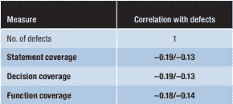
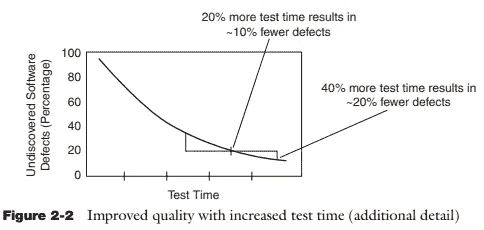
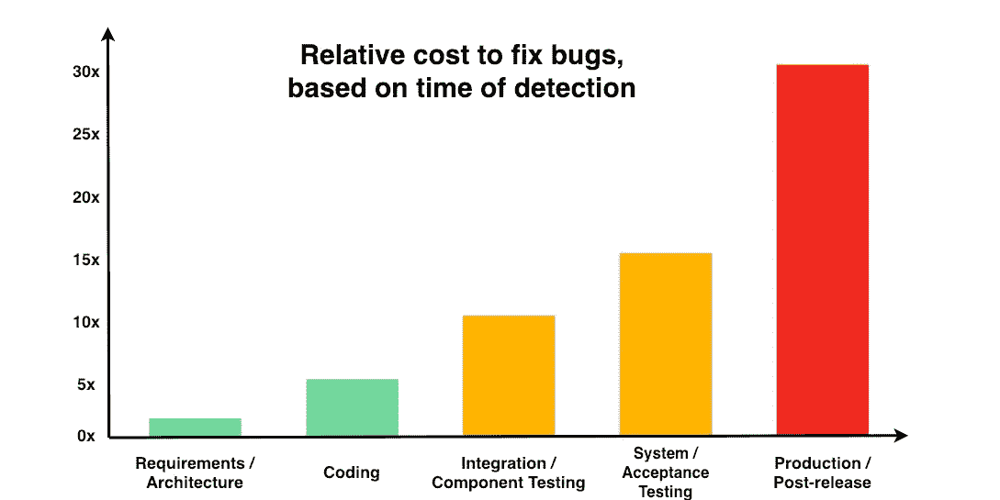
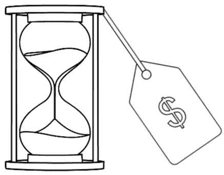

# 关于软件测试的七个不言而喻的事实

> 原文：<https://medium.com/geekculture/seven-unspoken-truths-about-software-tests-4bcf0f720a04?source=collection_archive---------3----------------------->

## 质量保证

## 大学或课程中通常不会教的东西，但每个人都应该知道


Photo by [Evgeni Tcherkasski](https://unsplash.com/@evgenit?utm_source=medium&utm_medium=referral) on [Unsplash](https://unsplash.com?utm_source=medium&utm_medium=referral)

1.  当你负责测试时，有人问过你为什么没有发现一个特定的缺陷吗？你有没有因为没有发现缺陷而责怪过别人？
2.  你是否增加了你的测试覆盖率，却发现产品中的缺陷数量是一样的？
3.  您是否在发布之前花费了比以往更多的时间来进行测试，却发现您不能捕捉到任何其他东西(并且您一发布，缺陷就开始出现)？
4.  开发人员可以测试他们的代码吗？
5.  如果后来发现缺陷，成本会成倍增加吗？
6.  你能通过以任何你想要的方式调整软件来试图找到缺陷，并且称之为“探索性测试”吗？
7.  你需要利用质量保证活动来提高产品质量吗？

让我们看看我们是否能打破一些关于软件测试的神话！

# #1 测试不会发现所有问题！

没错。没有任何质量保证活动能捕捉到所有现存的缺陷。


Photo by [Geronimo Giqueaux](https://unsplash.com/@ggiqueaux?utm_source=medium&utm_medium=referral) on [Unsplash](https://unsplash.com?utm_source=medium&utm_medium=referral)

```
Techniques Effectiveness
Software review: 25% to 40%
Software inspection: 45% to 65%
Code review: 20% to 35%
Code inspection: 45% to 70%
***Unit test: 15% to 50%
Integration test: 25% to 40%
System test: 25% to 55%
Beta test (< 10 users): 24% to 40%
Beta test (> 1000 users): 65% to 85%***Adapted from Caper Jones, Software defect-removal efficiency, IEEE Computer, April 1996, pp. 94 - 95, DOI 10.1109/2.488361, ISSN 1558-0814.
```

一些测试实践实际上比仅仅检查效率更低。重点不在于选择你需要关注哪种类型的测试，而在于将其中的一些结合起来，以达到事半功倍的效果。

因此，下次有人抱怨没有发现缺陷时，提醒他们没有办法确保没有发现特定的缺陷。

找出测试中遗漏缺陷的原因是事后分析。这是逆向思维。这就相当于说一个魔术在已经被公开了它是如何完成的之后是显而易见的。这不是一个有效的分析。

永远不要责怪质量保证工程师。他们在那里寻找引入的缺陷。不是他们造成的。捕捉缺陷的工具的有效性和防止缺陷被引入的有效性是一样的。没有什么是完美的。

# #2 测试覆盖率与测试的有效性几乎没有关联(如果有的话)


Photo by [Ricardo Resende](https://unsplash.com/@rresenden?utm_source=medium&utm_medium=referral) on [Unsplash](https://unsplash.com?utm_source=medium&utm_medium=referral)

是的，你没看错。我们已经有足够的科学证据表明，增加单元测试覆盖率不一定会增加您的测试套件在发现缺陷方面的有效性！也许是时候关注与测试相关的内容，而不是测试多少代码了。

下面的参考文献来自:
[*V. Antinyan 和 M. Staron，《神话般的单元测试覆盖》，2019 IEEE/ACM 第 41 届国际软件工程会议:实践中的软件工程(ICSE-SEIP)，2019，第 267–268 页，DOI:10.1109/ICSE-seip . 2019.00038 .*](https://doi.org/10.1109/ICSE-SEIP.2019.00038)



The correlation coefficients between statement, decision, and function coverage and the number of defects were weak.

1.  A. Mockus，N. Nagappan 和 T.T. Dinh-Trong，“测试覆盖和验证后缺陷:多案例研究”，Proc .第三国际交响乐。实证软件工程。和测量(ESEM 09)，2009 年，第 291-301 页。
    覆盖率和缺陷之间的相关性**没有或者非常弱**。此外，将覆盖率从某一水平提高到 100%所需的努力呈指数增长。
2.  *M.R. Lyu，J. Horgan，S. London，“软件测试有效性的覆盖分析工具”，IEEE Trans。可靠性，第 43 卷，第 4 期，1994 年，第 527-535 页。*
    定性分析发现**缺陷和覆盖率之间没有关联**。
3.  B. Smith 和 L.A. Williams，关于代码覆盖率作为单元测试停止标准的调查，tech。报告 TR-2008–22，北卡罗来纳州立大学计算机科学系，2008 年，第 1–6 页。
    结果**不支持测试强度受控时，测试覆盖率和缺陷数量之间存在因果相关性**的假设。
4.  L. Briand 和 D. Pfahl，“使用模拟来评估测试覆盖率对缺陷覆盖率的实际影响”，Proc。第十届国际交响乐。软件可靠性工程。，1999 年，第 148-157 页。
    结果**不支持测试强度受控时，测试覆盖率和缺陷数量之间存在因果相关性**的假设。
5.  P.S. Kochhar，F. Thung 和 D. Lo，“代码覆盖和测试套件有效性:大型系统中真实错误的实证研究”，Proc。IEEE 第 22 届国际会议。软件分析、进化和再造(SANER 15)，2015 年，第 560–564 页。
    在覆盖率和缺陷之间发现了一个**中度到强烈的相关性**。然而，**覆盖率是手动操作和计算的**。
6.  L. Inozemtseva 和 R. Holmes，“覆盖率与测试套件的有效性没有很强的相关性”。第 36 届国际会议。软件工程。(ICSE 14)，2014 年，第 435-445 页。在覆盖率和缺陷之间发现了一个弱到中等的相关性。覆盖的类型对结果没有影响。
7.  *X. Cai 和 M.R. Lyu，“不同测试剖面下代码覆盖率对故障检测的影响”，美国计算机学会软件工程。注释，第 30 卷，第 4 期，2005 年，第 1-7 页。*
    在覆盖率和缺陷之间发现了一个**中度相关**，但是**缺陷是人为引入的**。对于不同的测试曲线，相关性是不同的。
8.  G. Gay 等人，“面向覆盖的测试用例生成的风险”，IEEE Trans。软件工程。，第 41 卷，2015 年第 8 期，第 803–819 页。
    覆盖度量是**测试套件充分性的弱指标**。**高覆盖率不一定意味着有效的测试**。

# #3 测试工作量呈指数增长

许多资料表明，测试人员在测试活动的开始会发现更多的缺陷，在结束时会发现更少的缺陷。有迹象表明，为了找到下一个缺陷，增加覆盖率和执行测试的努力呈指数增长。

在论文“测试覆盖和验证后缺陷:多案例研究”中。第三国际交响乐。实证软件工程。和测量(ESEM 09)，2009 年，第 291-301 页。)，将覆盖率从某一水平提高到 100%所需的努力呈指数增长。



根据《实现自动化软件测试:如何在提高质量的同时节省时间和降低成本》一书中的作者所说达斯汀、加勒特和高夫(2009 年)。皮尔森教育。)，软件可靠性模型表明，随着测试时间的增加，单位时间内发现的缺陷数量呈指数下降。

# #4 开发者偏见


Photo by [Fotis Fotopoulos](https://unsplash.com/@ffstop?utm_source=medium&utm_medium=referral) on [Unsplash](https://unsplash.com?utm_source=medium&utm_medium=referral)

假设一个开发人员错误地理解了一个需求。代码会按照他的误解实现——测试也是。

如果开发人员忘记在代码中做一些事情，比如验证一个特定的条件，很可能他也不会记得测试它。

就这么简单。

为了避免这个问题，开发人员可以测试彼此的代码，但不能测试他们自己的代码。

如果他们没有设计测试用例，他们可以测试他们自己的代码，避免前面提到的偏见。

虽然测试驱动的开发可能会减少忘记某事的偏见，但它不会减少误解某事的偏见。

# #5 后来发现的缺陷可能不需要花费太多的成本来修复

我甚至不知道如何开始，因为虽然这是真的，但人们通常不会这么说。我们很多人都习惯于看到这样的图片:



唯一的区别是实际数字，有时最高可达 30 倍、100 倍甚至 150 倍。Laurent Bossavit 是敏捷方法专家，也是巴黎软件咨询公司 CodeWorks 的技术顾问，他在 GitHub 上发表了一篇名为“智力不诚实程度”的文章，讲述了这些信息是如何被凭空创造出来的。

在“延迟问题更难解决吗？在整个生命周期中重新审视修复缺陷的成本”(门泽斯，t .，尼科尔斯，w .，舒尔，f .等人，Empir Software Eng 22，1903–1935(2017)[https://doi.org/10.1007/s10664-016-9469-x](https://doi.org/10.1007/s10664-016-9469-x))，作者没有发现任何证据表明修复代码中的缺陷在投入生产后需要更长的时间。

在论文“我们从对抗缺陷中学到了什么”(Forrest Shull，Vic Basili，Barry Boehm 等，第八届国际软件度量研讨会会议录(METRICS '02)。美国 IEEE 计算机学会，249。2002.)作者发现，修复某些非关键类缺陷的成本在整个生命周期阶段几乎是不变的(在项目早期平均为 1.2 小时，而在项目后期为 1.5 小时)。

然而，

这些研究中的许多测量了定位错误和修复代码中的缺陷所花费的努力。

他们错过了什么？



1.  回归测试！
    在我们投入生产之前，我们会进行大量的回归测试。通常会涉及到手工测试。交付某些缺陷修复，尤其是关键的缺陷修复，可能需要重新执行许多测试。
2.  机会成本！在这些缺陷被识别和修复的时候，许多人将会转移到下一个任务或者甚至其他项目。这些任务和项目将遭受中断，甚至可能危及他们的最后期限。
3.  企业成本！
    没错！这家企业可能不得不支付罚金。客户可能会受到财务影响。对用户体验会有影响。【2020 年 12 月，游戏[赛博朋克 2077 因推出时的诸多技术问题被索尼商店](https://www.forbes.com/sites/siladityaray/2020/12/18/cyberpunk-2077s-disastrous-launch-gets-worse-as-sony-removes-game-from-playstation-store-promises-refunds/)下架。索尼提供全额退款。后来，开发公司 CD Projekt Red 宣布对 PS4 和 Xbox 播放器进行退款。[在一次投资者电话会议中，CD Projekt Red 表示，“与恢复公司声誉相比，修复赛博朋克 2077 的成本‘无关紧要’](https://www.gamesradar.com/the-cost-of-fixing-cyberpunk-2077-is-irrelevant-compared-to-restoring-company-reputation-says-cdpr/)”该公司的股票已经从 2020 年 12 月的每股 31 美元涨到 2021 年 6 月的每股 10 美元。
4.  代码中没有引入的缺陷。如果一个缺陷被注入到代码中，它只需要在那里被修复。然而，想象一下，如果一个缺陷被注入到一个技术规范中。结果可能会影响不同服务或组件中的多个类。例如，想象一下决定一个不被第三方服务支持的身份验证框架的成本，第三方服务将无法验证身份验证令牌。如果缺陷在一个需求中，级联效应会更糟糕。
    所有这些都没有提到，如果在代码中发现一个错误，预计至少会进行一次调查，看看最初是不是技术规范出错了。如果缺陷存在，调查将继续查看它是否来自需求。

因此，虽然修复代码错误的努力在发布后可能不会增加那么多，但是尽早修复缺陷可以节省大量的精力、金钱和麻烦。

# #6 探索性测试需要流程和文档


许多人认为，如果他们到处尝试输入意外的数据或不按顺序随机地执行操作，他们就是在做“探索性测试”。他们不是。

探索性测试并不意味着临时做事情。探索性测试仅仅意味着学习系统如何工作与定义和执行测试用例并行发生。

换句话说，探索性测试可以(最好应该)由现有的文档支持，比如需求和手册。这里的区别在于，测试不是预先编写好的。

测试脚本应该被定义为活动的一部分，这样一旦发现了缺陷，复制它的方法就会被记录下来。这些脚本可以在以后被自动化或者在将来的手工测试中使用(那将不再是探索性的)。

测试用例仍然应该使用诸如边界值分析、等价类划分等技术来定义。没有理由去定义随机的测试用例，这些测试用例在检测缺陷时可能不是成本有效的或者有效的。

# #7 改进过程中的非质量保证活动可以提高产品质量

2009 年[在巴西](http://www-di.inf.puc-rio.br/~kalinowski//publications/TravassosK09a.pdf)(葡萄牙语)进行的一项研究涉及 135 个软件开发组织，通过改进他们的过程，他们识别和修复缺陷的能力得到了提高。这些公司是巴西软件过程改进项目“MPS”的一部分。Br，“他们应该坚持软件过程改进模型(MPS 模型)。

这个模型有几个阶段，其中 58 家公司处于第一阶段，他们被要求改进他们的项目管理和需求管理过程。

虽然不清楚为什么会发生这种情况，但我们可以合理地预期，确定了合适的人参与团队、培训需求以及适当的预算和时间表的项目很可能会有人员、时间和其他资源来提高质量。

# 奖金(有趣的事实):百慕大计划


Photo by [Reilly Durfy](https://unsplash.com/@photorjd?utm_source=medium&utm_medium=referral) on [Unsplash](https://unsplash.com?utm_source=medium&utm_medium=referral)

好吧，这是个搞笑的，但是没有解释，可能真的行不通。

百慕大计划是一种更快完成项目的战略名称。您将团队的一部分成员派往百慕大(即，将他们从项目中移除)，项目会更快完成。

它被认为是对 Brooks 定律的回应(一个关于软件项目管理的观察，根据这个观察“给一个晚的软件项目增加人员会使它更晚”)。所以，如果你把人去掉，是不是会更快？

根据我的经验，在新人入职期间，每一个新加入团队的人都会占用一个人 1/3 的生产时间，直到他们充分发挥生产力。

因此，移除最近加入的人可能会提高生产率。

它能起作用的其他原因是团队中有太多的冲突。移除与团队目标不一致的人可能会有所帮助。

如果一个团队中有太多的人，沟通开销可能会严重影响工作效率。在这种情况下，拆分团队可能会很好(这在技术上与从项目中移除人员是不一样的)。

否则，撤走人员只会降低在更短时间内建造更多建筑的能力。

无论如何，我只是在分享百慕大计划，因为谈论它总是很有趣。:-D

> 如果你喜欢这个故事，请在结尾鼓掌，这样我就知道你想读什么了。
> 
> ***我用博客赚不了一毛钱。如果您想支持更多内容的创作，请与您的同事分享博客，并关注它以获得新故事的通知***