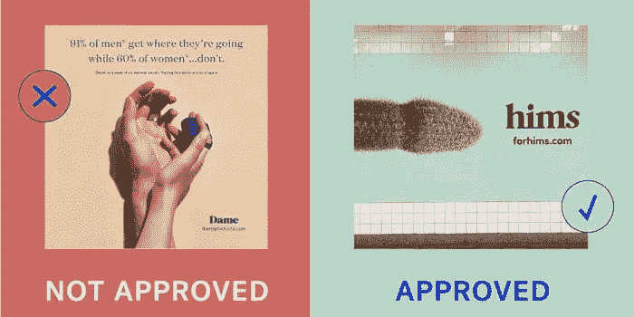
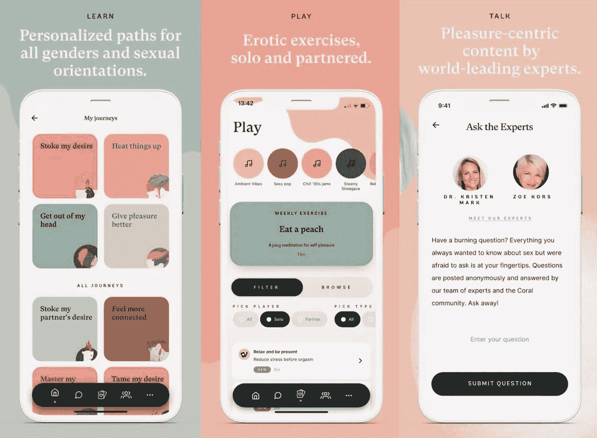
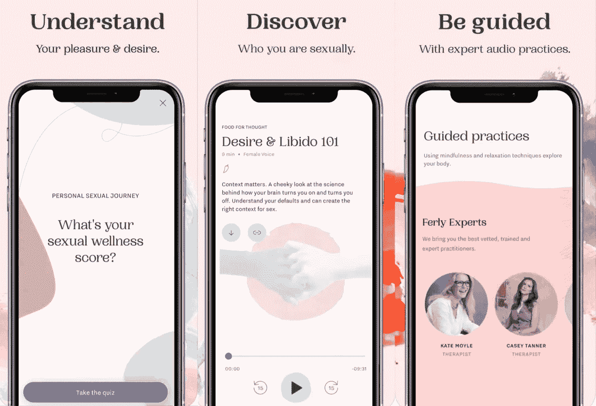

# 性科技创业公司:幸福的未来

> 原文：<https://medium.com/geekculture/sextech-startups-the-future-of-wellbeing-62cc317356a?source=collection_archive---------4----------------------->

对一个人来说似乎是标准的东西对另一个人来说可能是不可接受的。不幸的是，这也给现代企业带来了挑战。我们使用相同的社交媒体网络和银行，我们所有人都使用谷歌来满足工作和个人需求。事实是，这些平台决定了什么是可接受的，什么是不可接受的，以及哪些企业可以使用它们。

性科技初创公司与禁止广告的类别有关，即使这些产品解决了与性健康相关的实际问题。尽管如此，女性科技是一个与女性性健康相关的行业，预计到 2025 年将增长到近 500 亿美元。

许多投资者也[看到了性科技](https://www.forbes.com/sites/andreabarrica/2019/03/25/12-leading-investors-explain-why-theyre-funding-sextech/?sh=7a1ab8644869)的市场机会。例如，[公司的联合创始人兼董事总经理格尔达·拉尔森(Gerda Larsson)说，她开始投资性科技*“在发现它是解决围绕性和女性性快感的全球禁忌的解决方案之一之后。科技让人们有机会围绕快乐以及快乐对你的意义进行探索、培养和创新。”*](http://www.thecaseforher.com/)

天使投资人劳拉·伯伦斯·吴说: [*“我对 sextech 的投资不应被视为与对其他类型医疗保健*](https://twitter.com/intent/tweet?url=http%3A%2F%2Fwww.forbes.com%2Fsites%2Fandreabarrica%2F2019%2F03%2F25%2F12-leading-investors-explain-why-theyre-funding-sextech%2F&text=%E2%80%9CMy%20investment%20in%20sextech%20shouldn%E2%80%99t%20be%20viewed%20any%20differently%20than%20investments%20in%20other%20types%20of%20healthcare.%22) *的投资有任何不同，比如***或***——这是一个巨大的、成熟的市场。那些坚持分割出我们身体某一方面的投资者，仅仅因为这让一些人不舒服，五年后可能会后悔。”***

**出于天生的好奇，我决定更深入地挖掘，了解为什么在 2022 年，我们仍然在谈论对一个人的健康至关重要的信息的污名化，以及我如何才能帮助那些想踏上制造性科技产品之路的人。**

# **性科技创业的最大障碍**

**先说阻碍很多创业者进入这个行业的主要壁垒。**

****

## **这个行业不被重视**

**关于 sextech 仍然有一个巨大的公司障碍；很多人会想到色情，机器人，VR，AR 体验。那不完全正确。 [Sextech 包括任何旨在增强性欲的技术](https://cxdojo.com/what-is-sextech)。这可以是任何东西，从蓝牙振动器到解决性和健康问题的应用程序。但这个行业继续被忽视，被视为禁忌。**

## **广告禁令**

**如果你与性科技专家或企业家交谈，他们会提到的一个主要问题是无法在社交媒体上宣传他们的产品。**

**[unbounded](https://unboundbabes.com/pages/about-us)首席执行官波利·罗德里格兹[告诉 TechCrunch](https://techcrunch.com/2019/07/30/sex-tech-startups-band-together-to-protest-facebooks-ad-policies/)sex tech 产品已经被脸书、Instagram 和 Pinterest 封杀。**

***“不能在上面做广告是一件大事，因为除了政策有偏见和性别歧视之外，它还阻止了这些创始人接触潜在客户。”***

****

**事实上，一个宣传勃起功能障碍药物的阴茎状仙人掌——被批准——一只手拿着振动器——没有被批准。性科技初创公司 Dame Products 和 Unbound 已经推出了一个网站，“批准/未批准”，在那里你也可以玩一个关于性健康产品的猜谜游戏。**

## **支付处理**

**对于任何初创公司来说，找到一个可靠的支付提供商都是至关重要的第一步。但是如果你的产品对某些人来说是有争议的，事情就变得棘手了。我们的团队在为客户开发约会平台时遇到了这样的障碍。他们不得不努力将支付网关整合到他们的网站上。事实证明，创建一个软件架构相对简单，而将一个支付提供商集成到一个约会平台却不简单。**

## **人力资源流程**

**当我与 S x Tech 的首席执行官兼联合创始人 Ola Miedzynska 交谈时。她还提到了性科技创业公司面临的所有障碍中的一个人力资源流程。如果你从事性科技行业，招聘一名有价值的内容创作者或有经验的销售人员可能是一个棘手的问题。事实证明，许多专家不想与这个行业有任何关联。因此，Ola 的建议是对远程解决方案持开放态度，放眼全球，雇佣国际专业人士。**

## **财政限制**

**每一个新的商业想法都需要一个至关重要的东西:钱。对于年轻的企业来说，要筹集资金，他们必须对自己做什么和如何做做出更积极的反应。但我们是在性科技领域，这里的事情并不典型。即使这个想法很特别，许多 sextech 公司也因为声誉风险而没有得到投资。幸运的是，事情开始改变。已经拿 sextech 产品的众筹平台有几个: [Crowdcube](https://www.crowdcube.com/) 、 [Republic](https://republic.co/) 、 [Indiegogo](https://www.indiegogo.com/) 。**

**例如，2020 年，2500 万美元的 Vice Ventures 基金成立，其使命是*“通过投资在“坏”行业运营的好公司，克服耻辱，争取更高的回报。”一家以色列基金亲密资本计划筹集 2000 万美元，投资开发 sextech 解决方案。***

# **性科技产业的新机遇**

**如果你对性科技产品有想法，并想进入这个行业，我们有好消息给你。与金融科技、医疗保健或零售等行业相比，性科技规模较小，而且几乎每个人都互相认识。所以很容易找到合适的人和关系网。你可以很容易地提出你的想法，并从 sextech 环境的早期声音中获得建设性的反馈。还有哪些行业可以夸耀这样一个紧密团结的社区？**

**谈到成功的性科技创业公司，首先想到的是一些产品。其中包括在种子期获得大量投资的应用程序(大多由女性创始人运营)。**

## **珊瑚**

****

**珊瑚是性健康市场的先锋。这是一个针对所有性别表达和性取向的夫妇的互动应用程序，提供课程、指南和真实故事，以改善性生活。你也可以[阅读珊瑚](https://isharna.medium.com/im-the-founder-of-coral-an-app-that-s-going-to-improve-your-sex-life-96c8ae989746)创始人 Isharna Walsh 的故事，以及她如何想出性健康应用程序的想法。**

## **玩弄女性者**

****

**好色之徒是一家全球性公司，在柏林、香港和渥太华设有办事处。专利的快感空气技术由于无接触的阴蒂刺激为女性提供了新的高潮感觉。2020 年，英国歌手[莉莉·艾伦宣布与好色之徒](https://www.prnewswire.com/in/news-releases/lily-allen-announces-collaboration-with-womanizer-887499068.html)合作，以提高自爱和关爱的意识。这是一个名人代言的绝佳例子。**

## **奇迹**

****

**[Ferly](https://weareferly.com/?ref=hackernoon.com) 是一个音频指南，在一个应用程序上汇集了会议、研讨会、测验和故事，帮助用户探索和了解他们对性的感受。这是一家总部位于伦敦的初创公司，2019 年从顶级投资者[那里筹集了 150 万英镑](https://www.vanityfair.com/london/2020/06/interview-billie-quinlan?ref=hackernoon.com)，其中包括迈克尔·阿克顿·史密斯(Calm 的联合创始人)和索菲亚·本茨(Spotify 前全球营销总监)。**

# **给性科技创业公司的建议**

**如果你想了解更多关于性科技的未来，请看我们的小组讨论。我们的嘉宾已经在这个行业工作了很长时间，在这个视频中，他们给出了许多关于启动性科技创业的实用技巧。**

## **与已经从事该行业的人交谈**

**网络。网络。网络。多一点人际关系网。Sextech 的社区相对较小。更容易接触到已经在那里呆了一段时间的人，扩大你的关系网。在 LinkedIn 上关注性科技专家，因为他们通常会发布即将举行的活动和会议，我们强烈建议参加(甚至在线)。它会让你更好地理解如何提高和推广你的品牌。以下是 sextech 的几个大牌人物:[布莱尼·科尔](https://www.linkedin.com/in/bryonycole/)、[辛迪·盖洛普](https://www.linkedin.com/in/cindygallop/)、[卡兰德拉·鲍尔弗](https://www.linkedin.com/in/calandrabalfour/)、[奥拉·米耶兹恩斯卡](https://www.linkedin.com/in/ola-miedzynska-370100143/)、[多明尼克·卡雷索斯](https://www.linkedin.com/in/dominnique/)等等。**

## **对行业充满热情**

**如果你对你的产品或领域没有热情，就不要去做。如果你关心性教育、性、幸福，并且知道科技如何积极地影响它，那么你来对地方了。但是准备好面对我们世界的保守现实，证明你的产品值得一试。**

## **不要害怕投球**

**如果你手中还没有产品或原型，不要害怕推销它。说说你的想法，包括你的愿景、解决方案、市场机会、商业模式、营销计划，以及你产品背后的团队。即使你仍然是一个创业者，也要抓住你的观众的注意力，帮助他们了解你是谁，以及你将如何发展你的团队。**

## **给自己找一个向导**

**Sextech 是关于社区的。了解行业，给自己找个导师。**

## **教育客户**

**围绕你的品牌创建一个社区，并在每一步进行教育。这一切都是为了教育你的顾客性科技产品如何提升他们的生活。**

**在不久的将来，为性健康和教育、性治疗设计的应用程序将成为我们日常生活的常规。打破性科技中的禁忌是一个缓慢的过程，教我们如何将产品应用到日常生活中。今天，你完全有机会颠覆这个行业，成为第一批开启性科技革命的人。**

# **最后一点**

**性科技正在获得动力，如果你对它有热情，你就有机会推出一个成功的产品。所以，总结一下，如果你即将进入这个领域，不要忘记:**

**✔️网络，并成为社区的一部分。**

**✔️推销你的产品，即使它还在构思阶段。**

**✔️考虑与国际团队合作，因为不是每个人都渴望与 sextech 合作。**

**✔️教育你自己和你的顾客性健康的重要性，以及你的产品如何改善他们的生活。**

**✔️了解这个行业，给自己找一个导师。**