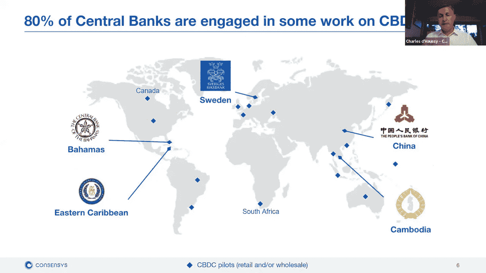
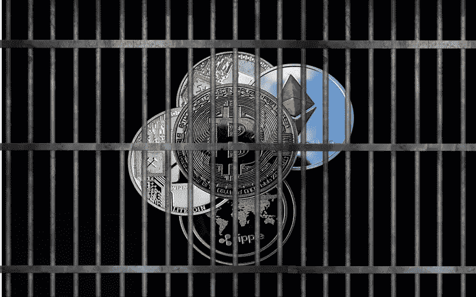

# 性感 CBDC 给山姆大叔

> 原文：<https://medium.com/geekculture/sexy-cbdcs-for-uncle-sam-97d8c94d0814?source=collection_archive---------42----------------------->

## 央行数字货币正在成为法定货币

如果生活在一个纸币成为历史，政府强迫你用他们自己的数字货币进行交易的世界里，会是什么样子？这些信息的每一点都储存在某个政府数据库里并进行分析。每一笔交易和个人信息都完全公开，接受公众监督。

听起来像噩梦吗？

我相信它比我们想象的要近——它可能就在拐角处！

在疫情的毁灭性影响之后，全球各国都在努力维持本国货币的价值，其中许多国家开始寻找替代方法来维持本国的经济健康发展。

事实是，世界各地的政府都害怕“第三方”数字货币。另一方面，他们认识到这是对其金融系统的威胁，理解与更有效的支付形式相关的价值。

## 于是，一个大问题变成了:为什么政府不发行自己的数字硬币？

# 什么是 CBDC？

这就是拥有中央银行数字货币(CBDC)的想法发挥作用的地方。目前，约 90%的央行正在考虑 CBDC，而 60%的央行正在积极尝试自己的 CBDC。

Majority of Central Banks Engaged in CBDC Activity Source: Charles o’Hanny

从本质上讲，CBDC 将拥有区块链的所有优势，以及各国货币目前拥有的法律和监管保障。

让我们开始讨论向 CBDCs 过渡的风险和好处。

## CBDCs 的好处

很明显，拥有一种即时支付和快速结算的方式，会让交易成本大大降低。目前，约 0.8%的 GDP 用于与零售消费者支出相关的交易。转向 CBDC 有助于大幅降低成本，并将节省的成本直接转移给消费者。

CBDC 将使每个人都有能力拥有一个银行账户(钱包)，并有助于改善没有银行账户的人的生活。政府甚至可以瞄准个人钱包来发放刺激、失业和其他福利支出。

一个好处是，这将让其它国家更容易不再依赖美元。它们将与其它支付公司竞争，美元的地位和标准可能会消失。

自 2020 年 4 月以来，在 4 家最具影响力的银行的帮助下，中国一直在试验自己的数字货币。我可以很容易地看到中国发行一种可能与美元竞争的数字法定货币。然而，他们需要解决下面列出的许多陷阱。

## CBDCs 的风险

你可能会问为什么目前没有被广泛接受的 CBDCs。答案是，将整个国家从有形的法定货币转变为基于信任的区块链货币，是一项艰巨的任务。

首先，要让全体人民相信网络是安全的是非常困难的。需要作出巨大努力来确定建立该系统的信任和信誉所需的正确共识机制。需要广泛的教育，这可能会很困难，尤其是对婴儿潮一代来说。

然后就是利息的问题。CBDC 应该是计息资产吗？这个比率是如何设定的？央行可以提供负利率来激励小银行将 CBD 加入它们的资产负债表吗？开放 CBD 以赚取利息打开了一个全新的局面，随之而来的还有许多问题需要解决。

此外，还有洗钱和不良财政行为者的风险。应该存储什么样的信息？这些信息将存储在哪里？谁有权访问？在宣布 CBDC 是一种法定货币之前，所有这些都是需要解决的问题。

## 这对其他加密货币意味着什么？

Possible Ban on Crypto Worldwide

美国政府对加密货币的态度可以在最近的 SEC 诉 XRP 诉讼中得到最好的体现。我在上周的文章中深入探讨了这起诉讼，你可以在这里阅读。

总之，美国证券交易委员会正试图将 XRP 视为非法证券。这起案件将为所有其他加密货币的发展开创一个巨大的先例。有利于证交会的裁决可能会为他们追查 BNB、ETH2、BCH 和许多其他公司打开大门。

如果美国采取这一立场，我认为欧盟也会效仿。他们再次将这些货币视为对其经济健康的威胁。欧盟已经计划在未来几年发布自己的 CBDC，他们不希望比特币或其他任何东西与之竞争。

美国加密货币法律地位的不确定性推动了加密相关业务的监管，并可能导致世界上最伟大的国家错过下一次技术复兴。

*再次感谢我所有出色的读者。没有你我做不到！*

*   约瑟夫·洛夫勒