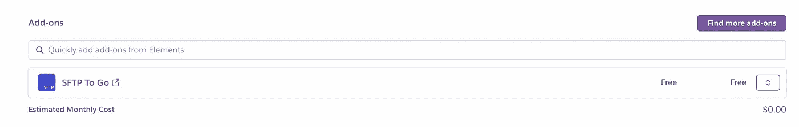
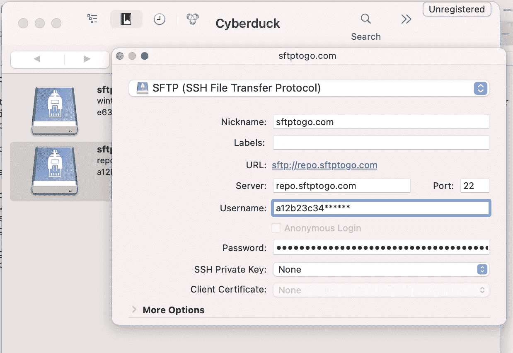
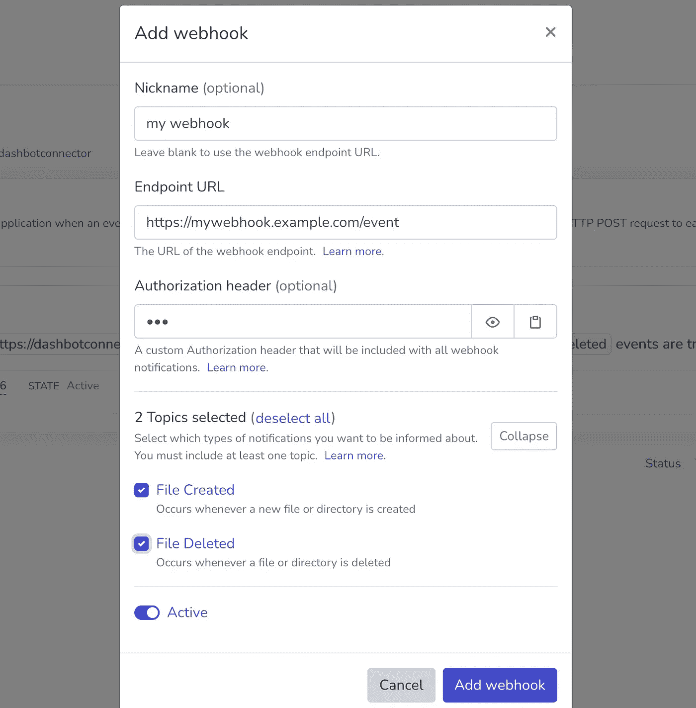

# SFTP 将登上 Heroku

> 原文：<https://medium.com/geekculture/sftp-to-go-on-heroku-78aff427c566?source=collection_archive---------15----------------------->

## 集成强大的远程存储附件


Photo by [Peter Burdon](https://unsplash.com/@peterburdon?utm_source=unsplash&utm_medium=referral&utm_content=creditCopyText) on [Unsplash](https://unsplash.com/s/photos/imagine?utm_source=unsplash&utm_medium=referral&utm_content=creditCopyText)

Heroku 是一个云原生平台，用于开发各种语言的应用程序。它提供了许多功能(GitHub 和 Docker 集成、Web UI 和命令行、扩展插件和云服务列表等)，是启动个人/小型项目的理想场所。

但是有一个**用例**并不简单:**存储文件。**

[ *如果你感兴趣的话，我已经在另一篇文章中讨论过这个挑战了*

[](/geekculture/files-on-heroku-cd09509ed285) [## 赫罗库的档案

### 克服 Heroku 短暂文件系统的选择。免费的。

medium.com](/geekculture/files-on-heroku-cd09509ed285) 

> Heroku Dynos 提供了一个[短暂的](https://devcenter.heroku.com/articles/dynos#ephemeral-filesystem)文件系统:本地更改在每次重新部署和应用程序重启时都会被丢弃，这使得它不适合持久化数据。

考虑到`Dyno Cycling`政策，这变得更加具有挑战性。

> 每个 Dyno(至少)每 24 小时重启一次，以保持系统的健康

幸运的是，Heroku 提供了各种各样的数据存储解决方案，从数据库到远程存储，符合 S3 标准的文件系统和 SFTP 存储库。

本文介绍了 [SFTP To Go](https://devcenter.heroku.com/articles/sftptogo) 附加组件、其特性、设置以及与 Python 代码的集成。**如果您只对最终概述和最精彩部分感兴趣，请跳到结尾**。

# SFTP 外带

[SFTP To Go](https://sftptogo.com/) 是一款为 Heroku 应用提供 SFTP/FTPS 存储的云解决方案。它以单击式附件的形式提供，提供了各种功能:

*   零管理:SFTP 的设置和管理对开发人员来说是透明的
*   网络入站规则:定义可以访问服务器的 IP 地址
*   亚马逊 S3 访问:使用 S3 兼容的 API 访问和管理文件
*   大规模运行:构建在 Amazon 云平台之上，可以随着流量和文件大小的增加而扩展
*   Webhooks:当文件改变时通知应用程序

## 设置

根据产品的`Zero Management`理念，设置是简单的。

```
heroku addons:create sftptogo:bronze -a APP_NAME
```

该插件在后台相对快速地配置:一旦准备就绪，你可以直接从 Heroku 访问“SFTP Go”仪表板。



Heroku Administration UI — SFTP To Go link — Image by Author

在“SFTP 去”仪表板有你需要的一切:凭证(SFTP / FTPS 访问和亚马逊 S3)，网络安全配置和 Webhooks(见下文)。

## 验证访问

安装完附加组件后，让我们尝试使用命令行访问存储库:

```
sftp a12b23c34******@repo.sftptogo.com
sftp> mkdir dir
sftp> ls
dir
```

我们也可以尝试使用 SFTP 的客户端，如[赛博达克](https://cyberduck.io/)



Cyberduck Connection Configuration — Image by Author

# 应用功能

## 通过 S3 进入

与 AWS S3 的兼容性使得该插件非常有吸引力，因为它可以很容易地与各种编程语言和框架集成。

Python 开发者可以使用`[boto3](https://boto3.amazonaws.com/v1/documentation/api/latest/index.html)`包

```
session = boto3.session.Session()s3 = session.client(
    **service_name**=**'**s3**'**,
    **aws_access_key_id**='####',
    **aws_secret_access_key**='####',
    **region_name**='eu-west-1'
)# upload new file
s3.upload_file(**Bucket**='', **Key**='myfile.txt', **Filename**='/tmp/myfile.txt')
```

## 通过 SFTP 协议访问

开发者也可以选择 FTP 库，例如`[ftplib](https://docs.python.org/3/library/ftplib.html)`

```
filename='myfile.txt'
filepath='/tmp/myfile.txt's = ftplib.FTP_TLS(**host**='h.example.com', **user**='user', **passwd**='123')
s.prot_p() *# data-channel protected by TLS* file = open(localfile, **'rb'**)  *# file to send* s.storbinary(**'STOR '**+filename, filepath)  *# send the file*file.close()  s.quit()
```

## Webhooks

可以使用 webhooks 通知特殊事件(文件创建、文件删除):对于管理应用程序外部发生的数据更改来说，这是一个出色的特性。

在仪表板中配置 webhook 详细信息(端点 URL、授权头、要监控的事件类型)



SFTP To Go Add Webhook — Image by Author

实现一个 REST 端点，每当发生一个给定的事件时，处理“SFTP 要走了”推送的 POST 请求。使用 Flask 这很简单:

```
@app.route(**'/event'**, methods=[**'POST'**])
defevent_process(): # Authorization Header (should be validated)
  header = request.headers[**'Authorization'**] payload = request.get_json() print(f"Type of event {**payload['Topic']**}").   # file.created
  print(f"Filepath {**payload['Data']['Path']**}"). # myfile.txt
  print(f"Filesize {**payload['Data']['Size']**}"). # 1028
```

# 摘要

出色的功能:

*   设置再简单不过了:一键创建和配置
*   有效和优雅的仪表板:轻松找到您需要的东西和复制凭证
*   webhooks 通知:优秀的特性，易于设置和管理(包括分析 webhook 交付及其 JSON 负载)
*   广泛的安全功能:密码轮换、IP 过滤、SSH 密钥、多种凭据以实现细粒度的访问控制。

我希望看到的改进:

*   可用的免费层:允许开发者免费开始小项目
*   文件更新通知:允许 webhooks 在现有文件被修改时发出通知

# 结论

对于需要灵活、可扩展且易于上手的远程文件存储的 Heroku 应用程序来说,“SFTP 随身版”是一个很好的附件。

你可以在我的 GitHub 知识库中找到文章中显示的代码片段(T4【SFTP】与 S3 和 [SFTP 与 FTP](https://github.com/gcatanese/HerokuFiles/blob/main/app/sftp_to_go_ftp.py) )。如有问题和建议，请在 [Twitter](https://twitter.com/beppecatanese) 上联系我。

下次见。✌️