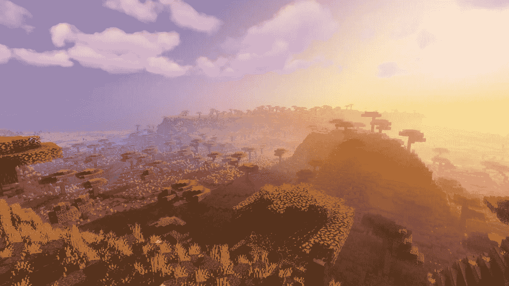

# 着色器之旅#0:简介

> 原文：<https://medium.com/geekculture/shader-journey-0-introduction-78367f7b7252?source=collection_archive---------14----------------------->

## 这是我在着色器世界的新冒险的开始！:)

The famous Minecraft game can get pretty impressive if you add some shaders to it! Image from: [https://tutos-gameserver.fr/2020/05/20/meilleurs-shaders-minecraft-1-14-et-1-15-resoudre-les-problemes-dun-serveur-minecraft/](https://tutos-gameserver.fr/2020/05/20/meilleurs-shaders-minecraft-1-14-et-1-15-resoudre-les-problemes-dun-serveur-minecraft/)

多年来，游戏开发的一个子领域让**着迷**(而**抵制**)的是**着色器**的惊人世界。我总是喜欢看着几行代码把我的 3D 物体变成像镜子一样的铬球，或者奇怪的发光球体，甚至是在空气中跳动的尖尖的气泡…但是我从来没有真正地…