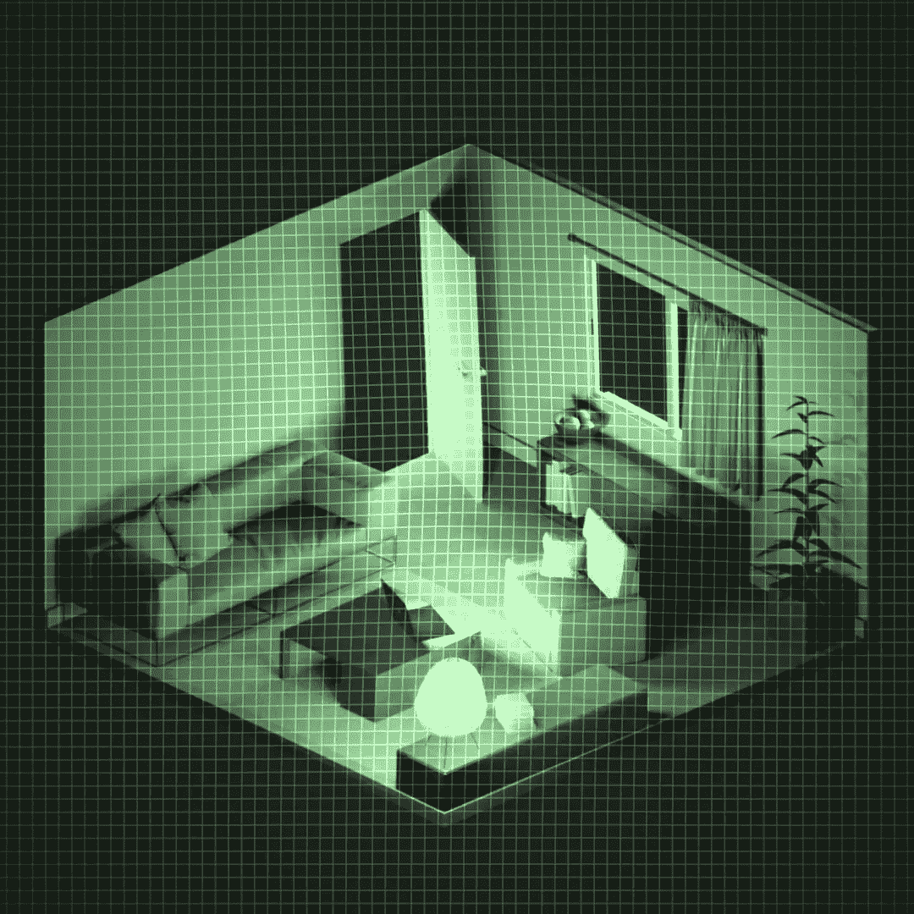

# 着色器之旅#3:基本后期处理效果

> 原文：<https://medium.com/geekculture/shader-journey-3-basic-post-processing-effects-e9feb900ceff?source=collection_archive---------11----------------------->

## 今天，这里是我的着色器之旅的第三批着色器——一些屏幕后期处理效果！

在[我的新 CG 系列](/geekculture/shader-journey-0-introduction-78367f7b7252):《着色器之旅》的前几集里，我谈到了一些可以直接应用在物体上的[卡通](/geekculture/shader-journey-1-basic-toons-3dfc68b4139c)和[全息](/geekculture/shader-journey-2-holograms-68d4c4a7eb12)着色器。今天，我想探索另一种类型的着色器:…