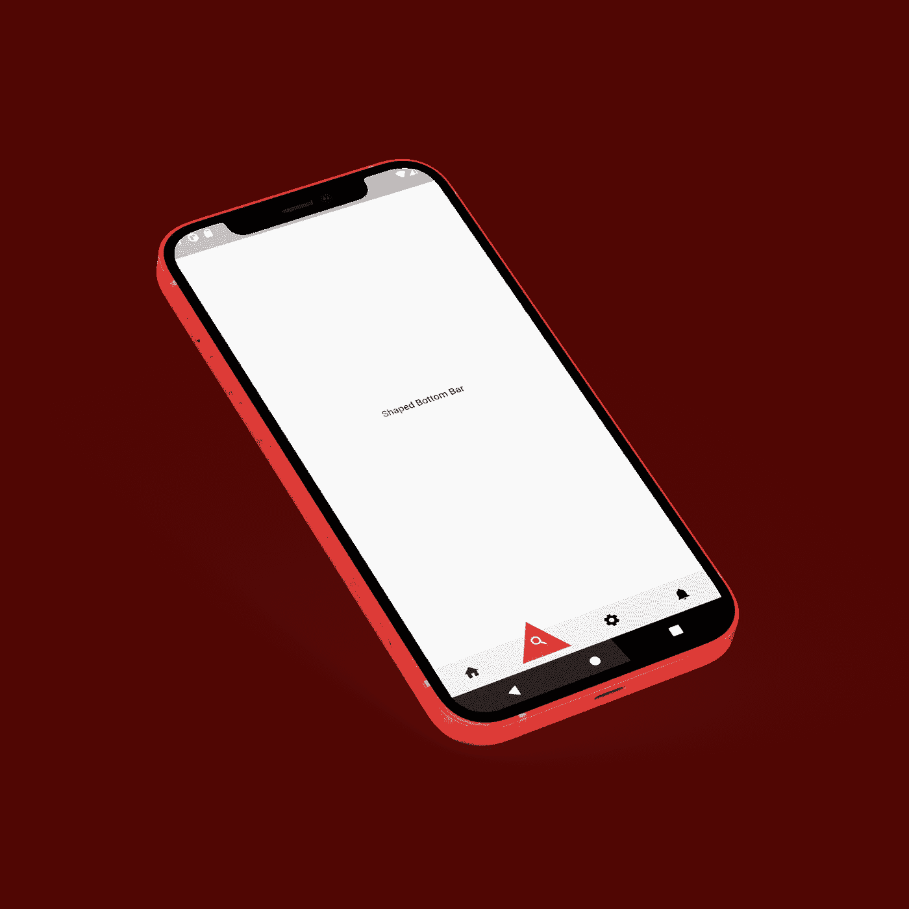
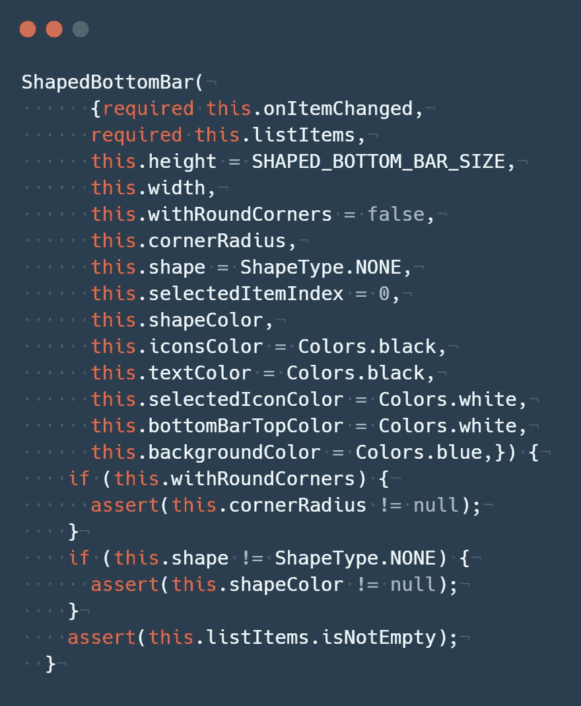
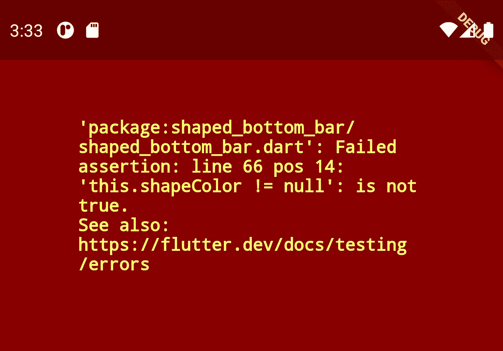
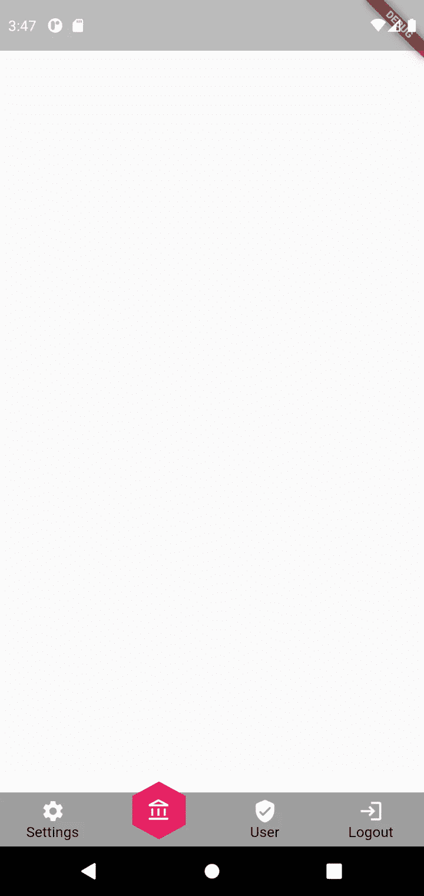
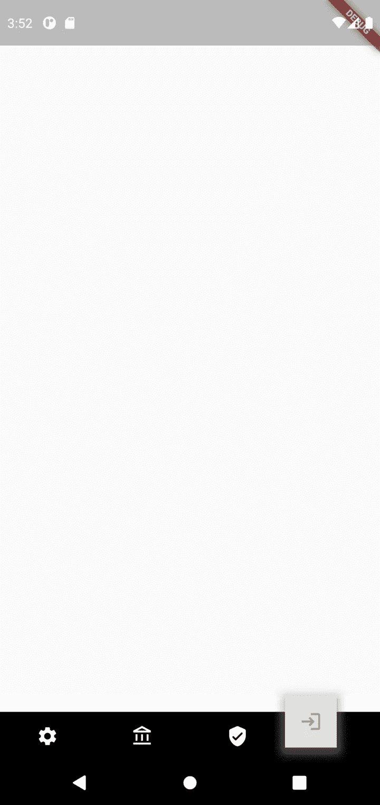
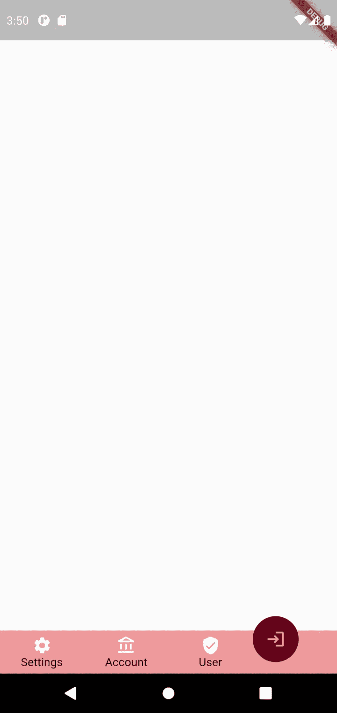
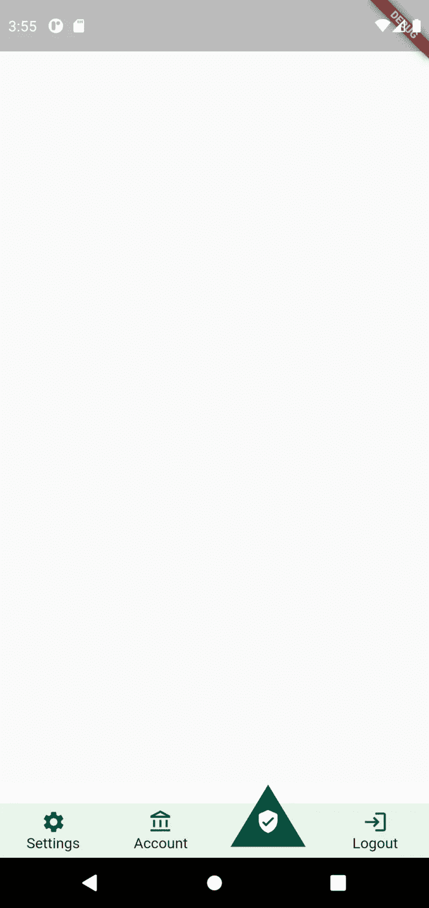
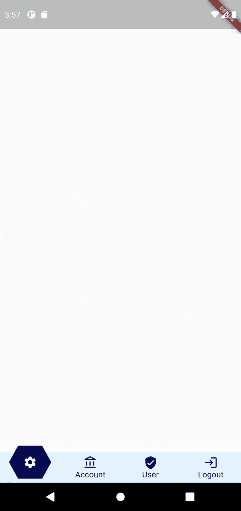

# 颤振中的异形底筋

> 原文：<https://medium.com/geekculture/shaped-bottom-bar-in-flutter-de92759bcbf2?source=collection_archive---------23----------------------->

在本文中，我们将浏览新的 Flutter 包 shaped_bottom_bar，并创建实现该包中已定义的各种形状的示例。

# 介绍

在 Flutter 中，创建一个底部导航条很简单，但是要实现一个更高级的导航条，你需要更多的技巧和时间。

这是这个包背后的主要思想，shaped_bottom_bar 试图通过给我们提供各种形状来简化一个高级设计的导航底部条的实现，它的行为很简单:所选择的项目将获得作为参数给出的形状类型。

在这篇文章中，我会给你更多关于这个包和它的部件的细节，以及我们如何实现简单和设计精美的底部栏。

# **Widgets**

## — ShapedBottomBar

正如这里所解释的这个小部件是创建底部形状栏的主类

只有两个必需的参数:

*   **onItemChanged** 是在项目间导航时将被调用的函数
*   **列表项**底部栏中用作子对象的“ShapedItemObject”类型的对象列表。

其他重要属性:

*   **shape** :默认设置为 ShapeType。无因此，默认情况下，已成形的底部条渲染时没有任何自定义形状，使用此属性来设置您的形状可能的属性:

*   当形状不是 ShapeType 时，需要 shapeColor。无，否则会出现以下错误:

因此，设置漂亮的底部形状的最低属性是:

*   改变了
*   列表项
*   形状
*   形状颜色

您可以使用其他参数来定制更多 like:` iconsColor `、` textColor `、` selectedIconColor `和` backgroundColor`。

**— ShapedItemObject**

使用此小部件创建将出现在 ShapedBottomBar 小部件中的列表项。

只有一个必需的参数:

*   **图标数据**:物品图标。

你也可以给这个项目添加一个标题，默认情况下，这个项目没有文本。

# 装置

像所有的 flutter 包一样，在你的项目中添加底部的形状条，在 pubsepec.yaml 文件中的“dependencies”下添加这一行:

| `shaped_bottom_bar: ^0.0.1`

# 例子

在这一节中，我将向您展示使用不同参数的 shaped_bottom_bar 的多个示例

**例#1**

上面的代码将给出下面的结果:

**例 2**

**例 3**

**例 4**

**例 5**

这些只是我们可以使用 shaped_bottom_bar 包构建的几个例子，当然你可以自定义更多的例子。

# 结论

最后让我提醒你，这是 shaped_bottom_bar 小部件的第一个版本，我希望你在未来的项目中使用它。

正如我们所看到的，它的实现和定制都很简单。

当然，这是一个开源项目，你可以在这个资源库[https://github.com/koukibadr/Shaped-Bottom-Bar](https://github.com/koukibadr/Shaped-Bottom-Bar)上为它做贡献

很高兴收到您的反馈和拉动请求。

编码快乐！