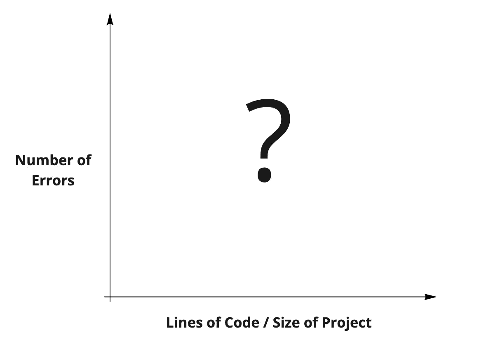
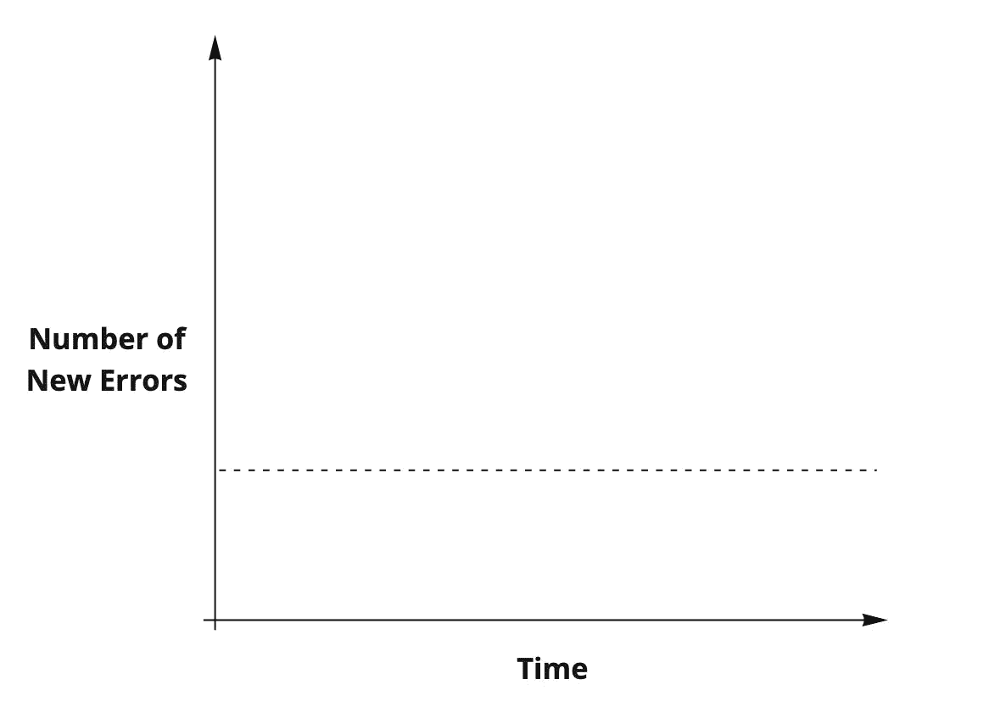
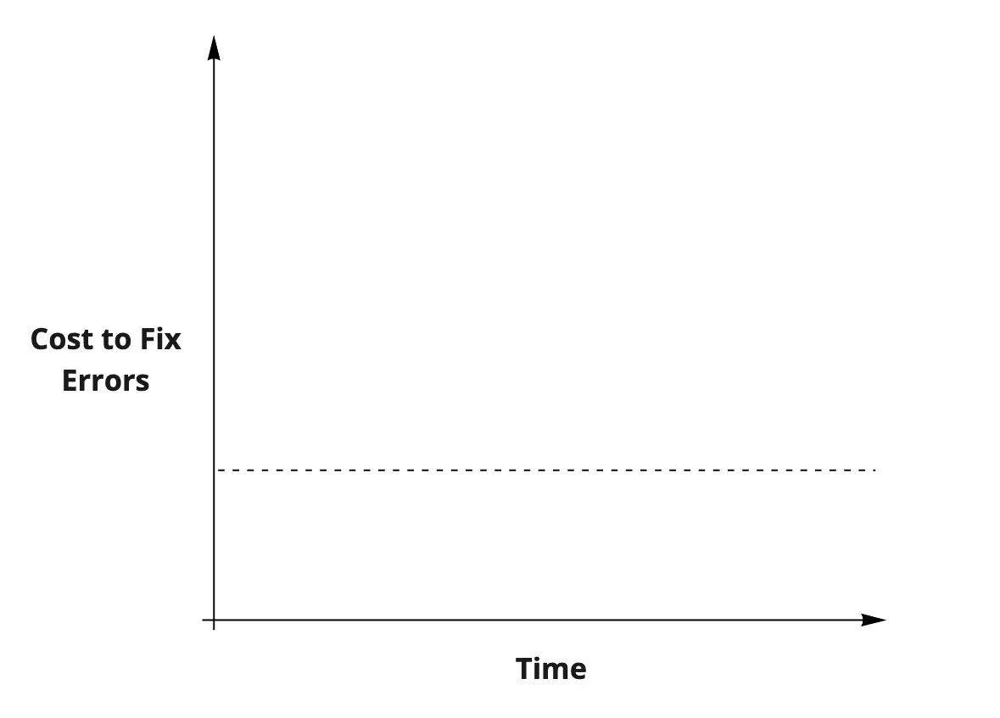
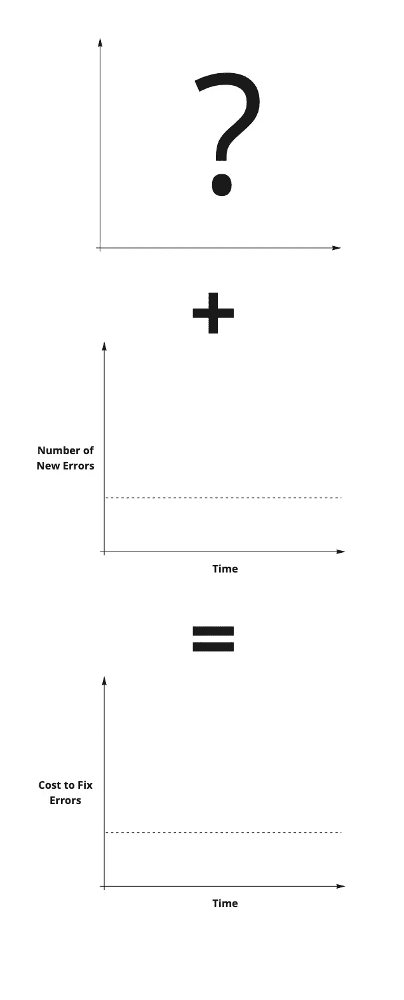
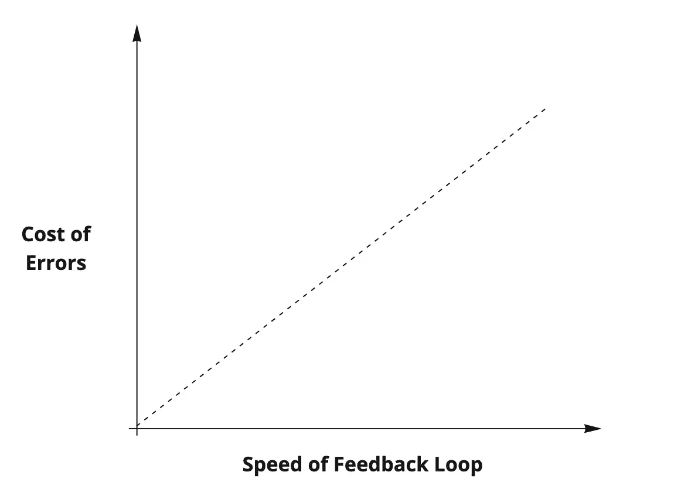
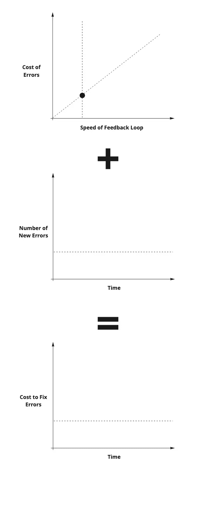
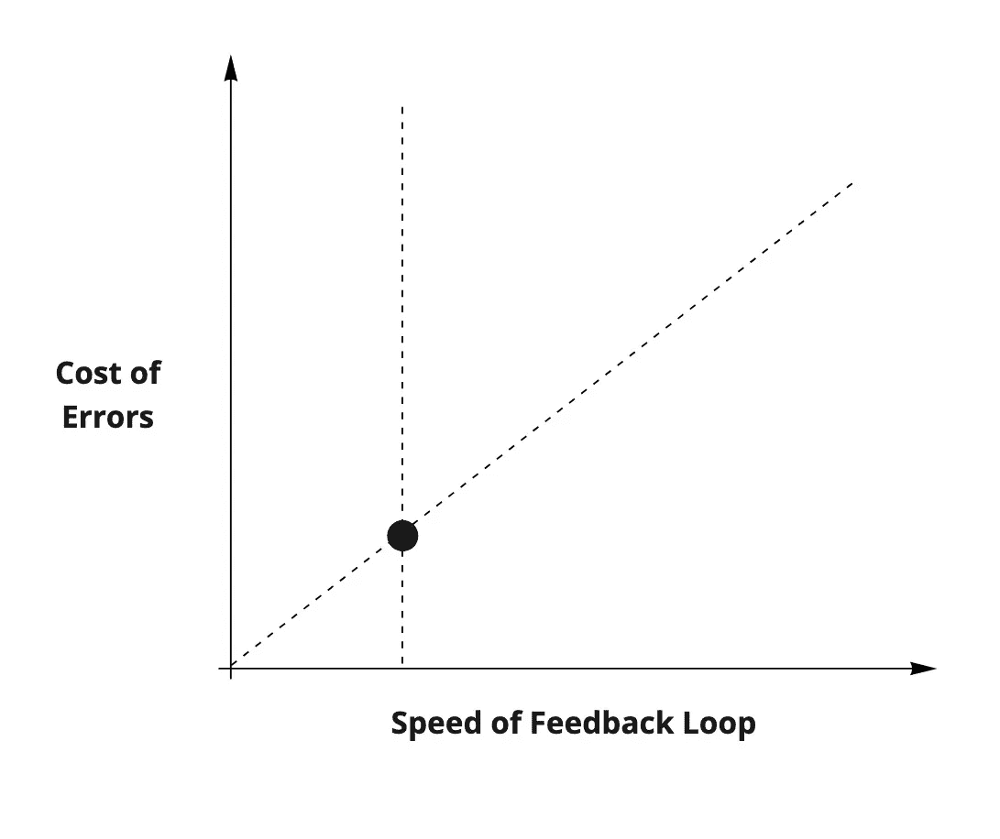

# 用敏捷的思维塑造年轻的头脑

> 原文：<https://medium.com/geekculture/shaping-young-minds-with-agile-thinking-33b63ccd3c12?source=collection_archive---------15----------------------->

From [Wikimedia](https://commons.wikimedia.org/wiki/File:Social_Network_Analysis_Visualization.png).

在周一和周三晚上，你可以发现我在圣路易斯大学的 CS 硕士项目中讲授“软件工程”课程。是的，这是一门真正的课程，而且它被认可为一个真正的学位。我肯定你在质疑 SLU 的判断，但你也可能低估了我推销自己的能力。见鬼，我曾经卖过自己 Windows 8， [hook，line，stinker](https://www.merriam-webster.com/dictionary/hook%2C%20line%20and%20sinker) 。

在这门课上，我的重点不是算法或数据或逐行的*代码*，而是工程的*过程*，我认为这是更具挑战性的研究。我采访过许多来自“顶级项目”的硕士项目的程序员:斯坦福大学、卡内基-梅隆大学、伊利诺伊大学——甚至是我久负盛名的母校，在那里我吮吸了四年充满学术挑战的乳汁[杜鲁门州立大学](https://www.truman.edu/)。

我发现大多数时候，这些项目的毕业生完全没有准备好实际开发软件，这更令人沮丧，因为这些人比我聪明得多。不要误解我的意思:他们知道的东西(算法、结构、形式方法)可能非常有价值——只是他们不能把那些东西写在纸上。这些应届毕业生相当于 1992 年福特金牛座的 8 升 645 马力 V10 蝰蛇发动机。车轮在旋转，轮胎在冒烟，声音像打雷一样大，但却一动不动地坐在起跑线上:*他们就是不能把动力降下来*。

嗯，凭借我两周——不，现在是三周——的学术教学经验，我将单枪匹马地改变这一切。我要教他们转向过度和转向不足，电子速度控制和顶点。奇怪的是，第一项研究是敏捷的衍生。

非常有趣。

From [Wikimedia](https://commons.wikimedia.org/wiki/File:United_Autosport%27s_Ligier_JS_P217_Gibson_and_Dempsey_Proton_Racing%27s_Porsche_991_RSR.jpg).

正如我在之前说过的，你在软件中偶然发现的最酷的东西可能是 50 年前由某个乡巴佬发现的:这条规则在这里也适用。

1981 年，Boehm(不，不是垃圾收集员)使用真实世界的数据将“错误成本”映射到“项目阶段”:

From [Software Engineering Economics](https://www.amazon.com/Software-Engineering-Economics-Barry-Boehm/dp/0138221227).

你可能以前见过这个。这条曲线是臭名昭著的(可怜的 Boehm ),因为事实证明，他实际上展示的是福特金牛座效应:Boehm 测量的是软件工程师正在使用的*特定过程*的失败(瀑布),而不是软件工程的一些固有属性。

这段历史题外话很好(我发现它很吸引人)，但是我承认它对今天的学生不一定有帮助，因为他们中没有人以前有过使用瀑布的经验。更重要的是，在 2022 年，一旦他们加入竞争，他们都不太可能遇到它。软件世界已经向前发展了，他们未来的雇主有 99-100%的可能会*要求*使用“敏捷”。不管他们喜欢与否，这些学生将被迫使用这种“敏捷方法”。不幸的是，这意味着他们会对此感到矛盾。他们永远不会感激它为他们做了什么，而且*他们永远不会充分利用它*。我知道这一点，因为这就是发生在我身上的事情，真的很遗憾，我花了好几年才明白为什么方法论真的很重要。

我需要向这些学生证明，这不是一般的问题，而是具体的问题。我需要为他们建立一个心理模型——首先是简单的，其次是正确的。帮助他们与敏捷协同工作，而不是反对它。为了建立这个模型，我们需要更多的图表。

Boehm 模型被错误地描述为第一原理，所以我们需要一个新的第一原理。这个甚至会比第一个*。*

**

*错误如何与代码行数(LoC)成比例？当然，我们知道 0 行代码没有错误——这个数据点很简单。这使我提出以下建议:*

**

*我甚至可能主张指数关系，但不管怎样——让我们都同意它是*增加*。对于任何编写过代码的人来说，这是不言而喻的。此外，让我们相信，随着软件项目的老化，它们通常会增长。我们可以用“新误差”而不是总误差来重新表述，得到如下结果:*

**

*这里是敏捷开发的第一个真理:**唯一不变的是错误**。这是现代世界中构建软件的现实，尽管我承认有一些类型的边缘情况软件(航天飞机或其他物理系统种类)必须达到可以忽略新错误的程度。这些是我们简单的第一心理模型没有处理的边缘情况。*

*现在我要提出一个*目标*。我们*实际上* *想要*的是以下内容，而不是增加成本的 Boehm 模型:*

**

*也就是说，如果我们想要运输和运营一个产品，我们需要一个固定的修复错误的成本(或者减少成本——但是不要自欺欺人了)。否则，软件项目将变得难以维护。我们如何到达这里？让我们用一个简单的可视化模型来重述这个问题:*

**

*这看起来微不足道。如果有某种恒定的方法来解决错误的话，这将是可能的。不幸的是，“错误”本质上是未知的，所以很难确定它们的解决方案。我们都有一个吉拉的票号，因为一个不能被命名的错误而烙在我们的脑海里。一提到那个数字，你就毛骨悚然。它夺走了朋友和同事的生命，也几乎夺走了你自己的生命。你只带着你的生命和对字符编码稍微好一点的理解逃脱了。这类 bug 花费了 tenable 类 100 倍的努力。*

*此外，尽管我们的目标是“固定时间误差修正”，但理想情况下，我们还需要找到一种方法，使该常数尽可能低。*

*敏捷提出了一种思考这个等式的新方法。敏捷提出解决错误的成本与*反馈回路*的速度成正比。*

**

*这是我们的第二个真理:***短的反馈循环降低了错误的成本*** 。*

*现在我们可以看到为什么瀑布有不断增加的成本！由于这个过程，反馈回路变得越来越长，因此，错误的成本急剧上升。让我们把这个代入等式，得到一个完整的心智模型。*

**

*现在我们脑海中有了敏捷最强大的成果之一的完整图像——敏捷在实践中实际能做什么的可视化表达。这给有经验的工程师的实践赋予了意义和动力，而这些从来没有向蚱蜢清楚地解释过。*

*啊，所以这就是为什么我们要做短距离冲刺。*这就是为什么我们如此频繁地交付构建。*这就是为什么 CI/CD 如此重要的原因。这就是为什么快速单元测试是重要的。这就是掌握 git 如此重要的原因。这就是为什么你的 IDE 热键如此重要。这就是为什么触摸打字如此重要的原因。这就是为什么我需要关心我如何坐在这把笨椅子上，显示器的确切位置，以及我触摸鼠标的频率。***

*你看，正确理解的话，*敏捷反馈循环会一直影响到*下面的事情。*

# *最后一个鸡蛋*

*你可能已经注意到了这里的一些东西。这就像漫威电影结尾的复活节彩蛋(但不像《永恒者》结尾的臭鸡蛋——我们能不能把它从记录中删掉？).它隐约暗示了续集。*

**

*这里有一个未提及的*交点*。那东西在那里做什么？它现在需要保持不被提及，因为事实证明，敏捷对于何时*停止*在你的反馈循环中工作没有太多的说明。多快才算够快？我如何在反馈循环中处理反馈？这些都是敏捷没有答案的问题——至少没有直接的答案。对于*那个，*我们需要结合实际操作经验和看 [*另一个*实践哲学](https://homepage.cs.uri.edu/~thenry/resources/unix_art/ch01s06.html) *。当我掌握了教那部分的时候，我会让你知道。**