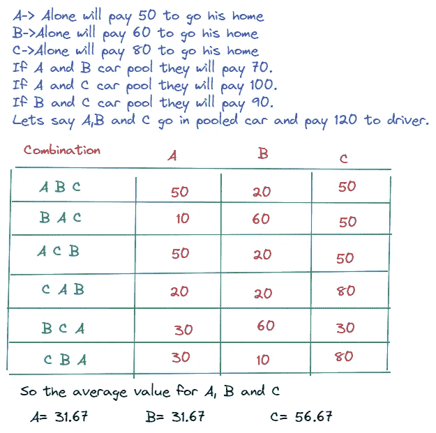
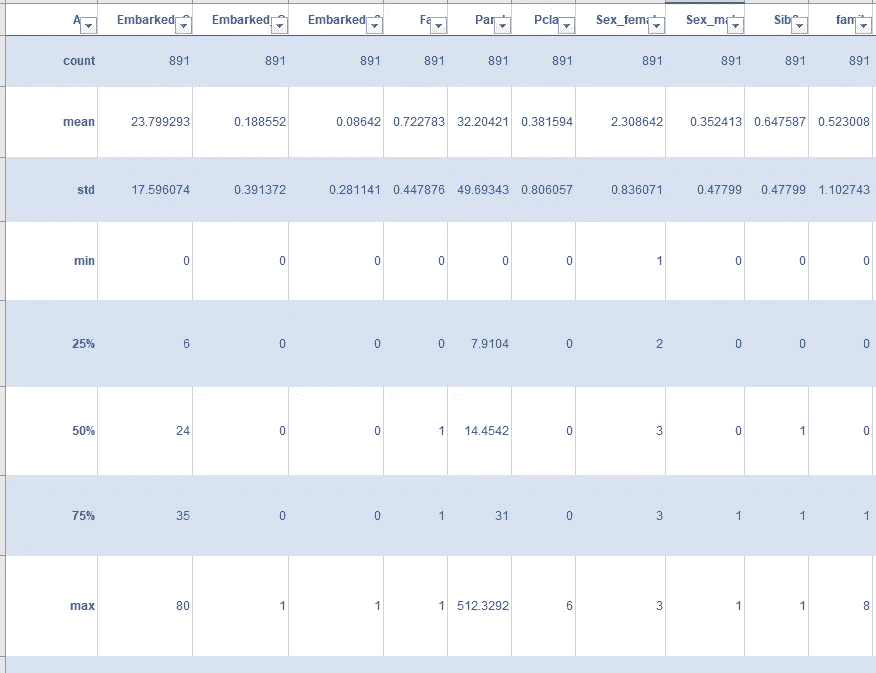
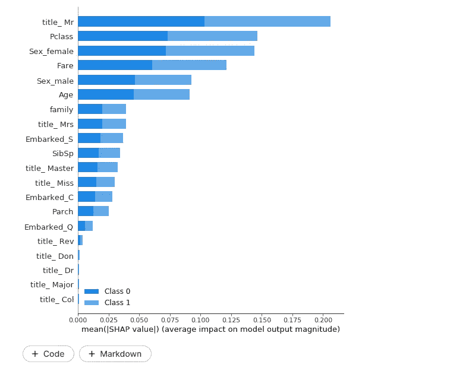
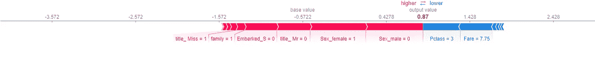

# 沙普利价值:解释人工智能

> 原文：<https://medium.com/geekculture/shapley-value-explaining-ai-190cd836a045?source=collection_archive---------4----------------------->


[https://www.reddit.com/r/IndiaSpeaks/comments/man3x9/this_is_the_scenic_beauty_of_coastal_karnataka/](https://www.reddit.com/r/IndiaSpeaks/comments/man3x9/this_is_the_scenic_beauty_of_coastal_karnataka/)

机器学习正逐渐成为生活的重要部分。从推荐电影到自动驾驶汽车，人工智能正在各行各业发挥作用。

由于 ML 模型正在作出关键决策，逐渐需要解释这些模型作出的决策。这些模型中大多数倾向于黑盒。

> 虽然准确的毁灭有所帮助，但回答“为什么它是这样决定的”同样重要。

# 为什么要解释这个预测

1.  在为网飞的用户预测推荐电影的用例中，如果没有关于为什么模型选择了某个东西的解释，那也没问题。
2.  可以进一步训练/调整这些模型，以便为用户提供更好的推荐。
3.  但是，在某些情况下，如分析客户的贷款资格，理解为什么某些客户被认为没有资格获得贷款是很重要的。这对银行了解拒绝贷款的标准是很重要的。
4.  在某些地区/国家，法律强制要求给出原因。
5.  ML 模型中可能存在某种“非预期偏差”。对预测的解释有助于消除这种偏见

# ML 模型的类型

从可解释性的角度来看，模型可以大致分为几种类型

## 白盒/灰盒型号:

这些模型包括线性回归、逻辑回归、决策树、朴素贝叶斯和 k 近邻等。这些模型被认为至少在理论上更容易解释。

然而在现实生活中，即使解释白盒模型也是困难的，主要是由于大量的输入特征。正则化可以在一定程度上有所帮助，但简化模型有时会失去准确性。这导致了[可解释性和准确性的权衡](https://www.darpa.mil/attachments/XAIProgramUpdate.pdf)。

底像仅仅用白盒或灰盒模型是无法解释的。

## 黑盒模型:

另一方面，深度学习、随机森林、梯度增强非常难以解释或诠释。

除了输入特性之外，它们还有非常多的内部变量。这一切使得人类无法解释决策的“为什么”。

然而，这些模型是非常精确的，并且主要用于现实生活条件中。他们需要使用外部方法/技术来解释决策。

# 模型不可知的可解释性方法


Source:[https://christophm.github.io/interpretable-ml-book/agnostic.html](https://christophm.github.io/interpretable-ml-book/agnostic.html)

有多种技术来解释黑色模型。其中一些列举如下:

1.  部分相关图
2.  局部可解释的模型不可知解释(LIME)
3.  个体条件期望
4.  置换特征重要性
5.  沙普利值

我们将讨论 Shapley 值。

# 沙普利值

请参考下面的维基百科文章，了解 Shapley 值的介绍。

> [**沙普利值**](https://en.wikipedia.org/wiki/Shapley_value) 是合作[博弈论](https://en.wikipedia.org/wiki/Game_theory)中的一个[解概念](https://en.wikipedia.org/wiki/Solution_concept)。它是为了纪念劳埃德·沙普利(Lloyd Shapley)而命名的，他在 1951 年提出了这一理论，并因此在 2012 年获得了诺贝尔经济学奖。对于每一个[合作游戏](https://en.wikipedia.org/wiki/Cooperative_game_theory)，它分配一个由所有玩家的联盟产生的总盈余的唯一分配(在玩家之间)。Shapley 值的特征在于一系列理想的性质。

简而言之，它试图在不同的参与者合作时找到收益(盈余)的公平分配。玩家会遵循合作行为的外在强制。

# 沙普利值:简单的例子

假设甲、乙和丙想拼车。让我们做如下假设

一个->光是去他家就要付 50

B->光是回家就要付 60

仅 C->就要付 80 英镑去他家

如果 A 和 B 共乘一辆车，他们要付 70 英镑。

如果 A 和 C 拼车，他们要付 100 英镑。

如果 B 和 C 拼车，他们要付 90 英镑。

假设 A、B 和 C 共乘一辆车，付给司机 120 英镑。

## 什么是公平分配？

让我们先尝试一下:

*假设 A 先下车，他大概能付 50(因为他本来是一个人付的)。b 可以支付 60 英镑(因为他会独自支付)，C 可以支付剩余的 10 英镑。*

但这可能并不公平。如果我们改变下降的顺序，谁支付多少变化。可能有各种方法来划分总和。

***让我们用沙普利值来理解什么是公平分配。***

在这方面，我们尝试所有的排列

因此，以下是所有可能的家庭投递顺序

1.  甲、乙、丙
2.  乙，甲，丙
3.  甲、丙、乙
4.  丙、甲、乙
5.  b，C，A
6.  丙、乙、甲

让我们计算一下每个人要付多少钱。

让我们以第一个例子 A，B，c 为例，A 和 B 一起支付 70 英镑。作为第一个落点，他将支付 50 英镑(因为他在独自前往时支付)。b 将支付剩余的 70–50 = 20。c 将支付剩余的 120–70 = 50

所以支出将是 50(A)+20(B)+50(C)。

在第二种情况 B 中，A 和 C 是删除顺序。甲和乙合起来要付 70 英镑。当 B 第一次下降时，他将支付 60 英镑(因为他在独自走时支付)。a 将支付剩余的 70–60 = 10。c 将支付剩余的 120–70 = 50

将类似的逻辑应用于其他组合，我们得到以下分布。



# 解释 ML 模型的 Shapley 值

ML 模型可以用 Shapley 值来解释模型。要在高层次上理解这一点，只需将播放器替换为特性。

通过观察各种特征和预测的组合，我们可以找到每个特征的基本贡献。特征的实际值可以解释预测高于或低于基本预测的原因。

让我们用[泰坦尼克号数据集](https://www.kaggle.com/c/titanic)来理解这一点。

在泰坦尼克号的数据集中，我们查看乘客信息，如船票等级、性别、年龄、票价、出发港口等。预测乘客的生存机会。

如果我们应用随机森林或 XGBoost，预测是准确的，但它变得难以解释。

Python 有 SHAP 库来解释这些模型。这不需要开发人员编写任何额外的代码。

[](https://shap.readthedocs.io/en/latest/index.html) [## 欢迎来到 SHAP 文档- SHAP 最新文档

### SHAP 是一种博弈论的方法来解释任何机器学习模型的输出…

shap.readthedocs.io](https://shap.readthedocs.io/en/latest/index.html) 

# 让我们看看代码

1.从 csv 文件准备数据。

```
def pre_process_data(df1):

    df1['title'] = df1.apply(lambda row: re.split('[,.]+', row['Name'])[1], axis=1)

    df1['family'] = df1['SibSp'] + df1['Parch'] + 1

    df1 = pd.get_dummies(df, columns=['Sex', 'Embarked', 'title'])

    # Drop columns unwanted columns
    # I'm dropping "Cabin" because it has too much missing data.
    df1 = df1.drop(['PassengerId', 'Name', 'Ticket', 'Cabin'], axis=1)return df1# value from labels

labels = train['Survived']
train.drop(['Survived'], axis=1, inplace=True)
# Get test ids
test_ids = test['PassengerId'].valuestrain = pre_process_data(train)
test = pre_process_data(test) train, test = train.align(test, join='outer', axis=1) train.replace(to_replace=np.nan, value=0, inplace=True)
test.replace(to_replace=np.nan, value=0, inplace=True)
```

2.查看加载的数据，并将其分为测试和训练

```
train.describe()
X_train, X_val, Y_train, Y_val = train_test_split(train, labels, test_size=0.3, random_state=1)
```



3.使用随机森林模型

```
clf=RandomForestClassifier(n_estimators=100)
clf.fit(X_train, Y_train)y_pred=clf.predict(X_val)
print("Accuracy:",metrics.accuracy_score(Y_val, y_pred))Accuracy: 0.7653631284916201
```

4.用 SHAP 图书馆解释特征的模型和重要性

```
explainer = shap.TreeExplainer(clf)
shap_values = shap.TreeExplainer(clf).shap_values(X_train)
shap.summary_plot(shap_values, X_train, plot_type="bar")
```

输出



它也可以用来解释一个单独的预测。下图显示了各种输入特征如何导致某些预测。



Shap 库还提供高级功能，如功能之间的部分依赖图。

# 进一步阅读

[](https://christophm.github.io/interpretable-ml-book/shapley.html) [## 5.9 Shapley 值|可解释的机器学习

### 预测可以通过假设实例的每个特征值是游戏中的“玩家”来解释，其中…

christophm.github.io](https://christophm.github.io/interpretable-ml-book/shapley.html) [](https://www.analyticsvidhya.com/blog/2019/11/shapley-value-machine-learning-interpretability-game-theory/) [## 机器学习可解释性的独特方法:博弈论和 Shapley 值！

### 概述了解如何使用 Shapley 值在博弈论的机器学习可解释性这是一个独特的和…

www.analyticsvidhya.com](https://www.analyticsvidhya.com/blog/2019/11/shapley-value-machine-learning-interpretability-game-theory/) 

**想进一步了解深度学习，请关注我的**[](https://smverma.medium.com/)****。****