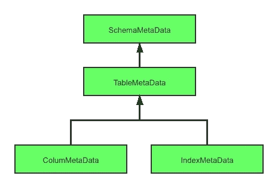

# ShardingSphere 的元数据加载过程

> 原文：<https://medium.com/geekculture/shardingspheres-metadata-loading-process-25855f2f372d?source=collection_archive---------53----------------------->

**1)**概述

元数据是构成数据的数据。在数据库术语中，任何描述数据库的数据都是元数据。列名、数据库名、用户名、表名等。存储数据库对象信息的数据定制库表是元数据。数据分片、加密和解密等核心功能都基于数据库元数据。

这表明元数据是 ShardingSphere 系统的核心，也是每个数据存储相关中间件或组件的核心数据。有了元数据的注入，就相当于整个系统有了一个神经中枢，可以结合元数据对库、表、列进行个性化操作，比如数据分片、数据加密、SQL 重写等。

对于 ShardingSphere 元数据加载过程，首先需要明确 ShardingSphere 中元数据的类型和层次结构。ShardingSphere 中的元数据主要围绕`ShardingSphereMetaData`展开，其核心是`ShardingSphereSchema`，是数据库的元数据，也是数据源元数据的顶层对象。ShardingSphere 中数据库元数据的结构如下图所示，对于每一层，上层数据都来自于下层数据的组装，所以我们采用以下自下而上的层次结构来逐一分析。



ShardingSphere Database Metadata Structure Diagram

**2)** **列元数据和索引元数据**

`ColumMetaData`和`IndexMetaData`是构成`TableMetaData`的基本元素。下面，我们将分别分析这两种元数据类型的结构和加载过程。`ColumMetaData`有以下主要结构:

```
public final class ColumnMetaData {
    // 
    private final String name;
    // 
    private final int dataType;
    // 
    private final boolean primaryKey;
    // 
    private final boolean generated;
    //
    private final boolean caseSensitive;
}
```

加载过程主要封装在`org.apache.shardingsphere.infra.metadata.schema.builder.loader.ColumnMetaDataLoader#load`方法中，其主要过程是通过数据库链接获取与表名匹配的元数据，加载一个表名下所有列的元数据。核心代码如下:

```
/**
 * Load column meta data list.
 *
 * @param connection connection
 * @param tableNamePattern table name pattern
 * @param databaseType database type
 * @return column meta data list
 * @throws SQLException SQL exception
 */
public static Collection<ColumnMetaData> load(final Connection connection, final String tableNamePattern, final DatabaseType databaseType) throws SQLException {
    Collection<ColumnMetaData> result = new LinkedList<>();
    Collection<String> primaryKeys = loadPrimaryKeys(connection, tableNamePattern);
    List<String> columnNames = new ArrayList<>();
    List<Integer> columnTypes = new ArrayList<>();
    List<String> columnTypeNames = new ArrayList<>();
    List<Boolean> isPrimaryKeys = new ArrayList<>();
    List<Boolean> isCaseSensitives = new ArrayList<>();
    try (ResultSet resultSet = connection.getMetaData().getColumns(connection.getCatalog(), connection.getSchema(), tableNamePattern, "%")) {
        while (resultSet.next()) {
            String tableName = resultSet.getString(TABLE_NAME);
            if (Objects.equals(tableNamePattern, tableName)) {
                String columnName = resultSet.getString(COLUMN_NAME);
                columnTypes.add(resultSet.getInt(DATA_TYPE));
                columnTypeNames.add(resultSet.getString(TYPE_NAME));
                isPrimaryKeys.add(primaryKeys.contains(columnName));
                columnNames.add(columnName);
            }
        }
    }
    try (Statement statement = connection.createStatement(); ResultSet resultSet = statement.executeQuery(generateEmptyResultSQL(tableNamePattern, databaseType))) {
        for (int i = 0; i < columnNames.size(); i++) {
            isCaseSensitives.add(resultSet.getMetaData().isCaseSensitive(resultSet.findColumn(columnNames.get(i))));
            result.add(new ColumnMetaData(columnNames.get(i), columnTypes.get(i), isPrimaryKeys.get(i),
                    resultSet.getMetaData().isAutoIncrement(i + 1), isCaseSensitives.get(i)));
        }
    }
    return result;
}
```

`IndexMetaData`是表中索引的名称，所以没有复杂的结构属性，只是一个名称。我们不再赘述细节，而是把重点放在装载过程上。其加载过程与立柱相似，主要过程在`org.apache.shardingsphere.infra.metadata.schema.builder.loader.IndexMetaDataLoader#load`法中。基本流程也是通过数据库链接获取`IndexInfo`组织中核心`IndexMetaData`的相关数据库和表元数据，实现代码如下:

```
public static Collection<IndexMetaData> load(final Connection connection, final String table) throws SQLException {
    Collection<IndexMetaData> result = new HashSet<>();
    try (ResultSet resultSet = connection.getMetaData().getIndexInfo(connection.getCatalog(), connection.getSchema(), table, false, false)) {
        while (resultSet.next()) {
            String indexName = resultSet.getString(INDEX_NAME);
            if (null != indexName) {
                result.add(new IndexMetaData(indexName));
            }
        }
    } catch (final SQLException ex) {
        if (ORACLE_VIEW_NOT_APPROPRIATE_VENDOR_CODE != ex.getErrorCode()) {
            throw ex;
        }
    }
    return result;
}
```

**3)** **表格元数据**

该类是`ShardingSphereMetaData`的基本元素，其结构如下:

```
public final class TableMetaData {
    // 表名
    private final String name;
    // 列元数据
    private final Map<String, ColumnMetaData> columns;
    // 索引元数据
    private final Map<String, IndexMetaData> indexes;
    //省略一些方法
}
```

从上面的结构我们可以看出`TableMetaData`是由`ColumnMetaData`和`IndexMetaData`组装而成的，所以`TableMetaData`的加载过程可以理解为一个中间层，具体实现还是依靠`ColumnMetaDataLoader`和`IndexMetaDataLoader`获取表名和相关链接进行数据加载。所以相对简单的`TableMetaData`加载过程主要在`org.apache.shardingsphere.infra.metadata.schema.builder.loader.TableMetaDataLoader#load`方法中，其核心加载过程如下:

```
public static Optional<TableMetaData> load(final DataSource dataSource, final String tableNamePattern, final DatabaseType databaseType) throws SQLException {
    // 获取链接
    try (MetaDataLoaderConnectionAdapter connectionAdapter = new MetaDataLoaderConnectionAdapter(databaseType, dataSource.getConnection())) {
        // 根据不同的数据库类型，格式化表名的模糊匹配字段
        String formattedTableNamePattern = databaseType.formatTableNamePattern(tableNamePattern);
        // 加载 ColumnMetaData 和 IndexMetaData 组装 TableMetaData
        return isTableExist(connectionAdapter, formattedTableNamePattern)
                ? Optional.of(new TableMetaData(tableNamePattern, ColumnMetaDataLoader.load(
                        connectionAdapter, formattedTableNamePattern, databaseType), IndexMetaDataLoader.load(connectionAdapter, formattedTableNamePattern)))
                : Optional.empty();
    }
}
```

**4)**schema metadata

根据对下面两层的分析，很明显这一层是元数据暴露的最外层，最外层的结构是一个`ShardingSphereSchema`，主要结构如下:

```
/**
 * ShardingSphere schema.
 */
@Getter
public final class ShardingSphereSchema {

    private final Map<String, TableMetaData> tables;

    @SuppressWarnings("CollectionWithoutInitialCapacity")
    public ShardingSphereSchema() {
        tables = new ConcurrentHashMap<>();
    }

    public ShardingSphereSchema(final Map<String, TableMetaData> tables) {
        this.tables = new ConcurrentHashMap<>(tables.size(), 1);
        tables.forEach((key, value) -> this.tables.put(key.toLowerCase(), value));
    }
```

根据模式概念，它包含几个表。`ShardingSphereSchema`的属性是 map 结构，键是`tableName`，值是`tableName`对应的表的元数据。

初始化主要通过构造函数来完成。同样，重点是表元数据加载，让我们从条目开始跟进。

整个元数据加载的核心入口点在`org.apache.shardingsphere.infra.context.metadata.MetaDataContextsBuilder#build`中。在构建中，我们通过配置规则组装和加载相应的元数据。核心代码如下:

```
/**
 * Build meta data contexts.
 * 
 * @exception SQLException SQL exception
 * @return meta data contexts
 */
public StandardMetaDataContexts build() throws SQLException {
    Map<String, ShardingSphereMetaData> metaDataMap = new HashMap<>(schemaRuleConfigs.size(), 1);
    Map<String, ShardingSphereMetaData> actualMetaDataMap = new HashMap<>(schemaRuleConfigs.size(), 1);
    for (String each : schemaRuleConfigs.keySet()) {
        Map<String, DataSource> dataSourceMap = dataSources.get(each);
        Collection<RuleConfiguration> ruleConfigs = schemaRuleConfigs.get(each);
        DatabaseType databaseType = DatabaseTypeRecognizer.getDatabaseType(dataSourceMap.values());
        // 获取配置的规则
        Collection<ShardingSphereRule> rules = ShardingSphereRulesBuilder.buildSchemaRules(each, ruleConfigs, databaseType, dataSourceMap);
        // 加载 actualTableMetaData 和 logicTableMetaData
        Map<TableMetaData, TableMetaData> tableMetaDatas = SchemaBuilder.build(new SchemaBuilderMaterials(databaseType, dataSourceMap, rules, props));
        // 组装规则元数据
        ShardingSphereRuleMetaData ruleMetaData = new ShardingSphereRuleMetaData(ruleConfigs, rules);
        // 组装数据源元数据
        ShardingSphereResource resource = buildResource(databaseType, dataSourceMap);
        // 组装数据库元数据
        ShardingSphereSchema actualSchema = new ShardingSphereSchema(tableMetaDatas.keySet().stream().filter(Objects::nonNull).collect(Collectors.toMap(TableMetaData::getName, v -> v)));
        actualMetaDataMap.put(each, new ShardingSphereMetaData(each, resource, ruleMetaData, actualSchema));
        metaDataMap.put(each, new ShardingSphereMetaData(each, resource, ruleMetaData, buildSchema(tableMetaDatas)));
    }
    // 
    OptimizeContextFactory optimizeContextFactory = new OptimizeContextFactory(actualMetaDataMap);
    return new StandardMetaDataContexts(metaDataMap, buildGlobalSchemaMetaData(metaDataMap), executorEngine, props, optimizeContextFactory);
}
```

上面的代码说明了在 build 方法中，数据库类型、数据库连接池等基本数据库数据。根据配置的 schemarule 加载，通过它完成`ShardingSphereResource`的组装；`ShardingSphereRuleMetaData`的集合，如配置规则、加密规则、认证规则等。被组装；在`ShardingSphereSchema`中加载必要的数据库元数据。追踪找到加载表元数据的方法，即`org.apache.shardingsphere.infra.metadata.schema.builder.SchemaBuilder#build`，其中分别加载了`actualTableMetaData` 和`logicTableMetaData`。

那么什么是 actualTable，什么是`logicTable`？简单的说对于`t_order_1`，`t_order_2`被认为是`t_order`的一个节点，所以在分析的概念中，`t_order`是 `logicTable`，而`t_order_1`和`t_order_2`实际上是`ble`。清楚地定义了这两个概念之后，我们接着一起看一下构建方法，主要分为以下两个步骤。

**I)**actualtable 元数据加载

`ActualTableMetaData`是系统分片的基本表。在 5.0 beta 版本中，我们采用数据库方言的方法使用 SQL 查询加载元数据，所以基本流程是先通过 SQL 查询加载数据库元数据。如果没有找到数据库方言加载器，则使用 JDBC 驱动程序连接来获取它，然后结合 ShardingSphereRule 中配置的表名加载配置表的元数据。核心代码如下所示。

```
private static Map<String, TableMetaData> buildActualTableMetaDataMap(final SchemaBuilderMaterials materials) throws SQLException {
    Map<String, TableMetaData> result = new HashMap<>(materials.getRules().size(), 1);
    // 数据库方言 SQL 加载元数据
    appendRemainTables(materials, result);
    for (ShardingSphereRule rule : materials.getRules()) {
        if (rule instanceof TableContainedRule) {
            for (String table : ((TableContainedRule) rule).getTables()) {
                if (!result.containsKey(table)) {
                    TableMetaDataBuilder.load(table, materials).map(optional -> result.put(table, optional));
                }
            }
        }
    }
    return result;
}
```

**ii)** **逻辑元数据加载**

从上面的概念我们可以看出，`logicTable`是由一个`actualTable`按照不同的规则组装而成的一个实际的逻辑节点，可以是分片节点，也可以是密码节点，还可以是别的什么。因此，`logicTableMetaData`是在`actualTableMetaData`的基础上，结合具体的配置规则，如库、表规则等关联节点。

具体流程来说，首先获取配置规则的表名，然后判断`actualTableMetaData`是否已经加载，结合配置规则和`TableMetaDataBuilder#decorate`方法生成相关逻辑节点的元数据。核心代码流程如下所示:

```
private static Map<String, TableMetaData> buildLogicTableMetaDataMap(final SchemaBuilderMaterials materials, final Map<String, TableMetaData> tables) throws SQLException {
    Map<String, TableMetaData> result = new HashMap<>(materials.getRules().size(), 1);
    for (ShardingSphereRule rule : materials.getRules()) {
        if (rule instanceof TableContainedRule) {
            for (String table : ((TableContainedRule) rule).getTables()) {
                if (tables.containsKey(table)) {
                    TableMetaData metaData = TableMetaDataBuilder.decorate(table, tables.get(table), materials.getRules());
                    result.put(table, metaData);
                }
            }
        }
    }
    return result;
}
```

在这一点上，核心元数据被加载并封装到一个映射中以供返回，供每个需求场景使用。

**元数据加载优化分析**

虽然元数据是我们系统的核心，但是系统启动时的数据加载不可避免地会增加系统负载，降低系统启动效率。因此，我们需要优化加载过程。目前，我们正在探索以下两种途径:

**A.** **用 SQL 查询替换本地 JDBC 驱动程序连接**

在 5.0 测试版之前，使用的方法是通过本地 JDBC 驱动程序加载。在 5.0 测试版中，我们逐渐采用多线程方法，通过 SQL 查询使用数据库方言加载元数据。加载系统数据的速度进一步提高。详细的方言加载器可以在`org.apache.shardingsphere.infra.metadata.schema.builder.spi.DialectTableMetaDataLoader`的相关实现中找到。

**b .**减少元数据加载次数

对于系统通用资源的加载，我们遵循“一次加载多次使用”的概念。当然这个过程中要考虑空间和时间。因此，我们不断优化以减少元数据的重复加载，从而提高整体系统效率。

**关于作者**


小米的软件工程师唐国成主要负责 MIUI 浏览器服务器端的开发。他是一名技术和开源爱好者，热爱探索，热衷于研究和学习开源中间件解决方案。他是 ShardingSphere 社区的一名自豪的成员，并在社区的支持下努力提高自己的技能，为 ShardingSphere 社区的发展做出贡献。

# **ShardingSphere 社区:**

sharding sphere Github:[https://github.com/apache/shardingsphere](https://github.com/apache/shardingsphere)

推特:[https://twitter.com/ShardingSphere](https://twitter.com/ShardingSphere)

https://bit.ly/3qB2GGc