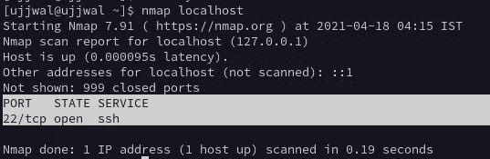

# 在两台电脑之间共享文件😍

> 原文：<https://medium.com/geekculture/share-files-from-between-two-pcs-778a1e5eb583?source=collection_archive---------23----------------------->

## 在网络上共享文件。

File Sharing

在这篇文章中，我写了如何在两台电脑上共享文件。

## 方法 1:使用 Python👐无线的😉

第一步:[下载](https://www.python.org/downloads/)并安装 Python3

Python Downloading Page

对于 Linux 写

> sudo 为 Ubuntu 安装 python3 #
> 
> sudo pacman-Syu python 3 # For Arch Linux
> 
> pkg 在 android 上安装 python # For termux

【Linux 大部分是边安装 python 边安装。]

## 步骤 2:找到你的机器的 Ip 地址。

对于 Windows 类型

> 用于查看本机的 IP 信息

对于 Linux 类型

> ifconfig

在 wlan0 中，你会在 inet 后找到你的 IP。

## 步骤 3:启动文件共享服务器。

在终端上写入…

> python3 -m http.server

你会得到 0.0.0.0: <port_number>。</port_number>

## 步骤 4:在浏览器上查看文件。

打开其他电脑或手机的浏览器。在您的浏览器上书写…

<ip_of_your_laptop>:</ip_of_your_laptop>

[注意:两台设备应连接在同一个无线网络中]

## 方法 2:使用 SSH。

在你的机器上安装 ssh，在终端上写 Linux(Ubuntu)……

> sudo 安装 OpenSSH-客户端 OpenSSH-服务器 nmap

然后通过键入以下命令启动 ssh

> sudo system CTL start sshd # For Ubuntu，Arch

或者

> /etc/init . d/ssh restart # For Ubuntu

**第二步:找到 ssh 运行的端口..**

在终端上写入…

> nmap 本地主机

**Find port in which ssh run**

## 第 3 步:从其他笔记本电脑打开文件管理器，并转到其他位置(不确定 Windows)。

在连接到服务器输入中，编写 sftp:// <ip_of the="" computer="" from="" which="" you="" are="" sharing="">。</ip_of>

给出用户名和密码，连接完成😃。

感谢你的阅读，在下一篇文章中，我会写如何在手机和电脑上传输文件。在我发布“关注我”时获得通知。感谢阅读，如果有任何问题，请在回复部分告诉我。

如果你喜欢这篇文章，请鼓掌🐧。

## 类似帖子:

 [## Linux 专家，提示和技巧| Ujjwal Kar

### 嗨，我是 Ujjwal Kar，在各种基于 linux 内核的操作系统上工作了很长时间，比如 Ubuntu，Ubuntu Linux Mint…

ujjwalkar.netlify.app](https://ujjwalkar.netlify.app/post/expert-on-linux-tips-and-tricks/)