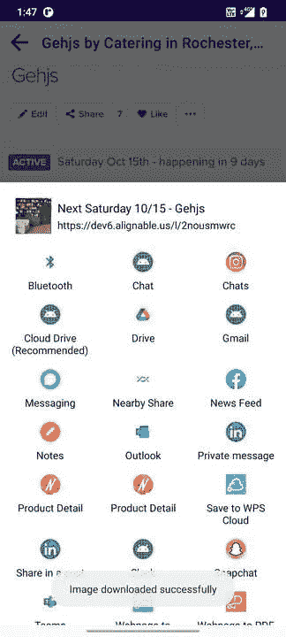
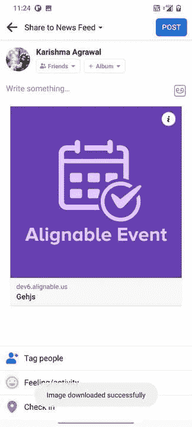
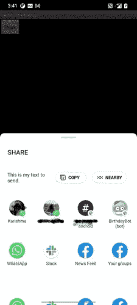
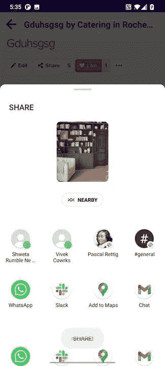
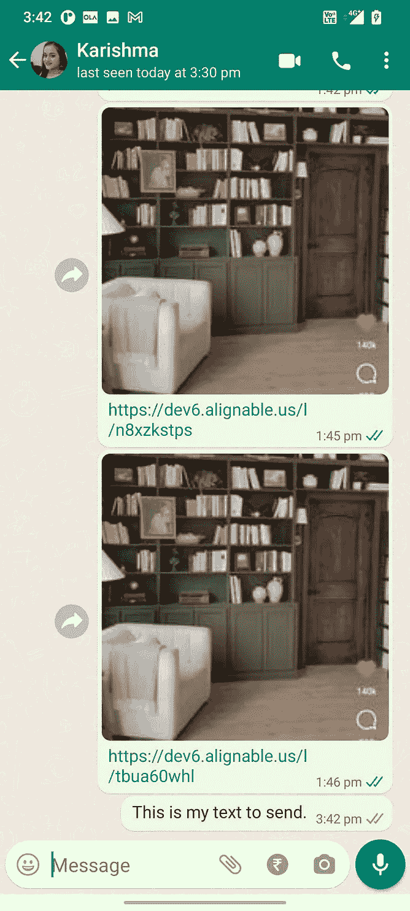

# 将帖子(文本/图片)分享到 android 上的其他应用程序

> 原文：<https://medium.com/geekculture/share-post-text-image-to-other-apps-on-android-e83d2aa5116c?source=collection_archive---------1----------------------->

你们一定都在不同的应用之间分享了一些内容。内容可以是任何东西，从 Instagram 卷轴到 WhatsApp 文本。

今天我们将通过一个例子来学习如何实现它。



Figure 1: ShareSheet, Figure 2: After sharing text and images on Facebook

在这篇文章中，我们将了解基本的内容共享，如文本或图像。

# 使用 Android 共享表

对于所有类型的共享，我们创建一个意图，并将其操作设置为意图。动作 _ 发送。为了显示共享表以选择我们需要调用的应用程序`Intent.createChooser().`

**发送文字内容**

运行这段代码，您会看到类似这样的内容。



Share sheet for text share


After the text shared on Whatsapp

请注意，有时您可能在脸书等其他应用程序中看不到文本。别担心，我们会学会怎么做的。

**发送图像**

正如我们在上面看到的，发送文本我们使用的是`Intent.EXTRA_TEXT`，同样的，如果我们想分享一张图片，我们需要做`Intent.EXTRA_STREAM`，并在其中传递图片内容 URI。

```
Intent shareIntent = new Intent();
shareIntent.setAction(Intent.ACTION_SEND);
shareIntent.putExtra(Intent.EXTRA_STREAM, uriToImage);
shareIntent.setType("image/jpeg");
startActivity(Intent.createChooser(shareIntent, null));
```

现在，为了实现这一点，我们需要有图像内容 URI，你可能有一个云存储网址或你可能有位图。

如果你有一个云存储的 URL，你需要先下载那个图像，保存到内存中，然后在 EXTRA_STREAM 中分享那个内容 URI。

**步骤 1** :请求读写存储权限
如果不请求权限，会收到 FileNotFound: ECASS 权限问题。

在清单中添加以下代码

```
<uses-permission android:name="android.permission.WRITE_EXTERNAL_STORAGE" />
<uses-permission android:name="android.permission.READ_EXTERNAL_STORAGE" />
```

在您的活动中添加以下代码以检查权限。

如果已经授予了权限，则在 ViewModel 中调用 saveImageInGallery 方法，该方法处理图像下载和保存。

否则请求许可。当您在用户采取行动后请求许可时，您会收到以下回调。

如果用户已经给予许可，保存图像，否则向他们显示一条消息，说明没有存储访问权限就不能共享。

**第二步**:保存在图库中

获得许可后，将图像保存到图库中。我把它作为 profile.png 保存在下载文件夹里。您也可以将图像保存到缓存中，并在使用后将其删除。

查看以下代码，了解如何将其保存在缓存中。

> [https://gist . github . com/nikartm/79932 c0a 4 f0a 644 f 7 ce 020143146 db 98](https://gist.github.com/nikartm/79932c0a4f0a644f7ce020143146db98)

我们还可以在 ShareIntent 中加入什么？

一些最常用的类型如下:
*EXTRA_TITLE —设置标题
EXTRA_SUBJECT —发送邮件时，传递的数据将被视为邮件主题。
额外时间—显示时间*

我们在 intent 中也看到了类型，为了发送文本，我们使用类型作为图像的文本/标签，我们使用类型作为`image/<image_extension>` ，如果我们发送多张不同类型的照片，我们可以使用`image/*,`作为通用类型。

*   `text/plain`、`text/rtf`、`text/html`、`text/json`，接收人应登记`text/*`
*   `image/jpg`、`image/png`、`image/gif`，接收者应注册`image/*`
*   `video/mp4`、`video/3gp`，接收者应登记`video/*`
*   `application/pdf`，接收者应注册支持的文件扩展名
*   您可以使用 MIME 类型的`*/*`，但是这是非常不鼓励的，它只匹配能够处理通用数据流的活动。

以上是一些其他类型的相应内容。

您看到了如何下载图像并将其保存到图库中的代码。现在让我们看看如何从存储中检索它。

**第三步**:以 URI 的身份从图库中检索并设置在 EXTRA_STREME 中

一种方法是:

`val uri = URI.parse(File(<file_path>)`

但当你在 Android 10 或更高版本上运行它时，它会开始出错。所以使用文件提供者。

1.  在清单文件中添加提供程序

```
<provider
    android:name="androidx.core.content.FileProvider"
    android:authorities="${applicationId}.provider"
    android:exported="false"
    android:grantUriPermissions="true">
    <meta-data
        android:name="android.support.FILE_PROVIDER_PATHS"
        android:resource="@xml/provider_paths" />
</provider>
```

2.创建 XML 文件 res 文件夹`provider_paths`

```
*<?*xml version="1.0" encoding="utf-8"*?>* <paths>
    <external-path
        name="external_files"
        path="." />
</paths>
```

3.使用文件从存储中访问图像

```
val uri: Uri? = FileProvider.getUriForFile(
    activity, BuildConfig.*APPLICATION_ID* + ".provider", File(
        Environment.getExternalStoragePublicDirectory(Environment.*DIRECTORY_DOWNLOADS*),
        "/profile.png"
    )
)
```

Uri 看起来会像这样:

`content://com.alignable.alignableapp.provider/external_files/Download/profile.png`

现在你可以在 EXTRA_STREAM 中通过这个 URI 了。



这是如何分享表看起来像在分享图像和其他应用程序，你会看到这个图像。

现在让我们来谈谈如何将文字和图像共享在一起。

# 一起分享文本和图像

从上面的代码中，你可以看到我们使用 EXTRA_TEXT 发送文本，使用 EXTRA_STREAM 发送图像，那么为什么不一起做呢？但是这里的类型是什么，让我们试着把类型作为一个图像，看看会发生什么。

```
val sendIntent: Intent = Intent().*apply* **{** *action* = Intent.*ACTION_SEND* putExtra(Intent.*EXTRA_TEXT*, url)
    putExtra(Intent.*EXTRA_STREAM*, uri)
    *type* = "image/*"
**}**
```

运行这段代码后，您会看到与图片共享相同的共享表，在 WhatsApp 中，您会同时看到文本和图片。

但当你试图在脸书和 instagram 上发送同样的内容时，它不起作用。

在修复它之前，让我们自定义 ShareSheet。现在，您可以看到，我们只是在 share sheet 中看到一个图像。但是我们想同时显示标题、副标题和图像。


将第一个共享表更改为第二个共享表，在第二个共享表中，您可以看到标题、副标题和图像。

为了实现这一点，让我们创建一个自定义的底部表，带有一个回收器视图，其中包含一个活动列表。

现在，单击“share”按钮，我们将创建一个共享意向和查询活动列表。将它传递到底部的表模型适配器中，以显示活动列表。而不是使用 android 共享意向选择器。

运行这段代码，你会看到定制的底部表。


现在我们需要处理项目点击监听器。让我们看看 AppAdapter 是什么样子的。

在活动中实现侦听器并处理操作。在这里，我们还将看到我们将如何处理与脸书和 Instagram 以及其他社交媒体应用程序的内容共享。

```
override fun onSelect(resolveInfo: ResolveInfo, shareIntent: Intent) {
    val activity = resolveInfo.activityInfo
    val name = ComponentName(
        activity.applicationInfo.packageName, activity.name
    )
    shareIntent.addCategory(Intent.*CATEGORY_LAUNCHER*)
    shareIntent.*component* = name
    startActivity(shareIntent)
}
```

从回调方法中获取选定的 ResolveInfo，并在那里设置组件名称和类别。

查看 CustomChooser Helper 类的完整代码，了解我们如何创建 share intent 并在这里启动定制的底部表单[。](https://gist.github.com/karishmaagr/8d42b4d4b7129077062563d46aa91b23)

现在让我们运行这段代码，看看这个应用程序是什么样子的。



Figure 1: Customised bottom sheet showing all apps where we can share content, Figure 2: Content after sharing on Facebook , Figure 3: Content After sharing on Whatsapp

# 参考

https://developer.android.com/training/sharing/send#java

[](/@sriramaripirala/android-10-open-failed-eacces-permission-denied-da8b630a89df) [## Android 10 打开失败:EACCES(权限被拒绝)

### 最近，对于我正在开发的一个应用程序，我们将目标 SDK 更改为 API 级别 29 (Android 10)。自从……

medium.com](/@sriramaripirala/android-10-open-failed-eacces-permission-denied-da8b630a89df) [](https://stackoverflow.com/questions/19298048/android-custom-intent-chooser) [## 安卓。自定义意图选择器

### 我在想，有没有办法用 Intent.createChooser 方法来选择行为？例如，我有一个图像，我…

stackoverflow.com](https://stackoverflow.com/questions/19298048/android-custom-intent-chooser) [](https://proandroiddev.com/how-to-get-users-installed-apps-in-android-11-b4a4d2754286) [## 如何获取 Android 11 中已安装应用的列表

### 在 Android 11 中，我们可以看到很多提高隐私性的更新。如果您的应用程序使用 PackageManager 方法来获取…

proandroiddev.com](https://proandroiddev.com/how-to-get-users-installed-apps-in-android-11-b4a4d2754286) 

# 结论

这篇文章只是关于共享文本和图像，但是你也可以共享文件。您还可以从其他应用程序接收内容。你可以在这里找到。

【https://developer.android.com/training/sharing/receive 

希望这篇文章对你有帮助。做一个实验，和我分享一下你实现了什么。

如果您有任何反馈，请在*karishma.agr1996@gmail.com 给我回信。非常感谢你的鼓掌帮助其他人找到这篇文章😃。*

