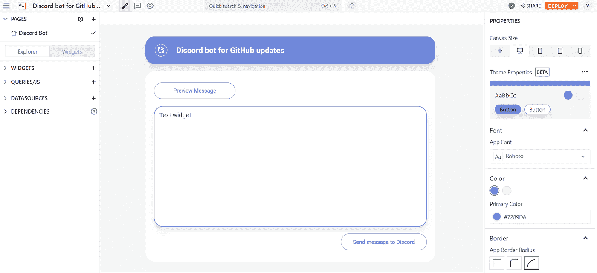
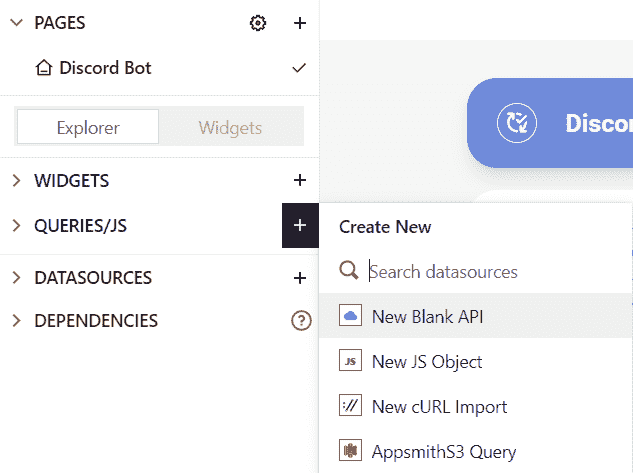
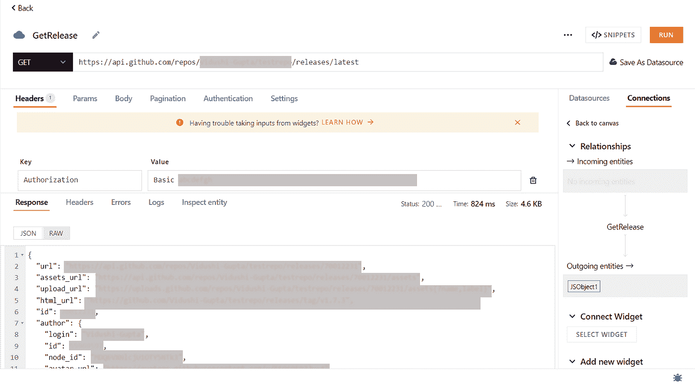
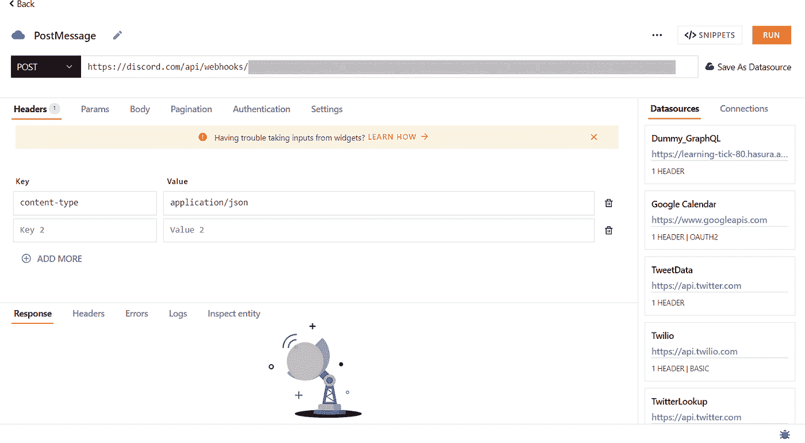
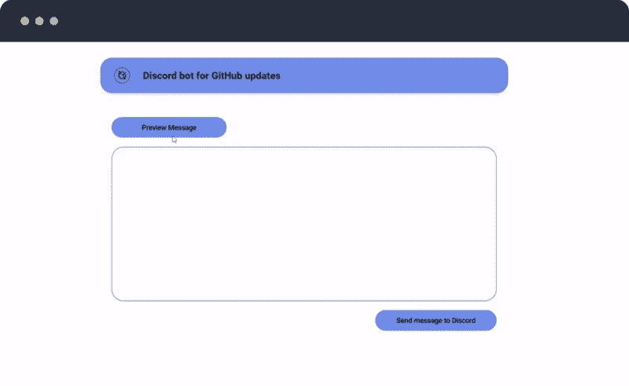

# 只需点击一下鼠标，就可以将您的 GitHub 版本分享到您的社区

> 原文：<https://medium.com/geekculture/share-your-github-releases-to-your-communities-with-just-one-click-65050ef69d0b?source=collection_archive---------20----------------------->

开发人员花费大量时间编码、提炼产品、发布增强、修复和改进。这些更新对产品用户来说至关重要。组织必须向他们的用户宣布更新，以提高对产品的认识，并帮助用户充分利用改进的产品。


在本教程中，我们将学习如何构建一个 Discord bot，在 10 分钟内在您想要的 Discord 服务器上的频道中共享最新版本。我们来建吧！

下面是 [app](https://app.appsmith.com/templates/62c2cd58e8e73110ce252a8f) 的样子；你可以骑着它去兜风。

# 设置 Appsmith

*   前往 appsmith.com[注册一个新账户或登录现有账户。](http://appsmith.com/)
*   在您喜欢的组织中创建一个新的应用程序，现在您将看到一个编辑器，您可以在其中拖放 UI 小部件来构建 UI。

# 为你的应用程序设置用户界面

对于 UI，添加以下小部件:

*   选择一个你喜欢的主题！
*   带有文本小部件和图标按钮的容器，用于应用程序的标题
*   两个按钮—一个用于预览消息，另一个用于在不一致时发送消息
*   一个文本小部件，用于预览机器人将在频道上发送的文本消息

这就是用户界面。只需四个简单的步骤，您就可以设置好应用程序的用户界面🎊。下面是它的样子:



App UI

# 在 Appsmith 上集成 Discord 和 GitHub

您将在希望安装机器人的服务器上使用一个不和谐的 webhook。这个 webhook 将帮助您在服务器的文本通道上发送自动消息。你可以在这里阅读更多关于不和谐网钩[的内容。](https://support.discord.com/hc/en-us/articles/228383668-Intro-to-Webhooks)

*   按照本文[中提到的步骤](https://support.discord.com/hc/en-us/articles/228383668-Intro-to-Webhooks)来设置一个 webhook。
*   一旦 webhook 生成，将 URL 复制到 webhook。

您将使用 [GitHub releases API](http://docs.github.com/en/rest/releases/releases) 来查找最新发布的版本并获得关于它们的信息。

*   根据 [GitHub 文档](http://docs.github.com/en/authentication/keeping-your-account-and-data-secure/creating-a-personal-access-token)中提到的步骤生成您的 GitHub 个人访问令牌。发布 API 的基本认证需要这个令牌。

# 设置查询和 API

您将首先设置一个 API 来获取 GitHub 存储库的最新版本。为此，请按照下列步骤操作:

*   从查询窗格创建“新的空白 API”。



Query pane

*   将查询重命名为 **GetRelease** 。为一个 **GET** 请求设置 API，因为我们想要 *get* 最新发布的信息。
*   为 API 添加此 URL

```
https://api.github.com/repos/<USERNAME>/<REPO-NAME>/releases/latest
```

确保添加您想要最新版本的存储库的存储库名称来代替 **<存储库名称>** ，并添加存储库所有者的用户名来代替 **<用户名>**

*   在报头中添加授权密钥，其值设置为基本 **<访问令牌>。**确保添加您之前复制的访问令牌，代替 **<访问令牌>**

点击' **Run** '按钮，您应该会看到一个 API 响应，其中包含最新版本的详细信息。



API Response

接下来，我们将在 Appsmith 中设置 Discord Webhook。为此，

*   从“查询”窗格中单击“新 API”，并将其命名为 **PostDiscord** 。
*   将 API 设置为 **POST** 请求，因为我们将*向 Discord 服务器发送*消息。
*   将你的 webhook URL 粘贴到 API 的 URL 中。
*   将**内容类型**设置为标题中的关键字，其值设置为**应用程序/json**

PostMessage API 如下所示:



PostMessage API

现在让我们编写一个查询来定制您想要在 Discord 服务器通道上发送的消息。

*   创建新的 JSObject
*   在 JSObject 中添加这个函数

```
message: () => {var apibody=GetRelease.data.bodyconst body= apibody.replace(/ *\([^)]*\) */g, “”)return((GetRelease.data.name) + “ is out🎉 \n\n” + (body) + “\n\nCheck the release out at “ + (GetRelease.data.html_url) )}
```

这里，我们使用 **(GetRelease.data.body)** 来获取发布说明的正文， **(GetRelease.data.name)** 来获取发布名称，**(getrelease . data . html _ URL)**来获取发布说明的链接。

您可以自由地使用任意多的属性进一步定制消息！

# 将查询绑定到应用程序 UI

既然已经设置了所有的 API 和查询，那么只需将它们绑定到小部件上。

*   绑定 **{{GetRelease.run()}}** 在**上运行 onClick** 中的预览消息按钮。
*   将**{ { jsobject 1 . message()} }**绑定到文本小部件的属性窗格中的**文本**。
*   绑定 **{{PostMessage.run()}}** 在**上运行 onClick** 中的发送消息到 Discord 按钮。

而且，就是这样。测试并运行你的机器人！



Screen recording

现在，您可以像专业人士一样在您的社区中共享您的发布！

为了测试这个机器人，我们有一个用于 GitHub 发布模板的[不和谐机器人](https://app.appsmith.com/templates/62c2cd58e8e73110ce252a8f)，你可以派生并使用它。

请通过此表格让我们知道您是否有任何可以帮助加快制作内部工具[的模板请求。](https://app.appsmith.com/app/request-templates/request-form-6241b5a8c99df2369931a656)

如有任何疑问，请点击 [**【不和谐】**](https://discord.com/invite/rBTTVJp) ，关注 [**YouTube**](https://www.youtube.com/c/Appsmith) 和 [**Twitter**](https://twitter.com/theappsmith) 了解最新消息。