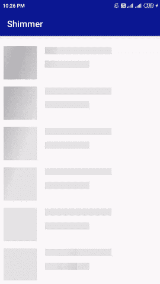
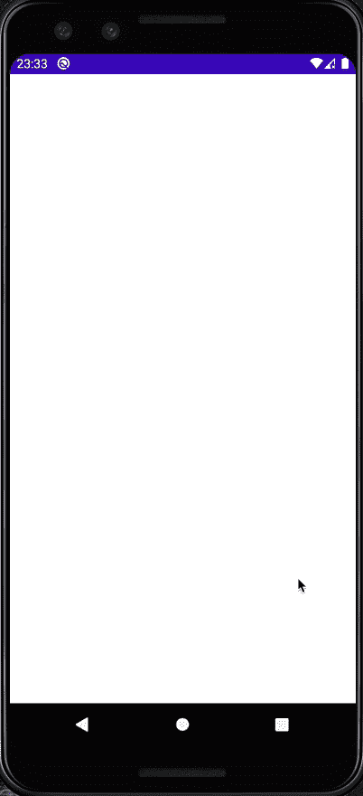

# Android 中的微光效果

> 原文：<https://medium.com/geekculture/shimmer-effect-in-android-2b6840cc0097?source=collection_archive---------2----------------------->

大家好👋🏻！今天我将向你展示如何在你的 Android 项目中使用**“微光效果”**。在开始之前，对于那些不知道什么是 shimmer 的人来说，这是一种向用户展示加载过程的更有效和 UX 友好的方式。如下所示，这通常是列表项目的首选:



Shimmer Effect

现在，让我们用一个例子来看看如何实现它，好吗？

我们将使用一个由脸书提供的第三方库。

如果你想了解一下，请点击这里。

首先，让我们将相关的依赖项添加到我们的`app/build.gradle` 文件中。

```
implementation 'com.facebook.shimmer:shimmer:0.5.0'
```

我们的应用程序将进行一个假的 API 调用并获得一个列表。之后，它将在 RecyclerView 中显示列表。在获取列表时，我们将向用户显示微光效果。

实际上，实现微光效果非常简单。我们所要做的就是在实现我们的列表行布局之后，简单地克隆这个布局，只有一个小的不同(给每个子视图一个较暗的背景颜色)，就这样。

让我们为我们的 RecyclerView 创建一个非常简单的`row_user_list`。

这个应该够用了。现在让我们创建我们的`row_user_list_shimmer`。

这里，我使用的背景颜色是

```
<color name="shimmerColor">#C2C2C2</color>
```

现在，让我们创建我们的屏幕。我们的`activity_main.xml`文件将包含一个 RecyclerView 和 **ShimmerFrameLayout。**

我们在这里所做的就是简单地添加我们想要向 ShimmerFrameLayout 显示多少个 shimmer 行。从现在开始，我们将像处理一个普通的 progressView 一样处理它。

现在，让我们创建一个伪 API 调用来获取用户。这里，为了不超出本文的范围，我将使用协程来实现 API 调用效果。

现在，让我们为我们的列表实现一个真正基本的 RecyclerViewAdapter。

我们都准备好了💪。让我们看看如何以编程方式设置 shimmer。我们所要做的就是在必要的时候呼叫`startShimmer()`和`stopShimmer()`。

在这个项目中，我使用了资源密封类，它非常有用，并且与 MVVM 设计模式非常兼容。

我们现在可以在从 MainActivity 观察 LiveData 对象的同时进行相关的操作。

设置好之后，我们的应用程序看起来会像这个🥳🥳:



这是所有的乡亲。这是展示如何使用微光效果的最基本的方法。当然，你可以做得更好，只要坚持下去🙌。

为了以防万一，您可以通过下面的链接获得完整的源代码:

[](https://github.com/yunusemrearslan/ShimmerExample) [## yunusemrearslan/ShimmerExample

### 此时您不能执行该操作。您已使用另一个标签页或窗口登录。您已在另一个选项卡中注销，或者…

github.com](https://github.com/yunusemrearslan/ShimmerExample) 

下一集再见👋🏻