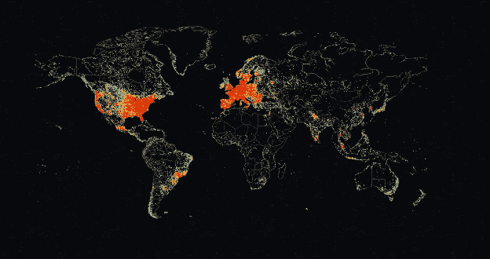

# Shodan:网络爬虫

> 原文：<https://medium.com/geekculture/shodan-the-internet-crawler-37cc22250656?source=collection_archive---------6----------------------->

## 寻找目标的公共资产

你好，世界！ [Shodan](https://www.shodan.io/) 是一个令人敬畏却又可怕的工具。Shodan 使我们能够通过互联网识别可公开访问的资产。安全研究人员使用 Shodan 快速识别运行在数亿台联网设备上的服务。搜索 Shodan，在我看来，如果它被用来收集统计数据或确定一个人的公共…