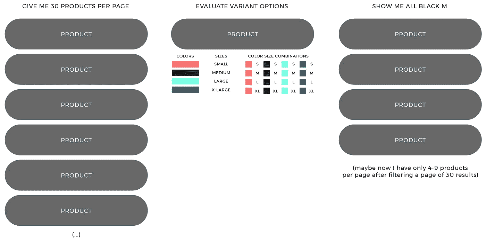

# Shopify 的快速搜索体验

> 原文：<https://medium.com/geekculture/shopify-a-new-faster-search-experience-ff7262a0b2f6?source=collection_archive---------16----------------------->

## 我的新 Shopify 应用程序， [Search X](https://www.getsearchx.com) ，在这里。

我已经在 Shopify 生态系统中工作了近十年——推出我自己的[应用](https://apps.shopify.com/partners/william-belk)，为客户工作，推出我自己的商店，构建主题；通常会尝试各种不同的方法。对于大型商店来说，一组长期存在的问题是**搜索、自动完成、产品过滤和收藏过滤**。我们希望深度和快速搜索，产品和收集过滤器，以及快速自动完成。与竞争对手的电子商务商店相比，我们希望 Shopify 搜索栏超出游客的预期。

# 这篇文章的摘要

Shopify 的搜索和过滤是中大型商店的一个大问题。我推出了 [**Search X**](https://www.getsearchx.com/) 来为 Shopify 提供最快、最高效的搜索应用——以尽可能小的占用空间实现惊人的查询速度。

Search X 是对 Shopify 提供的许多搜索和过滤应用程序的回应，我认为这些应用程序臃肿、缓慢、低效、难以定制。Search X 的三个核心焦点是 1)闪电般的快速搜索查询速度性能，2)尽可能最小的页面有效负载大小，只有 18K 核心 javascript/html/css 有效负载，没有外部库依赖，以及 3)简单和高级的定制，如回调、标记组和定制 html 选项。

Search X 也是唯一一款对所有 Shopify 实体提供深度搜索和过滤的应用:产品、收藏、文章和页面。

总之， [**Search X**](https://www.getsearchx.com/) 是 Shopify 最快、最高效的搜索、过滤和自动完成 app。

# 首要问题空间是什么？

Shopify 的搜索和过滤是很难解决的问题。许多店主或客户无法想象这一点。通过搜索和过滤来回答更深层次的客户需求，像“*给我看 M 码的全黑*”，绝对会超过 Shopify 的 liquid language 的开发能力。我以前在尝试这样做的时候已经达到了内部液体记忆的极限——也许是荣誉的徽章，或者是徒劳的练习。最终，在任何合理的目录规模下，深度搜索和过滤都需要产品目录数据的外部解释，即数据库或搜索索引，或者两者都需要。

默认情况下，Shopify 数据调用(通过 liquid 或 API)只返回产品及其相关的变量数据。不可能要求 Shopify " *给我看看 M 码的全黑*"。为了了解所有产品变型中发生的情况，即按颜色和尺寸等对变型进行分组，必须查看每个产品并在每个产品父代中创建变型组，或者为所有`black`、所有`size M`及其交集建立单独的数据集合。为了用 Shopify 的液体或 API 说“ *show me all black in size M* ”，必须用`product.variant option_n contains black`浏览所有产品，然后过滤出结果。简单吧？但是分页呢？事实上，我们不能在任何地方存储这些评估。我们开始在每个页面中过滤掉奇数个实体。访客体验变得缓慢、受内存限制、不稳定，而且这一切看起来都不专业——也就是说，对访客没有好处。

# Shopify 上的搜索和过滤问题的解决空间是什么？

解决方案空间有两个主要途径，1) Shopify 的新[预测搜索](https://shopify.dev/tutorials/add-predictive-search-to-your-shopify-theme)功能，它*非常*慢，并且不提供变体过滤功能，2)外部搜索栏和过滤应用程序，如 Searchanise、Algolia、Boost、Fast Simon、Klevu 等等。

# 我使用 Shopify 搜索和过滤应用的体验…

简而言之，我在搜索和过滤应用方面的经历是一次耐心和挫折的锻炼。使用 Searchanise、Algolia 和 Boost 等应用程序时，经常会出现非常相似的问题:

*   为什么这些应用在页面上加载这么多 javascript？ [Search X](https://www.getsearchx.com/) 向浏览器交付一个比小 10 倍的完整*有效负载，用于渲染、css 和核心 javascript 资产。*
*   为什么会有那么多又慢又摇摇晃晃的动画拖慢了用户的搜索体验？
*   为什么他们使用这么多像 JQuery、Vue 和 Modernizr 这样的库依赖？
*   为什么我不能像搜索和过滤产品一样搜索和过滤收藏？为什么我不能像搜索和过滤产品一样搜索和过滤文章？
*   使用这些 app 的 SEO 效果如何？
*   这款 app 为什么这么难定制？！
*   最后一个问题:**搜索能快多少**？

# 我最终的解决方案:搜索 X

Search X 是对 Shopify 搜索和过滤问题的固执己见的回应。创建 Search X 的主要问题是:如果我抛弃所有的无用信息，构建一个核心的搜索应用程序，给我想要的东西，会怎么样？我想要的是:

*   快速搜索 Shopify——像吓人的快，我们能有多快，真正的极限是什么？
*   快速自动完成—同样，我们能多快到达这里？让我们挑战极限。
*   深度产品、收藏和文章过滤—对所有实体一视同仁，让我随时随地搜索一切。
*   页面上的 javascript 少得多——与流行的搜索和过滤应用相比，Search X 发送到页面的 javascript、css 和 html 要少 10 到 20 倍。
*   像 JQuery 这样臃肿的外部库的终结。有时候商店默认使用不同版本的 Jquery，一个 app 会注入另一个版本，所以最后每次页面加载都是两个 JQuery 库。我真的很喜欢 JQuery，因为它很方便，但是在客户不知道的情况下在他们的站点上加载两个库应该是犯罪。
*   绝对没有像 Vue 或 Modernizr 这样的新的实验性 javsascript 库。

*Real-time screen capture

*Real-time screen capture

## 给它演示一下

你可以试试 Search X 演示网站[这里](https://demo.getsearchx.com/)，Search X 安装在一个默认的 Shopify 主题“亮相”上你也可以访问[服从服装](https://obeyclothing.com/search)网站，在那里搜索 X 已经被定制一点，以符合他们的设计要求。

你可以在这里查看所有的搜索 X 特性。Search X 拥有大量功能，如快速购物/快速查看、标签组、谷歌结构化数据、色板、字段增强、全球货币、对 Shopify 产品评论应用程序的评论支持、Loox、Yotpo、JudgeMe 和 Stamped。

*在*[*WilliamBelk.com*](https://www.williambelk.com)*找我。关注我* [*推特*](https://twitter.com/wbelk) *。*