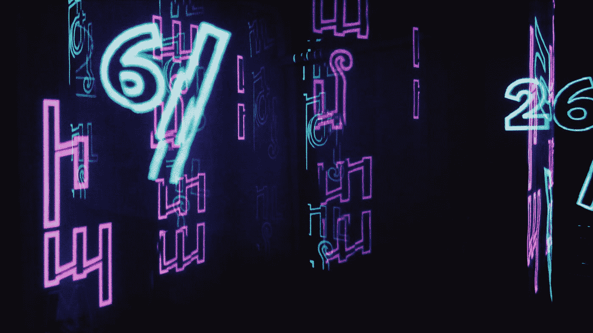
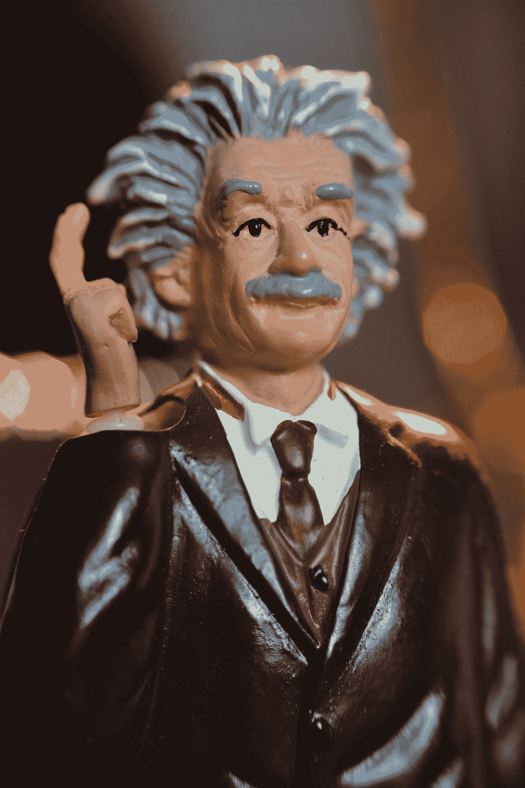
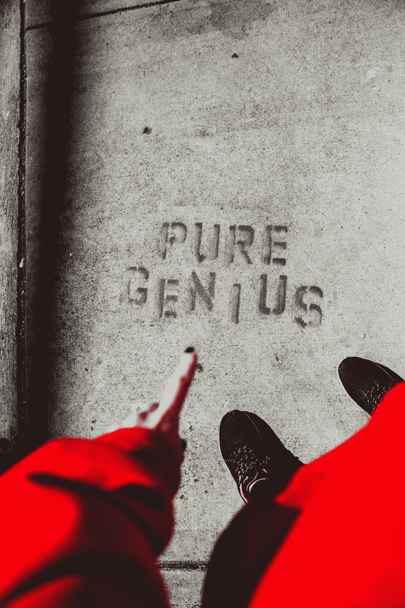
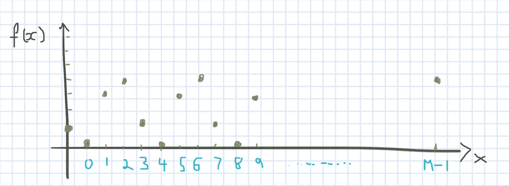
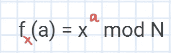
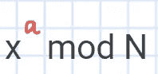
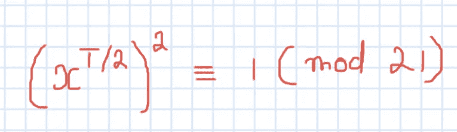

# Shor 算法:对 RSA 加密的严峻挑战

> 原文：<https://medium.com/geekculture/shors-algorithm-a-serious-challenge-to-rsa-encryption-45ae00861939?source=collection_archive---------16----------------------->

## 重新发明密码学

Photo by [Artem Bryzgalov](https://unsplash.com/@abrizgalov?utm_source=medium&utm_medium=referral) on [Unsplash](https://unsplash.com?utm_source=medium&utm_medium=referral)

假设你是一名物理讲师，在一个晴朗的日子里，你精疲力尽，你的讲座还剩下最后几分钟，但你没有心情继续任何话题。

所以你决定把最难的物理难题交给学生，让他们在那几分钟内保持专注，而你他妈的肯定没有学生会在那几分钟内得到答案。

Photo by [Bonneval Sebastien](https://unsplash.com/@sebastien_bonneval?utm_source=medium&utm_medium=referral) on [Unsplash](https://unsplash.com?utm_source=medium&utm_medium=referral)

# RSA 加密

当前的一套加密技术(如 RSA)正寄希望于一个类似的问题，这个问题甚至在几个月或几年内都无法解决。

Photo by [Aron Visuals](https://unsplash.com/@aronvisuals?utm_source=medium&utm_medium=referral) on [Unsplash](https://unsplash.com?utm_source=medium&utm_medium=referral)

这个问题名字叫因式分解。

计算两千位数相乘的结果并不难。

但是要找到一个一千位数的两个质因数是一件很难的事。

Photo by [Michał Parzuchowski](https://unsplash.com/@mparzuchowski?utm_source=medium&utm_medium=referral) on [Unsplash](https://unsplash.com?utm_source=medium&utm_medium=referral)

这是 RSA 所依赖的复杂问题。

目前的计算机要花很长时间才能解决这个问题，因此，目前的密码系统被认为是安全可靠的。

# 令你惊讶的是

回到你的物理课上。

记得你累了，为了在最后几分钟吸引学生，你把最难的难题给了学生。这样你可以休息一下。

但是假设你班上有一个纯粹的天才。

Photo by [Andrew George](https://unsplash.com/@andrewjoegeorge?utm_source=medium&utm_medium=referral) on [Unsplash](https://unsplash.com?utm_source=medium&utm_medium=referral)

在你的讲座结束之前，谁解决了这个难题。

Photo by [Oliver Ragfelt](https://unsplash.com/@oliverragfelt?utm_source=medium&utm_medium=referral) on [Unsplash](https://unsplash.com?utm_source=medium&utm_medium=referral)

我肯定你会对此感到恼火，因为你指望在你的讲座结束前不解决这个难题，这样你就可以休息一下。

# 那个天才就是肖尔的算法

肖尔的算法是最优秀的**量子计算算法**，这在现实中会对 RSA 加密系统造成很大的危险。

Photo by [rosario janza](https://unsplash.com/@janza?utm_source=medium&utm_medium=referral) on [Unsplash](https://unsplash.com?utm_source=medium&utm_medium=referral)

肖尔算法的主要构建模块是**周期寻找**。

那么什么是寻找周期呢？

考虑下图:

如果你看到绿点有图案。

这些绿点就是 f(X)

假设输入为 X，输出为 f(X)。

所以有一个周期函数或者周期模式叫做 f(X)。

周期性模式意味着该模式在某个时间间隔 T 之后重复，使得 f(X) = f(X + T)。

在这里我们要找到那个测试

在量子幺正变换电路中使用的叠加原理的帮助下，测量后只有某些循环模式会保留如下。

所以在应用量子电路后，我们发现周期 T 是 4。

一旦完成满足该函数的周期查找:

这里，N 是最大的数字，我们开始随机取 x，并验证它是否与 N 互质。这里，我们使用最大公约数或 gcd 来寻找质因数。否则，我们计算幂函数的周期。

如果周期 T 是偶数，我们求的数就是 *pow(x，T/2)* ***如下图*** 。如果 T 不是偶数，我们再随机取一个 x，再试一次。

*(这里我们可以用* ***欧几里德的算法*** *计算 gcd，取质因数。)*

# 结论

寻找如此大数量的质因数，任何经典算法都需要指数时间，而 Shor 的量子算法可以在多项式时间内找到。这是一个巨大的飞跃，引领我们进入一个发人深省的状态，在后量子计算时代重新发明密码学。