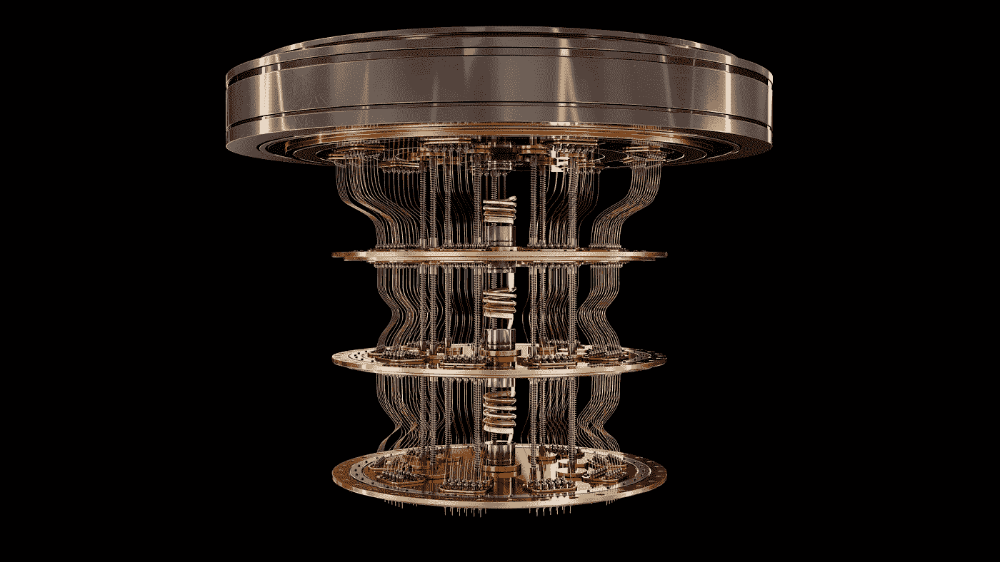

# 经典模拟量子计算机的捷径

> 原文：<https://medium.com/geekculture/shortcuts-to-classically-simulating-quantum-computers-81938cedc4d2?source=collection_archive---------6----------------------->

## 超导量子位经典模拟中常见的假设可信吗？

**作者:** [泰勒·琼斯](https://www.linkedin.com/in/tyj/)，[凯亚·史蒂文](https://www.linkedin.com/in/kaiah-steven-a68062190/)，[泽维尔·庞西尼](https://www.linkedin.com/in/xavier-poncini-585b151ba/)，量子机器学习研究部[马克斯·凯尔森](https://maxkelsen.com)

Image Credit: [Shutterstock](https://www.shutterstock.com/image-illustration/quantum-computer-on-black-background-3d-1788843131)

# 介绍