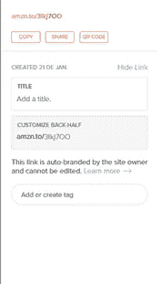
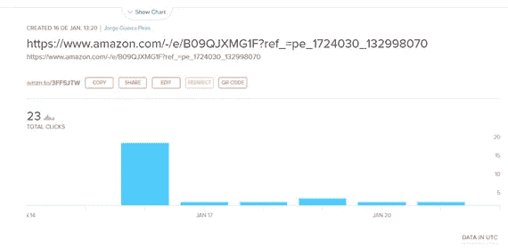

# 缩短链接|如何

> 原文：<https://medium.com/geekculture/shortening-links-how-to-9d5ea21a90ac?source=collection_archive---------23----------------------->

学会让你的链接更吸引人

你知道你想分享的那个巨大链接吗？让我提醒你一下！

在谷歌上找自己的结果。

【https://www.google.com/search?q=jorge+guerra+pires】&OQ =豪尔赫+格拉+皮雷&aqs = chrome . 0.69 i59 j 35 I 39j 69 I 60 L3 j 69 I 65 l 3.5711 j0 j 7&sourceid = chrome&ie = UTF-8

找我一本的结果！从谷歌拿到书后的最终结果。

[https://www . Amazon . com . br/intro % C3 % A7 % C3 % A3o-m % C3 % a9 todos-matem % C3 % a1 ticos-ci % C3 % AAncias-vida-ebook/DP/b 09 nmlzgyc/ref = Sr _ 1 _ 2？qid = 1642775594&refinements = p _ 27% 3 Jorge+Guerra+Pires&s = digital-text&Sr = 1-2](https://www.amazon.com.br/introdu%C3%A7%C3%A3o-m%C3%A9todos-matem%C3%A1ticos-ci%C3%AAncias-vida-ebook/dp/B09NMLZGYC/ref=sr_1_2?qid=1642775594&refinements=p_27%3AJorge+Guerra+Pires&s=digital-text&sr=1-2)

当然，你可以隐藏超链接！想直接分享链接怎么办？也许你想用 pdf，没有超链接，也许你想分享的地方不允许链接。

原因不重要，这是你的事。有一个很好的解决方案！事实上，有几个类似的解决方案。一些平台，比如 Google Forms，已经有了内置的功能。其他人已经自动做到了，比如 LinkedIn。

这个网站是一个选择，一个很好的选择！[https://app.bitly.com/](https://app.bitly.com/)

# 步骤 1:将你的链接放在输入框中

Placing a huge link on the input form.

# 第二步:点击创建

Now you have one nice small link. Hit copy to copy the link. Final result: [https://amzn.to/3Ikj7OO](https://amzn.to/3Ikj7OO)

# **您还可以收集统计数据**

通过收集统计数据更好地了解你的受众！

Statistics that comes together with the link shortening

Motivation to shorten your link

===========
亚马逊简介:[https://www.amazon.com/author/jorgeguerrapiresphd](https://www.amazon.com/author/jorgeguerrapiresphd)

购买我们的电子书支持我的写作！
[https://jorgeguerrapires . medium . com/my-selected-assays-from-medium-on-computer-programming-34578 bebb 63 a](https://jorgeguerrapires.medium.com/my-selected-assays-from-medium-on-computer-programming-34578bebb63a)

===
捐款

给我买杯☕☕☕☕☕咖啡或者一本书！！📚📚📚📚📚
如果这些内容对您有用！这是一次性捐赠，没有必要再捐赠了！
https://www.buymeacoffee.com/jorgepires

现在你也可以支持我的任何项目!More info: [https://jorgeguerrabrazil.wixsite.com/ideacodinglab/publications](https://jorgeguerrabrazil.wixsite.com/ideacodinglab/publications)

访问我的课程:

Angular, Unit Testing, Figma, and Numerical Analysis: Building a dashboard for our app using Angular Material
[https://www.udemy.com/course/angular-unit-testing-figma-and-numerical-analysis/?referralCode=CEC8C36E50F431E197CE](https://www.udemy.com/course/angular-unit-testing-figma-and-numerical-analysis/?referralCode=CEC8C36E50F431E197CE)
#javascript #typescript #angular #udemycouons #testdrivendvelopment #testing #technology

创新与生物数学
构建计算生物学用户友好接口的挑战
[https://www.udemy.com/course/innovating-with-biomathematics//。referralCode=861F75660F9C05BB3BD5](https://www.udemy.com/course/innovating-with-biomathematics/?referralCode=861F75660F9C05BB3BD5)
#angular #javascript #bioinformatics #computationalbiology #udemycourse #udemycoupon

年轻研究人员的袖珍手册:从科学入门到博士后,第一卷。1.:科学启动(第 1 版)。)
[https://www.udemy.com/course/手册 青年研究员?referralCode=B8C6FE30F27828A08735](https://www.udemy.com/course/manual-de-bolso-do-jovem-pesquisador/?referralCode=B8C6FE30F27828A08735)
#科学启动 #jovempescher #udemycouons #udemycourse

模型驱动开发(MDD)和运筹学:学习运筹学侧重于应用数学,运筹学的简要介绍(卷。一, 1° 版)
[https://www.udemy.com/course/model-driven-development-mdd-e-research-operative/?referralCode=E2FF7D1AE8FDE4662A42](https://www.udemy.com/course/model-driven-development-mdd-e-pesquisa-operacional/?referralCode=E2FF7D1AE8FDE4662A42)
优惠券:
#业务研究 #engenhariad 生产 #tomadedecisao #程序自动化 #智能计算

介绍生命科学中的数学方法:学习应用于生物学和医学的计算和数学模型,第一卷。1
课程链接:
[https://www.udemy.com/course/uma-introjeo-aos-method-mathematics-nas-生命科学//referralCode=96D33CDD4844CF3EDE8E](https://www.udemy.com/course/uma-introducao-aos-metodos-matematicos-nas-ciencias-da-vida/?referralCode=96D33CDD4844CF3EDE8E)
#生物信息学 #生物数学 #生物学 #计算生物学